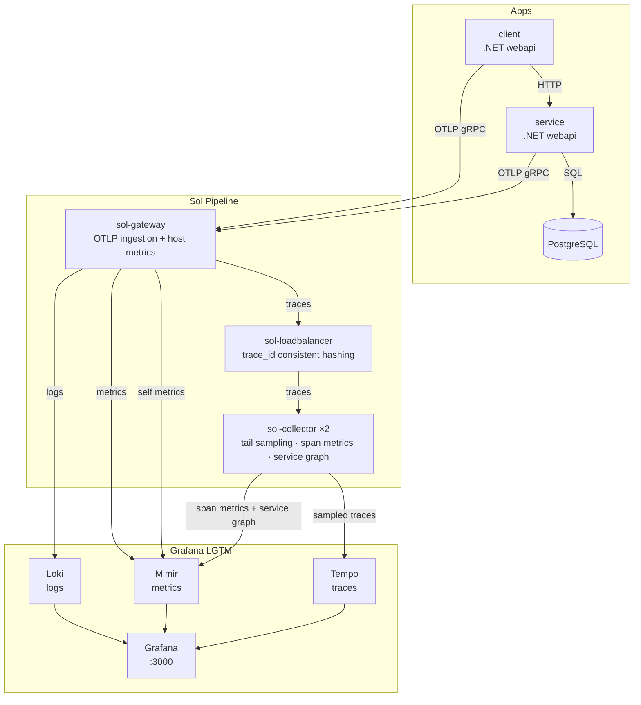

# Sol + Grafana LGTM stack

End-to-end observability demo with Sol as the telemetry pipeline, example apps (to produce telemetry), and the Grafana LGTM stack (Loki, Grafana, Tempo, Mimir).

## Architecture

Two .NET webapi applications (client and service) send OTLP telemetry to a three-tier Sol pipeline:



### Sol pipeline roles

| Component | Config | Role |
|---|---|---|
| **sol-gateway** | [sol-gateway.yaml](./sol/sol-gateway.yaml) | OTLP ingestion, host metrics, resource attribute promotion, routes logs/metrics/traces to backends |
| **sol-loadbalancer** | [sol-loadbalancer.yaml](./sol/sol-loadbalancer.yaml) | Consistent-hash routing on `trace_id` via DNS resolution to sol-collector replicas |
| **sol-collector** | [sol-collector.yaml](./sol/sol-collector.yaml) | Tail sampling, span metrics, service graph generation, forwards to Tempo and Mimir |

### Backends

| Service | Purpose |
|---|---|
| **Grafana** | Dashboards and exploration (port 3000) |
| **Loki** | Log storage |
| **Mimir** | Metric storage (OTLP HTTP) |
| **Tempo** | Trace storage (OTLP gRPC) |
| **PostgreSQL** | Application database for the .NET service |

## Run locally

```bash
docker compose up -d
```

Open Grafana: http://localhost:3000

## Key Sol features demonstrated

### Tail sampling

The sol-collector assembles full traces and applies policies before forwarding to Tempo:

```yaml
transforms:
  tail_sampling:
    type: tail_sampling
    inputs: ["otlp.traces"]
    decision_wait_secs: 10
    policies:
      - type: and
        name: sampled-latency-policy
        sub_policies:
          - type: latency
            name: latency-policy
            threshold_ms: 100
          - type: probabilistic
            name: probabilistic-policy
            sampling_percentage: 10.0
      - type: latency
        name: high-latency-policy
        threshold_ms: 500
      - type: and
        name: sampled-error-policy
        sub_policies:
          - type: status_code
            name: status-code-error-policy
            status_codes: ["ERROR"]
          - type: string_attribute
            name: http-status-code-error-policy
            key: http.response.status_code
            values: [4..]
            enabled_regex_matching: true
            invert_match: true
```

### Trace-aware load balancing

The sol-loadbalancer routes all spans for a trace to the same collector replica using consistent hashing on `trace_id`:

```yaml
sinks:
  otlp_traces:
    type: opentelemetry
    inputs: ["otlp.traces"]
    protocol:
      type: grpc
      load_balancing:
        routing_key: traceID
        resolver:
          type: dns
          hostname: sol-collector
```

### Service graph

The sol-collector computes inter-service edge metrics from trace spans:

```yaml
transforms:
  servicegraph:
    type: servicegraph
    inputs: ["otlp.traces"]
    metrics_flush_interval_secs: 15
    dimensions: ["db.system", "messaging.system"]
    store:
      ttl_secs: 2
      max_items: 1000
```

### Host metrics

The sol-gateway collects host metrics and exports them with a `node_` prefix for node-exporter dashboard compatibility:

```yaml
sources:
  host_metrics:
    type: host_metrics
    scrape_interval_secs: 15
    namespace: ""
    resource_attributes:
      service.name: sol
```

## Application workload

Two .NET webapi applications generate realistic telemetry (logs, metrics, traces):

- **client** — sends HTTP requests to the service, simulating end-user traffic
- **service** — handles requests, queries a PostgreSQL database, and produces spans with configurable failure and latency ratios

Both applications use the [OpenTelemetry .NET SDK](https://github.com/open-telemetry/opentelemetry-dotnet) with OTLP gRPC export to the sol-gateway. Any OTLP-capable application can replace them — Sol is language-agnostic.

## Grafana dashboards

Three pre-provisioned dashboards are available at http://localhost:3000:

### Sol Pipeline

[Dashboard JSON](./grafana/provisioning/dashboards/Sol/SOL%20Pipeline.json)

Monitors the Sol pipeline internals — signal flows, per-component throughput, and error rates across all three Sol instances.

| Section | Panels | What it shows |
|---|---|---|
| **Signal flows** | Traces / Metrics / Logs (received vs sent) | End-to-end event flow through the pipeline |
| **Sources** | Received events/s, errors/s | Ingestion rate and source-level errors |
| **Transforms** | Received/sent events/s, drop ratio | Transform throughput and data reduction |
| **Sinks** | Sent events/s, retry rate, errors/s | Delivery health to Loki, Mimir, Tempo |
| **Tail sampling** | Sampled/dropped by policy, dropped too early, effective sampling ratio | Sampling decisions and trace completeness |
| **Service graph** | Inter-service edge metrics | Service-to-service call relationships |

### Node Exporter (Sol host_metrics)

[Dashboard JSON](./grafana/provisioning/dashboards/Sol/Node%20Exporter%20(host_metrics).json)

Host metrics collected by the sol-gateway's `host_metrics` source, exported with a `node_` prefix for compatibility with the standard Node Exporter Full dashboard (Grafana ID 1860). Panels include CPU, memory, swap, disk, filesystem, and network.

### OpenTelemetry .NET webapi

[Dashboard JSON](./grafana/provisioning/dashboards/Apps/OpenTelemetry%20dotnet%20webapi.json) | [Grafana.com](https://grafana.com/grafana/dashboards/20568-opentelemetry-dotnet-webapi/)

Application-level dashboard using the RED (Rate, Errors, Duration) and USE (Utilization, Saturation, Errors) methods. Shows ASP.NET request rates, error rates, latency distributions, runtime metrics (GC, thread pool), and HTTP client instrumentation for the .NET client and service applications.

## Disclaimer

This demo is for local development and hands-on exploration only. Security, scaling, and high availability are not addressed.
