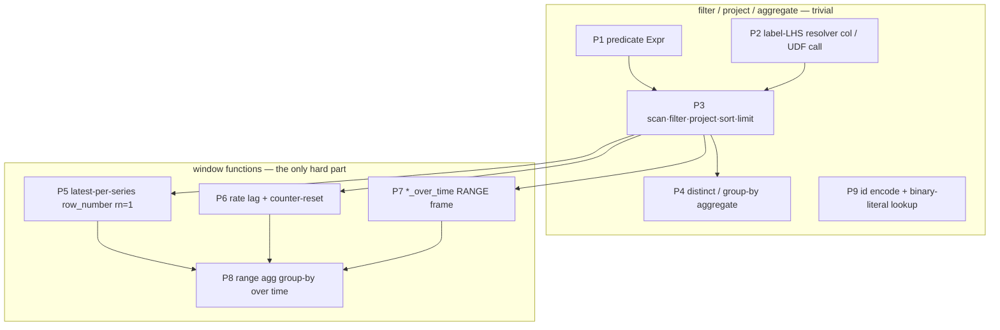

# expr-lowering — Design Doc

Builds on: [designs/20260605_query-parsers.md](../../20260605_query-parsers/designs/20260605_query-parsers.md)

## Context

Sol's query backend lowers three parsed query languages (PromQL, LogQL, TraceQL)
to SQL **text** built with `format!`, then hands the string to `ctx.sql(query)`
(`QueryEngine::sql`), which DataFusion *re-parses* into a `LogicalPlan`. Today
there are ~110 `format!` SQL-build sites (prometheus 54, loki 34, tempo 22, sql 2),
each signal re-implementing the same *label/field `op` value → predicate* shape,
every value string-interpolated (guarded by `esc()` — an injection surface, NFR9).

DataFusion's SQL is a front-end over its **logical layer**: `ctx.sql(text)` parses
to a sqlparser AST then lowers to a `LogicalPlan` of `Expr` nodes — the same IR the
`DataFrame`/`LogicalPlanBuilder` API builds directly. Building `Expr` reaches that IR
without text or a re-parse, is type-safe, and makes values literals.

**This work fully migrates query construction off SQL strings onto the DataFusion
`Expr`/`LogicalPlan` API.** An audit shows the entire SQL surface collapses to **9
reusable plan primitives** (P1–P9 below); only three are "hard" (window functions:
latest-per-series, rate, `*_over_time`). Building those three once, parity-tested in
isolation, lets every signal compose them. The **only** SQL that remains is the
user-supplied `/api/v1/sql` endpoint (we don't build it) and the **Rust-native Arrow
compute** (histogram interpolation, bucket-heatmap explode, resample, binary-op
vector matching) — which was never SQL.

The migration also fixes a second sprawl: **unit conversions**. Internally the code
is already nanoseconds (storage is `Timestamp(Nanosecond)`; all math is ns `i64`),
but conversions (`* 1e9`, `/ 1e9`, sec↔ns parsers, per-signal duration parsers) are
scattered. We standardize on a **canonical nanosecond `i64`** core with conversion
only at the boundary, which also removes the per-site `CAST(time_unix_nano AS BIGINT)`
ambiguity that is the chief risk in the window primitives.

## Functional Requirements

### <a id="fr1"></a>FR1 — Shared predicate builder (`Expr`)
One module builds DataFusion `Expr` predicates from a normalized *(lhs, op, value)*
triple, reused by PromQL matchers, LogQL label/line filters, and TraceQL field
comparisons: `= != =~ !~ > >= < <=`, absent-label semantics (absent ≡ empty),
anchored regex (`^(?:…)$`), numeric/text comparison, `body` substring/regex. Label
LHS resolution (promoted column vs `prom_attr`/`json_get_str` UDF call) is a
parameter, not duplicated per signal. **[P1, P2]**

### <a id="fr2"></a>FR2 — Literal values (injection-safe)
Every query value enters as `lit(value)`, never interpolated. `esc()` is removed from
all migrated paths; no query value can alter plan structure (NFR9, structural).

### <a id="fr3"></a>FR3 — Full migration of query construction to the DataFrame/`Expr` API
**All** query building moves to `Expr`/`DataFrame`/`LogicalPlanBuilder` — including
the window-function lowerings previously thought of as SQL-only:
- **P3** scan→filter→project→sort→limit (selectors, search, streams, trace-by-id).
- **P4** distinct / group-by aggregate (labels, series, tags, tag values, index
  stats/volume, instant `sum by`).
- **P5** latest-per-series (`row_number()` window → `rn = 1`): PromQL instant + the
  histogram/latest scan.
- **P6** rate (`lag()` window + counter-reset `CASE` + `/dt`).
- **P7** `<agg>_over_time` (`agg()` window with a `RANGE … PRECEDING` frame).
- **P8** range aggregation (`sum/max/… by (labels)` group-by over time).
- **P9** binary-id encode / binary-literal lookup (`encode(_,'hex'/'base64')`,
  `FixedSizeBinary(16)` literal instead of `arrow_cast(X'…')`).

After this, **no `format!` SQL exists in the query-construction path.**

### <a id="fr4"></a>FR4 — Plan execution path on the engine
`QueryEngine` gains `collect(DataFrame|LogicalPlan)` alongside `sql(&str)`, with the
query cache keyed off the plan (not SQL text), preserving the cache contract
(FR5/NFR6 of parquet-backend). After the migration the internal `sql()` callers are
gone; `sql()` may remain only for `sql_user` (the user endpoint).

### <a id="fr5"></a>FR5 — Behavioural parity
Every query the string lowering handles produces equivalent results after migration.
`querier::` tests stay green; SQL-text assertions are rewritten to plan-structure or
result-level assertions of equal meaning. HTTP handlers/routes and the response JSON
are unchanged. Window primitives are validated in isolation against the current SQL's
outputs before rewiring (the de-risking gate).

### <a id="fr6"></a>FR6 — No SQL in core (the invariant) + primitive catalog
A CI-checkable invariant: outside `sql.rs` (user endpoint) and test fixtures, there
are **no `format!`-built SQL strings** in `src/querier/`. The design documents the
9-primitive catalog and which functions map to which primitive (the coverage map).

### <a id="fr7"></a>FR7 — Canonical nanosecond units, converted only at the boundary
Internal time and duration are **nanoseconds `i64`**, carried as newtypes
`TimeNs`/`DurationNs` so the core cannot mix sec/ms/ns. Conversions live **only** at:
- **Ingress** — the HTTP param parsers (sec→ns for Prometheus/Tempo; Loki already ns)
  and a **single** `parse_duration_ns` for PromQL `[5m]`, TraceQL `1.5s`, LogQL
  `[5m]`/`offset`.
- **Egress** — the response serializers (ns→sec for Prometheus output only; Loki
  emits ns; Tempo durations are ns).

No `* 1e9` / `/ 1e9` / `CAST … AS BIGINT` unit handling in the core. Sample **values**
stay `f64` (Prometheus is float by spec; not standardized).

## Non-Functional Requirements

### <a id="nfr1"></a>NFR1 — No new external dependency
Only `datafusion::{logical_expr, prelude, functions_window, functions}` — all already
in the tree (DataFusion 53.1.0).

### <a id="nfr2"></a>NFR2 — No performance / cache regression
Plan-based execution skips a parse (≤ SQL latency); the cache stays effective (equal
plan → hit). Window plans must not be materially slower than the current SQL windows.

### <a id="nfr3"></a>NFR3 — Incremental, reversible, parity-gated
Units first (parity-safe), then primitives (tested in isolation), then per-signal
rewire — each a shippable, revertible slice. No flag-day.

## Non-goals

- **The cross-signal `/api/v1/sql` endpoint.** It executes *user-supplied* SQL via
  `sql_user` (sqlparser path) — not a lowering we build. It stays SQL by definition;
  it is the one sanctioned SQL site.
- **Rust-native Arrow post-processing.** `histogram_quantile` interpolation, classic
  bucket-heatmap explode, `resample_to_grid`, `topk_series`, binary-op vector matching,
  matrix/streams shaping — these run on result `RecordBatch`es and were never SQL.
  Unaffected; they are *not* "SQL in core".
- **A unified source AST across signals.** PromQL/LogQL/TraceQL stay distinct
  front-ends; the shared layer is the lowering *target* (`Expr`) — established fact.
- **Standardizing sample values.** Values stay `f64`.

## Rabbit holes

- **Window-frame RANGE units (P7).** The `RANGE BETWEEN d PRECEDING` bound must be in
  the same units as the `ORDER BY` key. With canonical ns (FR7) both are ns `i64`,
  removing the per-site cast ambiguity. *Cap:* order/ frame on the ns `i64` key; if a
  frame can't be expressed in ns directly, use an `INTERVAL`; validate P7 against the
  current SQL output before rewiring — do not improvise frame semantics.
- **`lag()`/window null & order semantics (P6).** Counter-reset `CASE`, dup-timestamp
  drop, `/dt`. *Cap:* reproduce the tested values exactly in the isolation tests; the
  rate helper is frozen once parity holds.
- **UDF-as-`Expr`.** `prom_attr`/`prom_metric_name`/`json_get_str`/`encode` as
  `Expr::ScalarFunction` need the registered UDF from the context registry. *Cap:*
  resolve once via the `SessionContext`; if one isn't reachable as an `Expr`, surface
  it (do not silently fall back to SQL — that would break FR6).
- **Plan cache key.** Cache is SQL-text keyed today. *Cap:* key on the optimized
  `LogicalPlan` indented display (deterministic, best-effort); see the ADR.
- **`i64` ns overflow.** ~year 2262; out of scope.

## Design

### The 9 primitives (the whole SQL surface)



| Primitive | DataFusion-API form | Used by |
|---|---|---|
| P1 predicate | `col.eq(lit())`, `regexp_match`, `is_null().or(..)` | all matchers/filters (all signals) |
| P2 LHS resolver | `col(..)` / `ScalarUDF.call(args)` | `*_lhs`, value/name exprs |
| P3 scan/filter/project/sort/limit | `ctx.table(t).filter().select().sort().limit()` | selectors, search, streams, trace-by-id, `metric_base_df`, **compactor sort-merge** |
| P4 distinct/aggregate | `.distinct()` / `.aggregate(group, aggs)` | labels, series, tags, tag values, index stats/volume, instant `sum by` |
| P5 latest-per-series | `Expr::WindowFunction(row_number)` + `filter(rn=1)` | PromQL instant, histogram/latest scan, **rollup last-per-bucket** |
| P6 rate | `WindowFunction(lag)` + `when().otherwise()` + arithmetic | `rate`/`irate`/`increase` |
| P7 `*_over_time` | `WindowFunction(agg)` + `WindowFrame(Range, Preceding(d), CurrentRow)` | `<agg>_over_time` |
| P8 range agg | `.aggregate(group_exprs, agg_exprs)` | `sum/max/… by (…)` over range |
| P9 id encode/lookup | `encode()` scalar fn; `lit(ScalarValue::FixedSizeBinary)` | Tempo search/trace-by-id |

### Module layout

```
src/querier/units.rs       # NEW — TimeNs, DurationNs newtypes; parse_duration_ns;
                         #   ingress (sec→ns) + egress (ns→sec) funnels
src/querier/plan/          # NEW — the 9 primitives over DataFusion Expr/DataFrame:
  predicate.rs           #   P1, P2  (lhs/op/value → Expr; UDF-call helpers)
  frame.rs               #   P5, P6, P7  (window helpers: latest, rate, over_time)
  agg.rs                 #   P4, P8  (distinct / group-by)
  ids.rs                 #   P9  (encode / FixedSizeBinary literal)
src/querier/catalog.rs     # QueryEngine::collect(plan) + plan-based cache key
src/querier/{prometheus,loki,tempo}.rs
                         # build_*/handle_* compose plan primitives; no format! SQL
                         #   (all translate_*/*_sql/lower_* SQL builders removed)
src/querier/{compaction,rollup}.rs
                         # write-side: sort-merge + downsample on the DataFrame API too
```

The FR6 invariant is enforced by `querier::no_sql_invariant_tests::test_no_format_sql_in_core`,
which scans `src/querier/` and fails on any `format!`-built SQL (`SELECT/FROM/WHERE/GROUP BY/JOIN`)
or `.sql(&format!…)` outside `sql.rs` (the user-SQL endpoint) and `#[cfg(test)]` fixtures.
The only remaining `.sql()` is `QueryEngine::sql` — a borrowed `&str` passthrough.

### Interfaces

- `units::{TimeNs, DurationNs}` value objects; `parse_duration_ns(&str) -> DurationNs`.
- `plan::predicate::cmp(lhs: Expr, op: MatchKind, value: &str, numeric: bool) -> Result<Expr, String>`
  (errors on a malformed numeric value rather than binding `NaN`).
- `plan::frame::{latest_per_series, rate, over_time}(base: DataFrame, …) -> DataFrame`.
- `QueryEngine::collect(plan) -> Result<Vec<RecordBatch>>` (cache + telemetry, keyed
  on the optimized `LogicalPlan`).
- Public `handle_*` signatures + HTTP routes unchanged (FR5).

Decisions:
- [Lowering target: DataFusion Expr / LogicalPlan](../adrs/20260608_lowering-target.md)
- [Migration scope: full (window primitives included)](../adrs/20260608_migration-scope.md)
- [Plan-based cache keying](../adrs/20260608_plan-cache-keying.md)
- [Canonical nanosecond units; convert only at the boundary](../adrs/20260608_canonical-nanoseconds.md)

## Cross-cutting Concerns

- **Observability** — `collect()` reuses `record_request`/`record_cache`; no dashboard
  change.
- **Migration** — units (parity-safe) → primitives (isolation-tested) → per-signal
  rewire; each slice shippable and revertible. PromQL range/instant is the last and
  largest rewire (it has all three window primitives).
- **Rollback** — each slice behind unchanged public functions; revert a commit to
  restore that endpoint's prior lowering.
