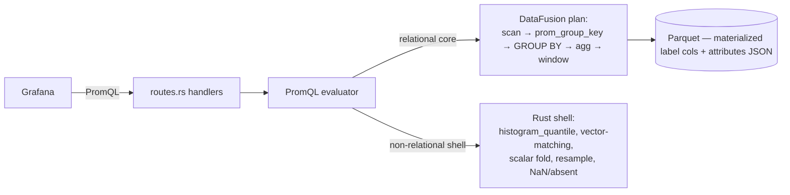
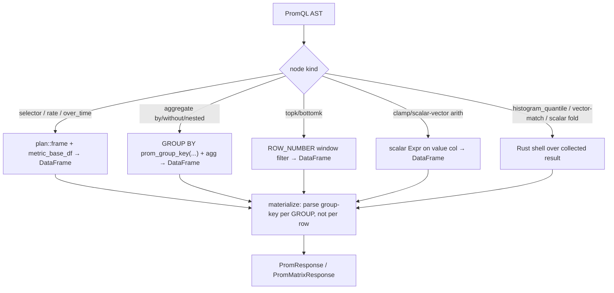

# promql-pushdown — Design Doc

## Context

The Sol querier evaluates PromQL over Parquet via DataFusion. Today the split is uneven (verified in `src/querier/prometheus.rs`):

- **Already relational (DataFusion):** vector selectors, `rate`/`irate`/`increase` (LAG window — `plan::frame::rate`), `<agg>_over_time` (RANGE-frame window — `plan::frame::over_time`), and single-level `<agg> by (…)` over a selector.
- **In-memory Rust (the cost):** `without(…)` grouping, **nested aggregates** (`count(count(…) by (cpu))`), `topk`/`bottomk`, `scalar()`, `clamp_min/max`, all binary/unary ops, and `histogram_quantile`. These run via `aggregate_instant_vector`/`aggregate_range_series` (the [promql-aggregate-evaluation ADR](../../workspace/parquet-backend/adrs/querier/promql-aggregate-evaluation.md)).
- **Materialization (the other cost):** `group_range_series` / `instant_vector_from_df` / `LabelCols::labels` rebuild each series' label map by calling **`serde_json::from_str` on the `attributes` column per row** (one parse + `BTreeMap` build for every sample).

Two pain points were **measured live** (14 MB Parquet = 4.5 M rows; queries 1–3 s):
1. **Per-row `attributes`-JSON parsing** on series materialization — a raw 24 h selector (~330 K rows) does ~330 K `serde_json` parses; this, not the 233 ms scan, dominates the ~3 s.
2. **High-cardinality in-memory aggregate composition** — the Rust path collects every series×point into RAM and reduces single-threaded, with **no spill** (the explicit risk in the superseded ADR).

The fix (agreed in discussion): a **hybrid** model. Push the **relational core** (scan → label/group-key extraction → grouping → aggregation → arithmetic → topk) into DataFusion logical plans so it inherits vectorised, parallel, spillable execution; keep a **thin Rust shell** only for the genuinely non-relational PromQL tail. The keystone is a **group-key column** computed in-plan — it lets `by` *and* `without` *and* nested aggregation become native DataFusion `GROUP BY` / chained `.aggregate()`. The **transition** computes the key from the `attributes` JSON via a scalar UDF; the **endgame** materialises hot labels as real Parquet columns (like `prom_name`) so the key is a prunable column op with row-group stats + bloom filters.

Not yet in production → **clean cutover, no retro-compat or backfill** (regenerate the Parquet store, exactly as the [prom-name-column](../../20260612_prom-name-column/README.md) migration did).

## Functional Requirements

### FR1 — `prom_group_key` scalar UDF (the keystone)
A deterministic scalar UDF that computes a **canonical group-key string** from a row's labels for a given grouping. It must support all three PromQL grouping modes:
- `by(L)` → key = sorted `k=v` pairs for labels in `L` that are present.
- `without(L)` → key = sorted `k=v` pairs for **all** labels **except** those in `L` and `__name__`.
- no modifier → constant key (one group).

Inputs are the `attributes` JSON column **plus** the promoted label columns (`service_name`, and — post-FR4 — any materialised label columns). The key string round-trips: it is the serialized result label set, so the response labels are recovered by parsing the key **once per output group**, never per input row. Registered on the shared `SessionContext` (like `prom_attr_udf`).

### FR2 — Aggregation pushdown
Lower `sum`/`min`/`max`/`avg`/`count` (with `by`/`without`/none) to a DataFusion `GROUP BY prom_group_key(...)` + aggregate over the value column, in both the instant and range evaluators. **Nested** aggregates lower to **chained `.aggregate()`** nodes (the recursive lowerer returns a `DataFrame` with a canonical schema, so an aggregate's inner can be any sub-plan). `topk`/`bottomk` lower to a `ROW_NUMBER() OVER (PARTITION BY ts ORDER BY v) <= k` window filter. The Rust helpers `aggregate_instant_vector`, `aggregate_range_series`, `AggGrouping`, `agg_reduce` are **deleted**.

### FR3 — Columnar series materialization (kill per-row JSON parse)
Result materialization must not call `serde_json::from_str` per input row.
- **Grouped results** carry the `prom_group_key` column → labels parsed once per output group.
- **Raw selectors** (no aggregation) materialize labels from columns: the promoted columns directly, and the attribute labels via the **endgame columns (FR4)** or, until then, a **parse-memoized-by-distinct-blob** path (parse each distinct `attributes` string once, not per row). `LabelCols`/`group_range_series`/`instant_vector_from_df` are reworked accordingly.

### FR4 — Columnar attributes (endgame, general)
The codec writes `attributes` as a **dictionary-encoded Arrow `MAP<Utf8,Utf8>`** column instead of a JSON string ([materialized-label-columns ADR](../adrs/2026-06-15_materialized-label-columns.md), Approach A). The read side (`prom_group_key`/`prom_attr`) reads the MAP **columnar — never `serde_json::from_str`** — for *every* label, and gains dictionary compression. This is general (no per-deployment allowlist). Per-label row-group pruning + bloom filters (Approach B, per-key columns) is **deferred** — it targets high-cardinality label-value filtering, which is not a measured pain. Clean cutover — the store is regenerated, old JSON-attribute files are not read.

### FR5 — Relational / non-relational boundary
A documented, enforced contract for what stays Rust (the thin shell) vs what is pushed to DataFusion. Stays Rust: `histogram_quantile` over OTLP bucket arrays (already Rust-native), vector matching `on/ignoring/group_left/right` edge cases, `scalar()` folding, staleness/NaN/absent and the step-grid resample (`resample_to_grid`), and the (currently unsupported) subquery/`@`/`offset` tail. Pushed to DataFusion: selectors, `rate`/`over_time` (already), grouping/aggregation (FR2), `clamp_min/max`, scalar∘vector arithmetic where it is a plain column op.

## Non-Functional Requirements

### NFR1 — No new external dependencies
Stay within the pinned set: `datafusion = "53"` (53.1.0), `datafusion-functions-json = "0.53.1"`, `object_store = "0.13"`, `promql-parser = "0.9"`, `moka = "0.12"`. `prom_group_key` is a custom Rust `ScalarUDF` (`create_udf`, like `prom_attr_udf`) — no new crate.

### NFR2 — PromQL parity (the contract)
Every existing querier PromQL test stays green — the ~32 tests in `prometheus.rs` (nested aggregate, `without`, `clamp_min`, `scalar` divisor, `topk`, `histogram_quantile`, vector matching, resample, etc.) are the parity contract. Results must match Mimir for the covered surface exactly as before (these tests encode that).

### NFR3 — Bounded querier memory
Aggregation must not materialize all series×points in querier RAM before reducing. After FR2 the grouping runs in DataFusion's hash aggregate (vectorised, multi-threaded, **spillable**), so a high-cardinality aggregate is bounded by DataFusion's memory pool, not by `O(series × points)` Rust `Vec`/`BTreeMap` growth.

### NFR4 — No-SQL-in-core invariant preserved
Query construction stays on the `Expr`/`DataFrame` API — **no `format!`-built SQL** (`sql.rs` remains the only sanctioned SQL surface). The existing invariant test (`no_sql_invariant_tests::test_no_format_sql_in_core`) must stay green; `prom_group_key` is wired via the UDF/Expr API, not string SQL.

### NFR5 — Clean cutover, no backfill
The FR4 schema change regenerates the Parquet store; old files (lacking the materialized columns) are **not** read and **not** migrated — identical policy to prom-name-column. The read side requires the new columns (or degrades gracefully to JSON for non-materialized labels), never both.

### NFR6 — Measurable latency improvement
The 24 h aggregate path (`sum(rate(…))`, `sum without(…)`) and raw-selector path are measurably faster than the in-memory baseline. Verified by a micro-benchmark over a synthetic high-cardinality fixture (parse count / wall-time) and, where the live stack is available, an `EXPLAIN ANALYZE` showing grouping in the plan rather than a post-scan Rust reduce.

## Non-goals

- **In-memory hot tier (ingester-style).** Already an explicit non-goal of [parquet-backend](../../workspace/parquet-backend/DESIGN.md#nfr6); freshness stays capped at the flush interval. This migration is about *how* flushed data is processed, not adding a RAM tier.
- **Intraday rollups for the active day.** A real lever for same-day long ranges, but it belongs to the rollup lifecycle ([long-range-metrics-strategy](../../workspace/parquet-backend/adrs/compactor/long-range-metrics-strategy.md)), not the PromQL engine. Excluded here to keep scope coherent; can be a separate workspace.
- **Subqueries `[5m:1m]`, `@`, `offset`.** Currently unsupported; this migration does not add them. FR5 only documents that they stay in the (thin) Rust shell when added.
- **Vector-matching pushdown into joins.** `on/ignoring/group_left/right` stays Rust (FR5) — join-based label-set matching is a rabbit hole (see below), and it is not a measured pain point.
- **Distributed query sharding (Mimir-style by-series).** Out of scope for a single-node engine.

## Rabbit holes

- **`without` over mixed promoted columns + JSON.** The group key must union the promoted label columns (`service_name`, materialized labels) with the `attributes` JSON keys, exclude the set + `__name__`, and sort canonically. *Cap:* the UDF takes the promoted columns as explicit extra args + the JSON column; it does **not** try to discover columns reflectively. Define the canonical format once (FR1 / [group-key-format ADR](../adrs/2026-06-15_group-key-format.md)) and freeze it.
- **Vector matching as SQL joins.** Tempting to push `vector∘vector` into a join keyed by the group-key. *Cap:* explicitly **out of scope** (FR5) — keep the existing Rust `vector_vector_*`; revisit only if it becomes a measured cost.
- **Materializing *all* attribute keys as columns.** Unbounded distinct keys → unbounded sparse columns → schema explosion. *Cap:* FR4 materializes a **bounded configured allowlist** of hot labels only ([materialized-label-columns ADR](../adrs/2026-06-15_materialized-label-columns.md)); everything else stays in `attributes` JSON.
- **DataFusion nested-aggregate plan building.** *Cap:* require the recursive lowerer to always return a `DataFrame` with a fixed canonical schema (`prom_group_key`-or-label columns + `v` + `time_unix_nano`); nesting is then just `.aggregate()` on that DataFrame. If a sub-expression can't produce that schema, it's in the Rust shell (FR5), not forced into the plan.

## Design

### Level 1 — context

### Level 2 — evaluation pipeline (target)

### Data model

The plan-carried frame has a **canonical schema** so any node composes with any other:

| Column | Meaning |
|---|---|
| `prom_group_key` (grouped) **or** promoted/label cols + `attributes` (raw) | series identity |
| `v` | value |
| `time_unix_nano` | sample time (range only) |

Write-side (FR4) extends the metric Parquet schema (per [materialized-label-columns ADR](../adrs/2026-06-15_materialized-label-columns.md)) with a bounded set of hot-label columns next to `prom_name`.

Decisions:
- [Aggregation pushdown — relational core in DataFusion](../adrs/2026-06-15_aggregation-pushdown.md) — *supersedes* [promql-aggregate-evaluation](../../workspace/parquet-backend/adrs/querier/promql-aggregate-evaluation.md)
- [Group-key canonical format](../adrs/2026-06-15_group-key-format.md)
- [Relational / non-relational boundary](../adrs/2026-06-15_relational-nonrelational-boundary.md)
- [Materialized hot-label columns (endgame, clean cutover)](../adrs/2026-06-15_materialized-label-columns.md)

## Cross-cutting Concerns

- **Observability:** no new metrics required; `sol_querier_*` latency/scan panels should show the 24 h aggregate path improve. Optionally add a debug log of the chosen plan shape (grouped-in-plan vs Rust shell) behind trace level.
- **Migration / cutover:** FR1–FR3 are read-side only — **no store change, deploy and go**. FR4 is a write-side schema change → clean cutover (regenerate the store), gated on ratifying the hot-label set. Sessions are ordered so the perf wins (FR1–FR3) land before the store-regenerating endgame (FR4).
- **Rollback:** FR1–FR3 revert by reinstating the Rust aggregate path (kept in git history); FR4 reverts by reverting the codec schema + regenerating. The parity tests (NFR2) are the safety net at every step.
