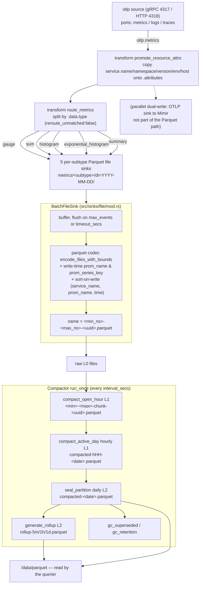
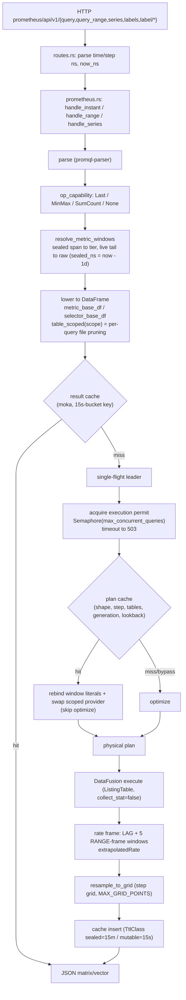

# Metrics write & read path

How a metric datapoint travels from OTLP ingest to a Parquet file, and how a Prometheus query reads it back. Every claim cites `file:line` on branch `feat/backend`; the design decisions behind each stage live in the dated workspace docs under `docs/2026*` (referenced inline).

- [Write path](#write-path)
- [Read path](#read-path)
- [Structural differences vs Prometheus/Mimir](#structural-differences-vs-prometheusmimir)
- [Code review — dead code & refactors](#code-review--dead-code--refactors)

---

## Write path

OTLP push → gateway routes by metric type → per-subtype Parquet files with self-describing names → compactor folds small files into an hourly/daily/rollup lattice.

### 1. Gateway ingest

- The **OTLP source** exposes three output ports `logs`/`metrics`/`traces` (`src/sources/opentelemetry/grpc.rs:35-37`, wired `src/sources/opentelemetry/config.rs:279-281`); the demo config binds gRPC :4317 / HTTP :4318 (`demo/otel-sol-grafana-dotnet/sol/sol-gateway.yaml:2-7`).
- **`promote_resource_attrs`** (remap) copies resource attributes (`service.name`, `service.namespace`, `service.version`, `deployment.environment`, `host.name`) onto every datapoint's `.attributes` (`sol-gateway.yaml:26-34`).
- **`route_metrics`** (route by `.data.type`) fans out to the 5 exhaustive OTLP subtypes — `gauge`, `sum`, `histogram`, `exponential_histogram`, `summary` — with `reroute_unmatched: false` dropping anything else (`sol-gateway.yaml:38-49`; route impl `src/transforms/route.rs:21-34`).
- Each route feeds a dedicated **Parquet file sink** writing to `metrics/<subtype>/dt=%Y-%m-%d/…` (`sol-gateway.yaml:108-161`). A separate OTLP sink dual-writes metrics to Mimir (`sol-gateway.yaml:83-93`) — parallel to, not part of, the Parquet path.

### 2. File sink: batching & self-describing names

- With `batch_encoding`, `build()` returns a `BatchFileSink` (`src/sinks/file/mod.rs:282-294`). It flushes when the buffer hits `max_events` or the `timeout_secs` sleep fires (`mod.rs:600-633`); demo values are `max_events: 5000, timeout_secs: 30` (defaults are 10 000 / 60 s, `mod.rs:145-152`).
- `flush_batch` renders the `dt=…` directory from the batch's first event, then calls the codec's `encode_files_with_bounds`, which returns **one `EncodedFile` per signal/subtype** present in the batch (`mod.rs:635-685`; `EncodedFile{data, time_bounds}` at `lib/codecs/src/encoding/encoder.rs:36-42`).
- **Exact-bounds naming**: each file is named `<min_ns>-<max_ns>-<uuid>.parquet` from the true folded time bounds of its rows (`parquet_bounds_path`, `mod.rs:797-820`), falling back to a legacy token name only if bounds are absent/degenerate (`mod.rs:765-776, 805`). This is what lets the querier prune files by name without opening footers — see [read path §2](#2-catalog--file-inventory). Bounds are folded per file in the codec (`fold_time_bound`/`metric_time_bounds`, `lib/codecs/src/encoding/format/parquet.rs:3794-3868`). *(Introduced by [`20260716_backend-metrics-perf`](../20260716_backend-metrics-perf/README.md) ADR A′.)*

### 3. Parquet codec & metric schema

`common_metric_schema_fields()` defines 15 shared columns + write-time materialised columns (`lib/codecs/src/encoding/format/parquet.rs:1562-1709`):

- Identity/time: `service_name`, `name`, `time_unix_nano` (TIMESTAMP ns UTC), `start_time_unix_nano`.
- **`attributes`** as a `MAP<Utf8,Utf8>` (`parquet.rs:1620-1622`) — all non-promoted labels live here.
- **`prom_name`** (REQUIRED) — normalised Prometheus name, computed at write via `sol_core::event::prom_name::prom_metric_name` (`parquet.rs:1686-1695, 2012-2019`).
- **`prom_series_key`** (REQUIRED) — canonical sorted+escaped `k=v` series key, computed at write via `sol_core::event::series_key::series_key` (`parquet.rs:1696-1707, 2317-2330`). The read path groups/partitions on this **plain column** instead of a per-row UDF. *(Introduced by [`20260722_rate-row-work`](../20260722_rate-row-work/README.md) FR2.)*
- Per-subtype value columns appended after the common 15 (gauge `int/double_value`; sum + temporality/monotonic; histogram `count/sum/min/max/bucket_counts/explicit_bounds`; exp-histogram; summary) — `parquet.rs:1712-1964`.
- **Sort-on-write**: metric row groups are sorted `(service_name, prom_name, time_unix_nano)` (`sort_dp_rows`, `parquet.rs:2021-2035`).

### 4. Compaction lattice

The compactor (`src/querier/compaction.rs`) runs `run_once` every `interval_secs` (`src/querier/mod.rs:96-110`), folding small files up a level lattice, all merges via `merge_inputs` with atomic staging (`compaction.rs:290-345`):

| Level | Producer | Output name | Trigger |
|---|---|---|---|
| L0 raw | gateway | `<min>-<max>-<uuid>.parquet` | ingest |
| L1 open-hour chunk | `compact_open_hour` (`compaction.rs:462-556`) | `<min>-<max>-chunk-<uuid>.parquet` | chunk closed ≥ `chunk_grace_secs`, ≥2 inputs *([`20260720_write-side-small-files`](../20260720_write-side-small-files/README.md))* |
| L1 closed-hour | `compact_active_day` (`compaction.rs:354-436`) | `compacted-hHH-<date>.parquet` | hour closed ≥ `hour_grace_secs`, ≥2 files |
| L2 daily | `seal_partition` (`compaction.rs:208-282`) | `compacted-<date>.parquet` | partition ≥ `grace_days` old |
| L2 rollup | `generate_rollup` (`rollup.rs:249-291`) | `rollup-5m/1h/1d.parquet` | sealed partitions only |

Consistency is **name-based, not lock-based**:
- Footer provenance `sol.compaction.{level,supersedes,resolution}` (`compaction.rs:39-43, 768-787`).
- `resolve_files` returns every `.parquet` except rollups and any name in a superseder's `supersedes` set — highest level wins, each datum read once (`compaction.rs:999-1019`).
- Staged `.<name>.tmp` → fsync → rename → fsync dir (`compaction.rs:744-787`); readers never see a partial file.
- GC deletes superseded inputs only after the superseder is older than `delete_grace_secs` (60 s > the querier's 15 s refresh, so a reader holding an old file list finishes first) (`compaction.rs:568-607`).

> **Note (write-side-small-files finding):** intraday *hourly* compaction was silently dead between the exact-bounds rename and its fix — `parse_hour` couldn't read the new names, so closed hours weren't collapsing. Now hours group via `contained_hour` on exact bounds (`compaction.rs:397-400, 722-727`).

### 5. Rollup tiers

`generate_rollup` downsamples sealed partitions into `metrics_5m/1h/1d` (`rollup.rs:249-291`), hash-aggregating per `(name, service_name, prom_series_key, time-bucket)` where `__bucket = time_unix_nano / resolution_ns` (`rollup.rs:145, 192-200`). Each bucket keeps the **last** raw sample plus rich per-bucket aggregates `value_{min,max,sum,count}` (`rollup.rs:180-191`) — this is what lets a tier answer `max/min/avg/sum/count_over_time` *and* stay exact, not just the last value. *(Design: [`20260716_rollup-read-routing`](../20260716_rollup-read-routing/README.md).)*

---

## Read path

A Prometheus query is parsed, its operator is mapped to the coarsest tier that can answer it, lowered to a DataFusion plan over a **time-scoped** file list, then run through three cache layers before execution.

### 1. HTTP routes

`make_routes` shares `Arc<QueryEngine>` into each filter (`src/querier/routes.rs:17-21, 499-681`). Endpoints: `/query` → `handle_instant`, `/query_range` → `handle_range`, `/series`/`/labels`/`/label/:name/values` → metadata handlers (`routes.rs:507-557`). A `warp::wrap_fn` adds an `InflightGuard` load gauge per request (`routes.rs:671-680`) — this is *not* the admission limit; the concurrency cap is an execution permit deeper in (§3). Overload surfaces as HTTP 503 + `Retry-After` by matching `OVERLOAD_MARKER` (`routes.rs:120-137`).

### 2. Catalog & file inventory

- `build_providers` walks each signal once, registering a `ListingTable` per signal with `with_collect_stat(false)` (schema is explicit, so footers aren't opened at plan time — EMFILE avoidance) and, in the same walk, populating a retained `FileInventory` (`src/querier/catalog.rs:218-260, 351-370`).
- `QueryEngine::table_scoped(name, scope)` filters that inventory to files whose interval overlaps the query window and builds an **unregistered, time-scoped** `ListingTable` via `LogicalPlanBuilder::scan(name, …)` (not `ctx.read_table` — the `name` is kept for plan-display/cache-key identity) (`catalog.rs:950-971`). Unknown table/schema → full-table fallback.
- File intervals are parsed from names by `parse_file_interval` (`src/querier/inventory.rs:174-225`): exact-bounds names → `[min, max+5s skew]`; `compacted-hHH` → that hour; `compacted-<date>`/`rollup-*` → the day; anything unparseable (incl. legacy `HH-MM-SS`) → unbounded/always-included. *(This per-query pruning is [`20260716_backend-metrics-perf`](../20260716_backend-metrics-perf/README.md) FR1.)*
- `refresh()` (every `refresh_interval_secs`, 15 s) rebuilds providers + inventory from one walk, swaps with a tight `deregister`→`register` (no `await` between) and **does not clear the result cache**; it bumps an inventory `generation` and invalidates the plan cache only when the file set actually changed (`catalog.rs:290-307, 1114-1133`).

### 3. Execution stack — layer order

Every metric query funnels through `sql` / `collect_scoped_stepped` / `sql_user` with this order (`catalog.rs:761-783, 1023-1098`):

1. **Result cache** (moka) — checked first, outside single-flight; key floors start/end to 15 s buckets; per-entry TTL via `ScopedExpiry` (sealed windows 15 min, mutable/unknown 15 s); a 256 MB weigher bounds memory; failures never cached (`src/querier/cache.rs:31-192`). *([`20260716_backend-metrics-perf`](../20260716_backend-metrics-perf/README.md) FR2.)*
2. **Single-flight** — concurrent identical `CacheKey`s coalesce onto one leader via `tokio::sync::watch`; the map mutex is never held across `await`; RAII removal on any exit; errors propagate to followers and are never cached (`src/querier/single_flight.rs:49-154`). *(FR3.)*
3. **Execution permit** — a `Semaphore(max_concurrent_queries)` acquired *inside* the leader (so coalesced followers don't consume capacity); bounded 5 s wait then `OverloadError`→503 (`catalog.rs:579, 681-692`). *(FR5.)*
4. **Plan cache** (DataFrame paths only) — caches the optimised `LogicalPlan` keyed by `(masked shape, step, tables, inventory generation, lookback config)`; on hit, rebinds the window-time literals and swaps the scoped `TableScan` provider, **skipping the optimize stage**; total-or-bypass rebind (`src/querier/plan_cache.rs:77-341`, `catalog.rs:824-892`). *(Design: [`20260717_promql-plan-cache`](../20260717_promql-plan-cache/README.md).)*

Stage timings (`parse`/`lower`/`optimize`/`physical`/`execute`) are recorded via `sol_querier_plan_stage_duration_seconds`; scan bytes/files are read from plan metrics after execution (`catalog.rs:800-811, 897-920, 451-535`).

### 4. PromQL lowering

- **`op_capability`** maps the query's operator to a tier capability — `rate`/`increase`/`histogram_quantile`→`Last`, `max/min_over_time`→`MinMax`, `avg/sum/count_over_time`→`SumCount`, everything else (incl. `irate`, quantile-over-time, bare selectors)→`None` (fail-safe raw) (`src/querier/prometheus.rs:2125-2159`).
- **`resolve_metric_windows`** is the single tier-resolution choke point: the sealed span (`hi < now − 1 day`) routes to the coarsest capable tier, the trailing live window always to raw `metrics` (`prometheus.rs:2202-2233`). *([`20260716_rollup-read-routing`](../20260716_rollup-read-routing/README.md).)*
- **Label model in the plan**: `prom_name` and `service_name` are real columns (predicate-pushdown / prune-friendly); the window/group partition key `prom_part() = [name, service_name, prom_series_key]` uses the **stored** `prom_series_key` column (`prometheus.rs:253-261`); any *other* label matcher becomes a `prom_attr(attributes, key)` UDF applied post-scan (`prometheus.rs:29-36`; `src/querier/plan/predicate.rs:39-44`).
- **`rate()`/`increase()`** lower to a DataFusion window plan (`src/querier/plan/frame.rs:185-310`), reduced by [`20260722_rate-row-work`](../20260722_rate-row-work/README.md) FR1 from 7 to **6 window expressions** (guard-tested at `frame.rs:558-575`): `LAG(prev_v)` + five RANGE-frame (`t−range … CURRENT ROW`) aggregates `SUM(delta)`, `FIRST_VALUE(delta)`, `FIRST_VALUE(v)`, `FIRST_VALUE(t)`, `COUNT(v)`. `last_t` is the current row's time (no `MAX(t)` window) and the `duration_to_end` term is dropped (provably 0 at a CURRENT ROW frame). This reproduces Prometheus `extrapolatedRate` bit-for-bit (golden-tested).
- **Instant** queries anchor `now`, apply a 5 min staleness lookback for bare selectors, and extend the scan by one `range` for LAG ops so the window's leading sample has a predecessor (`prometheus.rs:743-870`).
- **Grid resample** carries the last value forward within a staleness window onto the step grid, capped at `MAX_GRID_POINTS` (`prometheus.rs:2427-2471`).
- **Metadata** endpoints default an absent `start` to `now − metadata_default_range_secs` (3 days) so they take the pruned/tiered path instead of scanning all history (`routes.rs:218-281`; `catalog.rs:727-734`). *([`20260716_backend-metrics-perf`](../20260716_backend-metrics-perf/README.md) FR4.)*

---

## Structural differences vs Prometheus/Mimir

Sol serves the same PromQL results but with a fundamentally different engine: **columnar Parquet + DataFusion**, not an in-memory TSDB.

| Dimension | Prometheus/Mimir | Sol | Consequence |
|---|---|---|---|
| **Storage** | In-memory TSDB head + inverted index + immutable blocks; series = hash of its label set. | Columnar Parquet on disk via DataFusion; no inverted index; series identity = stored `prom_name` + `service_name` + `prom_series_key` columns (`catalog.rs:144-198`). | Sol re-reads Parquet per query; mitigated by result cache + plan cache + single-flight + file pruning. Measured ([`20260722_rate-row-work/VERIFY.md`](../20260722_rate-row-work/VERIFY.md)): result-cache hit **5.5 ms** (beats Mimir), warm repeated `rate()` **74–113 ms**, cold **384 ms**, vs **Mimir ~23 ms** — ~4× cold gap. |
| **Query evaluation** | Native PromQL engine over TSDB iterators; `rate()` = `extrapolatedRate` iterator. | `promql-parser` → **lowered** to a DataFusion window plan (`prometheus.rs`, `plan/frame.rs`). | Results **identical** (extrapolation reproduced bit-for-bit, golden-tested); only the execution *mechanism* differs (window operators vs streaming iterator). Sol is not a streaming engine — classic `_bucket`/`_count`/`_sum` series are synthesised on read. |
| **Label model** | Every label indexed; matchers hit the inverted index. | `prom_name`/`service_name` are materialised columns (pushdown/prune); all other labels live in an `attributes` MAP filtered by a post-scan `prom_attr` UDF (`prometheus.rs:29-36`; `plan/predicate.rs:39-44`). | Matchers on the two real columns prune files; any other label filter is O(rows scanned), not O(index lookup). |
| **Metric types** | Everything flattened to float samples; histograms exploded into `_bucket`/`_sum`/`_count` series. | 5 OTLP subtypes routed to separate Parquet dirs (`sol-gateway.yaml:38-49`), unioned as one logical `metrics` table (`catalog.rs:144`); native OTLP histogram arrays stored, `histogram_quantile` reads bucket columns directly (`prometheus.rs:1720-1799`). | Native OTLP fidelity, one query surface; classic series synthesised only when a query needs them. |
| **Downsampling** | Recording rules / Mimir downsampled blocks. | Rollup tiers `metrics_5m/1h/1d` with rich per-bucket `{last,min,max,sum,count}` + operator→capability routing (`rollup.rs`, `prometheus.rs:2088-2233`). | Rich per-bucket stats let a tier answer more operators exactly than a single downsampled value would. |
| **Freshness** | Scrape → head → immediately queryable. | OTLP push → gateway batches (~30 s demo flush) → querier refresh (15 s) discovers files. | Inherent tens-of-seconds ingest→visible latency absent in Prometheus's head; instant-query staleness window matches Prometheus's 5 min (`config/querier.rs:109`). |

---

## Code review — dead code & refactors

Reviewed `src/querier/` (+ the metric codec path and `sol-core` series key) after the multi-workspace iteration history. Findings verified against actual call sites/reachability; ranked by confidence.

### Actionable

**D1 — `prom_series_key_udf` is fully dead (registered but never invoked).** Confidence: HIGH.
After `rate-row-work` FR2 moved partitioning onto the stored `prom_series_key` **column**, the UDF's only two referents are its definition (`src/querier/udf.rs:97-113`) and its registration (`catalog.rs:647`); every other `prom_series_key` mention is the column accessor `col("prom_series_key")`, a comment, or a negative test assertion that the UDF is *absent* from the plan (`prometheus.rs:4819`, `rollup.rs:622`) — verified. Its private helper `series_key_string` (`udf.rs:115-120`) is then a thin wrapper used only by the UDF + one test.
**Action:** delete the UDF, `series_key_string`, the registration (`catalog.rs:644-647`), and the orphaned `test_prom_series_key_is_injective_and_sorted` (`udf.rs:356-367`). The `prom_series_key_expr()` column accessor is a different symbol and stays.

**C1 — Redundant local `use max_udaf`** at `frame.rs:90` — the module already imports it at `frame.rs:15`. Drop the local `use`.

**C2 — Duplicated `base` binding** across the rate/increase/irate arms (`prometheus.rs:415-432`) — each builds the identical `metric_base_df(…, metric_value_cols(name))`. Hoist above the `match`; gated by the rate/irate parity tests.

### Verified clean (no action)

- **`min_udaf`/`max_udaf` imports** (`frame.rs:15`) are *live* — used by `max/min_over_time` (`frame.rs:330-332`); FR1 only dropped `MIN(t)`/`MAX(t)` from `rate()`. Only the redundant *local* re-import (C1) is dead.
- **`rate()` has no leftover bindings** — all 5 frame windows are read; the reduction was 7→6 window exprs (guard `frame.rs:558-575`).
- **Superseded functions are gone** — `select_range_table`, `tiered_hist_source`, `topk_series` appear only in comments; no definitions/call sites. `resolve_metric_windows`/`op_capability` are live with no unreachable capability arms.
- **The one `#[allow(dead_code)]`** (`QueryCache::clear`, `cache.rs:157`) is legitimate — called only from tests.

### Assessment

**A1 — FR3 declared-sort machinery: correct and cheap, but yields zero elision today. Keep.** `METRIC_FILE_SORT_COLUMNS = [service_name, prom_name, time_unix_nano]` is declared via `with_file_sort_order` and correctly matches the codec write sort (drift-guarded, `catalog.rs:322-364, 1205`). It elides no window `SortExec` for **two** independent reasons, both verified: (1) the DataFusion-53 `CAST(time_unix_nano AS Int64)` in the window ORDER BY isn't treated as order-preserving (`test_rate_plan_sortexec_blocked_by_time_cast`, `prometheus.rs:3680`); and (2) the declared order doesn't even prefix-match the window partition `prom_part() = [name, service_name, prom_series_key]` (`prometheus.rs:258-260`) — so even fixing the cast wouldn't elide with the current declaration. Cost is negligible and the declaration is a correct safety statement; **the follow-up is a stored Int64 ns time column + aligning the declared columns to `prom_part`**, not removal (see [`20260722_rate-row-work`](../20260722_rate-row-work/README.md) VERIFY / ADR).

### Refactor opportunity

**R1 — Consolidate the scan+matcher skeleton** across `metric_base_df` / `selector_base_df` / `hist_scan` / `hist_instant_scan` (`prometheus.rs:200-241, 773-807, 2237-2258, 2550-2586`) — all four repeat `table_scoped(scope)` → filter `prom_name` → matcher loop, diverging only on the time predicate and projection. Extract a `scoped_matched_scan(engine, name, matchers, scope)` returning the post-matcher frame. Confidence: MEDIUM — touches every metric read path, so land it behind the existing selector/rate/histogram parity tests.

> Net: one high-confidence dead-code removal (**D1**), two mechanical cleanups (**C1/C2**), one test-gated refactor (**R1**). Everything else is already clean or correct-as-is.
