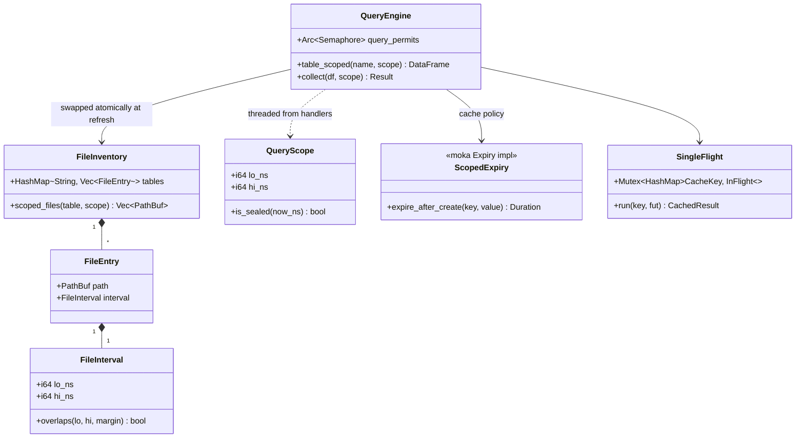

# backend-metrics-perf — Tasks

Design: [DESIGN.md](./DESIGN.md)

## Analysis

Build: `cargo build --lib` — verified green (via test compile)
Test: `cargo test --lib querier::` — verified green @ `ac28543d8`: 220 passed, 0 failed, 1 ignored
Lint: `make check-clippy` (`Makefile:478` → `cargo clippy --workspace --all-targets --all-features -- -D warnings`) — `--all-targets -D warnings` variant verified green @ `ac28543d8`; full `--all-features` gate was green at the same commit per `ac28543d8`'s own commit message, and no source has changed since

### Known-failing tests
| Test | Reason | Action |
|---|---|---|
| (1 ignored in `querier::` — pre-existing) | ignored by design | ignore |
| 6 × `codecs encoding::format::json` metric-serialisation tests under `-p codecs --all-features` | pre-existing at `cc88c6ba7` (verified identical at HEAD before task 1b landed); outside workspace scope | ignore |

### Measured baseline (live demo, image `sol:ac28543d8`, store: 1,529 metrics files / 7 days)
| Probe | Sol today | Target |
|---|---|---|
| Cold single 15-min `rate()` range query | 240–410 ms | ≤ 50 ms ([NFR1](./DESIGN.md#nfr1)) |
| Nonexistent-metric query | ~270 ms | ~few ms (falls out of FR1) |
| 20-query dashboard burst | ~2.3 s wall / ~19 core-s | ≤ 500 ms / ≤ 2 core-s ([NFR2](./DESIGN.md#nfr2)) |
| `EXPLAIN ANALYZE` footer opens per 15-min query | ~1,400 | O(window files), tens |
| `__name__` values / `series` (unbounded) | 570 ms / 370 ms | bounded window ([FR4](./DESIGN.md#fr4)) |

### Domain model

### Requirement traceability
| Type / Trait / Fn | Addresses | Notes |
|---|---|---|
| `FileInterval` | [FR1](./DESIGN.md#fr1) | Conservative per-file time bounds; unparseable → unbounded ([ADR](./adrs/per-query-file-pruning.md)) |
| `FileEntry`, `FileInventory` | [FR1](./DESIGN.md#fr1) | Retained at refresh from the same `build_providers` walk as the registered tables |
| `QueryScope` | [FR1](./DESIGN.md#fr1), [FR2](./DESIGN.md#fr2) | One window type serves file pruning and cache classification |
| `QueryEngine::table_scoped` | [FR1](./DESIGN.md#fr1) | Ephemeral unregistered `ListingTable` via `ctx.read_table` |
| `ScopedExpiry` | [FR2](./DESIGN.md#fr2) | Sealed windows → long TTL; mutable/unknown → 15 s ([ADR](./adrs/cache-invalidation-scope.md)) |
| `SingleFlight` | [FR3](./DESIGN.md#fr3) | Hand-rolled async coalescing keyed by existing `CacheKey` |
| `metadata_default_range_secs` (config) | [FR4](./DESIGN.md#fr4) | Routes default `start` when absent |
| `QueryEngine::query_permits` | [FR5](./DESIGN.md#fr5) | `tokio::sync::Semaphore` in `sql`/`collect`/`sql_user` ([ADR](./adrs/concurrency-guardrail.md)) |

### Transformations
| Function | Input → Output | Invariant / Rule |
|---|---|---|
| `parse_file_interval` | `&Path → FileInterval` | Unparseable names → unbounded interval (always included); `compacted-hHH` uses `hour_end_ns` convention; raw `HH-MM-SS-*` upper bound = flush time + margin, lower = day start |
| `FileInventory::scoped_files` | `(table, QueryScope) → Vec<PathBuf>` | **Superset guarantee**: contains every file whose interval overlaps `[lo − margin, hi + margin]`; margin = 1 h documented constant |
| `QueryEngine::table_scoped` | `(name, QueryScope) → DataFrame` | Result equality: identical rows to the full registered table filtered to the same window (the pruning is invisible in results) |
| `QueryScope::is_sealed` | `(self, now_ns) → bool` | `hi < now − 1 day` — same wall-clock rule as `SEALED_OFFSET_NS` (`src/querier/prometheus.rs:2069`) |
| `SingleFlight::run` | `(CacheKey, future) → CachedResult` | N concurrent same-key callers → exactly 1 execution; errors propagate to all waiters and are never cached |

### Constraints discovered (constitution)
- `test_no_format_sql_in_core` (`src/querier/mod.rs:184`): all query construction outside `sql.rs` uses the `Expr`/`DataFrame` API — no `format!` SQL.
- Refresh swap protocol: deregister/register pairs with no `await` between (`src/querier/catalog.rs:284-290`); the inventory swap must not reintroduce the race — build new inventory + providers fully, then swap both.
- moka is `sync`-only (`Cargo.toml:461`); no new dependencies, no new features on pinned crates without an ADR.
- The tier no-bypass guard (`src/querier/prometheus.rs:6398-6428`): tier tables reached only via `resolve_metric_windows` — `table_scoped` must respect the same rule.

## Tasks

### 1. `FileInterval` path parser ([FR1](./DESIGN.md#fr1))
**Goal**: Pure parsing of a Parquet file path into conservative time bounds — the foundation for pruning.
**Types**: `FileInterval`, `parse_file_interval` — see domain model
**Constraints**:
- [ADR: per-query file pruning](./adrs/per-query-file-pruning.md) — interval rules per name shape; unparseable → unbounded; reuse `partition_dirs`-style `dt=` parsing and `hour_end_ns` (`src/querier/compaction.rs:150-180, 545-550`)
- Invariant: parser is total — never errors, never excludes by default
**Tests** (red → green):
- `test_interval_raw_file_bounds` — `dt=2026-07-10/12-18-28-<uuid>.parquet` → `[day_start, flush+margin]`
- `test_interval_compacted_hour` — `compacted-h07-…` → `[07:00−margin, 08:00+margin]` of that day
- `test_interval_compacted_day_and_rollup` — full-day bounds
- `test_interval_unparseable_is_unbounded` — garbage name → always overlaps
- `test_interval_overlap_semantics` — boundary overlap cases incl. margin
**Verify**: `cargo test --lib querier::inventory && make check-clippy`
**Acceptance criteria**:
- [x] All five tests green; parser lives beside the catalog (new `src/querier/inventory.rs` or module the implementer chooses)
- [x] During implementation, verify and document (code comment) whether the gateway file-sink `%H-%M-%S` template stamps write time or event time (check the file sink implementation), per the ADR's ⚠️
**Depends on**: (none)
**Time-box**: ~60 min

### 1b. Self-describing file names at the gateway ([FR1](./DESIGN.md#fr1), [ADR A′ — ratified](./adrs/per-query-file-pruning.md))
**Goal**: The Parquet file sink names each metrics/logs/traces file with its batch's exact `time_unix_nano` bounds (`<min_ns>-<max_ns>-<uuid>.parquet`) so the inventory parses exact intervals; requires the demo store wipe at rollout.
**Types**: gateway file-sink naming + codec exposing batch min/max; `parse_file_interval` extended for the new shape (exact bounds + skew constant)
**Constraints**:
- [ADR: per-query file pruning](./adrs/per-query-file-pruning.md) — A rules stay as fallback (unparseable/legacy names → conservative/unbounded); `compacted-*`/`rollup-*` naming untouched
- Invariant: name bounds are exact min/max of the file's `time_unix_nano` values
**Tests** (red → green):
- `test_sink_filename_carries_batch_time_bounds` — encoded batch min/max appear in the produced file name
- `test_interval_exact_bounds_name` — parser returns `[min, max + skew]` for the new shape
**Verify**: `cargo test --lib querier::inventory && make check-clippy`
**Acceptance criteria**:
- [x] Both tests green; demo README/compose note the store-wipe requirement for the rollout
**Depends on**: task 1
**Time-box**: ~60 min

### 2. Retained `FileInventory` + `QueryEngine::table_scoped` ([FR1](./DESIGN.md#fr1))
**Goal**: Refresh retains the per-table file list with intervals; the engine can serve a time-scoped DataFrame over a filtered, unregistered provider.
**Types**: `FileEntry`, `FileInventory`, `QueryScope`, `QueryEngine::table_scoped`
**Constraints**:
- [ADR: per-query file pruning](./adrs/per-query-file-pruning.md) — inventory and registered tables derive from the same `build_providers` walk; swap atomically; scoped provider via `ctx.read_table`, never registered
- Invariant: superset guarantee (transformations table); empty filtered list → empty MemTable with the table schema (mirror `catalog.rs:242-245`)
- Unknown table name or windowless caller → fall back to the registered full table
**Tests**:
- `test_inventory_built_on_refresh` — refresh over a 3-day fixture yields inventory entries per table
- `test_table_scoped_excludes_out_of_window_files` — 15-min scope over 3-day fixture returns only in-window rows AND `scoped_files` returns only the expected paths
- `test_table_scoped_equals_full_table_filtered` — result-equality invariant on a fixture spanning the boundary
- `test_table_scoped_unknown_table_falls_back` — behaves as `engine.table`
**Verify**: `cargo test --lib querier:: && make check-clippy`
**Acceptance criteria**:
- [x] All four tests green; no change to registered-table behaviour (existing catalog tests untouched and green)
**Depends on**: task 1
**Time-box**: ~75 min

### 3. Wire query paths through `table_scoped` ([FR1](./DESIGN.md#fr1), [NFR1](./DESIGN.md#nfr1), [NFR3](./DESIGN.md#nfr3))
**Goal**: Every windowed call site prunes; windowless sites keep today's behaviour.
**Types**: `QueryScope` threaded through `metric_base_df` (`src/querier/prometheus.rs:203`), `selector_base_df` (`:756`), `hist_scan` (`:2131`), `build_label_values` scan (`:1375`), ranged `metadata_sources` (`:155`), `build_series`, Loki range paths (`src/querier/loki.rs:234, 290, 331`), Tempo search (`src/querier/tempo.rs:219`)
**Constraints**:
- Windowless paths unchanged: `metadata_sources` no-range branch, `handle_labels`, Tempo tags/trace-by-id, raw SQL
- Tier no-bypass guard stays green (`prometheus.rs:6398-6428`)
- Lookback is already inside the callers' windows (shard lookback / `instant_range_windows`) — `table_scoped` must **not** re-widen beyond the margin
**Tests**:
- `test_range_query_opens_only_window_files` — 3-day fixture, 15-min query: files-opened assertion via the `DebuggingRecorder` pattern (`test_query_records_real_bytes_scanned` precedent, `catalog.rs:896`)
- `test_cross_day_query_correct` — window spanning a day boundary returns identical results to pre-change (result-equality on fixture)
- Existing `querier::` suite (≈220) is the regression net — all green
**Verify**: `cargo test --lib querier:: && make check-clippy`
**Acceptance criteria**:
- [ ] Files-opened for a 15-min query on the multi-day fixture ≤ in-window file count (deterministic proxy for [NFR1](./DESIGN.md#nfr1))
- [ ] Full `querier::` suite green, tier guard included
**Depends on**: task 2
**Time-box**: ~90 min

### 4. Scoped cache expiry; refresh stops clearing ([FR2](./DESIGN.md#fr2))
**Goal**: Sealed-window results survive catalogue refreshes; live staleness bound unchanged.
**Types**: `ScopedExpiry`, `QueryScope::is_sealed`, cache insert path carrying the scope
**Constraints**:
- [ADR: cache invalidation scope](./adrs/cache-invalidation-scope.md) — remove `clear()` from `refresh()` (`src/querier/catalog.rs:611-614`); per-entry TTL via moka `Expiry`; unclassified → short TTL; update the `refresh()` docstring promise (`catalog.rs:607-609`)
- Invariant: no entry may outlive the byte budget (weigher unchanged)
**Tests**:
- `test_sealed_entry_survives_refresh` — insert sealed-classified entry, `refresh()`, still a hit
- `test_live_entry_short_ttl_classification` — classification unit tests on `is_sealed` boundary (`hi = now − 1 day ± ε`)
- `test_unscoped_insert_defaults_to_short_ttl`
**Verify**: `cargo test --lib querier:: && make check-clippy`
**Acceptance criteria**:
- [ ] Tests green; `refresh()` no longer calls `clear()`; docstring updated
**Depends on**: task 3 (scope plumbing)
**Time-box**: ~75 min

### 5. Single-flight execution ([FR3](./DESIGN.md#fr3), [NFR2](./DESIGN.md#nfr2))
**Goal**: Concurrent identical queries execute once. (Expected impact tempered in FR3: helps concurrent viewers and Grafana re-fires, not a single viewer's distinct panels.)
**Types**: `SingleFlight` in front of `sql`/`collect`/`sql_user` (`src/querier/catalog.rs:519, 566, 591`)
**Constraints**:
- [ADR: cache invalidation scope](./adrs/cache-invalidation-scope.md) — hand-rolled (moka `sync` `get_with` would block the executor); errors propagate to all waiters, never cached; in-flight entry removed on completion (no leak on panic/cancel)
**Tests**:
- `test_single_flight_coalesces_concurrent_identical` — N concurrent same-key calls, execution counter (counting wrapper) shows 1
- `test_single_flight_error_propagates_and_not_cached` — failing leader fails all waiters; next call re-executes
- `test_single_flight_distinct_keys_parallel` — different keys don't serialise
**Verify**: `cargo test --lib querier:: && make check-clippy`
**Acceptance criteria**:
- [ ] Tests green; coalesced-hit counter emitted via `sol_querier_*` telemetry (`src/querier/telemetry.rs` conventions)
**Depends on**: task 4
**Time-box**: ~60 min

### 6. Bounded metadata defaults ([FR4](./DESIGN.md#fr4))
**Goal**: Variable/label queries without `start` stop scanning all history.
**Types**: `metadata_default_range_secs` config field (default 3 days), applied in `prom_label_values` / `prom_series` / `prom_labels` route param parsing (`src/querier/routes.rs:204-209`)
**Constraints**:
- Explicit `start` from the client always wins; Prometheus API semantics otherwise unchanged
- Sealed-span tier routing in `build_label_values` (`src/querier/prometheus.rs:1351-1370`) is already correct — only the default window changes
**Tests**:
- `test_label_values_default_start_bounded` — route test: fixture with an old file outside the default window; its labels absent without `start`, present with explicit `start=0`
- `test_series_default_start_bounded` — same for `/series`
**Verify**: `cargo test --lib querier:: && make check-clippy`
**Acceptance criteria**:
- [ ] Tests green; config field documented in the demo `sol-querier.yaml` comment style
**Depends on**: task 3
**Time-box**: ~45 min

### 7. Enforce `max_concurrent_queries` ([FR5](./DESIGN.md#fr5))
**Goal**: The configured guardrail actually guards.
**Types**: `QueryEngine::query_permits` (`Arc<tokio::sync::Semaphore>`), acquire with bounded wait in `sql`/`collect`/`sql_user`; timeout → typed overload error mapped to 503 + `Retry-After` in `routes.rs`
**Constraints**:
- [ADR: concurrency guardrail](./adrs/concurrency-guardrail.md) — bounded wait constant (injectable for tests); shed counter telemetry; `InflightGuard` gauge untouched
**Tests**:
- `test_semaphore_limits_concurrency` — max=1, hold a permit, second call sheds after (tiny test) timeout with the overload error
- `test_shed_maps_to_503` — route-level: 503 + `Retry-After` header
- `test_permits_released_on_error` — failing query frees its permit
**Verify**: `cargo test --lib querier:: && make check-clippy`
**Acceptance criteria**:
- [ ] Tests green; `sol_querier_shed_total` (or equivalent) counter emitted
**Depends on**: (none — parallel-safe; scheduled last for merge simplicity)
**Time-box**: ~60 min

### 8. Demo-scale evidence: benchmark fixture + live re-measurement checklist ([NFR1](./DESIGN.md#nfr1), [NFR2](./DESIGN.md#nfr2))
**Goal**: Prove the targets with a repeatable in-repo measurement and script the live verification for Phase 6.
**Types**: `#[ignore]`d benchmark-style test generating a demo-scale store (≥ 1,500 files, ≥ 7 `dt=` days) + deterministic files-opened assertions; a `VERIFY.md` (workspace) with the exact curl probes used in this analysis (single cold query, 20-query burst, metadata endpoints) and the baseline numbers to beat
**Constraints**:
- Wall-clock assertions only in the `#[ignore]`d bench (CI-safe); deterministic assertions use files-opened counts
**Tests**:
- `bench_cold_range_query_demo_scale` (`#[ignore]`) — prints cold/warm latency + files opened
- `test_files_opened_scales_with_window_not_store` — 15-min vs 3-day window on the same fixture: opened counts differ accordingly
**Verify**: `cargo test --lib querier:: && cargo test --lib querier:: -- --ignored bench_cold_range_query_demo_scale --nocapture`
**Acceptance criteria**:
- [ ] Deterministic test green; bench runs and prints; `VERIFY.md` lists probes + baseline numbers (from the Analysis table above)
**Depends on**: tasks 3, 4, 5
**Time-box**: ~60 min

## Sessions

### Session 1 — FR1: file pruning end-to-end (~4.75 H)
Tasks: 1, 1b, 2, 3
**Skills**: `rust-software-engineer`, `rust-build`, `tdd`
**Checkpoint**: `cargo test --lib querier:: && make check-clippy`
**Commit point**: yes — commit after checkpoint passes

### Session 2 — FR4 (FR1 enabler) + FR2 + FR3 (~3 H)
Tasks: 6, 4, 5 — in this order (priority ranking in [DESIGN.md](./DESIGN.md#priority-review-against-the-original-7-item-recommendation): metadata bounding unlocks FR1 for variable queries and ships first)
**Skills**: `rust-software-engineer`, `rust-build`, `tdd`
**Checkpoint**: `cargo test --lib querier:: && make check-clippy`
**Commit point**: yes

### Session 3 — FR5 (cuttable) + evidence (~2 H)
Tasks: 7, 8
**Skills**: `rust-software-engineer`, `rust-build`, `tdd`
**Checkpoint**: `cargo test --lib querier:: && make check-clippy && cargo test --lib querier:: -- --ignored bench_cold_range_query_demo_scale --nocapture`
**Commit point**: yes

## Quality gates (post-session review)
- [ ] Acceptance criteria: all green above
- [ ] Code review: implementation matches [DESIGN.md](./DESIGN.md) intent
- [ ] Code organization: inventory module placement, naming consistent with catalog/compaction conventions
- [ ] Code quality: no new complexity beyond the three ADR mechanisms; no duplication of path parsing (reuse `compaction.rs` helpers)
- [ ] Security review: no new deps; overload shed path returns no internal detail
- [ ] Observability: files-opened p95 drop visible on the SOL Querier Backend dashboard; coalesced-hit + shed counters wired
- [ ] Performance: [NFR1](./DESIGN.md#nfr1)/[NFR2](./DESIGN.md#nfr2) — bench numbers recorded here; live re-measurement (VERIFY.md) after user rebuild, alongside the pending rollup-read-routing/range-rate-parity live checks
