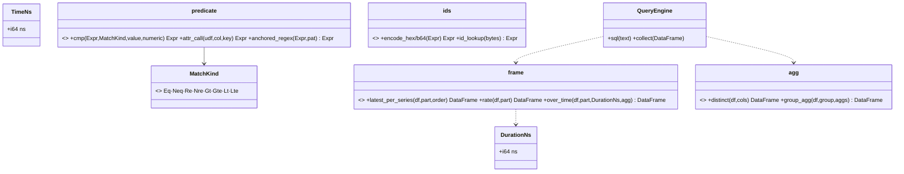

# expr-lowering — Tasks

Design: [DESIGN.md](./DESIGN.md) · ADRs: [lowering-target](./adrs/lowering-target.md),
[migration-scope](./adrs/migration-scope.md), [plan-cache-keying](./adrs/plan-cache-keying.md),
[canonical-nanoseconds](./adrs/canonical-nanoseconds.md)

## Analysis

Build: `cargo build --features query-backend` — green (baseline)
Test: `cargo test --features query-backend --lib query::` — green (**153** tests)
Lint: `cargo clippy --features query-backend --lib -- -D warnings` — green
New filters: `… --lib query::units`, `… --lib query::plan`.

> ⚠ Builds are slow here (~8–14 min full test relink). Use `cargo check -p sol`
> mid-task; batch test runs at session checkpoints.

### Goal invariant (FR6)
After migration: **no `format!`-built SQL in `src/query/` except `sql.rs`** (the
user endpoint) and test fixtures. A grep gate enforces it.

### The 9 primitives (target of the migration) — see [DESIGN](./DESIGN.md#design)
P1 predicate · P2 LHS resolver · P3 scan/filter/project/sort/limit · P4 distinct/agg ·
P5 latest-per-series (window) · P6 rate (window) · P7 `*_over_time` (window frame) ·
P8 range group-by · P9 id encode/lookup.

### Unit-conversion sites to centralize ([FR7](./DESIGN.md#fr7))
Ingress: `routes.rs::{parse_ns, parse_time_ns, parse_step_ns, loki_step_ns}` (sec→ns).
Duration parsers (3 → 1): PromQL `Duration::as_nanos`, TraceQL `duration_nanos`, LogQL `[5m]`.
Egress: `prometheus.rs` `ts as f64 / 1e9` (matrix/vector). Core: drop all `*1e9`/`/1e9`/`CAST AS BIGINT` unit use.

### Known-failing tests
| Test | Reason | Action |
|---|---|---|
| (none) | clean baseline | — |

### Domain model

### Requirement traceability
| Type / Module | Addresses | Notes |
|---|---|---|
| `units::{TimeNs, DurationNs, parse_duration_ns}` + ingress/egress funnels | [FR7](./DESIGN.md#fr7) | canonical ns; boundary-only conversion |
| `plan::predicate` (P1, P2) | [FR1](./DESIGN.md#fr1), [FR2](./DESIGN.md#fr2) | shared matcher → `Expr`, `lit()` values |
| `plan::frame` (P5, P6, P7) | [FR3](./DESIGN.md#fr3) | window primitives; isolation-tested |
| `plan::agg` (P4, P8), `plan::ids` (P9) | [FR3](./DESIGN.md#fr3) | distinct/group-by, id encode/lookup |
| `QueryEngine::collect` + plan cache key | [FR4](./DESIGN.md#fr4), [NFR2](./DESIGN.md#nfr2) | DataFrame execution + cache |
| `tempo::*`, `loki::*`, `prometheus::*` rewired | [FR3](./DESIGN.md#fr3), [FR5](./DESIGN.md#fr5), [FR6](./DESIGN.md#fr6) | compose primitives; no SQL |

### Transformations
| Function | Input → Output | Invariant |
|---|---|---|
| `predicate::cmp` | `(Expr, MatchKind, value, numeric) → Expr` | value is `lit()`; regex anchored; absent≡empty |
| `frame::rate` | `DataFrame → DataFrame` | result == current `rate_sql` (counter-reset, dup-ts drop, /dt) |
| `frame::over_time` | `(DataFrame, DurationNs, agg) → DataFrame` | RANGE frame in ns == current `over_time_sql` |
| `frame::latest_per_series` | `DataFrame → DataFrame` | one row per series at/before `t` (== `rn=1`) |
| `QueryEngine::collect` | `DataFrame → Vec<RecordBatch>` | same cache/telemetry as `sql()` |
| `parse_duration_ns` | `&str → DurationNs` | `5m`→300e9, `1.5s`→1.5e9; one parser for all 3 langs |

## Tasks

### 0. Canonical-nanosecond units ([FR7](./DESIGN.md#fr7))
**Goal**: Introduce `units` (`TimeNs`, `DurationNs`, `parse_duration_ns`); route the
4 ingress parsers + 3 duration parsers + Prometheus egress through it; delete scattered
`*1e9`/`/1e9` unit handling. Parity-safe (no behaviour change).
**Types**: `TimeNs`, `DurationNs` — see domain model
**Constraints**: [ADR canonical-nanoseconds](./adrs/canonical-nanoseconds.md); values stay `f64`; conversions only at ingress/egress.
**Tests**: `test_parse_duration_ns` (`5m/1.5s/200ms/1h`), `test_ingress_sec_to_ns`, `test_egress_ns_to_sec_fractional`, existing `query::` suite stays green.
**Verify**: `cargo test --features query-backend --lib query::units && cargo test --features query-backend --lib query::`
**Acceptance**: [ ] one ingress + one egress conversion site each; [ ] one duration parser; [ ] `query::` green (parity); [ ] no `*1e9`/`/1e9` outside `units` + serializers.
**Depends on**: (none) **Time-box**: ~75 min

### 1. Predicate/agg/ids primitives + plan execution ([FR1](./DESIGN.md#fr1), [FR2](./DESIGN.md#fr2), [FR4](./DESIGN.md#fr4))
**Goal**: `plan::predicate` (P1/P2), `plan::agg` (P4/P8), `plan::ids` (P9), and `QueryEngine::collect(DataFrame)` with plan-based cache keying.
**Types**: `MatchKind`, `predicate::*`, `agg::*`, `ids::*` — see domain model
**Constraints**: [lowering-target](./adrs/lowering-target.md), [plan-cache-keying](./adrs/plan-cache-keying.md); `lit()` values; UDFs as `Expr::ScalarFunction` from the registry; no new dep.
**Tests**: `test_cmp_literal_expr` (value bound, `a'b` safe), `test_anchored_regex`, `test_eq_absent_aware`, `test_collect_caches` (equal plan → hit).
**Verify**: `cargo test --features query-backend --lib query::plan`
**Acceptance**: [ ] 8 ops build with `lit()`; [ ] `collect` returns batches + caches; [ ] `prom_attr`/`json_get_str`/`encode` reachable as `Expr`.
**Depends on**: 0 **Time-box**: ~90 min

### 2. Window primitives, parity-tested in isolation ([FR3](./DESIGN.md#fr3), [NFR2](./DESIGN.md#nfr2))
**Goal**: `plan::frame::{latest_per_series, rate, over_time}` (P5/P6/P7) built and
proven against the **current SQL outputs** before any rewire (the de-risking gate).
**Types**: `frame::*` — see domain model
**Constraints**: [migration-scope](./adrs/migration-scope.md); ns `i64` order key + frame bound (canonical units); reproduce counter-reset + dup-ts drop (P6) and RANGE-frame (P7) exactly.
**Tests** (over a fixture, assert equality to the existing SQL path's result):
- `test_rate_matches_sql` — same values as `rate_sql` on the counter fixture (incl. reset).
- `test_over_time_matches_sql` — `max_over_time` RANGE frame equals `over_time_sql`.
- `test_latest_per_series_matches_sql` — one row/series at/before `t`.
**Verify**: `cargo test --features query-backend --lib query::plan`
**Acceptance**: [ ] all three window helpers match the SQL path on fixtures; [ ] frame bounds in ns; [ ] helpers frozen (signatures stable for rewire).
**Depends on**: 1 **Time-box**: ~90 min

### 3. Rewire TraceQL + LogQL (filters/discovery, no windows) ([FR3](./DESIGN.md#fr3), [FR5](./DESIGN.md#fr5))
**Goal**: TraceQL search/trace-by-id/tags + LogQL streams/volume/discovery build via
`plan::*` + DataFrame; route handlers through `collect`. No `format!` SQL in tempo.rs/loki.rs.
**Constraints**: parity; deferred TraceQL/LogQL features still error; volume level `CASE`/bucket as `Expr`.
**Tests**: rewrite `query::tempo`/`query::loki` SQL-substring tests to plan/result; end-to-end fixtures stay green; value-injection test (`'`/`&&` can't alter plan).
**Verify**: `cargo test --features query-backend --lib query::tempo && cargo test --features query-backend --lib query::loki`
**Acceptance**: [ ] tempo.rs + loki.rs have no `format!` SQL; [ ] both suites green.
**Depends on**: 1 **Time-box**: ~90 min

### 4. Rewire PromQL (instant + range, windows) ([FR3](./DESIGN.md#fr3), [FR5](./DESIGN.md#fr5))
**Goal**: PromQL instant (P5 latest + P4 `sum by`), range (P6 rate, P7 `*_over_time`,
P8 group-by, bare selector), series/labels (P4) compose the primitives. The
histogram/bucket/binary-op/resample Rust analytics are unchanged (consume batches).
**Constraints**: parity with the full `query::prometheus` suite; rollup-tier table
selection + frontend shard split preserved; instant ts = eval time.
**Tests**: rewrite SQL-substring tests to plan/result; the existing execution tests
(`test_rate_executes…`, `test_max_over_time_executes…`, `test_topk…`, hist tests) stay
green unchanged (they assert results).
**Verify**: `cargo test --features query-backend --lib query::prometheus`
**Acceptance**: [ ] prometheus.rs query-construction has no `format!` SQL; [ ] suite green.
**Depends on**: 2, 3 **Time-box**: ~90 min

### 5. Enforce the no-SQL invariant + finalize ([FR6](./DESIGN.md#fr6))
**Goal**: Add the grep gate (no `format!` SQL in `src/query/` outside `sql.rs`/tests);
confirm `QueryEngine::sql` is used only by `sql_user`; update the design coverage map;
full checkpoint.
**Tests**: `test_no_format_sql_in_core` (a test or CI grep asserting the invariant).
**Verify**: `cargo test --features query-backend --lib query:: && cargo clippy --features query-backend --lib -- -D warnings`
**Acceptance**: [x] invariant holds (`test_no_format_sql_in_core` green); [x] full `query::` green (137 passed); [x] clippy clean (`--lib -D warnings`); [x] coverage map updated.
**Depends on**: 3, 4 **Time-box**: ~60 min

> **Status (done):** all tasks T0–T5 complete and committed. Read+write query
> construction is fully on the DataFusion `Expr`/`DataFrame` API; the only
> sanctioned `.sql()` is `QueryEngine::sql` (user endpoint, borrowed `&str`).
> Phase 6 (move ADRs/DESIGN to durable docs, delete this workspace) is
> **intentionally deferred** per the user — this workspace stays in place.
> Pre-existing `clippy --tests` `clone_on_ref_ptr` warnings in test fixtures
> are out of scope (the checkpoint is lib-only clippy).

## Sessions

### Session 1 — units + primitives (~4H)
Tasks: 0, 1, 2
**Skills**: `rust-software-engineer`
**Checkpoint**: `cargo test --features query-backend --lib query::units && cargo test --features query-backend --lib query::plan && cargo test --features query-backend --lib query:: && cargo clippy --features query-backend --lib -- -D warnings`
**Commit point**: yes (after each task)

### Session 2 — TraceQL + LogQL rewire (~2H)
Tasks: 3
**Skills**: `rust-software-engineer`
**Checkpoint**: `cargo test --features query-backend --lib query::tempo && cargo test --features query-backend --lib query::loki && cargo clippy --features query-backend --lib -- -D warnings`
**Commit point**: yes

### Session 3 — PromQL rewire + invariant (~2.5H)
Tasks: 4, 5
**Skills**: `rust-software-engineer`
**Checkpoint**: `cargo test --features query-backend --lib query:: && cargo clippy --features query-backend --lib -- -D warnings`
**Commit point**: yes

## Quality gates (post-session review)
- [ ] Acceptance criteria all green
- [ ] No `format!` SQL in core (grep gate), `sql()` only for the user endpoint
- [ ] Window primitives match the prior SQL outputs on fixtures (parity gate)
- [ ] Predicate builder is the single op-semantics source; values are `lit()`
- [ ] Units: one ingress + one egress conversion; no `*1e9`/`/1e9`/`CAST AS BIGINT` in core
- [ ] Observability: `collect()` emits the same telemetry as `sql()`
- [ ] Performance: no latency regression; cache hit-rate preserved

## Uncertainty (hill chart)
- T0 units — **downhill** (centralization of existing logic; parity-safe).
- T1 predicate/agg/ids + `collect` — **downhill** (well-understood API).
- T2 window primitives — **downhill but the real risk**; the isolation-vs-SQL parity
  tests are the gate — if any can't reach parity in time-box, fall back to hybrid for
  that one primitive ([migration-scope](./adrs/migration-scope.md) escape hatch).
- T3, T4, T5 — **downhill** once T2 is green (compose + rewire + invariant).
- No task is blocking-uphill; the only concentrated risk (P5/P6/P7) is isolated and
  has a documented fallback.

## Pre-flight gate (Phase 4c) — confirm before Phase 5
- [ ] ADRs accepted (lowering-target, migration-scope, plan-cache-keying, canonical-nanoseconds).
- [ ] Baseline build/test/lint green (run now).
- [ ] `QueryEngine::collect` + plan cache key validated against the moka `CacheKey`.
- [ ] `functions_window` (row_number/lag) + `WindowFrame(Range, Preceding)` confirmed in DataFusion 53 API.
- [ ] `lit()`/UDF-as-`Expr` reachability for `prom_attr`/`prom_metric_name`/`json_get_str`/`encode`.
