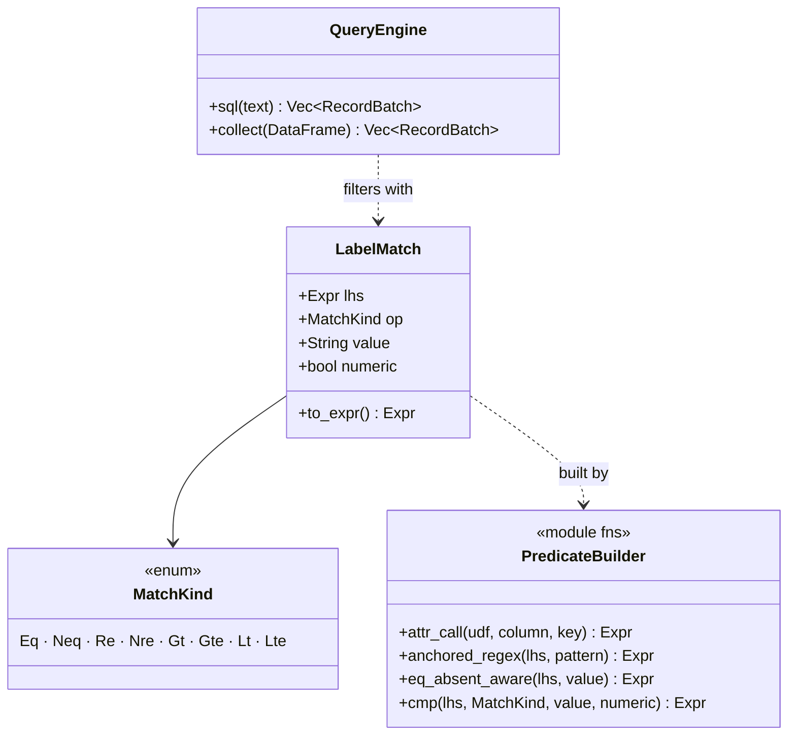

# expr-lowering — Tasks

Design: [DESIGN.md](./DESIGN.md) · ADRs: [lowering-target](./adrs/lowering-target.md),
[hybrid-boundary](./adrs/hybrid-boundary.md), [cache-and-unparser](./adrs/cache-and-unparser.md)

## Analysis

Build: `cargo build --features query-backend` — green (baseline)
Test: `cargo test --features query-backend --lib query::` — green (**153** tests)
Lint: `cargo clippy --features query-backend --lib -- -D warnings` — green
New module test filter: `… --lib query::predicate`.

> ⚠ Builds are slow here (~8–14 min for the full `sol` test-binary relink). Batch
> verification at session checkpoints; prefer `cargo check -p sol` mid-task.

### Known-failing tests
| Test | Reason | Action |
|---|---|---|
| (none) | clean baseline | — |

### Current predicate/lowering surface (to unify or migrate)
| Signal | label-LHS fn | predicate fn(s) | UDFs used |
|---|---|---|---|
| prometheus | `label_lhs` | `matcher_pred`, `metric_value_and_match` | `prom_attr`, `prom_metric_name`, `regexp_like` |
| loki | `label_lhs` | `label_pred`, `line_pred`, `label_filter_pred` | `prom_attr`, `regexp_like`, `octet_length` |
| tempo | `traceql_lhs` | `lower_cmp`, `lower_field_expr`, `collect_preds` | `json_get_str`, `regexp_like` |

Execution: all via `QueryEngine::sql(&str)` (`ctx.sql`), cache keyed by SQL text
(`CacheKey::for_sql`). UDFs registered on the `SessionContext` (json funcs via
`datafusion-functions-json`; `prom_attr`/`prom_metric_name` in `src/query/udf.rs`).

### Domain model

### Requirement traceability
| Type / Fn | Addresses | Notes |
|---|---|---|
| `predicate::MatchKind`, `LabelMatch`, `cmp/attr_call/anchored_regex/eq_absent_aware` | [FR1](./DESIGN.md#fr1), [FR2](./DESIGN.md#fr2) | the shared builder; `lit()` values |
| `QueryEngine::collect` + plan cache key | [FR4](./DESIGN.md#fr4), [NFR2](./DESIGN.md#nfr2) | DataFrame execution + cache |
| `tempo::*` (search via DataFrame) | [FR3](./DESIGN.md#fr3), [FR5](./DESIGN.md#fr5) | pilot |
| `loki::*` (streams/volume/discovery via DataFrame) | [FR3](./DESIGN.md#fr3), [FR5](./DESIGN.md#fr5) | |
| `prometheus::*` (series/label_values via DataFrame; matchers via builder) | [FR3](./DESIGN.md#fr3), [FR6](./DESIGN.md#fr6) | instant/rate stay SQL |
| hybrid boundary doc | [FR6](./DESIGN.md#fr6) | which side each query is on |

### Transformations
| Function | Input → Output | Invariant |
|---|---|---|
| `LabelMatch::to_expr` | `&self → Expr` | value is `lit()`; regex anchored `^(?:…)$`; `=""`/`!=` honor absent≡empty |
| `QueryEngine::collect` | `DataFrame → Result<Vec<RecordBatch>>` | same cache/telemetry contract as `sql()`; equal plan → cache hit |
| `tempo::build_search` | `(SpansetExpr, range, limit) → DataFrame` | result-equivalent to today's `translate_search` SQL |

### Constraints discovered
- `translate_*` internal helpers may **change shape/return type** (e.g. `translate_search`
  String→DataFrame); the **HTTP handlers + routes are the stable surface** (FR5). Tests
  asserting SQL text get rewritten to plan/result assertions.
- PromQL instant uses a `ROW_NUMBER` window → it is **not** a pure-filter query; it
  stays SQL (only its matcher predicates may be shared via the builder + unparser).
- Cache key must exist for a plan → derive from optimized `LogicalPlan` display (ADR).

## Tasks

### 1. Shared predicate builder + plan execution path ([FR1](./DESIGN.md#fr1), [FR2](./DESIGN.md#fr2), [FR4](./DESIGN.md#fr4))
**Goal**: Stand up `src/query/predicate.rs` (lhs/op/value → `Expr`, `lit()` values) and `QueryEngine::collect(DataFrame)` with plan-based cache keying.
**Types**: `MatchKind`, `LabelMatch`, `attr_call`, `anchored_regex`, `eq_absent_aware`, `cmp` — see domain model
**Constraints**:
- [ADR: lowering-target](./adrs/lowering-target.md) — `Expr` via DataFrame; no new dep.
- [ADR: cache-and-unparser](./adrs/cache-and-unparser.md) — key on optimized `LogicalPlan` display.
- Invariant: values are `lit()`; regex anchored; absent≡empty for `=""`/`!=`.
**Tests**:
- `test_cmp_builds_literal_expr` — `cmp(col("x"), Eq, "a'b", false)` produces `x = Utf8("a'b")` (value bound, not interpolated).
- `test_anchored_regex_expr` — `=~"web"` → regex `^(?:web)$`.
- `test_eq_absent_aware` — `=""` → `(x IS NULL OR x = "")`.
- `test_collect_executes_and_caches` — build a trivial DataFrame over a fixture table, `collect()` twice → second is a cache hit (telemetry/`record_cache`).
**Verify**: `cargo test --features query-backend --lib query::predicate`
**Acceptance criteria**:
- [ ] `predicate` module builds the 8 ops with `lit()` values.
- [ ] `QueryEngine::collect` returns batches and integrates the cache (equal plan → hit).
- [ ] No new crate in `cargo tree`.
**Depends on**: (none) **Time-box**: ~90 min

### 2. Pilot — migrate TraceQL search to predicate + DataFrame ([FR3](./DESIGN.md#fr3), [FR5](./DESIGN.md#fr5))
**Goal**: Build the TraceQL search query via `predicate` + DataFrame; route `handle_search` through `collect`; prove parity + cache keying end-to-end.
**Types**: `tempo::build_search(&SpansetExpr, …) -> DataFrame`
**Constraints**:
- [ADR: hybrid-boundary](./adrs/hybrid-boundary.md) — search is a pure-filter query (migrates).
- Field comparison lowering reuses `predicate::cmp`; `traceql_lhs` returns `Expr` (promoted col / `json_get_str` UDF call); deferred scopes/structural ops still error.
- Invariant: result-equivalent to today's `translate_search` SQL.
**Tests**: rewrite `query::tempo` search tests from SQL-substring to plan/result:
- `test_search_filter_plan` — the built plan filters on `service_name = lit("client")` etc. (assert via `df.logical_plan()` display or executed result over a fixture).
- existing `test_search_groups_spans_into_traces` (result-level) stays green unchanged.
- `test_search_unsupported_still_errors` — structural ops / event scope error.
**Verify**: `cargo test --features query-backend --lib query::tempo`
**Acceptance criteria**:
- [ ] `handle_search` executes a DataFrame (no `format!` SQL for the search filter).
- [ ] `query::tempo` green (rewritten assertions of equal meaning).
- [ ] Search values are literals (a value containing `'`/`&&` cannot alter the plan) — test included.
**Depends on**: 1 **Time-box**: ~90 min

### 3. Migrate LogQL streams + volume to DataFrame ([FR3](./DESIGN.md#fr3), [FR5](./DESIGN.md#fr5))
**Goal**: Build the LogQL streams query (`handle_query_range`) and volume (`handle_volume`) via `predicate` + DataFrame (filter + project/limit; volume = group-by level/bucket + count).
**Types**: `loki::build_streams`, `loki::build_volume`
**Constraints**: selector matchers + line filters + label filters reuse `predicate`; parser-stage no-ops + dynamic-label error preserved; the level `CASE` and bucket arithmetic become `Expr`.
**Tests**: rewrite `query::loki` lowering tests to plan/result; keep the end-to-end fixture tests green.
**Verify**: `cargo test --features query-backend --lib query::loki`
**Acceptance criteria**:
- [ ] streams + volume build via DataFrame; `query::loki` green.
- [ ] line/label filter values are literals.
**Depends on**: 1 **Time-box**: ~90 min

### 4. Migrate discovery endpoints to DataFrame ([FR3](./DESIGN.md#fr3))
**Goal**: labels / label values / series / tags / tag values / index stats+volume across loki, tempo, and prometheus `series_sql`/`label_values_sql` build via DataFrame (distinct / aggregate), reusing `predicate` for any `match[]` filtering.
**Constraints**: same normalized-label output as today (parity); `prom_metric_name`/`prom_attr`/`json_get_str` called as `Expr::ScalarFunction` from the UDF registry.
**Tests**: rewrite discovery tests to result-level; existing end-to-end label/tag tests stay green.
**Verify**: `cargo test --features query-backend --lib query::loki && cargo test --features query-backend --lib query::tempo && cargo test --features query-backend --lib query::prometheus`
**Acceptance criteria**:
- [ ] discovery endpoints execute via DataFrame; the three suites green.
**Depends on**: 1 **Time-box**: ~90 min

### 5. Predicate reuse in SQL-staying paths + boundary doc + checkpoint ([FR6](./DESIGN.md#fr6), [NFR2](./DESIGN.md#nfr2))
**Goal**: Where it round-trips, render the shared `Expr` predicates to SQL via `Unparser` for the window/instant paths (prometheus `matcher_pred`, loki label filters feeding metric SQL) so the builder is the single source of truth; otherwise leave hand-written and record it. Finalize the hybrid-boundary matrix in the design.
**Constraints**: [ADR: cache-and-unparser](./adrs/cache-and-unparser.md) — gate on round-trip fidelity; do not chase unparser edge cases (rabbit-hole cap).
**Tests**: `test_unparser_roundtrip_matcher` (or, if it doesn't round-trip, a documented note + the path stays as-is with its existing test).
**Verify**: `cargo test --features query-backend --lib query:: && cargo clippy --features query-backend --lib -- -D warnings`
**Acceptance criteria**:
- [ ] Full `query::` suite green; clippy `-D warnings` clean.
- [ ] Hybrid boundary documented (which queries migrated, which stay SQL, and predicate-reuse status).
**Depends on**: 2, 3, 4 **Time-box**: ~75 min

## Sessions

### Session 1 — builder + pilot (~3H)
Tasks: 1, 2
**Skills**: `rust-software-engineer`
**Checkpoint**: `cargo test --features query-backend --lib query::predicate && cargo test --features query-backend --lib query::tempo && cargo clippy --features query-backend --lib -- -D warnings`
**Commit point**: yes (after each task)

### Session 2 — LogQL + discovery migration (~3H)
Tasks: 3, 4
**Skills**: `rust-software-engineer`
**Checkpoint**: `cargo test --features query-backend --lib query::loki && cargo test --features query-backend --lib query::tempo && cargo test --features query-backend --lib query::prometheus`
**Commit point**: yes

### Session 3 — SQL-path predicate reuse + boundary + final checkpoint (~1.5H)
Tasks: 5
**Skills**: `rust-software-engineer`
**Checkpoint**: `cargo test --features query-backend --lib query:: && cargo clippy --features query-backend --lib -- -D warnings`
**Commit point**: yes

## Quality gates (post-session review)
- [ ] Acceptance criteria all green
- [ ] Code review: migrated queries match prior results; predicate builder is the single op-semantics source
- [ ] Code organization: `predicate.rs` shared; signals only build LHS + assemble plans
- [ ] Security: migrated paths use `lit()` (no `esc()`); a `'`/`&&`-laden value cannot alter a plan (tested)
- [ ] Observability: `collect()` emits the same request/cache telemetry as `sql()`
- [ ] Performance: no latency regression vs SQL path; cache hit-rate preserved (equal query → hit)

## Uncertainty (hill chart)
- T1 — **downhill** (Expr API + a `collect` mirroring `sql` are well-understood).
- T2 pilot — **downhill, watch cache keying** (the one genuinely new mechanism; pilot validates it).
- T3, T4 — **downhill** (same pattern repeated; volume's `CASE`/bucket as `Expr` is mechanical).
- T5 — **downhill** for the boundary doc; **uphill risk on `Unparser` fidelity** → capped as a non-blocking "reuse if it round-trips, else leave SQL".
- No task is uphill in a way that blocks autopilot; the only uncertainty (unparser reuse) is explicitly optional.

## Pre-flight gate (Phase 4c) — confirm before Phase 5
- [ ] ADRs accepted (lowering-target, hybrid-boundary, cache-and-unparser).
- [ ] Baseline build/test/lint green (run now).
- [ ] Confirm `QueryEngine::collect` + plan cache key design against the moka cache (`CacheKey`).
- [ ] Confirm `lit()`/UDF-as-`Expr` reachability for `prom_attr`/`prom_metric_name`/`json_get_str`.
