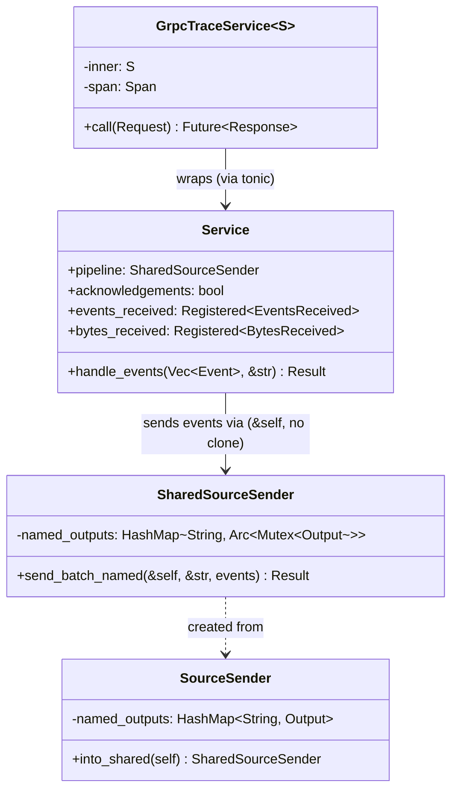

# gRPC Per-Request Overhead — Tasks

Design: [DESIGN.md](./DESIGN.md)

## Analysis

Build: `cargo check` — verified green
Test: `cargo test -p sol --lib sources::opentelemetry` — (pending)
Lint: `cargo clippy` — (pending)

### Domain model

### Requirement traceability

| Type / Fn | Addresses | Notes |
|---|---|---|
| `run_grpc_server` / `run_grpc_server_with_routes` | [FR1](./DESIGN.md#fr1) | Remove DecompressionAndMetricsLayer |
| `decompression.rs` | [FR1](./DESIGN.md#fr1) | Delete file |
| `Service` (grpc.rs) | [FR1](./DESIGN.md#fr1), [FR2](./DESIGN.md#fr2) | Add `bytes_received`, use `SharedSourceSender` |
| `SharedSourceSender` | [FR2](./DESIGN.md#fr2) | Per-output `Arc<Mutex<Output>>` — no cross-signal contention |
| `GrpcTraceService::call` | [FR3](./DESIGN.md#fr3) | Reduce allocations |

### Transformations

| Function | Input → Output | Invariant / Rule |
|---|---|---|
| `Service::handle_events` | `Vec<Event>` → `Result<(), Status>` | Emit BytesReceived. Call `self.pipeline.send_batch_named(...)` — no clone, per-output lock. |
| `SharedSourceSender::send_batch_named` | `(&self, &str, events)` → `Result<(), SendError>` | Lock only the target output's mutex. `tokio::sync::Mutex` (async-safe). |
| `GrpcTraceService::call` | `Request` → `Future<Response>` | No `to_owned()` string allocations |

## Tasks

### 1. Remove DecompressionAndMetrics layer, emit BytesReceived in handler ([FR1](./DESIGN.md#fr1), [NFR1](./DESIGN.md#nfr1), [NFR3](./DESIGN.md#nfr3))

**Goal**: Delete the DecompressionAndMetrics tower middleware. Let tonic handle decompression natively. Emit BytesReceived in the gRPC handler — same pattern as HTTP.

**Types**: `Service` (grpc.rs), `run_grpc_server_with_routes` (mod.rs), `OpentelemetryConfig` (config.rs)

**Constraints**:
- [ADR: decompression-strategy](./adrs/decompression-strategy.md) — Option B: remove layer, use tonic built-in
- Keep `.accept_compressed(CompressionEncoding::Gzip)` on tonic service servers (tonic handles decompression)
- Add `bytes_received: Registered<BytesReceived>` to `Service` struct
- Emit `bytes_received.emit(ByteSize(byte_size))` in `handle_events` — mirrors HTTP path (http.rs:229)
- `DecompressionAndMetricsLayer` removed from `run_grpc_server` and `run_grpc_server_with_routes`
- Check if `sources::vector` needs its own BytesReceived handling after layer removal

**Tests**:
- `test_uncompressed_grpc_request_succeeds` — uncompressed OTLP gRPC request is processed correctly
- `test_compressed_grpc_request_decompresses` — gzip-compressed OTLP gRPC request is decompressed and processed
- `test_bytes_received_emitted` — BytesReceived metric fires for gRPC requests

**Verify**: `cargo test -p sol --lib sources::opentelemetry && cargo clippy`

**Acceptance criteria**:
- [ ] `DecompressionAndMetricsLayer` not used in `run_grpc_server` or `run_grpc_server_with_routes`
- [ ] `decompression.rs` deleted (or emptied if re-exports are needed)
- [ ] `Service` struct has `bytes_received` field and emits in `handle_events`
- [ ] Gzip-compressed gRPC requests still work (tonic handles it)
- [ ] `sources::vector` still compiles and works without the layer
- [ ] Existing tests pass

**Depends on**: (none)
**Time-box**: ~90 min

### 2. Eliminate SourceSender clone in gRPC handler ([FR2](./DESIGN.md#fr2), [NFR1](./DESIGN.md#nfr1))

**Goal**: Replace per-request `self.pipeline.clone()` with per-output locking via `SharedSourceSender`.

**Types**: `SharedSourceSender` (source_sender/sender.rs), `Service` (grpc.rs)

**Constraints**:
- [ADR: source-sender-mutability](./adrs/source-sender-mutability.md) — Option B: per-output `Arc<tokio::sync::Mutex<Output>>`
- Add `SharedSourceSender` type in `source_sender` module: stores `HashMap<String, Arc<tokio::sync::Mutex<Output>>>`, exposes `send_batch_named(&self, ...)`
- Add `SourceSender::into_shared(self) -> SharedSourceSender` conversion method
- `tokio::sync::Mutex` required — `Output::send_batch` is async, lock held across await points
- `handle_events` must still support acknowledgements (BatchNotifier)
- `Output` visibility stays `pub(super)` — `SharedSourceSender` encapsulates it

**Tests**:
- `test_grpc_handler_sends_without_clone` — handler processes events without cloning SourceSender
- `test_concurrent_grpc_signals` — concurrent log + trace + metric requests don't deadlock and run in parallel

**Verify**: `cargo test -p sol --lib sources::opentelemetry`

**Acceptance criteria**:
- [ ] `SharedSourceSender` type exists with per-output `Arc<tokio::sync::Mutex<Output>>`
- [ ] `Service.pipeline` is `SharedSourceSender`
- [ ] No `self.pipeline.clone()` in `handle_events`
- [ ] Different signals (logs, traces, metrics) don't contend on the same lock
- [ ] Concurrent requests handled without deadlock
- [ ] Existing tests pass

**Depends on**: (none)
**Time-box**: ~60 min

### 3. Reduce GrpcTraceLayer allocations ([FR3](./DESIGN.md#fr3), [NFR1](./DESIGN.md#nfr1))

**Goal**: Eliminate unnecessary heap allocations in GrpcTraceService::call.

**Types**: `GrpcTraceService`

**Constraints**:
- Tracing span must still be created per request
- URI path parsing must not allocate strings — use `&str` slices

**Tests**:
- Existing tests pass with the refactored tracing layer

**Verify**: `cargo test -p sol --lib sources::util::grpc`

**Acceptance criteria**:
- [ ] No `to_owned()` calls in `GrpcTraceService::call`
- [ ] Tracing span still records service and method names
- [ ] Existing tests pass

**Depends on**: (none)
**Time-box**: ~45 min

### 4. Benchmark validation ([NFR1](./DESIGN.md#nfr1), [NFR2](./DESIGN.md#nfr2))

**Goal**: Run benchmark suite to measure improvement and verify no regressions.

**Constraints**:
- Must run at least: `noop-logs-grpc-10k`, `noop-logs-grpc-10k-gzip`, `noop-traces-grpc-10k`, `noop-logs-http-10k`
- Uncompressed logs gRPC must show measurable improvement (target: 10x over 100/s baseline)
- Batched traces gRPC must not regress below 9,000/s
- HTTP must not regress

**Verify**: `cd demo/benchmark && bash run.sh --scenario noop-logs-grpc-10k --duration 30`

**Acceptance criteria**:
- [ ] `noop-logs-grpc-10k` throughput > 1,000/s (10x improvement over 100/s baseline)
- [ ] `noop-traces-grpc-10k` throughput >= 9,000/s (no regression)
- [ ] `noop-logs-http-10k` throughput >= 4,500/s (no regression)

**Depends on**: tasks 1, 2, 3
**Time-box**: ~30 min

## Sessions

### Session 1 — Core optimizations (~3H)
Tasks: 1, 2, 3
**Skills**: (standard Rust)
**Checkpoint**: `cargo test -p sol --lib sources::opentelemetry && cargo test -p sol --lib sources::util::grpc && cargo clippy`
**Commit point**: yes

### Session 2 — Benchmark validation (~30 min)
Tasks: 4
**Skills**: (none)
**Checkpoint**: benchmark results show improvement targets met
**Commit point**: yes — commit benchmark results

## Quality gates (post-session review)
- [ ] Acceptance criteria: all green above
- [ ] Code review: implementation matches [DESIGN.md](./DESIGN.md) intent
- [ ] Code organization: changes are minimal and focused
- [ ] Code quality: no new complexity, clean types
- [ ] Performance: benchmark targets met per [NFR1](./DESIGN.md#nfr1), no regressions per [NFR2](./DESIGN.md#nfr2)
