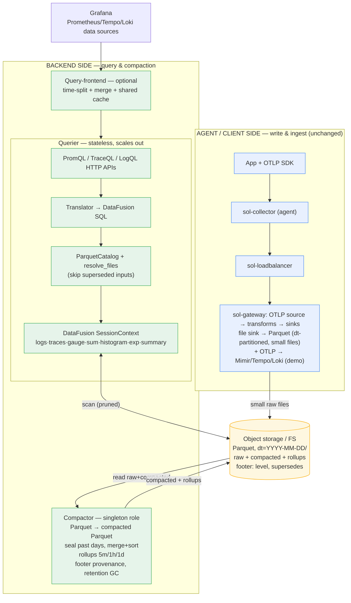

# Parquet Backend — Design Doc

## Context

The [parquet-multisignal](../parquet-multisignal/DESIGN.md) workspace defines how Sol writes OTLP logs, traces, and metrics as Parquet files. This workspace addresses the **read side**: how to query those Parquet files to serve Grafana dashboards via the Prometheus (PromQL), Tempo (TraceQL), and Loki (LogQL) APIs.

### Current architecture

```
OTLP sources → Sol pipeline → Grafana backends (Mimir, Tempo, Loki)
                                     ↑
                              Grafana queries via HTTP APIs
```

Each backend is a separate system with its own storage engine, query language, and API. Sol acts as a write proxy, forwarding signals to three independent backends.

### Target architecture

```
OTLP sources → Sol pipeline → Parquet files (one schema per signal type)
                                     ↑
                              Sol query backend (DataFusion)
                              serving Prometheus, Tempo, Loki HTTP APIs
                                     ↑
                              Grafana queries via same HTTP APIs
```

Sol becomes a self-contained observability backend: ingest OTLP, store as Parquet, query via DataFusion, serve Grafana-compatible APIs.

### Query traffic analysis (from pcap)

Analysis of a live Grafana dashboard session against the demo stack (`demo/otel-sol-grafana-dotnet/883cbd10a4e1.pcap`) revealed the following query patterns:

#### Tempo — Traces (12 queries)

| Query type | API | Example | Count |
|---|---|---|---|
| Trace search (TraceQL) | `GET /api/search?q=...` | `{resource.service.name="client" && name="GET /randomuser" && span.http.response.status_code=500}` | 1 |
| Trace by ID | `GET /api/v2/traces/:id` | `/api/v2/traces/3bc59070ba6c121cad3d88a3f889b303` | 1 |
| Tag value discovery | `GET /api/v2/search/tag/:tag/values?q=...` | Tag values for `name`, `status`, `http.response.status_code` filtered by TraceQL | 8 |
| Tag list | `GET /api/v2/search/tags` | List all available span tag names | 2 |

#### Loki — Logs (2 queries)

| Query type | API | Example | Count |
|---|---|---|---|
| Log range query (LogQL) | `GET /loki/api/v1/query_range` | `{service_name="client", service_version=~"1\\.0\\.0", deployment_environment="dev"}` backward, limit=1000 | 2 |

#### Mimir — Metrics (130 queries)

| Query type | API | Example | Count |
|---|---|---|---|
| Histogram quantile | `POST /prometheus/api/v1/query_range` | `histogram_quantile(0.95, sum(rate(..._bucket{service_name="client"}[1m])) by (le,...))` | 12 |
| Rate + sum by | `POST /prometheus/api/v1/query_range` | `topk(10, sum by(...) (rate(http_server_request_duration_seconds_count{...}[1m])))` | ~30 |
| Gauge / instant | `POST /prometheus/api/v1/query` | `node_memory_total_bytes{host="...",job="sol"}` | ~20 |
| Max over time | `POST /prometheus/api/v1/query_range` | `max by(gc_heap_generation) (max_over_time(dotnet_gc_last_collection_heap_size_bytes{...}[1m]))` | ~14 |
| Label discovery | `GET /prometheus/api/v1/label/:name/values` | Distinct values for `service_name`, `http_route`, `http_response_status_code`, etc. | 9 |
| Series existence | `GET /prometheus/api/v1/series` | `traces_service_graph_request_server_seconds` (service graph metric) | 2 |
| Sol internal metrics | `POST /prometheus/api/v1/query_range` | `sum(rate(sol_component_received_events_total{...}[1m]))` | ~12 |
| Node metrics | various | `node_cpu_seconds_total`, `node_memory_*`, `node_filesystem_*`, `node_network_*` | ~30 |

#### Reanalysis — volume-weighted query mix (from `tcpdump -A` over the pcap)

Re-extracting all HTTP request lines and `/api/ds/query` bodies confirms the workload is **overwhelmingly metrics**:

| Datasource | Share of datasource queries | Endpoints hit |
|---|---|---|
| **Prometheus / Mimir** | ~95% (`"type":"prometheus"` ×121) | `query_range` ×101, `query` ×20 |
| **Tempo** | ~3% (`"type":"tempo"` ×4) | `tag-values` ×8, `traceql` markers ×68 (search refinement) |
| **Loki** | ~2% (`"type":"loki"` ×2) | `query_range` |

PromQL function frequency across the session (all refreshes): `count` ×194, `rate` ×183, `sum`/`sum by` ×84, `topk` ×48, `max_over_time` ×32, `avg` ×28, `histogram_quantile` ×24, `max by` ×10, `clamp_min` ×4. Metrics queried are .NET runtime (`dotnet_gc_*`, `dotnet_thread_pool_*`), ASP.NET (`http_server_request_duration_seconds_*`), and node-exporter (`node_cpu_*`, `node_memory_*`, `node_filesystem_*`).

**Design implication**: optimisation effort and the NFR cost/latency budget must be driven by the **PromQL `rate` + `histogram_quantile` over sum/histogram tables** path. Tempo and Loki are correctness features, not performance-critical.

### Complexity tiers (DataFusion over Parquet)

| Tier | Query pattern | DataFusion approach | Key challenge |
|---|---|---|---|
| **Easy** | Log range queries | `WHERE service_name = ... AND time BETWEEN ...` + row group stats pruning | Straightforward scan + filter |
| **Easy** | Gauge instant queries | `WHERE name = ... AND labels match` + latest value | Simple filter |
| **Medium** | Trace search | `WHERE service_name = ... AND name = ...` + `json_extract(attributes, ...)` | JSON extraction in WHERE clause, no pushdown into JSON |
| **Medium** | Tag/label discovery | `SELECT DISTINCT json_extract(attributes, key)` | Full scan of JSON columns |
| **Medium** | Trace by ID | `WHERE trace_id = X'...'` | Random point lookup — needs bloom filter on `trace_id` |
| **Hard** | `rate()` | `LAG()` window function over `(PARTITION BY attributes ORDER BY time)` | Time-series ordering + windowed derivative |
| **Hard** | `sum by()`, `topk()`, `max_over_time()` | `GROUP BY` + window functions | Multi-step aggregation |
| **Very hard** | `histogram_quantile()` | CTE + UNNEST bucket arrays + cumulative window + interpolation | Multi-step SQL from JSON bucket data |

### PromQL → DataFusion SQL translation examples

**rate():**
```sql
WITH ordered AS (
  SELECT attributes, time_unix_nano, double_value,
    LAG(double_value) OVER w AS prev_value,
    LAG(time_unix_nano) OVER w AS prev_time
  FROM sum_metrics
  WHERE name = 'http_server_request_duration_seconds_count'
    AND service_name = 'client'
    AND time_unix_nano BETWEEN @start AND @end
  WINDOW w AS (PARTITION BY attributes ORDER BY time_unix_nano)
)
SELECT attributes, time_unix_nano,
  CASE WHEN double_value >= prev_value
    THEN (double_value - prev_value) / ((time_unix_nano - prev_time) / 1e9)
    ELSE double_value / ((time_unix_nano - prev_time) / 1e9)
  END AS rate_per_sec
FROM ordered WHERE prev_time IS NOT NULL
```

**histogram_quantile():**
```sql
WITH buckets AS (
  SELECT time_unix_nano, attributes,
    UNNEST(CAST(json_parse(bucket_counts) AS BIGINT[])) AS bucket_count,
    UNNEST(CAST(json_parse(explicit_bounds) AS DOUBLE[])) AS upper_bound,
    count AS total_count
  FROM histogram_metrics
  WHERE name = 'http_server_request_duration_seconds' AND service_name = 'client'
),
cumulative AS (
  SELECT *,
    SUM(bucket_count) OVER (PARTITION BY time_unix_nano, attributes ORDER BY upper_bound) AS cum_count,
    LAG(upper_bound) OVER (PARTITION BY time_unix_nano, attributes ORDER BY upper_bound) AS prev_bound
  FROM buckets
)
SELECT time_unix_nano,
  COALESCE(prev_bound, 0)
    + (upper_bound - COALESCE(prev_bound, 0))
    * (0.95 * total_count - LAG(cum_count) OVER (...))
    / NULLIF(cum_count - LAG(cum_count) OVER (...), 0) AS p95
FROM cumulative
WHERE cum_count >= 0.95 * total_count
```

### Pre-existing Sol features relevant to this workspace

- **`servicegraph` transform** (`src/transforms/servicegraph/`): computes `traces_service_graph_request_server_seconds` histogram metrics from trace spans at ingest time. Input: `DataType::Trace`, output: `DataType::Metric`. The cross-signal service graph metric is already materialized at ingest — no cross-signal query needed at read time.

### State of the art

| System | Storage | Query engine | Caching |
|---|---|---|---|
| **Grafana Mimir** | TSDB blocks (Prometheus format) | Custom PromQL engine | Query frontend with result cache (memcached/Redis) |
| **Grafana Tempo** | Parquet blocks + bloom filters | Custom TraceQL engine | Bloom filter cache, query frontend |
| **Grafana Loki** | Chunks + TSDB index | Custom LogQL engine | Chunk cache, query frontend |
| **SigNoz** | ClickHouse tables | ClickHouse SQL | ClickHouse query cache |
| **InfluxDB 3.0** | Parquet (Iceberg) | DataFusion | In-memory cache, query dedup |
| **GreptimeDB** | Custom columnar + Parquet | DataFusion-based | Write-ahead buffer as hot cache |

**Key observation**: InfluxDB 3.0 and GreptimeDB prove that DataFusion over Parquet is viable for production observability. Both use DataFusion as their core query engine over Parquet-stored data.

#### InfluxDB 3.0 (IOx / FDAP stack) — the reference use case

InfluxDB 3.0 is the closest published design to this workspace: **F**light + **D**ataFusion + **A**rrow + **P**arquet. Its architecture is decoupled into four components that communicate only via a **catalog** and **object storage** ([InfluxData architecture blog](https://www.influxdata.com/blog/influxdb-3-0-system-architecture/), [storage-engine docs](https://docs.influxdata.com/influxdb3/cloud-dedicated/reference/internals/storage-engine/)):

| Component | Role | Lesson for Sol |
|---|---|---|
| **Ingester** | Buffers writes in Arrow memory, flushes **sorted** Parquet at a size/time threshold | Sol's Parquet codec already writes the files — but it does **not sort** them. Sorting on low-cardinality columns is what gives InfluxDB 10–100× compression and fast pruning. |
| **Querier** | DataFusion over Parquet; also scans **not-yet-persisted** ingester data so queries see fresh data | Sol explicitly makes hot/unflushed data a [non-goal](#non-goals) — accept flush-interval freshness, skip this complexity. |
| **Compactor** | Merges many small flushed files into fewer large sorted/deduped files (InfluxDB default: new file ~every 15 min → compacted to ≤100 MB/day-of-data files; **InfluxDB's number, not Sol's** — Sol flushes ~30s) | **This is the critical lever.** Sol flushes one small file per batch per signal → a "small-files problem". Without compaction, DataFusion must list and open hundreds of files per query — InfluxDB users hit a 432-file query limit when fragmented ([fragmentation issue](https://github.com/influxdata/influxdb/issues/26785)). |
| **Garbage collector** | Deletes files superseded by compaction / past retention | Sol needs simple retention pruning, not a full GC. |

Two further InfluxDB facts shape Sol's cost/latency NFRs:
- **Parquet memory cache**: InfluxDB caches Parquet data/metadata in the querier; the default cache budget is **20% of available memory** ([config docs](https://docs.influxdata.com/influxdb3/enterprise/reference/config-options/)). Caching trades memory for latency.
- **Sort + columnar compression**: encoding is dramatically better when data is sorted on least-cardinality columns first ([ingest/compression blog](https://www.influxdata.com/blog/improved-data-ingest-compression-influxdb-3-0/)).

**What Sol should adopt vs. skip** (single-node, ~100 events/s demo target — not InfluxDB's distributed scale):

| InfluxDB technique | Sol decision | Why |
|---|---|---|
| DataFusion over Parquet | **Adopt** | Core of [NFR1](#nfr1). |
| Sorted Parquet (low-cardinality columns first) | **Adopt** (write-side hint + read-side assumption) | Cheapest large win for pruning + compression. |
| Compactor split from ingester | **Adopt** — standalone Parquet→Parquet component (sealed days), gateway stays dumb | Fixes the small-files problem without slowing ingest; the ingester/compactor split is InfluxDB's core lever ([FR7](#fr7)). |
| Footer/file-level provenance instead of a catalog DB | **Adopt** — supersession metadata in the compacted Parquet footer | Gets compaction consistency without Iceberg/Delta ([compaction-consistency ADR](./adrs/compaction-consistency.md)). |
| Bounded Parquet/metadata memory cache + query-result cache | **Adopt** (bounded, see [caching ADR](./adrs/query-caching-strategy.md)) | The memory⇄latency trade-off the user asked to balance. |
| Catalog DB, distributed ingester/querier/compactor split, Apache Flight | **Skip** | Over-engineered for single-node; Grafana talks HTTP, not Flight. |
| Deduplication / merge-on-read | **Skip** | Sol's Parquet output is append-only (no updates/upserts) → nothing to dedupe. |
| Querier reading unpersisted hot data (ingester-memory hot tier) | **Skip (v1)** | Hot data is a [non-goal](#non-goals); **this is precisely what caps Sol's freshness at the flush interval**. Loki/Mimir queriers read recent data from ingester RAM to get instant freshness; adding such a hot tier is the documented future escape ([NFR6](#nfr6) balance #2). |

## Functional Requirements

### <a id="fr1"></a>FR1 — Prometheus-compatible HTTP API

Implement the Prometheus HTTP API endpoints observed in the pcap:
- `POST /prometheus/api/v1/query` — instant PromQL query
- `POST /prometheus/api/v1/query_range` — range PromQL query
- `GET /prometheus/api/v1/label/:name/values` — label value discovery
- `GET /prometheus/api/v1/series` — series existence check

Translate PromQL to DataFusion SQL over metric Parquet tables (gauge, sum, histogram, exp_histogram, summary). Full endpoint surface + response schemas: [API-SPEC.md §1](./API-SPEC.md).

### <a id="fr2"></a>FR2 — Tempo-compatible HTTP API

Implement the Tempo HTTP API endpoints observed in the pcap:
- `GET /api/search` — trace search with TraceQL filter
- `GET /api/v2/traces/:traceID` — trace by ID lookup
- `GET /api/v2/search/tags` — list available tag names
- `GET /api/v2/search/tag/:tag/values` — tag value discovery with TraceQL filter

Translate TraceQL to DataFusion SQL over the traces Parquet table. Full endpoint surface + response schemas: [API-SPEC.md §3](./API-SPEC.md).

### <a id="fr3"></a>FR3 — Loki-compatible HTTP API

Implement the Loki HTTP API endpoints observed in the pcap:
- `GET /loki/api/v1/query_range` — log range query with LogQL filter

Translate LogQL to DataFusion SQL over the logs Parquet table. Full endpoint surface + response schemas: [API-SPEC.md §2](./API-SPEC.md).

### <a id="fr4"></a>FR4 — DataFusion query engine integration

Integrate Apache DataFusion as the query engine:
- Register Parquet files as DataFusion table providers (one table per signal type + metric subtype)
- Configure predicate pushdown for `service_name`, `name`, and timestamp columns
- Enable Parquet bloom filters for `trace_id` column (trace-by-ID point lookups)
- Support JSON extraction functions for `attributes` columns

### <a id="fr5"></a>FR5 — Query result caching

Cache expensive query results to handle dashboard refresh patterns:
- The pcap shows identical queries repeated every ~15s (dashboard auto-refresh)
- Cache keyed by `(query_hash, time_range_bucket)` with configurable TTL
- In-memory LRU cache as default (no external dependency)
- Optional Redis backend for shared cache across query nodes

### <a id="fr6"></a>FR6 — Metric downsampling / rollups for the long tail (required for >90d)

Because metrics are queried over 90d–2y ([NFR7](#nfr7)), raw-resolution scans over the long tail are infeasible even with time-splitting. Serve metrics from **resolution tiers**, the query-frontend ([FR8](#fr8)) picking the tier from `(range, step)`:
- **Recent** (configurable, e.g. last N days): full-resolution raw Parquet — the correctness baseline computed in real time.
- **Cold tail**: pre-aggregated rollups (e.g. 5m → 1h → 1d), produced by the compaction role ([FR7](#fr7)) as separate Parquet metric rows.
- Rollups must preserve correctness for the dominant functions: store histogram **bucket counts** (not pre-computed quantiles) so `histogram_quantile` stays accurate after merge; store counter values so `rate` is recomputable across the coarser step.
- Fall back to real-time raw computation when a rollup tier is absent.

> This was previously framed as an optional ingest-time optimisation. The 2y metrics **query interval** ([NFR7](#nfr7)) makes it **required** to meet [NFR6](#nfr6) on the long tail. It does not apply to traces/logs (short query intervals).

### <a id="fr7"></a>FR7 — File layout + standalone compaction (Parquet → compacted Parquet)

Bound the small-files problem (the dominant cost driver per the InfluxDB comparison) so NFR5/NFR6 hold. Two parts — a cheap write-side hint and a separate compaction component:

- **Gateway hint (cheap, recommended, not sufficient):** the file sink writes under per-signal (and per-metric-subtype) directories with a time-partitioned path (`…/logs/dt=YYYY-MM-DD/*.parquet`, `…/metrics/gauge/dt=…/`, etc.) and sorts within each batch. Today the sink writes flat `…/logs/%Y-%m-%d-%H-%M-%S.parquet` per signal dir (metric subtypes share `metrics/`); the `dt=` + per-subtype layout is the proposed hint. This gives immediate day-level path pruning, but it does **not** merge the many small per-flush files, build rollups, or globally sort — so it cannot replace compaction. The gateway stays low-latency otherwise. This gives immediate day-level path pruning, but it does **not** merge the many small per-flush files, build rollups, or globally sort — so it cannot replace compaction. The gateway stays unchanged otherwise (low-latency small writes).
- **Compactor component (required):** a standalone **Parquet-in → compacted-Parquet-out** component — DataFusion sort-merge, sharing the querier's schemas/catalog — running as the **singleton** compactor role ([NFR8](#nfr8)). It merges small files into few large globally-sorted files, builds metric **rollup tiers** ([FR6](#fr6)), and prunes per the configured retention policy. **Not** a distributed compactor/catalog/GC service.
- **Sealed-day cadence:** the compactor only processes **sealed** partitions — days (or hours) older than `now − grace`. The **current** day is left as raw small files and scanned directly. One date boundary governs compaction, the immutable-cache line ([FR8](#fr8)), and tier selection.
- **Consistency without a catalog:** the compacted output records, in its **Parquet footer key-value metadata**, a `level` and the inputs it **supersedes** (written atomically at file close). Queriers resolve by level and skip superseded inputs; coverage references input *provenance*, not an event-time range, so late data stays orthogonal. Deleting superseded inputs is GC, not correctness. See [compaction-consistency ADR](./adrs/compaction-consistency.md).
- Compaction is configurable and can be disabled (write-heavy / low-query deployments).

### <a id="fr8"></a>FR8 — Time-range query splitting (query-frontend)

For long metric ranges, split a `query_range` into aligned sub-queries (default per-day, aligned to UTC midnight and `step`), execute them across the stateless querier replicas ([NFR8](#nfr8)), and merge:
- **Per-shard immutable caching**: completed historical shards never change → cache permanently; only the in-progress shard is uncacheable. This is what makes a 2y range refreshed every 15s cheap (729 cache hits + 1 live shard) and fixes the whole-range cache-key defect.
- **Boundary correctness**: range-vector functions (`rate`, `increase`) overlap shards by the lookback/range window and stitch; non-decomposable aggregations merge correctly across shards (`topk` = partial-topk-then-merge; `histogram_quantile` = sum bucket counts per series across shards, then compute).
- Traces (<7d) and logs (<30d) may skip splitting — the window is short enough. Splitting is primarily a metrics concern.

### <a id="fr9"></a>FR9 — SQL query endpoint (cross-signal, the differentiator)

Expose the DataFusion `SessionContext` directly as a SQL endpoint, alongside the three Grafana-native APIs (FR1–FR3). PromQL/TraceQL/LogQL provide drop-in Grafana compatibility (the migration wedge); SQL provides the capability the three-language model **cannot** — unified analytics and **cross-signal correlation** ([MARKET §7.2](../../otlp-as-core-protocol-plan/MARKET.md)).

- **Endpoint**: `POST /api/v1/sql` (query in, results out). The three Grafana APIs already translate to SQL internally — this exposes the same engine raw, so it is nearly free.
- **Cross-signal JOINs** over the shared keys present in every schema: `trace_id` (logs ⨝ traces), `service_name` + time window (metrics ⨝ traces/logs). Enables the "impossible in Grafana Cloud" query — span p50 latency ⨝ error-log counts ⨝ CPU metric, in one statement.
- **Consumers**: Grafana's SQL data sources / SQL Expressions, plus external BI / dbt / Jupyter / DuckDB — "your observability data is a SQL table" ([MARKET §7.4](../../otlp-as-core-protocol-plan/MARKET.md)), reinforcing the own-your-data/open-format position.
- **Protocol (v1)**: HTTP with JSON results (+ optional Arrow/Arrow-stream for large results). **Postgres-wire and Arrow Flight SQL are deferred** (warrant their own ADR) — HTTP+JSON is the lowest-friction first step and is Grafana-consumable.
- **Same constraints as the querier**: stateless ([NFR8](#nfr8)), subject to the query guardrails ([NFR9](#nfr9): max bytes scanned, max range, max concurrency), reads the same compacted+rollup catalog with footer-supersession resolution.

## Non-Functional Requirements

### <a id="nfr1"></a>NFR1 — DataFusion as the only query engine dependency

Use Apache DataFusion (Rust-native) as the sole query engine. No JVM (Spark), no embedded databases (DuckDB), no external query services. DataFusion is embeddable, scales via Ballista for distributed execution, and is proven for Parquet-stored observability data (InfluxDB 3.0, GreptimeDB).

### <a id="nfr2"></a>NFR2 — Grafana-compatible response formats

All API responses must be compatible with Grafana's data source plugins:
- Prometheus API: JSON response format per Prometheus HTTP API spec
- Tempo API: JSON response format per Tempo HTTP API spec
- Loki API: JSON response format per Loki HTTP API spec

No custom Grafana plugins — standard Prometheus, Tempo, and Loki data sources must work unchanged. The exact endpoint contracts (request params + response JSON schemas, with real bodies extracted from the pcap) are specified in [API-SPEC.md](./API-SPEC.md) — the acceptance target for the response builders.

### <a id="nfr3"></a>NFR3 — Dashboard refresh latency

The pcap dashboard session involves ~130 queries per refresh. Target: complete all queries within 2 seconds for a single-node deployment with data volumes typical of the demo stack (~100 events/second). Caching (FR5) is expected to bring repeat refreshes under 500ms.

### <a id="nfr4"></a>NFR4 — Parquet file discovery

The query engine must discover and register Parquet files from configurable storage:
- Local filesystem (development, single-node)
- S3-compatible object storage (production)

File discovery is based on the naming convention defined in the [parquet-multisignal](../../designs/20260527_parquet-multisignal.md) codec design.

### <a id="nfr5"></a>NFR5 — Resource cost budget (CPU / memory)

In the default single-node deployment the querier runs **in-process** with the Sol ingest pipeline (the compactor is a separate component/role, [FR7](#fr7)/[NFR8](#nfr8)), so query work competes with ingestion for CPU and memory and must not starve it. On a single-node demo deployment (~100 events/s), with the dashboard issuing ~130 queries every 15s:

- **Memory**: total query-backend footprint (DataFusion working set + Parquet/metadata cache + query-result cache) ≤ **256 MB** steady-state by default, and configurable. Inspired by InfluxDB's "cache = 20% of available memory" lever, but bounded by an absolute default rather than a percentage, because Sol co-hosts ingestion. Caches are the tunable knob: larger cache → lower latency → more memory.
- **CPU**: a dashboard refresh burst must not sustain >1 core-second of query CPU per refresh on demo data. The DataFusion `SessionContext` uses a **bounded** Tokio/Rayon worker pool (configurable, default = `min(4, available_parallelism)`), so query bursts cannot consume all cores and stall ingestion.
- **The small-files problem is the primary cost driver** (see InfluxDB comparison): per-query file listing + open + footer parse scales with file count. Compaction (FR7) and sort order keep file count and per-query scan cost bounded.

### <a id="nfr6"></a>NFR6 — Response-time budget and the cost/latency balance

Supersedes the latency target in NFR3 with an explicit trade-off contract:

| Path | Cold (cache miss) | Warm (cache hit) | Primary cost lever |
|---|---|---|---|
| Full dashboard refresh (~130 queries) | < **2 s** | < **500 ms** | query-result cache (FR5) |
| Single `rate()` / `sum by` range query | < **300 ms** | < **20 ms** | sort order + row-group pruning + file count (FR7) |
| `histogram_quantile()` range query | < **600 ms** | < **20 ms** | JSON-UNNEST cost ([rabbit hole 5](#rabbit-holes)); pre-compute is the FR6 escape hatch |
| Trace-by-id point lookup | < **150 ms** | n/a | `trace_id` bloom filter (FR4) |
| Log range / tag discovery | < **300 ms** | < **20 ms** | predicate pushdown |

**The balance** (the trade-off the user must be comfortable with):
1. **Memory vs latency** — caches are bounded (NFR5). If a deployment wants lower latency, it raises the cache budget; the default favours co-existing with ingestion over minimum latency.
2. **Freshness vs file quality (the flush-interval trade-off)** — three *distinct* cadences must not be conflated: the **flush interval** (~30s in the demo) sets ingest→queryable latency; the **rollup resolution** (5m/1h/1d, [FR6](#fr6)) is downsample granularity; the **compaction cadence** (sealed-day) is when files are merged. A *short* flush gives fresher data but more small files; a *long* flush gives larger files but staler data. **Compaction decouples these** — flush short to optimise freshness, compact later to optimise file size; do **not** lengthen the flush to get bigger files. Sweet spot ≈ the freshness SLA ≈ dashboard refresh (15–60s); below ~10s, tiny-file/PUT overhead outweighs the freshness gain. Because hot/unflushed data is a [non-goal](#non-goals), **Sol's freshness floor *is* the flush interval**; matching Grafana Cloud's instant freshness (Loki/Mimir ingesters serve recent data from RAM before flush; see the [InfluxDB comparison](#influxdb-30-iox--fdap-stack--the-reference-use-case)) would require a future **hot tier** — the querier also scanning an in-memory recent-events buffer.
3. **Write-amplification vs read-latency** — compaction (FR7) spends background CPU/IO to merge small files, buying lower query latency. On the demo target it is cheap; it is configurable and can be disabled for write-heavy/low-query deployments.
4. **Accuracy vs cost** — rollup/downsampling tiers (FR6) trade ingest/compaction CPU + storage for read-time latency on the metrics long tail. Required for 2y metrics ([NFR7](#nfr7)), not optional.

### <a id="nfr7"></a>NFR7 — Per-signal query intervals (calibrated to Grafana Cloud)

This **query interval** — how far back a query reaches, *not* how long data is retained — drives the read-path optimisations (splitting, rollups, caching, partition pruning). Defaults are calibrated to [Grafana Cloud's per-signal retention](https://grafana.com/docs/grafana-cloud/cost-management-and-billing/manage-invoices/understand-your-invoice/logs-invoice/), which caps the max queryable range at the retention period:

| Signal | Default query interval (= max range) | Opt-in ceiling | Grafana Cloud reference | Partition | Splitting | Rollups |
|---|---|---|---|---|---|---|
| **Traces** | **30 days** | — | 30 d retention | day | no | no |
| **Logs** | **30 days** | — | 30 d retention; Loki `max_query_length` 30d1h | day | optional | no |
| **Metrics** | **13 months** (~395 d) | **2 years** | 13 mo retention | day → week/month (cold) | **required** ([FR8](#fr8)) | **required** ([FR6](#fr6)) |

- **Traces**: 30 d matches Grafana Cloud (an earlier draft used 7 d). 7 d remains available as a cost-saving config; 30 d is the default, for parity.
- **Metrics**: 13 mo default matches Grafana Cloud. **2 y is opt-in** and requires a **rollup-only cold tail** beyond ~395 d (raw aged out) — see [COMPLEXITY.md §7](./COMPLEXITY.md) (M2: 2 y raw at high cardinality is impractical).
- **Query interval ≠ retention.** Retention (deletion TTL) is a separate configurable policy enforced by the compactor GC ([FR7](#fr7)); it must be ≥ the query interval but is not defined by these numbers. The max range is enforced as a hard guardrail ([NFR9](#nfr9)). Metrics are the scaling case; traces/logs are short-interval special cases that skip the heavy long-range machinery.

### <a id="nfr8"></a>NFR8 — Horizontal read scalability (role separation)

The read path scales **out**, not just up. Because state lives in shared object storage (storage/compute separation), read scaling is by stateless replication — the lakehouse advantage over a stateful TSDB. Deployment roles (mirroring `mimir -target` / InfluxDB queriers):

- **Querier** — stateless; API translation + DataFusion over shared object storage. **Scales horizontally** behind a load balancer for query concurrency (the ~130 queries/refresh × N dashboards workload).
- **Query-frontend** (optional) — time-range splitting ([FR8](#fr8)) + a **shared** result cache (Redis/object-store) across queriers; this is the multi-node form of [FR5](#fr5).
- **Compactor** — **singleton**; the only writer of compacted/rollup files ([FR7](#fr7)). Must not be replicated.

Single-node "all roles in one process" remains the default (per-process LRU cache, in-process compactor). Each role is the same binary with different config, so a deployment starts single-node and scales out without a rewrite. Resource isolation between ingestion and query uses the dual-runtime split (pipeline runtime > query runtime; ingestion never starves).

### <a id="nfr9"></a>NFR9 — Query guardrails (max range + max bytes scanned)

Mirror Grafana Cloud's query-protection limits ([Loki query-limit policies](https://grafana.com/docs/grafana-cloud/cost-management-and-billing/analyze-costs/logs-costs/log-query-limit-policies/)) so a single pathological query cannot blow the NFR5/NFR6 budgets. Enforced at **query validation, before execution**:

- **Max query range per signal** — traces/logs 30 d, metrics 13 mo (2 y when opt-in). Reject or clamp beyond, as Loki does (`max_query_length` 30d1h). Aligns with the [NFR7](#nfr7) query interval.
- **Max bytes scanned per query** — configurable, default ~**1 GB** (Grafana Cloud `maxQueryBytesRead` is 500 MB–1 GB). A query whose planned scan (post-pruning estimate) exceeds the budget is rejected, or forced onto a coarser rollup tier ([FR6](#fr6)).
- **Max concurrent queries per querier** and **max result series/points** — bound memory per node ([NFR5](#nfr5)).

On breach, return a clear Grafana-compatible error (e.g. HTTP 422 with a message naming the exceeded limit), never a silent truncation. These are the read-side analogue of the ingest pipeline's rate limits, and the enforcement point for the cost/latency contract in [NFR6](#nfr6).

## Non-goals

- **Query/API coverage**: the **full read/query API surface** of Mimir/Loki/Tempo is targeted ([API-SPEC.md](./API-SPEC.md)), and the **full query-language surface** is mapped with explicit per-construct trade-off decisions ([QUERY-MAPPING.md](./QUERY-MAPPING.md)) — *not* just the pcap subset. What stays out: genuinely unbounded or hot-data constructs (`predict_linear`/`holt_winters`/subqueries, `absent*`, TraceQL structural operators, TraceQL metrics, live tail) — deferred, with the [SQL endpoint (FR9)](#fr9) as the escape hatch. Ingestion and admin/ring/config endpoints are out (read-only backend).
- **Single-query distribution (Ballista)**: splitting *one* query across nodes (intra-query parallelism) is deferred — the workload is many *small* queries, not one giant scan. **Horizontal scaling for query concurrency is NOT a non-goal** — it is required (see [NFR8](#nfr8)): the backend runs as stateless querier replicas over shared object storage, scaled behind a load balancer. The two are different axes; only Ballista-style single-query distribution is out of scope.
- **Write-ahead log / hot data**: queries run over finalized Parquet files only. Real-time tail (last few seconds of data not yet flushed to Parquet) is out of scope — the batch flush interval defines the query freshness boundary.
- **Multi-tenancy**: single-tenant deployment. Tenant isolation is a future concern.
- **Alerting / recording rules engine**: FR6 covers pre-computation at ingest time. A full recording rules engine (with rule evaluation loop, alert manager integration) is out of scope.

## Rabbit holes

1. **PromQL parser**: writing a full PromQL parser is a multi-month project. **Constraint**: use an existing Rust PromQL parser crate (e.g., `promql-parser`) or implement only the subset needed (rate, histogram_quantile, sum/avg/max/topk by, instant/range selectors). Decide in ADR.

2. **TraceQL parser**: TraceQL is less standardized than PromQL. **Constraint**: implement the subset observed in the pcap (attribute filters with `&&`, `=`, `!=`). No structural operators (span set operations) in v1.

3. **Parquet file lifecycle**: as new Parquet files are written, the query engine must discover them. **Constraint**: simple file-system / object-store re-listing, not a catalog system (Iceberg/Delta Lake). Consistency between raw and compacted files uses footer-level supersession metadata on the sealed-day boundary ([FR7](#fr7), rabbit hole 6), not a transactional catalog.

6. **Read/compact consistency without a catalog**: a querier must read each datum exactly once while the compactor merges files. **Constraint**: only **sealed** partitions are compacted (never the active day); the compacted output declares in its **footer** which inputs it supersedes (+ a `level`); queriers resolve by level and skip superseded inputs. Coverage is by input provenance, not event-time range — late data is bounded and accepted (hot data is a non-goal). Do **not** attempt to mutate input files' state (Parquet footers are immutable; N-file flag flips are not atomic).

4. **JSON attribute extraction performance**: every query that filters on span/metric attributes requires `json_extract` on the `attributes` column. This defeats Parquet predicate pushdown. **Constraint**: accept the performance cost for v1. Attribute promotion (materializing hot attributes as top-level columns) is a future optimization.

5. **Histogram bucket unnesting**: DataFusion's `UNNEST` over JSON-parsed arrays may have performance issues for large batch sizes. **Constraint**: benchmark with realistic histogram cardinality before committing to the JSON-unnest approach. Fall back to Rust-native histogram computation if SQL is too slow.

## Design

### Architecture — tiers (agent/client side vs backend side)

The system splits into a **write/ingest tier** (agent → gateway, unchanged from the demo) and a **read/backend tier** (compactor + querier + query-frontend). **Object storage is the only contact point** between them — the lakehouse storage/compute boundary. Every box is the same Sol binary in a different role.



**Tier responsibilities:**

| Tier | Role | State | Scaling | Designed in |
|---|---|---|---|---|
| Agent / client | collector → loadbalancer → **gateway** (OTLP in, transforms, file sink → Parquet) | streaming buffers | by throughput | existing demo + [parquet-multisignal](../../designs/20260527_parquet-multisignal.md); this workspace only adds the `dt=` path hint ([FR7](#fr7)) |
| Backend — **querier** | API translation + DataFusion over shared storage; `resolve_files` honours footer provenance | **stateless** | **horizontal** ([NFR8](#nfr8)) | [FR1](#fr1)–[FR4](#fr4), tasks 1–9 |
| Backend — **query-frontend** | time-split + merge + shared result cache | cache only | horizontal | [FR8](#fr8), task 11 |
| Backend — **compactor** | seal/merge, rollups, footer provenance, retention GC | owns compacted files | **singleton** | [FR6](#fr6)/[FR7](#fr7), tasks 10, 12 |

Single-node default = all backend roles in one process (querier in-process, in-process compactor, per-process cache); the same binary splits into roles to scale out without a rewrite.

### Query translation layer

Each query language is translated to DataFusion SQL. The **authoritative, full-surface mapping** (every construct, with its ✅ native / ⚠️ cost-flagged / ⛔ restricted decision) lives in [QUERY-MAPPING.md](./QUERY-MAPPING.md); the table below is an illustrative excerpt:

| Source language | Target | Key functions |
|---|---|---|
| PromQL `rate(m{l=v}[1m])` | SQL `LAG()` window over sum/gauge tables | `PARTITION BY attributes ORDER BY time` |
| PromQL `histogram_quantile(q, ...)` | SQL CTE + UNNEST + interpolation over histogram table | JSON bucket array parsing |
| PromQL `sum by (l) (...)` | SQL `GROUP BY json_extract(attributes, l)` | JSON extraction |
| PromQL `topk(n, ...)` | SQL `ORDER BY value DESC LIMIT n` | Standard SQL |
| PromQL `max_over_time(m[1m])` | SQL `MAX() OVER (... ROWS BETWEEN ...)` | Window function |
| TraceQL `{resource.service.name="x" && name="y"}` | SQL `WHERE service_name = 'x' AND name = 'y'` | Top-level columns |
| TraceQL `{span.attr=v}` | SQL `WHERE json_extract(attributes, '$.attr') = 'v'` | JSON extraction |
| Trace by ID | SQL `WHERE trace_id = X'...'` | Bloom filter-accelerated |
| LogQL `{service_name="x"} \|= "text"` | SQL `WHERE service_name = 'x' AND body LIKE '%text%'` | Full-text on body column |

### Caching strategy

```
Query → hash(query, time_range_bucket) → LRU cache lookup
  ├─ HIT  → return cached result
  └─ MISS → DataFusion SQL → execute → cache result → return
```

- Time range bucketing: round `start`/`end` to nearest 15s boundary (matches typical dashboard refresh)
- TTL: configurable, default 15s (one dashboard refresh cycle)
- Max entries: configurable, default 1000
- Cache invalidation: TTL-based only (no active invalidation on new Parquet file arrival)

### Decisions

- [Query backend process integration](./adrs/query-backend-process-integration.md) — how the server embeds in the Sol process (mirrors `src/api/`)
- [DataFusion table registration and Parquet file discovery](./adrs/datafusion-table-discovery.md) — `ListingTable` per signal, periodic re-listing, dependency gating
- [File layout and compaction strategy](./adrs/file-layout-and-compaction-strategy.md) — sort order, lightweight compaction, cache budget (the NFR5/NFR6 cost/latency balance)
- [Deployment roles and horizontal read scaling](./adrs/deployment-roles-and-read-scaling.md) — querier / query-frontend / singleton compactor; dual-runtime isolation (NFR8)
- [Long-range metrics strategy](./adrs/long-range-metrics-strategy.md) — time-partitioned layout, per-day time-splitting, rollup tiers (FR6/FR8/NFR7)
- [Compaction consistency](./adrs/compaction-consistency.md) — standalone Parquet→Parquet compactor, sealed-day cadence, footer supersession metadata (no catalog)
- [PromQL parsing strategy](./adrs/promql-parsing-strategy.md)
- [Query caching strategy](./adrs/query-caching-strategy.md)

**Analysis artifacts (Phase 4a gate, before implementation):**
- [COMPLEXITY.md](./COMPLEXITY.md) — cost/complexity model (logs/metrics/traces) at demo / midpoint / ceiling vs AWS pricing; validates compaction/rollups/splitting and the beat-Loki / parity-Tempo / lose-to-Mimir-on-storage verdicts.
- [QUERY-MAPPING.md](./QUERY-MAPPING.md) — full-surface PromQL/LogQL/TraceQL → SQL with per-construct trade-off decisions.
- [API-SPEC.md](./API-SPEC.md) — Grafana-compatible HTTP contracts per backend (request params + response JSON), grounded in real pcap response bodies; the NFR2 acceptance target.

> **Note (analysis):** Sol's existing [`lib/prometheus-parser`](../../../lib/prometheus-parser/) parses the Prometheus **text exposition format**, not PromQL queries. The `promql-parser` crate decision is unaffected — the two solve different problems.

## Cross-cutting Concerns

- **Grafana data source configuration**: Grafana connects to Sol's query backend using standard Prometheus, Tempo, and Loki data source configs. The endpoint URL changes from `http://mimir:9009` to `http://sol:9009` (or a configurable port). No custom plugins needed.
- **Parquet file schema dependency**: the query backend depends on the schema defined in [parquet-multisignal/DESIGN.md](../parquet-multisignal/DESIGN.md). Schema changes require coordinated updates to both the codec and the query engine table registrations.
- **Observability of the query backend**: expose query latency, cache hit rate, and DataFusion execution metrics as Sol internal metrics (`sol_query_*`). These feed back into the same pipeline (Sol monitoring Sol).
- **Service graph metrics**: the `servicegraph` transform already materializes `traces_service_graph_request_server_seconds` as `OtelMetric` events at ingest time. These flow through the pipeline into the histogram Parquet table. The query backend reads them as regular histogram metrics — no special handling needed.
