# Parquet Backend — Tasks

Design: [DESIGN.md](./DESIGN.md)

ADRs (8): [process integration](./adrs/query-backend-process-integration.md) · [DataFusion table discovery](./adrs/datafusion-table-discovery.md) · [file layout & compaction](./adrs/file-layout-and-compaction-strategy.md) · [deployment roles & read scaling](./adrs/deployment-roles-and-read-scaling.md) · [long-range metrics](./adrs/long-range-metrics-strategy.md) · [compaction consistency](./adrs/compaction-consistency.md) · [PromQL parsing](./adrs/promql-parsing-strategy.md) · [query caching](./adrs/query-caching-strategy.md)

## Analysis

### Phase 4a gate — model & mappings before code (must pass before Session 1)

Per the directive *"compute/validate the complexity model first, and analyse the full query mapping, before implementing anything"*, two analysis artifacts gate implementation:

- [ ] [COMPLEXITY.md](./COMPLEXITY.md) — cost/complexity model (logs/metrics/traces) instantiated at demo / midpoint / ceiling vs AWS pricing. **Validated analytically**: compaction mandatory (C1), rollups/splitting metrics-only (C2/M2), beat-Loki = fewer components + bloom + SQL (C4), metrics lose to Mimir on storage → rollup-only cold tail.
- [ ] [QUERY-MAPPING.md](./QUERY-MAPPING.md) — full-surface PromQL/LogQL/TraceQL → SQL with per-construct trade-off decisions (✅/⚠️/⛔). Restricted constructs reach the [SQL endpoint (FR9)](./DESIGN.md#fr9).
- [ ] [API-SPEC.md](./API-SPEC.md) — Grafana-compatible HTTP contracts (request params + response JSON per endpoint), grounded in real pcap bodies. The acceptance target for the response-builder tasks (3, 4, 5, 7) and the [NFR2](./DESIGN.md#nfr2) gate.

These resolve the previously-uphill tasks **analytically** (no spike): the model gives each its approach + fallback and the mapping gives each its exact SQL. Open constants (DataFusion scan GB/s, UNNEST cost, bloom FP rate) are measured *during* the task, not blocking the plan ([COMPLEXITY.md §10](./COMPLEXITY.md)).

### Build / test / lint commands

The query backend lives behind a new `query-backend` Cargo feature gating `src/query/` and the `datafusion` / `object_store` dependencies (see [DataFusion table discovery ADR](./adrs/datafusion-table-discovery.md)).

| Action | Command |
|---|---|
| Build | `cargo build --no-default-features --features query-backend` |
| Test (module) | `cargo test --no-default-features --features query-backend query::` |
| Test (single) | `cargo test --no-default-features --features query-backend <test_name>` |
| Lint | `cargo clippy --no-default-features --features query-backend -- -D warnings` |
| Format check | `cargo fmt -- --check` |

> The `query-backend` feature must transitively enable whatever core/event/codec features `src/query/` needs (event types, `codecs/parquet` schema constants). Wire those into the feature definition in Session 1.

### Demo verification (session-end `verify`)

The demo (`demo/otel-sol-grafana-dotnet/`) runs Sol from a configurable image: `compose.yml` uses `image: ${SOL_IMAGE:-superbeeeeeee/sol:latest}`. To exercise the query backend against the real stack, **build Sol locally with the feature, tag it, and point the demo at it**:

```
# build local Sol image with the query backend, then:
SOL_IMAGE=sol:query-backend docker compose --profile parquet up
```

Add a `query:` block to `sol/sol-gateway.yaml` (or a dedicated query role) pointing at the Parquet path the file sink writes (`/data/parquet/...`), then run the session `verify` against Grafana. This is how NFR6 latency / NFR5 resources are measured end-to-end.

### Baseline state

- Current `main` (parquet write side merged, [#28](https://github.com/cboudereau/sol/pull/28)) is the green baseline. The `query-backend` feature does **not exist yet** — the first action of Session 1 is to add it and confirm the existing tree still builds with it enabled.
- `cargo check -p codecs --features parquet` is the cheapest proof the codec (this workspace's schema contract) compiles; run it before starting.

### Known-failing tests
| Test | Reason | Action |
|---|---|---|
| (none expected) | New feature is additive and gated | If a pre-existing flaky integration test fails, it is unrelated — ignore |

### Existing facts that constrain this work (evidence-based)

- HTTP serving uses **warp** filters + **hyper**: `src/api/server.rs`, `src/sources/opentelemetry/http.rs`. No new HTTP framework needed.
- Embedded-server integration precedent: `api: api::Options` at `src/config/mod.rs:149`, started via `setup_api` at `src/app.rs:134`, held on `src/topology/controller.rs:42`. The query server mirrors this exactly.
- Parquet codec: `lib/codecs/src/encoding/format/parquet.rs`; `parquet = 56.2.0`; attributes are **JSON UTF8 strings** ([ADR 0038](../../adrs/0038-attributes-serialization-strategy.md)); timestamps are `INT64 / TIMESTAMP(NANOS, UTC)`; `trace_id` is `FIXED_LEN_BYTE_ARRAY(16)`, `span_id`/`parent_span_id` `FIXED_LEN_BYTE_ARRAY(8)`. Seven tables: logs, traces, gauge, sum, histogram, exp_histogram, summary (exact columns in [parquet-multisignal](../../designs/20260527_parquet-multisignal.md)).
- `lib/prometheus-parser` is a **text-exposition-format** parser, **not** PromQL — do not reuse it for query parsing.
- `moka` (0.12) is already in `Cargo.lock` (transitive); `datafusion` / `promql-parser` are **not** present and must be added.

### Domain model

```mermaid
classDiagram
    class QueryServer {
        <<embedded server>>
        +start(QueryOptions, Handle) Result~QueryServer~
        +shutdown()
    }
    class QueryOptions {
        +SocketAddr address
        +StorageConfig storage
        +CacheConfig cache
        +Duration refresh_interval
    }
    class ParquetCatalog {
        +register(SessionContext) Result
        +refresh() Result
    }
    class SignalTable {
        <<enum>>
        Logs
        Traces
        Gauge
        Sum
        Histogram
        ExpHistogram
        Summary
        +arrow_schema() SchemaRef
        +listing_dir() str
    }
    class QueryEngine {
        +sql(str) Result~Vec~RecordBatch~~
    }
    class QueryCache {
        <<trait>>
        +get(CacheKey) Option~CachedResult~
        +put(CacheKey, CachedResult, ttl)
    }
    class MokaQueryCache
    class CacheKey {
        +u64 query_hash
        +i64 start_bucket
        +i64 end_bucket
    }
    class PromqlTranslator {
        <<fn>>
        +translate(Expr, TimeRange) Result~Sql, UnsupportedFn~
    }
    class TraceqlTranslator {
        <<fn>>
        +translate(TraceqlFilter) Result~Sql~
    }
    class LogqlTranslator {
        <<fn>>
        +translate(LogqlExpr, TimeRange) Result~Sql~
    }
    class PromResponse {
        <<Grafana JSON>>
    }
    class TempoResponse {
        <<Grafana JSON>>
    }
    class LokiResponse {
        <<Grafana JSON>>
    }

    QueryServer *-- QueryOptions
    QueryServer *-- QueryEngine
    QueryServer *-- QueryCache
    QueryEngine *-- ParquetCatalog
    ParquetCatalog *-- SignalTable
    QueryCache <|.. MokaQueryCache
    QueryCache ..> CacheKey
    QueryServer ..> PromqlTranslator
    QueryServer ..> TraceqlTranslator
    QueryServer ..> LogqlTranslator
    PromqlTranslator ..> PromResponse
    TraceqlTranslator ..> TempoResponse
    LogqlTranslator ..> LokiResponse

    class QueryGuardrails {
        +check(query, TimeRange) Result
    }
    class SqlEndpoint {
        <<fn>>
        +sql(str) Result~Json~
    }
    class QueryFrontend {
        +split(query_range) Vec~Shard~
        +merge(Vec~ShardResult~) Result
        +select_tier(range, step) RollupTier
    }
    class RollupTier {
        <<enum>>
        Raw
        FiveMin
        OneHour
        OneDay
    }
    class Compactor {
        <<singleton role>>
        +seal_partition(dt) Result
        +run()
    }
    class DeploymentRole {
        <<enum>>
        Querier
        QueryFrontend
        Compactor
    }
    class CacheBudget {
        +u64 max_bytes
    }
    QueryServer ..> QueryGuardrails
    QueryServer ..> SqlEndpoint
    QueryFrontend ..> QueryEngine
    QueryFrontend ..> RollupTier
    QueryFrontend ..> QueryCache
    Compactor ..> SignalTable
    Compactor ..> RollupTier
    QueryCache *-- CacheBudget
    QueryServer ..> DeploymentRole
```



### Requirement traceability
| Type / Trait / Fn | Addresses | Notes |
|---|---|---|
| `QueryServer` | [FR1](./DESIGN.md#fr1), [FR2](./DESIGN.md#fr2), [FR3](./DESIGN.md#fr3) | Embedded warp server, mounts the three API routers |
| `QueryOptions` | [NFR4](./DESIGN.md#nfr4) | Config block: address, storage (local/S3), cache, refresh |
| `ParquetCatalog` | [FR4](./DESIGN.md#fr4), [NFR4](./DESIGN.md#nfr4) | Registers + periodically re-lists `ListingTable`s |
| `SignalTable` | [FR4](./DESIGN.md#fr4) | Seven tables; explicit Arrow schema = codec contract |
| `QueryEngine` | [FR4](./DESIGN.md#fr4), [NFR1](./DESIGN.md#nfr1) | Thin wrapper over DataFusion `SessionContext` |
| `QueryCache` / `MokaQueryCache` | [FR5](./DESIGN.md#fr5), [NFR6](./DESIGN.md#nfr6) | Trait + in-memory default ([caching ADR](./adrs/query-caching-strategy.md)) |
| `CacheKey` | [FR5](./DESIGN.md#fr5) | `hash(query, floor(start/15s), floor(end/15s))` |
| `LogqlTranslator` | [FR3](./DESIGN.md#fr3) | LogQL subset → SQL |
| `PromqlTranslator` | [FR1](./DESIGN.md#fr1) | promql-parser AST → SQL ([PromQL ADR](./adrs/promql-parsing-strategy.md)) |
| `TraceqlTranslator` | [FR2](./DESIGN.md#fr2) | TraceQL subset → SQL |
| `PromResponse` / `TempoResponse` / `LokiResponse` | [NFR2](./DESIGN.md#nfr2) | Grafana-compatible JSON shapes |
| `Compactor` | [FR7](./DESIGN.md#fr7), [NFR5](./DESIGN.md#nfr5), [NFR6](./DESIGN.md#nfr6) | Standalone Parquet→Parquet component, singleton role; sealed-day merge + footer provenance + rollups + retention GC ([compaction-consistency ADR](./adrs/compaction-consistency.md)) |
| `CacheBudget` | [NFR5](./DESIGN.md#nfr5) | Bounded total memory for Parquet-metadata + result caches |
| `QueryFrontend` | [FR8](./DESIGN.md#fr8), [NFR8](./DESIGN.md#nfr8) | Time-range split + merge + shared cache ([long-range ADR](./adrs/long-range-metrics-strategy.md), [roles ADR](./adrs/deployment-roles-and-read-scaling.md)) |
| `RollupTier` | [FR6](./DESIGN.md#fr6), [NFR7](./DESIGN.md#nfr7) | Downsampled metric resolutions (5m/1h/1d) for the cold tail |
| `DeploymentRole` | [NFR8](./DESIGN.md#nfr8) | enum Querier (stateless, scale-out) / QueryFrontend / Compactor (singleton) |
| `QueryGuardrails` | [NFR9](./DESIGN.md#nfr9) | per-signal max range (traces/logs 30d, metrics 13mo / 2y opt-in) + max bytes scanned (~1GB) + max concurrent/series; reject at validation |
| `SqlEndpoint` | [FR9](./DESIGN.md#fr9) | raw DataFusion SQL + cross-signal JOINs (`trace_id`; `service_name`+time); HTTP+JSON v1 |
| `ObjectStore` retry/backoff + paginated LIST | [NFR10](./DESIGN.md#nfr10) | `503 SlowDown` exponential backoff+jitter; prefix-sharded reads; bounded LIST (shared across querier + compactor) |
| File-sink layout (write-side) | [FR7](./DESIGN.md#fr7) | per-signal/subtype dirs + `dt=` partition + sort-on-write (`src/sinks/file` + demo config) — task 14 |
| Demo artifacts (compose + Grafana provisioning) | [NFR2](./DESIGN.md#nfr2), [NFR6](./DESIGN.md#nfr6) | `sol-query` service, parallel `Sol-*` datasources, backend-switch dashboard variable — task 15 (no Rust types) |

### Transformations
| Function | Input → Output | Invariant / Rule |
|---|---|---|
| `SignalTable::arrow_schema` | `&self → SchemaRef` | Column names/types must match the codec output in [parquet-multisignal](../../designs/20260527_parquet-multisignal.md) exactly; mismatch is a hard error |
| `ParquetCatalog::refresh` | `&SessionContext → Result` | Idempotent; re-registers tables from current file listing; never panics on an empty/absent directory |
| `LogqlTranslator::translate` | `LogqlExpr × TimeRange → Sql` | `{k="v"}` → `WHERE k='v'`; `\|= "t"` → `body LIKE '%t%'`; `=~` → regex match; always bounded by `time_unix_nano BETWEEN start AND end`; `limit` applied |
| `PromqlTranslator::translate` | `promql Expr × TimeRange → Result<Sql, UnsupportedFn>` | Supported fns ([PromQL ADR](./adrs/promql-parsing-strategy.md)) translate; any other fn → `UnsupportedFn` error (never a panic, never wrong SQL) |
| `rate(v[d])` | window over sum/gauge → per-sec rate | `PARTITION BY attributes ORDER BY time_unix_nano`; counter reset (`v[t]<v[t-1]`) ⇒ use `v[t]` as delta |
| `histogram_quantile(q, v)` | histogram rows → quantile | CTE + UNNEST(JSON `bucket_counts`/`explicit_bounds`) + cumulative window + linear interpolation |
| `TraceqlTranslator::translate` | `TraceqlFilter → Sql` | `resource.service.name`/`name`/`status` → top-level columns; `span.X`/`.X` → `json_extract(attributes,'$.X')`; trace-by-id → `WHERE trace_id = X'..'` |
| `CacheKey::from` | `query × TimeRange → CacheKey` | Time bounds floored to 15s buckets so adjacent dashboard refreshes collide |
| `record_batches_to_*_json` | `Vec<RecordBatch> → Grafana JSON` | Output must validate against the Prometheus/Tempo/Loki HTTP API response schema ([NFR2](./DESIGN.md#nfr2)) |
| `Compactor::seal_partition` | `sealed dt-partition → 1 compacted file (+ rollups)` | Only partitions older than `now − grace`; merge → sorted Parquet; write footer `level` + `supersedes`(provenance) atomically (staging → finalize); rollups store bucket counts + counter values; idempotent; singleton ([compaction-consistency ADR](./adrs/compaction-consistency.md)) |
| `Querier::resolve_files` | `(table, range) → file set` | Read compacted footers; pick highest `level` per sub-range; **skip superseded inputs**; never double-read; deletion of inputs is GC, not correctness |
| `QueryFrontend::split` | `metric query_range → Vec<shard>` | Per-day shards aligned to UTC midnight + `step`; range-vector shards overlap by lookback window |
| `QueryFrontend::merge` | `Vec<shard result> → result` | `topk` = partial-then-merge; `histogram_quantile` = sum bucket counts across shards then compute; never average per-shard quantiles |
| `QueryFrontend::select_tier` | `(range, step) → RollupTier` | Recent → raw resolution; long tail → coarsest rollup whose resolution ≤ step; fall back to raw if tier absent |
| `QueryGuardrails::check` | `query × TimeRange → Result<(), Rejected>` | Reject if range > per-signal max (traces/logs 30d, metrics 13mo/2y opt-in) or planned scan > max-bytes; clear Grafana-compatible error, never silent truncation ([NFR9](./DESIGN.md#nfr9)) |

## Tasks

### 1. `query-backend` feature + module skeleton ([FR1](./DESIGN.md#fr1), [NFR1](./DESIGN.md#nfr1))
**Goal**: A compilable, feature-gated `src/query/` module and the `query:` config block, wired into app startup like `api`.
**Types**: `QueryOptions`, `QueryServer` (skeleton) — see domain model
**Constraints**:
- [ADR: process integration](./adrs/query-backend-process-integration.md) — config block + `setup_query` in `app.rs`, server held on `topology/controller.rs`, **not** a source/sink/transform
- [ADR: DataFusion table discovery](./adrs/datafusion-table-discovery.md) — add `datafusion` + `object_store` only under `query-backend`; default build untouched
- New external dependencies (`datafusion`, `object_store`, `promql-parser`) are **pre-approved by this ADR** — adding them is within the constitution; adding any other crate is not
- **Front-load verified (2026-06)**: versions pinned `datafusion = "53"` (v53.1.0, incl. `datafusion-functions-nested` for UNNEST), `object_store = "0.13"` (`fs`,`tokio`,`aws`), `promql-parser = "0.9"` — all resolve from crates.io. Parquet file-read interop is version-stable ([datafusion-table-discovery ADR](./adrs/datafusion-table-discovery.md)); the build confirms read-back on a codec fixture.
- [NFR9](./DESIGN.md#nfr9): `QueryOptions` carries per-signal guardrails — max query range (traces/logs 30d, metrics 13mo default / 2y opt-in), max bytes scanned (~1GB), max concurrent queries; enforced at validation by the API handlers (tasks 3–5, 7) and frontend (task 11)
**Tests**:
- `test_query_options_deserializes_from_yaml` — `query: { address, storage: { path } }` parses
- `test_default_build_excludes_query_backend` — module is absent without the feature (compile-gate check)
**Verify**: `cargo build --no-default-features --features query-backend && cargo build` (default still builds)
**Acceptance criteria**:
- [x] `query-backend` feature exists in `Cargo.toml` and gates `src/query/` + the new deps
- [x] `QueryOptions` is a `configurable_component`-style config struct deserializable from YAML (`test_query_options_deserializes_from_yaml` ✅)
- [x] `setup_query` starts a `QueryServer` from `app.rs` mirroring `setup_api`; server stored on the topology controller (`query_server` field)
- [x] Default `cargo build` (no feature) is unchanged and green (`cargo check` clean; the 2nd "test" is the default-build gate, verified via the checkpoint command rather than a unit test)
**Depends on**: (none)
**Time-box**: ~75 min · **Hill**: downhill — ✅ DONE

### 2. Signal table schemas + ParquetCatalog ([FR4](./DESIGN.md#fr4), [NFR4](./DESIGN.md#nfr4))
**Goal**: Register the seven Parquet signal tables in a DataFusion `SessionContext` from a storage root, with periodic refresh.
**Types**: `SignalTable`, `ParquetCatalog`, `QueryEngine`
**Constraints**:
- [ADR: DataFusion table discovery](./adrs/datafusion-table-discovery.md) — one `ListingTable` per signal **directory** (`logs/`, `traces/`, per-subtype metric dirs; or single `metrics/` union fallback), explicit Arrow schema, periodic re-list (default 15s). Requires the sink to write per-subtype metric dirs — a documented write-side dependency
- Invariant: `SignalTable::arrow_schema()` columns match [parquet-multisignal](../../designs/20260527_parquet-multisignal.md) exactly (names, types, nullability)
- Predicate pushdown enabled for `service_name`, `name`, timestamp columns
- `Querier::resolve_files` honours **footer supersession** ([compaction-consistency ADR](./adrs/compaction-consistency.md)): when both raw and compacted files are present, pick the highest `level` per sub-range and skip superseded inputs (each datum read once). Pre-compaction (no compacted files yet) this is a no-op.
- [NFR5](./DESIGN.md#nfr5): bound the DataFusion worker pool (default `min(4, available_parallelism)`) and the Parquet metadata cache so the backend does not starve ingestion
- [NFR10](./DESIGN.md#nfr10): file discovery uses **paginated LIST** (1000/page) and the `object_store` client must retry `503 SlowDown` with exponential backoff+jitter; prefix-sharded reads (`dt=`/per-signal) spread the per-prefix GET-rate ceiling
**Tests**:
- `test_signal_tables_map_to_directories` — `logs/`, `traces/`, and per-subtype metric dirs each register as a table (or single `metrics/` union fallback)
- `test_catalog_registers_tables_from_dir` — write a fixture Parquet file, register, `SELECT count(*)` returns the row count
- `test_catalog_refresh_picks_up_new_file` — add a file after registration, refresh, count increases
- `test_catalog_empty_dir_is_not_an_error` — registering against an empty/absent dir succeeds with 0 rows
- `test_logs_schema_matches_codec_columns` — schema column names/types equal the codec's log schema
**Verify**: `cargo test --no-default-features --features query-backend query::catalog`
**Acceptance criteria**:
- [ ] All seven tables queryable by SQL after `register`
- [ ] `refresh()` is idempotent and surfaces new files
- [ ] Empty/missing directory does not error
- [ ] `trace_id`/`span_id` exposed as fixed-size binary; timestamps as nanosecond UTC timestamps
**Depends on**: task 1
**Time-box**: ~90 min · **Hill**: downhill

### 3. LogQL → SQL + Loki `query_range` endpoint ([FR3](./DESIGN.md#fr3), [NFR2](./DESIGN.md#nfr2))
**Goal**: First full vertical slice — `GET /loki/api/v1/query_range` returns Grafana-compatible JSON from the `logs` table. Proves config → server → catalog → translate → DataFusion → JSON end to end.
**Types**: `LogqlTranslator`, `LokiResponse`
**Constraints**:
- Transformation: label matchers `{k="v"}`, `{k=~"re"}` → `WHERE`; line filter `|= "t"` → `body LIKE '%t%'`; always bound by `time_unix_nano BETWEEN start AND end`; honour `limit` and `direction`
- [NFR2](./DESIGN.md#nfr2): response matches Loki `query_range` JSON (`status`, `data.resultType="streams"`, `data.result[].stream`/`values`) — standard Grafana Loki data source must render it unchanged
- Only the pcap subset is in scope ([non-goals](./DESIGN.md#non-goals))
**Tests**:
- `test_logql_label_matchers_to_where` — `{service_name="client", service_version=~"1\\.0\\.0"}` → expected SQL
- `test_logql_line_filter_to_like` — `|= "error"` → `body LIKE '%error%'`
- `test_loki_query_range_response_shape` — handler returns valid `streams` JSON for a fixture
- `test_loki_response_deserializes_as_grafana_expects` — round-trips through the Loki response schema
**Verify**: `cargo test --no-default-features --features query-backend query::loki`
**Acceptance criteria**:
- [ ] `GET /loki/api/v1/query_range` serves a fixture dataset
- [ ] LogQL label + line filters translate to correct SQL
- [ ] Response validates against the Loki HTTP API schema
**Depends on**: task 2
**Time-box**: ~90 min · **Hill**: downhill

### 4. Prometheus instant queries: gauge + label/series discovery ([FR1](./DESIGN.md#fr1), [NFR2](./DESIGN.md#nfr2))
**Goal**: `POST /prometheus/api/v1/query`, `GET /prometheus/api/v1/label/:name/values`, `GET /prometheus/api/v1/series` for the simple (gauge instant + discovery) tier.
**Types**: `PromqlTranslator` (instant selectors only), `PromResponse`
**Constraints**:
- [ADR: PromQL parsing](./adrs/promql-parsing-strategy.md) — parse with `promql-parser`; unsupported function → `UnsupportedFn` error JSON, never a panic
- Transformation: instant vector selector `m{l=v}` → `WHERE name='m' AND <label preds>` returning the latest point in range; `sum by`/`max by` → `GROUP BY json_extract(attributes,'$.l')`
- Label discovery → `SELECT DISTINCT json_extract(attributes, key)` (and top-level columns); series existence → `SELECT DISTINCT` of identifying columns
- [NFR2](./DESIGN.md#nfr2): `resultType="vector"` JSON; label/series endpoints return `{status, data:[...]}`
**Tests**:
- `test_promql_instant_selector_to_sql`
- `test_promql_sum_by_label_groups_on_json_extract`
- `test_promql_unsupported_fn_returns_error` — e.g. `predict_linear(...)` → `UnsupportedFn`
- `test_label_values_distinct` / `test_series_existence`
- `test_prom_vector_response_shape`
**Verify**: `cargo test --no-default-features --features query-backend query::prometheus::instant`
**Acceptance criteria**:
- [ ] Gauge instant queries return correct latest values
- [ ] `label/:name/values` and `series` return distinct results
- [ ] Unsupported PromQL functions return a clear error, never a panic
- [ ] Vector response validates against the Prometheus API schema
**Depends on**: task 2
**Time-box**: ~90 min · **Hill**: downhill

### 5. Prometheus range queries: `rate`, `sum by`, `topk`, `max_over_time` ([FR1](./DESIGN.md#fr1))
**Goal**: `POST /prometheus/api/v1/query_range` for the P0 windowed-aggregation functions over sum/gauge tables.
**Types**: `PromqlTranslator` (range + window functions), `PromResponse` (`matrix`)
**Constraints**:
- Transformation `rate(v[d])`: `LAG()` window `PARTITION BY attributes ORDER BY time_unix_nano`; counter reset (`v[t] < v[t-1]`) ⇒ delta = `v[t]` (simplified, per [PromQL ADR](./adrs/promql-parsing-strategy.md))
- `max_over_time(v[d])` → `MAX() OVER (... ROWS/RANGE ...)`; `topk(n, v)` → `ORDER BY value DESC LIMIT n`
- PromQL staleness/lookback rules are **out of scope** v1 ([PromQL ADR](./adrs/promql-parsing-strategy.md))
- See the worked `rate()` SQL in [DESIGN.md §PromQL→SQL](./DESIGN.md#design)
**Tests**:
- `test_rate_translates_to_lag_window`
- `test_rate_counter_reset_uses_current_value`
- `test_topk_orders_and_limits`
- `test_max_over_time_window`
- `test_prom_matrix_response_shape`
**Verify**: `cargo test --no-default-features --features query-backend query::prometheus::range`
**Acceptance criteria**:
- [ ] `rate`, `sum by`, `topk`, `max_over_time` produce correct values on fixtures
- [ ] Counter resets handled per ADR
- [ ] Matrix response validates against the Prometheus API schema
**Depends on**: task 4
**Time-box**: ~90 min · **Hill**: downhill

### 6. `histogram_quantile` over histogram table ([FR1](./DESIGN.md#fr1))
**Goal**: The very-hard tier — `histogram_quantile(q, sum(rate(..._bucket[d])) by (le,...))` translated to SQL over the histogram Parquet table.
**Types**: `PromqlTranslator` (histogram_quantile arm)
**Constraints**:
- Transformation: CTE + `UNNEST` of JSON `bucket_counts`/`explicit_bounds` + cumulative `SUM() OVER` + linear interpolation, per the worked SQL in [DESIGN.md §PromQL→SQL](./DESIGN.md#design)
- [Rabbit hole 5](./DESIGN.md#rabbit-holes): benchmark UNNEST on realistic histogram cardinality; if SQL is too slow, fall back to Rust-native bucket computation. **Cap exploration at the time-box** — if the JSON-UNNEST path does not work within the box, record it as ambiguous and pause at the session boundary rather than open-endedly tuning.
**Tests**:
- `test_histogram_quantile_p95_interpolation` — known buckets → known p95 within tolerance
- `test_histogram_quantile_handles_empty_buckets`
**Verify**: `cargo test --no-default-features --features query-backend query::prometheus::histogram`
**Acceptance criteria**:
- [ ] p50/p95/p99 computed within tolerance on a fixture histogram
- [ ] Empty/zero-count buckets do not panic or divide by zero
**Depends on**: task 5
**Time-box**: ~90 min · **Hill**: **downhill** — approach settled by [QUERY-MAPPING.md §2.3](./QUERY-MAPPING.md) (CTE+UNNEST) with the Rust-native fallback as the documented escape ([COMPLEXITY.md §10](./COMPLEXITY.md)); only UNNEST cost-constant is measured during the task

### 7. Tempo/TraceQL: search, trace-by-id, tag discovery ([FR2](./DESIGN.md#fr2), [NFR2](./DESIGN.md#nfr2))
**Goal**: `GET /api/search`, `GET /api/v2/traces/:id`, `GET /api/v2/search/tags`, `GET /api/v2/search/tag/:tag/values` over the traces table.
**Types**: `TraceqlTranslator`, `TempoResponse`
**Constraints**:
- Transformation: `{resource.service.name="x" && name="y"}` → top-level column `WHERE`; `{span.attr=v}` → `json_extract(attributes,'$.attr')`; trace-by-id → `WHERE trace_id = X'..'` (bloom-filter accelerated)
- TraceQL subset only: `&&`, `=`, `!=` — no structural/span-set operators ([rabbit hole 2](./DESIGN.md#rabbit-holes))
- [NFR2](./DESIGN.md#nfr2): Tempo search / traces / tags JSON shapes
- The `traces_service_graph_*` metric is already materialized at ingest — no cross-signal query ([DESIGN.md §pre-existing](./DESIGN.md#pre-existing-sol-features-relevant-to-this-workspace))
**Tests**:
- `test_traceql_top_level_columns`
- `test_traceql_span_attr_json_extract`
- `test_trace_by_id_hex_to_binary_literal`
- `test_tag_values_distinct`
- `test_tempo_search_response_shape`
**Verify**: `cargo test --no-default-features --features query-backend query::tempo`
**Acceptance criteria**:
- [ ] Trace search, trace-by-id, tag list, and tag values all serve fixtures
- [ ] `trace_id` hex string correctly converted to a binary literal for point lookup
- [ ] Responses validate against the Tempo HTTP API schema
**Depends on**: task 2
**Time-box**: ~90 min · **Hill**: downhill

### 8. Query result cache ([FR5](./DESIGN.md#fr5), [NFR6](./DESIGN.md#nfr6))
**Goal**: Wrap the query path in a `QueryCache` (moka LRU default) keyed by query + 15s time bucket.
**Types**: `QueryCache` trait, `MokaQueryCache`, `CacheKey`
**Constraints**:
- [ADR: query caching](./adrs/query-caching-strategy.md) — trait with in-memory `moka` default, TTL 15s, max 1000, LRU eviction, no active invalidation; Redis backend deferred behind the trait
- Transformation `CacheKey`: `hash(query, floor(start/15s), floor(end/15s))`
**Tests**:
- `test_cache_key_buckets_to_15s`
- `test_cache_hit_returns_without_executing` — second identical query within TTL does not hit DataFusion (spy/counter)
- `test_cache_ttl_expiry`
- `test_cache_lru_eviction_at_capacity`
**Verify**: `cargo test --no-default-features --features query-backend query::cache`
**Acceptance criteria**:
- [ ] Repeat queries within TTL served from cache
- [ ] Time-range bucketing collides adjacent dashboard refreshes
- [ ] Trait allows a future Redis impl without touching the query path
**Depends on**: tasks 3, 4
**Time-box**: ~60 min · **Hill**: downhill

### 9. Query backend observability ([NFR6](./DESIGN.md#nfr6), [NFR5](./DESIGN.md#nfr5), [NFR9](./DESIGN.md#nfr9), [NFR10](./DESIGN.md#nfr10), cross-cutting)
**Goal**: Stand up the telemetry infrastructure and emit the **querier-side** metrics so Sol monitors its own backend. The compactor (`sol_compactor_*`) and frontend metrics are emitted by **their own tasks** (10, 11) via this infra — so this task does not depend on them.
**Types**: internal_events for the query backend (follow `src/internal_events/` conventions)
**Constraints**:
- Emit the querier-side catalog from [DESIGN.md §cross-cutting](./DESIGN.md#cross-cutting-concerns): `sol_query_*` (request count/duration/bytes-scanned/files-opened histograms, cache hit/miss + memory, guardrail rejects, unsupported-construct counter) and `sol_objectstore_*` (requests/throttles/latency). `sol_compactor_*` is registered here but **emitted by task 10**; frontend shard metrics **by task 11**.
- Reuse Sol's internal-event/metric registration; `sol_query_*` / `sol_objectstore_*` / `sol_compactor_*` namespaces; flow through `internal_metrics` → pipeline (Sol monitoring Sol)
- Histograms use Prometheus `_bucket`/`_sum`/`_count` so `histogram_quantile` works in the dashboard
**Tests**:
- `test_request_duration_histogram_emitted` (by api/signal)
- `test_cache_hit_miss_counters`
- `test_objectstore_throttle_counter` (503 path)
- `test_guardrail_reject_counter` / `test_unsupported_construct_counter`
**Verify**: `cargo test --no-default-features --features query-backend query::telemetry`
**Acceptance criteria**:
- [ ] Telemetry infra + `sol_query_*` / `sol_objectstore_*` / cache metrics emitted; labels match the dashboard queries
- [ ] Histograms expose `_bucket` (Grafana `histogram_quantile`)
- [ ] `sol_compactor_*` / frontend metrics are wired by tasks 10/11; the `SOL Query Backend` dashboard renders fully once those land (verified at task 15)
**Depends on**: task 8 (cache)
**Time-box**: ~60 min · **Hill**: downhill

### 10. Standalone compactor: sealed-day merge + footer provenance + retention ([FR7](./DESIGN.md#fr7), [NFR5](./DESIGN.md#nfr5), [NFR6](./DESIGN.md#nfr6), [NFR8](./DESIGN.md#nfr8))
**Goal**: A standalone `Parquet → compacted Parquet` component (singleton role) that bounds the small-files problem without slowing the gateway, with catalog-free read/compact consistency.
**Types**: `Compactor` (singleton), `DeploymentRole`, `CacheBudget`
**Constraints**:
- [ADR: compaction-consistency](./adrs/compaction-consistency.md) — DataFusion sort-merge; shares the querier's schemas/catalog; **only seals partitions older than `now − grace`** (never the active day); **footer** `level` + `supersedes` written atomically via staging→finalize; coverage by provenance (late data orthogonal)
- [ADR: deployment roles](./adrs/deployment-roles-and-read-scaling.md) — singleton; the only writer of compacted files; queriers stay stateless
- Transformations `Compactor::seal_partition` + querier-side `Querier::resolve_files` (extends task 2): querier picks highest `level`, **skips superseded inputs**, never double-reads; input deletion is GC
- Layout: day-partitioned path `dt=YYYY-MM-DD/`; merged output globally sorted (`service_name`, `name`, `time_unix_nano`)
- Retention is a **separate configurable policy** (per-signal TTL), enforced by GC here — independent of the [NFR7](./DESIGN.md#nfr7) query-interval numbers (retention ≥ query interval)
- [NFR5](./DESIGN.md#nfr5): bounded resources; the gateway is **unchanged**
- [NFR10](./DESIGN.md#nfr10): compactor reads/writes retry `503 SlowDown` with backoff; merging into fewer files directly lowers the per-query GET rate against S3's per-prefix ceiling
**Tests**:
- `test_seal_only_compacts_partitions_older_than_grace` — active day untouched
- `test_compacted_footer_records_level_and_supersedes`
- `test_querier_skips_superseded_inputs` — raw + compacted both present → each datum read once (no double-count)
- `test_staging_then_finalize_atomic` — partial/aborted compaction leaves no visible compacted file
- `test_compaction_merges_to_fewer_sorted_files` / `test_compaction_is_idempotent`
- `test_retention_gc_deletes_past_policy` — configurable TTL, not the query-interval numbers
**Verify**: `cargo test --no-default-features --features query-backend query::compaction`
**Acceptance criteria**:
- [ ] Only sealed partitions compacted; active day scanned raw
- [ ] Compacted footer carries `level` + `supersedes`; querier resolves by level and reads each datum exactly once
- [ ] Staging→finalize is atomic; aborted runs leave no partial compacted file
- [ ] Fewer, globally-sorted files; idempotent; gateway unchanged
- [ ] Retention GC honours the configured per-signal policy
- [ ] Emits `sol_compactor_*` metrics (runs/duration/files-input/files-output/rollup-rows/retention-deleted/lag) via the task-9 telemetry infra
**Depends on**: task 2 (catalog + `resolve_files`), task 8 (cache), task 9 (telemetry infra)
**Time-box**: ~90 min · **Hill**: downhill

### 11. Query-frontend: time-range splitting + merge + per-shard immutable cache ([FR8](./DESIGN.md#fr8), [NFR8](./DESIGN.md#nfr8), [NFR6](./DESIGN.md#nfr6))
**Goal**: Make long metric ranges cheap and cacheable by splitting `query_range` into per-day shards, executing across stateless queriers, and merging correctly.
**Types**: `QueryFrontend`, `DeploymentRole`
**Constraints**:
- [ADR: long-range metrics](./adrs/long-range-metrics-strategy.md) — per-day shards aligned to UTC midnight + `step`; completed historical shards cached **permanently** (immutable); only the in-progress shard uncacheable
- [ADR: deployment roles](./adrs/deployment-roles-and-read-scaling.md) — queriers stateless; frontend owns split/merge + shared cache; single-node default = in-process
- Transformations `split` / `merge`: range-vector shards overlap by lookback window; `topk` = partial-then-merge; `histogram_quantile` = sum bucket counts across shards then compute (never average quantiles)
- Fixes the whole-range cache-key defect ([caching ADR amendment](./adrs/query-caching-strategy.md))
**Tests**:
- `test_split_aligns_to_utc_midnight_and_step`
- `test_rate_shards_overlap_by_lookback` — boundary `rate()` equals unsplit result
- `test_histogram_quantile_merge_sums_buckets` — split+merge equals unsplit within tolerance
- `test_topk_partial_merge`
- `test_historical_shard_cached_permanently` — re-query advancing `end`: only the live shard misses
**Verify**: `cargo test --no-default-features --features query-backend query::frontend`
**Acceptance criteria**:
- [ ] Long range split into aligned shards; results match the unsplit query (rate, topk, histogram_quantile)
- [ ] Historical shards served from cache on refresh; only the in-progress shard recomputed
- [ ] Traces/logs short queries bypass splitting
- [ ] Emits frontend metrics (split count, shard-cache hit/miss) via the task-9 telemetry infra
**Depends on**: tasks 5, 6, 8, 9 (telemetry infra)
**Time-box**: ~90 min · **Hill**: **downhill** — merge algorithm specified in [long-range-metrics ADR](./adrs/long-range-metrics-strategy.md) + [QUERY-MAPPING.md](./QUERY-MAPPING.md) (overlap-by-lookback; topk partial-then-merge; sum-buckets-then-quantile); cache-immutability validated in [COMPLEXITY.md §4](./COMPLEXITY.md)

### 12. Metric rollup tiers (downsampling) ([FR6](./DESIGN.md#fr6), [NFR6](./DESIGN.md#nfr6), [NFR7](./DESIGN.md#nfr7))
**Goal**: Serve the metrics cold tail (beyond the recent window) from pre-aggregated resolutions so 13mo-default / 2y-opt-in ranges meet NFR6.
**Types**: `RollupTier`, extends `Compactor`
**Constraints**:
- [ADR: long-range metrics](./adrs/long-range-metrics-strategy.md) — compactor produces 5m/1h/1d rollups; rollups store **bucket counts** + **counter values** (not pre-computed quantiles) to keep `histogram_quantile`/`rate` correct after merge
- `QueryFrontend::select_tier`: recent → raw; long tail → coarsest tier with resolution ≤ `step`; fall back to raw if tier absent
- Raw real-time computation (tasks 5–6) remains the correctness baseline
**Tests**:
- `test_rollup_preserves_bucket_counts` — quantile over 1h rollup ≈ quantile over raw within tolerance
- `test_rate_over_rollup_matches_raw` within tolerance
- `test_select_tier_by_range_and_step`
- `test_missing_tier_falls_back_to_raw`
**Verify**: `cargo test --no-default-features --features query-backend query::rollup`
**Acceptance criteria**:
- [ ] Rollups generated by the compactor for metric tables only
- [ ] `histogram_quantile` / `rate` over rollups match raw within tolerance
- [ ] Frontend selects the tier from `(range, step)`; falls back to raw when absent
**Depends on**: tasks 10, 11
**Time-box**: ~90 min · **Hill**: **downhill** — rollup correctness rule fixed ([long-range-metrics ADR](./adrs/long-range-metrics-strategy.md): store bucket counts + counter values, not quantiles); necessity + row-reduction quantified in [COMPLEXITY.md §7](./COMPLEXITY.md) (M2); tolerance measured during the task

> **Per-signal scope note**: tasks 11–12 apply to **metrics only** (13mo default, 2y opt-in). Traces and logs (≤30d) are bounded-window tables registered plainly in task 2 — they skip rollups (splitting optional) ([NFR7](./DESIGN.md#nfr7)).

### 13. SQL query endpoint + cross-signal JOIN ([FR9](./DESIGN.md#fr9), [NFR8](./DESIGN.md#nfr8), [NFR9](./DESIGN.md#nfr9))
**Goal**: Expose DataFusion SQL over the catalog — the cross-signal differentiator the three Grafana languages can't do.
**Types**: `SqlEndpoint`
**Constraints**:
- `POST /api/v1/sql`; JSON results (+ optional Arrow stream for large results); stateless ([NFR8](./DESIGN.md#nfr8))
- Cross-signal JOIN keys: `trace_id` (logs ⨝ traces), `service_name` + time window (metrics ⨝ traces/logs)
- Subject to [NFR9](./DESIGN.md#nfr9) guardrails (max bytes scanned / range / concurrency); reads compacted+rollup via `resolve_files` ([compaction-consistency ADR](./adrs/compaction-consistency.md))
- Postgres-wire / Arrow Flight SQL **deferred** (separate ADR)
**Tests**:
- `test_sql_select_over_each_signal_table`
- `test_join_logs_traces_on_trace_id`
- `test_join_metrics_traces_on_service_and_time_window`
- `test_sql_guardrail_rejects_oversize_scan`
- `test_sql_result_json_consumable_by_grafana`
**Verify**: `cargo test --no-default-features --features query-backend query::sql`
**Acceptance criteria**:
- [ ] `SELECT` works over all seven signal tables
- [ ] logs ⨝ traces on `trace_id`; metrics ⨝ traces on `service_name` + time window
- [ ] Guardrails enforced; oversize query rejected with a clear error
- [ ] JSON result shape consumable by a Grafana SQL data source
**Depends on**: task 1 (guardrails config), task 2 (catalog)
**Time-box**: ~60 min · **Hill**: downhill

### 14. Write-side file-sink layout: per-subtype dirs + `dt=` partition + sort ([FR7](./DESIGN.md#fr7))
**Goal**: Make the gateway write the layout the query backend needs — per-signal/subtype directories, day-partitioned, locally sorted — so tables register cleanly and day-pruning works. **This is a write-side change (`src/sinks/file` + demo `sol-gateway.yaml`), the documented cross-workspace dependency.**
**Types**: file-sink path templating (extends the existing `file` sink batch path)
**Constraints**:
- [ADR: datafusion-table-discovery](./adrs/datafusion-table-discovery.md) — emit `…/logs/dt=YYYY-MM-DD/`, `…/traces/dt=…/`, `…/metrics/gauge/dt=…/`, `…/metrics/sum/dt=…/`, … (one dir per signal/subtype) so each maps to a clean `ListingTable`
- [ADR: file-layout-and-compaction](./adrs/file-layout-and-compaction-strategy.md) — sort within each batch by `service_name`, `name`, `time_unix_nano` (write-side hint)
- Path template uses event-batch flush time for `dt=`; late/cross-midnight data is bounded (compaction re-buckets) — do not block the gateway to sort globally
- The codec already emits one blob per subtype ([parquet-multisignal](../../designs/20260527_parquet-multisignal.md)); this task only changes the **sink path/sort**, not the codec
**Tests**:
- `test_file_sink_writes_per_subtype_dt_partition` — a mixed batch lands in the right `…/<signal|subtype>/dt=YYYY-MM-DD/` dirs
- `test_file_sink_sorts_batch_by_sort_key`
- `test_demo_gateway_config_parses` — the updated `sol-gateway.yaml` parquet sinks validate
**Verify**: `cargo test --features codecs-parquet sinks::file::`
**Acceptance criteria**:
- [ ] Per-signal + per-metric-subtype directories with `dt=YYYY-MM-DD/` sub-partitions
- [ ] Rows sorted within each written file by the sort key
- [ ] Demo `sol-gateway.yaml` updated to the new paths; existing pipeline still flushes
**Depends on**: (none — write side; unblocks task 2's per-subtype tables)
**Time-box**: ~60 min · **Hill**: downhill

### 15. Demo integration: sol-query service + parallel Grafana datasources + end-to-end ([NFR2](./DESIGN.md#nfr2), [NFR6](./DESIGN.md#nfr6), [NFR8](./DESIGN.md#nfr8))
**Goal**: Make the demo run Sol-as-backend **alongside** Mimir/Tempo/Loki, so Grafana renders Sol's APIs side-by-side and NFR6/NFR5/NFR10 are measured end-to-end.
**Types**: demo deployment artifacts (compose + Grafana provisioning) — no Rust types
**Constraints**:
- **Dual-write (forward to both backends)**: the demo `sol-gateway.yaml` already fans every signal to **both** the real backends (OTLP → Mimir/Tempo/Loki) **and** Parquet (→ Sol). This task **preserves** that — both backends receive identical data so dashboards compare like-for-like. compose feeds both paths from the one gateway; no data is moved off the real backends.
- A `sol-query` compose service: the locally-built Sol image (`SOL_IMAGE`), `--config sol-query.yaml` (a `query:` block over `parquet-data:/data/parquet:ro`), `internal_metrics` `service.name: sol/query` (so the dashboard `$instance` resolves)
- **Parallel** Grafana datasources: add `Sol-Prometheus` / `Sol-Tempo` / `Sol-Loki` (uids `sol-prometheus`…) pointing at `http://sol-query:9009/prometheus`, `:/`, `:/loki` — **keep** the existing Mimir/Tempo/Loki for side-by-side ([NFR2](./DESIGN.md#nfr2))
- **Backend-switch dashboard variable**: every demo dashboard exposes a `$datasource` (per signal type) template variable so a user flips **Sol ↔ Grafana backend** from the dropdown with no panel edits. `SOL Pipeline.json` + `SOL Query Backend.json` already use it; audit the rest (`Node Exporter`, app dashboards) and add the variable where missing, repointing panel `datasource` to `${datasource}`. For multi-signal dashboards use one variable per type (`$prom_ds`, `$loki_ds`, `$tempo_ds`).
- Provision the existing `SOL Query Backend.json` dashboard; API contracts satisfy [API-SPEC.md](./API-SPEC.md) so stock datasources work unmodified
**Tests** (integration/manual, not unit):
- `test_sol_query_yaml_parses` — the demo query config validates
- `test_dashboards_use_datasource_variable` — every demo dashboard panel references `${...}` datasource var, not a hard-coded uid
- Grafana "Save & Test" passes for all three `Sol-*` datasources (discovery probes, [API-SPEC §4](./API-SPEC.md))
- A panel returns matching results from `Sol-Prometheus` vs `Mimir` for a `rate()`/`histogram_quantile` query (parity)
**Verify**: `SOL_IMAGE=sol:query-backend docker compose --profile parquet up` → Grafana → flip the dashboard datasource var Sol↔Mimir and confirm both render; `SOL Query Backend` dashboard renders; NFR6 latency measured
**Acceptance criteria**:
- [ ] Gateway forwards every signal to **both** real backends and Parquet (same data queryable via Mimir and Sol-Prometheus)
- [ ] Three `Sol-*` datasources provisioned in parallel; all pass Save & Test
- [ ] Every demo dashboard has a datasource variable; switching it repoints panels Sol ↔ Grafana backend with no edits
- [ ] A metric query matches Mimir within tolerance via Sol (parity); `SOL Query Backend` dashboard renders; NFR6 latency measured
**Depends on**: tasks 3, 4, 5, 6, 7 (APIs), 9 (telemetry), 10 (compaction), 14 (layout)
**Time-box**: ~90 min · **Hill**: downhill

## Sessions

### Session 1 — Foundation: feature, server, catalog, write-layout (~3.25H)
Tasks: 1, 14, 2
**Skills**: `rust-software-engineer`, `rust-build`, `tdd`
**Checkpoint**: `cargo test --no-default-features --features query-backend query::catalog && cargo test --features codecs-parquet sinks::file:: && cargo build`
**Commit point**: yes — commit after checkpoint passes
> Front-load in task 1: pin a DataFusion version compatible with the codec's `parquet 56.2.0` and confirm it reads the codec output (TIMESTAMP(NANOS), `FIXED_LEN_BYTE_ARRAY` trace_id, JSON-string columns); confirm `promql-parser` is available. These are the only "could-surprise" items — resolve them before building on DataFusion.

### Session 2 — Loki + Prometheus instant (~3H)
Tasks: 3, 4
**Skills**: `rust-software-engineer`, `rust-build`, `tdd`
**Checkpoint**: `cargo test --no-default-features --features query-backend query::loki query::prometheus::instant && cargo clippy --no-default-features --features query-backend -- -D warnings`
**Commit point**: yes

### Session 3 — Prometheus range + histogram_quantile (~3H)
Tasks: 5, 6
**Skills**: `rust-software-engineer`, `rust-build`, `tdd`
**Checkpoint**: `cargo test --no-default-features --features query-backend query::prometheus`
**Commit point**: yes
> Task 6 is now `downhill` (approach fixed by [QUERY-MAPPING.md §2.3](./QUERY-MAPPING.md) + Rust-native fallback). The UNNEST cost-constant is the one thing measured during the task; if it exceeds budget, take the documented fallback — no plan change.

### Session 4 — Tempo + caching + observability (~3.5H)
Tasks: 7, 8, 9
**Skills**: `rust-software-engineer`, `rust-build`, `tdd`, `test-code-coverage`
**Checkpoint**: `cargo test --no-default-features --features query-backend query::tempo query::cache query::telemetry && cargo clippy --no-default-features --features query-backend -- -D warnings`
**Commit point**: yes
> Task 9 stands up the telemetry infra + querier-side metrics; the compactor/frontend metrics are emitted by tasks 10/11 (built on this infra), so 9 lands before them.

### Session 5 — Compaction + query-frontend splitting (~3H)
Tasks: 10, 11
**Skills**: `rust-software-engineer`, `rust-build`, `tdd`, `test-code-coverage`
**Checkpoint**: `cargo test --no-default-features --features query-backend query::compaction query::frontend && cargo clippy --no-default-features --features query-backend -- -D warnings`
**Commit point**: yes
> Both `downhill`: compaction consistency fixed in the [compaction-consistency ADR](./adrs/compaction-consistency.md); frontend merge rules in the [long-range-metrics ADR](./adrs/long-range-metrics-strategy.md) + [QUERY-MAPPING.md](./QUERY-MAPPING.md). End of session: `verify` — measure NFR6 latency + NFR5 memory **before vs after** compaction on the demo data.

### Session 6 — Rollups + SQL endpoint (~2.5H)
Tasks: 12, 13
**Skills**: `rust-software-engineer`, `rust-build`, `tdd`, `test-code-coverage`
**Checkpoint**: `cargo test --no-default-features --features query-backend query::rollup query::sql && cargo clippy --no-default-features --features query-backend -- -D warnings`
**Commit point**: yes
> Rollup necessity + row-reduction quantified in [COMPLEXITY.md §7](./COMPLEXITY.md). End of session: verify a synthetic long-range (13mo–2y) metric range meets NFR6 via splitting + rollups vs. raw scan (the measured-constant step).

### Session 7 — Demo integration & end-to-end (capstone) (~1.5H)
Tasks: 15
**Skills**: `rust-software-engineer`, `verify`
**Checkpoint**: `SOL_IMAGE=sol:query-backend docker compose --profile parquet up` → Grafana: all `Sol-*` datasources pass Save & Test; flip a dashboard's datasource var Sol↔Mimir (both render); `SOL Query Backend` dashboard renders; a `rate()` panel matches Mimir within tolerance
**Commit point**: yes
> Capstone: the gateway dual-writes (real backends + Parquet), Sol serves the three APIs over the shared Parquet, and Grafana switches between Sol and the reference backends via the datasource variable — proving NFR2 parity and measuring NFR6/NFR5/NFR10 end-to-end.

## Quality gates (post-session review)
- [ ] Acceptance criteria: all green above
- [ ] Code review ([code-review](../../../.claude) skill): implementation matches [DESIGN.md](./DESIGN.md) intent and the eight ADRs
- [ ] Code organization: `src/query/` module structure, one submodule per API + translator + catalog + cache + compaction + frontend; roles (querier/frontend/compactor) cleanly separated
- [ ] Read scalability ([NFR8](./DESIGN.md#nfr8)): queriers hold no authoritative state; compactor is a strict singleton; cache works behind the shared-backend trait
- [ ] Object-store limits ([NFR10](./DESIGN.md#nfr10)): `503 SlowDown` retried with backoff; reads prefix-sharded; LIST paginated; a dashboard refresh stays under the per-prefix GET ceiling post-compaction (verified against the demo/synthetic run)
- [ ] Demo end-to-end ([NFR2](./DESIGN.md#nfr2), tasks 14–15): gateway dual-writes to both backends; `sol-query` serves the shared Parquet; parallel `Sol-*` datasources + backend-switch dashboard variable; a metric query matches Mimir via Sol within tolerance
- [ ] Code quality: translators are pure functions (AST → SQL), no duplication across the three response builders
- [ ] Security review: no SQL injection from label/tag values into generated SQL (parameterize or escape); dependency audit on the new `datafusion`/`object_store`/`promql-parser` trees; no secrets in storage config logging
- [ ] Observability: `sol_query_*` metrics present; query latency + cache hit rate visible
- [ ] Performance / cost ([NFR6](./DESIGN.md#nfr6), [NFR5](./DESIGN.md#nfr5)): full demo dashboard refresh < 2s cold / < 500ms cached; per-query latency targets met; query-backend memory ≤ 256 MB default; bounded worker pool does not starve ingestion; file-open count bounded by compaction
- [ ] Long-range ([NFR7](./DESIGN.md#nfr7), [FR8](./DESIGN.md#fr8), [FR6](./DESIGN.md#fr6)): 2y metric query interval meets NFR6 via splitting + rollups; historical shards cached immutably; sealed days served from compacted+rollup, active day from raw; retention GC honours the configured policy; split/rollup results match raw within tolerance
- [ ] Query guardrails ([NFR9](./DESIGN.md#nfr9)): per-signal max range (traces/logs 30d, metrics 13mo / 2y opt-in) and max-bytes-scanned enforced at validation; breach returns a clear Grafana-compatible error, never silent truncation
