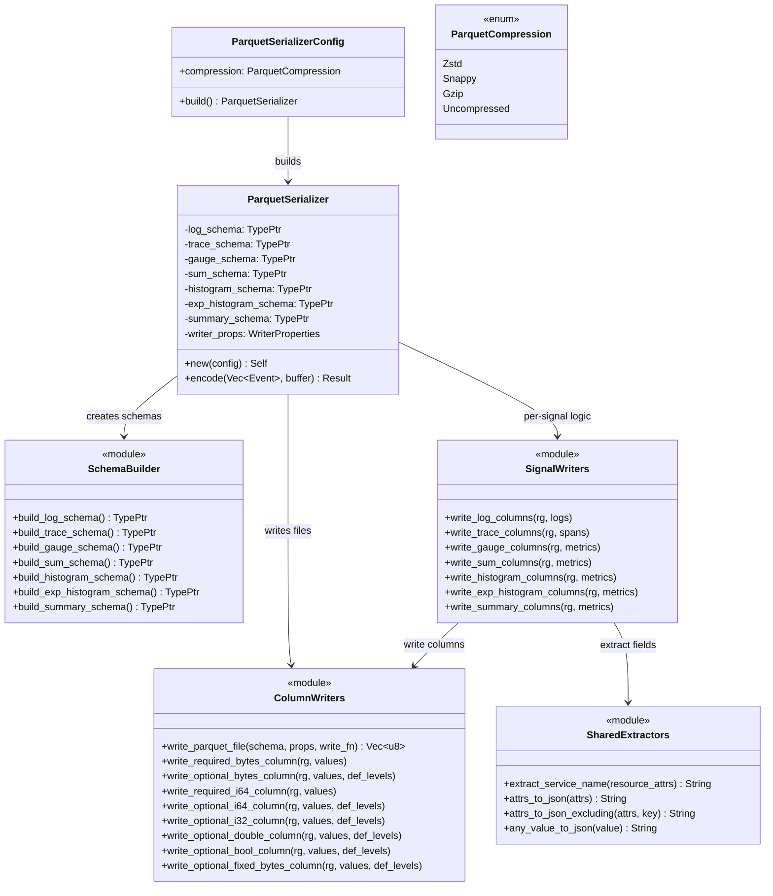

# Parquet Multisignal — Tasks

Design: [DESIGN.md](./DESIGN.md)

## Analysis

Build: `cargo check -p codecs --features parquet` — verified green
Test: `cargo test -p codecs --features parquet --lib -- parquet` — verified green (15 tests)
Lint: `cargo clippy -p codecs --features parquet --all-targets -- -D warnings`

### Known-failing tests
| Test | Reason | Action |
|---|---|---|
| (none) | | |

### Domain model

### Requirement traceability
| Type / Module / Fn | Addresses | Notes |
|---|---|---|
| `ColumnWriters::write_parquet_file` | [FR1](./DESIGN.md#fr1) | Shared file writer lifecycle — SerializedFileWriter + SerializedRowGroupWriter |
| `ColumnWriters::write_*_column` | [FR1](./DESIGN.md#fr1) | Typed column writers for each Parquet physical type |
| `SchemaBuilder::build_log_schema` | [FR2](./DESIGN.md#fr2) | Log Parquet schema (18 columns) |
| `SignalWriters::write_log_columns` | [FR2](./DESIGN.md#fr2) | Extract log fields → write columns |
| `SchemaBuilder::build_trace_schema` | [FR3](./DESIGN.md#fr3) | Trace Parquet schema (24 columns) |
| `SignalWriters::write_trace_columns` | [FR3](./DESIGN.md#fr3) | Extract span fields → write columns |
| `SchemaBuilder::build_gauge_schema` | [FR4](./DESIGN.md#fr4) | Gauge metric schema (common + 2) |
| `SchemaBuilder::build_sum_schema` | [FR4](./DESIGN.md#fr4) | Sum metric schema (common + 4) |
| `SchemaBuilder::build_histogram_schema` | [FR4](./DESIGN.md#fr4) | Histogram metric schema (common + 7) |
| `SchemaBuilder::build_exp_histogram_schema` | [FR4](./DESIGN.md#fr4) | ExpHistogram metric schema (common + 12) |
| `SchemaBuilder::build_summary_schema` | [FR4](./DESIGN.md#fr4) | Summary metric schema (common + 3) |
| `SignalWriters::write_*_columns` (metrics) | [FR4](./DESIGN.md#fr4) | Extract metric data point fields → write columns |
| `ParquetSerializer::encode` | [FR5](./DESIGN.md#fr5) | Partition by signal type, route to signal writer |
| `SharedExtractors` | [FR6](./DESIGN.md#fr6) | service_name, resource/scope JSON serialization |
| `ParquetSerializer` (no arrow dep) | [NFR1](./DESIGN.md#nfr1) | parquet feature drops arrow + serde_arrow |

### Transformations
| Function | Input → Output | Invariant / Rule |
|---|---|---|
| `write_parquet_file` | `(schema, props, write_fn) → Vec<u8>` | Output is a valid self-contained Parquet file (header + row group + footer) |
| `write_log_columns` | `(&mut RowGroupWriter, &[OtelLog]) → Result<()>` | Writes exactly 18 columns in schema order; row count = logs.len() |
| `write_trace_columns` | `(&mut RowGroupWriter, &[OtelSpan]) → Result<()>` | Writes exactly 24 columns in schema order; row count = spans.len() |
| `write_gauge_columns` | `(&mut RowGroupWriter, &[OtelMetric]) → Result<()>` | Writes common + 2 columns; row count = total data points across all metrics |
| `write_sum_columns` | `(&mut RowGroupWriter, &[OtelMetric]) → Result<()>` | Writes common + 4 columns; row count = total data points |
| `write_histogram_columns` | `(&mut RowGroupWriter, &[OtelMetric]) → Result<()>` | Writes common + 7 columns; row count = total data points |
| `write_exp_histogram_columns` | `(&mut RowGroupWriter, &[OtelMetric]) → Result<()>` | Writes common + 12 columns; row count = total data points |
| `write_summary_columns` | `(&mut RowGroupWriter, &[OtelMetric]) → Result<()>` | Writes common + 3 columns; row count = total data points |
| `extract_service_name` | `&OtelAttributes → String` | Returns `resource_attrs.get_string("service.name")` or `"unknown"` |
| `attrs_to_json` | `&OtelAttributes → String` | `serde_json::to_string(attrs)` — lossless JSON serialization |
| `attrs_to_json_excluding` | `(&OtelAttributes, &str) → String` | Same but excludes one key (for resource_attributes excluding service.name) |
| `ParquetSerializer::encode` | `(Vec<Event>, &mut BytesMut) → Result<()>` | Partitions events by signal type + metric subtype, writes one Parquet file per group |

### External dependencies (parquet feature)
| Crate | Version | Used for |
|---|---|---|
| `parquet` | 56.2.0 | `SerializedFileWriter`, `SerializedColumnWriter`, schema types, compression |
| `serde_json` | (workspace) | JSON serialization of attributes, events, links, exemplars |

Removed from parquet feature:
| Crate | Reason |
|---|---|
| `arrow` | Was only used as intermediary for ArrowWriter — replaced by native column writers |
| `serde_arrow` | Was only used for ObjectMap → RecordBatch — no longer needed |

### Proto field access summary

**OtelLog** (`lib/sol-core/src/event/otel_event.rs`):
- `record()` → `&LogRecord` (proto: time_unix_nano, observed_time_unix_nano, severity_number, severity_text, body, flags, trace_id, span_id, dropped_attributes_count)
- `attributes()` → `&OtelAttributes` (record-level, already extracted from proto)
- `resource_attrs()` → `&OtelAttributes` (has `service.name`)
- `resource()` → `Option<&Resource>` (has `schema_url`)
- `scope()` → `Option<&InstrumentationScope>` (has `name`, `version`)
- `scope_attrs()` → `&OtelAttributes`

**OtelSpan** (`lib/sol-core/src/event/otel_event.rs`):
- `span()` → `&Span` (proto: trace_id, span_id, parent_span_id, name, kind, start_time_unix_nano, end_time_unix_nano, status, trace_state, events, links, flags, dropped_*_count)
- `attributes()` → `&OtelAttributes` (span-level)
- `resource_attrs()`, `resource()`, `scope()`, `scope_attrs()` — same pattern as OtelLog

**OtelMetric** (`lib/sol-core/src/event/otel_metric.rs`):
- `metric()` → `&Metric` (proto: name, description, unit, data: Option<MetricData>)
- `metric().data` → `Option<MetricData>` — match on Sum/Gauge/Histogram/Summary/ExponentialHistogram
- Each variant contains `data_points: Vec<DataPoint>` with per-point fields
- `dp_attrs` → `Vec<OtelAttributes>` (one per data point, already extracted)
- `resource_attrs()`, `resource()`, `scope()`, `scope_attrs()` — same pattern

**OtelAttributes**:
- `get_string(key) → Option<&str>` for extracting `service.name`
- `serde::Serialize` → JSON via `serde_json::to_string()`
- `iter() → Iterator<Item = (&String, &AnyValue)>` for filtering keys

## Tasks

### 1. Column writer helpers and shared extractors ([FR1](./DESIGN.md#fr1), [FR6](./DESIGN.md#fr6))
**Goal**: Build the low-level column writing primitives and shared field extractors that all signal types use.
**Types**: `ColumnWriters` module, `SharedExtractors` module
**Constraints**:
- [ADR: parquet-writing-strategy](./adrs/parquet-writing-strategy.md) — use `SerializedFileWriter` + `SerializedColumnWriter`, no Arrow
- Each `write_*_column` function takes a `&mut SerializedRowGroupWriter` and calls `next_column()` to get the next column writer in schema order
- Definition levels: `1_i16` = present, `0_i16` = null. Required columns pass `None` for def_levels.
- `write_parquet_file` encapsulates `SerializedFileWriter` lifecycle: create → next_row_group → write_columns → close row group → close writer → return bytes
- `extract_service_name` returns `"unknown"` when `service.name` is absent
- `attrs_to_json_excluding` must clone and remove the key, not mutate the original
**Tests**:
- `test_write_parquet_file_produces_valid_output` — write a minimal 1-column file, verify Parquet magic bytes and footer
- `test_write_required_bytes_column` — write 3 string values, read back and verify
- `test_write_optional_bytes_column_with_nulls` — write mix of present/null, verify def levels roundtrip
- `test_write_optional_i64_column` — write timestamps, verify values
- `test_write_optional_i32_column` — write i32 values with nulls
- `test_write_optional_double_column` — write f64 values with nulls
- `test_write_optional_bool_column` — write booleans with nulls
- `test_write_optional_fixed_bytes_column` — write fixed-length byte arrays (trace_id-sized)
- `test_extract_service_name_present` — extracts from resource attrs
- `test_extract_service_name_missing` — returns "unknown"
- `test_attrs_to_json` — serializes OtelAttributes to valid JSON
- `test_attrs_to_json_excluding` — excludes specified key
**Verify**: `cargo check -p codecs --features parquet && cargo test -p codecs --features parquet --lib -- parquet`
**Acceptance criteria**:
- [ ] `write_parquet_file` produces bytes starting with `PAR1` magic and ending with valid footer
- [ ] All typed column writers handle required and optional columns correctly
- [ ] All shared extractors produce correct output
- [ ] No `arrow` or `serde_arrow` imports in new code
**Depends on**: none
**Time-box**: ~90 min

### 2. Log schema and encoding rewrite ([FR2](./DESIGN.md#fr2), [NFR1](./DESIGN.md#nfr1))
**Goal**: Rewrite the existing log encoding to use native column writers. Add `service_name` and `event_name` columns.
**Types**: `SchemaBuilder::build_log_schema`, `SignalWriters::write_log_columns`
**Constraints**:
- Schema has 18 columns (see DESIGN.md Log Schema table) — `service_name` and `event_name` are new
- Column order in schema definition must match write order in `write_log_columns`
- `service_name`: BYTE_ARRAY/UTF8, REQUIRED — extracted via `extract_service_name(log.resource_attrs())`
- `event_name`: BYTE_ARRAY/UTF8, OPTIONAL — `log.record().event_name` if the proto field exists (check opentelemetry-proto version)
- Timestamps: INT64 with `LogicalType::Timestamp { is_adjusted_to_utc: true, unit: TimeUnit::NANOS }`
- `trace_id`: FIXED_LEN_BYTE_ARRAY(16), OPTIONAL — zero-pad or truncate to exactly 16 bytes
- `span_id`: FIXED_LEN_BYTE_ARRAY(8), OPTIONAL — zero-pad or truncate to exactly 8 bytes
- `body`: JSON-serialized `AnyValue` via `serde_json::to_string`
- `attributes`: `attrs_to_json(log.attributes())`
- `resource_attributes`: `attrs_to_json_excluding(log.resource_attrs(), "service.name")`
- Remove all `arrow::*` and `serde_arrow::*` imports from parquet.rs
- Remove `arrow` and `serde_arrow` from parquet feature in Cargo.toml
**Tests**:
- `test_log_schema_column_count` — 18 columns
- `test_log_schema_column_names` — exact ordered list
- `test_log_encode_single_event` — encode 1 log, read back, verify row count and column count
- `test_log_encode_service_name` — verify service_name column populated from resource attrs
- `test_log_encode_timestamps_as_nanos` — verify timestamps are INT64 nanos
- `test_log_encode_trace_id_fixed_len` — verify 16-byte fixed-length binary
- `test_log_encode_sparse_nulls` — encode with minimal fields, verify nulls
- `test_log_encode_batch_100` — encode 100 logs, verify row count
- `test_log_compression_roundtrip` — each compression codec produces valid output
**Verify**: `cargo check -p codecs --features parquet && cargo test -p codecs --features parquet --lib -- parquet`
**Acceptance criteria**:
- [ ] `parquet` feature in Cargo.toml no longer includes `dep:arrow` or `dep:serde_arrow`
- [ ] `cargo check -p codecs --features parquet` compiles without arrow/serde_arrow
- [ ] All 18 columns present in correct order
- [ ] `service_name` populated correctly, `event_name` column exists
- [ ] Timestamps readable as nanosecond timestamps
- [ ] Existing integration tests in `src/sinks/util/encoding.rs` updated and passing
**Depends on**: task 1
**Time-box**: ~90 min

### 3. Trace schema and encoding ([FR3](./DESIGN.md#fr3))
**Goal**: Add Parquet encoding for OTLP spans with the trace schema.
**Types**: `SchemaBuilder::build_trace_schema`, `SignalWriters::write_trace_columns`
**Constraints**:
- Schema has 24 columns (see DESIGN.md Trace Schema table)
- `duration_nanos`: computed as `span.end_time_unix_nano - span.start_time_unix_nano` (i64, wrapping if end < start)
- `events`: JSON-serialized `span.events` array — each event has `time_unix_nano`, `name`, `attributes`, `dropped_attributes_count`
- `links`: JSON-serialized `span.links` array — each link has `trace_id`, `span_id`, `trace_state`, `attributes`, `dropped_attributes_count`, `flags`
- `status_code` and `status_message` extracted from `span.status` (which is `Option<Status>`)
- `trace_id`: FIXED_LEN_BYTE_ARRAY(16), REQUIRED — zero-fill if empty
- `span_id`: FIXED_LEN_BYTE_ARRAY(8), REQUIRED — zero-fill if empty
- `parent_span_id`: FIXED_LEN_BYTE_ARRAY(8), OPTIONAL — null if empty
- Access via `span.span()` → `&Span` proto, `span.attributes()`, `span.resource_attrs()`, etc.
**Tests**:
- `test_trace_schema_column_count` — 24 columns
- `test_trace_schema_column_names` — exact ordered list
- `test_trace_encode_single_span` — encode 1 span, read back, verify
- `test_trace_encode_duration_nanos` — verify computed duration
- `test_trace_encode_service_name` — from resource attrs
- `test_trace_encode_events_as_json` — events serialized as JSON string
- `test_trace_encode_links_as_json` — links serialized as JSON string
- `test_trace_encode_status` — status_code and status_message extracted
- `test_trace_encode_fixed_len_ids` — trace_id 16 bytes, span_id 8 bytes
- `test_trace_encode_batch` — encode multiple spans
**Verify**: `cargo check -p codecs --features parquet && cargo test -p codecs --features parquet --lib -- parquet`
**Acceptance criteria**:
- [ ] All 24 trace columns present in correct order
- [ ] `duration_nanos` = `end_time - start_time`
- [ ] Events and links serialized as JSON strings
- [ ] Fixed-length byte arrays correct size
**Depends on**: task 1
**Time-box**: ~60 min

### 4. Gauge and Sum metric schemas and encoding ([FR4](./DESIGN.md#fr4))
**Goal**: Add Parquet encoding for Gauge and Sum metrics.
**Types**: `SchemaBuilder::build_gauge_schema`, `SchemaBuilder::build_sum_schema`, `SignalWriters::write_gauge_columns`, `SignalWriters::write_sum_columns`
**Constraints**:
- Gauge: 15 common columns + 2 specific (int_value, double_value) = 17 columns
- Sum: 15 common columns + 4 specific (int_value, double_value, aggregation_temporality, is_monotonic) = 19 columns
- One row per `NumberDataPoint` — a single `OtelMetric` may contain multiple data points
- Access: `metric.metric().data` → `Some(MetricData::Gauge(g))` → `g.data_points` → iterate `NumberDataPoint`
- `NumberDataPoint.value`: `Option<number_data_point::Value>` — `AsInt(i64)` or `AsDouble(f64)`. Write to `int_value` or `double_value` column (other is null).
- `dp_attrs`: `metric.dp_attrs[i]` — one `OtelAttributes` per data point, already extracted
- Common columns (service_name, name, description, unit, timestamps, attributes, flags, exemplars, resource/scope) — extracted via shared helpers
- `exemplars`: JSON-serialized `data_point.exemplars` array
- `aggregation_temporality` and `is_monotonic` are metric-level (same for all DPs in a Sum)
**Tests**:
- `test_gauge_schema_column_count` — 17 columns
- `test_gauge_encode_int_value` — NumberDataPoint with AsInt
- `test_gauge_encode_double_value` — NumberDataPoint with AsDouble
- `test_gauge_encode_multiple_data_points` — single metric with 3 data points → 3 rows
- `test_sum_schema_column_count` — 19 columns
- `test_sum_encode_with_temporality` — aggregation_temporality and is_monotonic populated
- `test_sum_encode_counter` — monotonic sum with rate-compatible data
**Verify**: `cargo check -p codecs --features parquet && cargo test -p codecs --features parquet --lib -- parquet`
**Acceptance criteria**:
- [ ] Gauge schema has 17 columns, Sum schema has 19 columns
- [ ] Multiple data points per metric produce multiple rows
- [ ] int_value/double_value correctly nullable (one set, other null)
- [ ] aggregation_temporality and is_monotonic populated for Sum
**Depends on**: task 1
**Time-box**: ~75 min

### 5. Histogram, ExponentialHistogram, Summary metric schemas and encoding ([FR4](./DESIGN.md#fr4))
**Goal**: Add Parquet encoding for Histogram, ExponentialHistogram, and Summary metrics.
**Types**: `SchemaBuilder::build_histogram_schema`, `build_exp_histogram_schema`, `build_summary_schema`, corresponding `write_*_columns`
**Constraints**:
- Histogram: 15 common + 7 specific = 22 columns. `bucket_counts` and `explicit_bounds` as JSON strings.
- ExponentialHistogram: 15 common + 12 specific = 27 columns. `positive_bucket_counts` and `negative_bucket_counts` as JSON strings.
- Summary: 15 common + 3 specific = 18 columns. `quantile_values` as JSON string.
- `count` fields are `u64` in proto, stored as INT64 (i64 cast). Values >i64::MAX are truncated (acceptable — counts this large are unrealistic).
- `sum` in HistogramDataPoint and ExponentialHistogramDataPoint is `Option<f64>` — nullable DOUBLE column.
- `sum` in SummaryDataPoint is `f64` — required DOUBLE column.
- `min`, `max` in Histogram/ExpHistogram are `Option<f64>` — nullable.
- ExpHistogram `positive`/`negative`: `Option<Buckets>` where `Buckets { offset: i32, bucket_counts: Vec<u64> }`. Write `offset` as INT32, `bucket_counts` as JSON string.
- `quantile_values`: JSON-serialized `Vec<ValueAtQuantile>` where `ValueAtQuantile { quantile: f64, value: f64 }`
**Tests**:
- `test_histogram_schema_column_count` — 22 columns
- `test_histogram_encode_buckets` — bucket_counts and explicit_bounds as JSON
- `test_histogram_encode_count_sum_min_max` — verify all numeric fields
- `test_exp_histogram_schema_column_count` — 27 columns
- `test_exp_histogram_encode_buckets` — positive/negative offset + bucket counts
- `test_summary_schema_column_count` — 18 columns
- `test_summary_encode_quantiles` — quantile_values as JSON
**Verify**: `cargo check -p codecs --features parquet && cargo test -p codecs --features parquet --lib -- parquet`
**Acceptance criteria**:
- [ ] Histogram: 22 columns, bucket data as JSON strings
- [ ] ExponentialHistogram: 27 columns, positive/negative bucket data
- [ ] Summary: 18 columns, quantile_values as JSON
- [ ] All count fields stored as i64
**Depends on**: task 1
**Time-box**: ~75 min

### 6. Signal routing and ParquetSerializer integration ([FR5](./DESIGN.md#fr5), [NFR3](./DESIGN.md#nfr3))
**Goal**: Wire up signal-type routing in ParquetSerializer::encode() and update the dispatch chain.
**Types**: `ParquetSerializer` (rewrite)
**Constraints**:
- [ADR: mixed-signal-batch-handling](./adrs/mixed-signal-batch-handling.md) — group by signal type, produce multiple Parquet files per encode() call
- `ParquetSerializer::new` must build all 7 schemas (log, trace, gauge, sum, histogram, exp_histogram, summary) and store `WriterProperties`
- `encode()`: partition `Vec<Event>` into `Vec<OtelLog>`, `Vec<OtelSpan>`, and `Vec<OtelMetric>` (by metric subtype). For each non-empty group, call `write_parquet_file` with the appropriate schema and column writer. Append all outputs to the buffer.
- Metric subtype routing: match on `metric.metric().data` → `MetricData::Sum` / `Gauge` / `Histogram` / `Summary` / `ExponentialHistogram`
- Empty input → return `NoEvents` error (existing behavior)
- All-filtered input (e.g., all events are of an unsupported type) → return `NoEvents` error
- Update `BatchSerializer::Parquet` and `BatchEncoder::encode` dispatch if needed
- Update integration tests in `src/sinks/util/encoding.rs`
**Tests**:
- `test_encode_logs_only` — batch of logs produces single Parquet file
- `test_encode_traces_only` — batch of traces produces single Parquet file
- `test_encode_gauge_only` — batch of gauge metrics produces single Parquet file
- `test_encode_mixed_signals` — logs + traces in one batch → two Parquet files in buffer
- `test_encode_mixed_metric_subtypes` — gauge + histogram metrics → two Parquet files
- `test_encode_empty_batch_error` — empty input returns NoEvents
- `test_encode_all_signal_types` — logs + traces + gauge + histogram → 4 Parquet files
**Verify**: `cargo check -p codecs --features parquet && cargo test -p codecs --features parquet --lib -- parquet && cargo clippy -p codecs --features parquet --all-targets -- -D warnings`
**Acceptance criteria**:
- [ ] Single-signal batches produce exactly one Parquet file
- [ ] Mixed-signal batches produce N Parquet files (one per signal type + metric subtype)
- [ ] Each Parquet file in the buffer is self-contained and readable independently
- [ ] Existing integration tests in encoding.rs pass (updated for new API)
- [ ] `cargo clippy` clean
**Depends on**: tasks 2, 3, 4, 5
**Time-box**: ~60 min

### 7. Dependency cleanup and feature flag verification ([NFR1](./DESIGN.md#nfr1))
**Goal**: Verify that the parquet feature compiles without arrow/serde_arrow and that the arrow feature is unaffected.
**Types**: `Cargo.toml` changes
**Constraints**:
- `lib/codecs/Cargo.toml`: change `parquet = ["dep:parquet", "dep:arrow", "dep:serde_arrow"]` to `parquet = ["dep:parquet"]`
- `lib/codecs/Cargo.toml`: remove `"arrow"` from parquet crate features: `features = ["snap", "flate2", "flate2-zlib-rs", "zstd"]`
- Verify `arrow` feature still compiles independently: `cargo check -p codecs --features arrow`
- Verify `parquet` feature compiles independently: `cargo check -p codecs --features parquet`
- Verify both together: `cargo check -p codecs --features arrow,parquet`
- Verify root crate with `codecs-parquet`: `cargo check --features codecs-parquet`
- No `use arrow::` or `use serde_arrow::` in any file gated by `#[cfg(feature = "parquet")]`
**Tests**:
- No new tests — this is a build verification task
**Verify**: `cargo check -p codecs --features parquet && cargo check -p codecs --features arrow && cargo check -p codecs --features arrow,parquet && cargo check --features codecs-parquet`
**Acceptance criteria**:
- [ ] `parquet` feature depends only on `dep:parquet` (no arrow, no serde_arrow)
- [ ] `arrow` feature unaffected
- [ ] Both features compile independently and together
- [ ] Root crate `codecs-parquet` feature compiles
**Depends on**: task 2 (which removes the imports)
**Time-box**: ~30 min

## Sessions

### Session 1 — Column writers, log rewrite, dependency cleanup (~3H)
Tasks: 1, 2, 7
**Skills**: `rust-software-engineer`, `tdd`, `rust-build`
**Checkpoint**: `cargo test -p codecs --features parquet --lib -- parquet && cargo check -p codecs --features arrow && cargo clippy -p codecs --features parquet --all-targets -- -D warnings`
**Commit point**: yes

### Session 2 — Traces and metrics (~3.5H)
Tasks: 3, 4, 5
**Skills**: `rust-software-engineer`, `tdd`, `rust-build`
**Checkpoint**: `cargo test -p codecs --features parquet --lib -- parquet && cargo clippy -p codecs --features parquet --all-targets -- -D warnings`
**Commit point**: yes

### Session 3 — Signal routing and integration (~1.5H)
Tasks: 6
**Skills**: `rust-software-engineer`, `tdd`, `rust-build`
**Checkpoint**: `cargo test -p codecs --features parquet --lib -- parquet && cargo clippy -p codecs --features parquet --all-targets -- -D warnings && cargo check --features codecs-parquet`
**Commit point**: yes

## Quality gates (post-session review)
- [ ] Acceptance criteria: all green above
- [ ] Code review: implementation matches [DESIGN.md](./DESIGN.md) intent
- [ ] Code organization: file placement, module structure, naming conventions (refactoring pass)
- [ ] Code quality: no new complexity, clean types, no duplication
- [ ] Security review: no secrets exposed, no unsafe code
- [ ] Observability: existing codec metrics still work
- [ ] Performance: no regression on log encoding throughput (benchmark if baseline exists)
