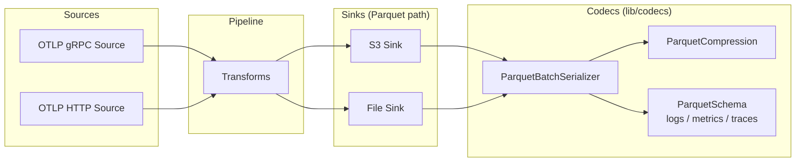

# Parquet Codec — Design Doc

## Context

Sol is an OTLP-native observability pipeline. Observability data (logs, metrics, traces) flows in via gRPC/HTTP OTLP sources and is routed to various sinks. A common data lake pattern is: **OTLP → Sol → S3 (or file) as Parquet** for downstream analytics via Athena, Presto, Spark, DuckDB, or ClickHouse.

Today Sol supports Arrow IPC streaming (for ClickHouse) but has no Parquet support. Arrow IPC is a streaming format without a file footer — it is not queryable by analytics engines without conversion. Parquet is the industry-standard columnar file format for data lakes, with built-in compression, predicate pushdown, and schema evolution.

The `parquet` crate from the arrow-rs project (v56.2.0, matching Sol's existing `arrow` dependency) provides native Rust Parquet writing with column-level compression codecs.

## Functional Requirements

### <a id="fr1"></a>FR1 — Parquet batch serializer

Add a `ParquetSerializer` implementing `tokio_util::codec::Encoder<Vec<Event>>` that converts a batch of `OtelLog`, `OtelMetric`, or `OtelSpan` events into a valid Parquet file (complete with footer).

The serializer must produce a self-contained Parquet file per batch — not a streaming format — because Parquet requires a file footer for the row group metadata.

### <a id="fr2"></a>FR2 — OTLP-native schema

Define fixed Parquet schemas for each signal type (logs, metrics, traces) derived from the OTLP proto structure. The schema must preserve the full OTLP structure: resource, scope, attributes, and signal-specific fields.

Attributes (key-value pairs with dynamic `AnyValue` types) must be serialized in a way that is both queryable and lossless. The approach must handle the recursive `AnyValue` type.

### <a id="fr3"></a>FR3 — Parquet-native compression

Expose Parquet's built-in column-level compression codecs in the serializer configuration. Parquet compression is applied per-column inside the file format — it is distinct from and replaces sink-level compression (gzip/zstd wrapping the entire payload).

### <a id="fr4"></a>FR4 — S3 sink integration

The Parquet serializer must work with the existing S3 sink via the `BatchSerializerConfig` / `EncoderKind::Batch` path. The S3 sink writes one object per batch — each object is a complete Parquet file.

### <a id="fr5"></a>FR5 — File sink integration

The Parquet serializer must work with the existing file sink. Each rotated file is a complete Parquet file with proper footer.

## Non-Functional Requirements

### <a id="nfr1"></a>NFR1 — Zero new crate families

Use only the `parquet` crate from the existing arrow-rs v56 family. The `arrow` crate is already a dependency — `parquet` shares the same version, release cadence, and Arrow type system. No new crate families introduced.

### <a id="nfr2"></a>NFR2 — Feature-gated

The Parquet codec must be gated behind a `parquet` feature flag (similar to the `arrow` feature for Arrow IPC), so it does not increase binary size or compile time for users who don't need it.

### <a id="nfr3"></a>NFR3 — Consistent with Arrow codec patterns

Follow the same architectural patterns as the existing Arrow IPC codec: `BatchSerializerConfig` variant, feature gating, `SchemaProvider` trait pattern, error handling via `snafu`.

### <a id="nfr4"></a>NFR4 — Queryable output

Parquet files produced must be directly queryable by standard tools (DuckDB, Athena, Spark) without post-processing. Column names must be predictable and documented.

## Non-goals

- **Parquet reading/decoding**: this design covers encoding (sink-side) only. A Parquet source (reading Parquet files from S3) is a separate future effort.
- **Schema evolution at write time**: the schema is fixed per signal type. If the OTLP proto evolves, the Parquet schema evolves with it. We do not support user-defined schema overrides in this iteration.
- **Parquet encryption**: the Parquet format supports column-level encryption, but this is out of scope.
- **Delta Lake / Iceberg integration**: table format metadata (manifests, transaction logs) is out of scope. Sol writes raw Parquet files; table format management is the responsibility of downstream tools.

## Rabbit holes

1. **AnyValue serialization**: OTLP attributes have recursive `AnyValue` types (string, int, double, bool, array, kvlist, bytes). Flattening to top-level Parquet columns is lossy and schema-unstable. Serializing as JSON strings is lossless but limits pushdown. **Constraint**: cap exploration at the two options analyzed in the ADR. Do not attempt recursive Parquet nested types for AnyValue.

2. **Metrics signal complexity**: OTLP metrics have 5 data point types (gauge, sum, histogram, exponential histogram, summary) with different schemas. A single unified schema would be sparse. **Constraint**: start with logs only. Metrics and traces schemas are Phase 2 work (separate workspace).

## Design

### Architecture (C4 Level 2)



### Codec Integration

The Parquet serializer plugs into the existing batch codec infrastructure:

```
BatchSerializerConfig::Parquet(ParquetSerializerConfig)
  → ParquetSerializer (implements Encoder<Vec<Event>>)
    → builds Arrow RecordBatch (reusing existing serde_arrow path)
    → writes Parquet file via parquet::arrow::ArrowWriter
    → Parquet-native compression applied per column
```

### Schema Design (Logs)

The Parquet schema for logs follows the OTLP `LogRecord` proto structure:

| Column | Parquet Type | Source |
|--------|-------------|--------|
| `time_unix_nano` | INT64 (TIMESTAMP_NANOS) | `log_record.time_unix_nano` |
| `observed_time_unix_nano` | INT64 (TIMESTAMP_NANOS) | `log_record.observed_time_unix_nano` |
| `severity_number` | INT32 | `log_record.severity_number` |
| `severity_text` | BYTE_ARRAY (UTF8) | `log_record.severity_text` |
| `body` | BYTE_ARRAY (UTF8) | `log_record.body` (JSON-serialized AnyValue) |
| `attributes` | BYTE_ARRAY (UTF8) | JSON-serialized key-value map |
| `flags` | INT32 | `log_record.flags` |
| `trace_id` | FIXED_LEN_BYTE_ARRAY(16) | `log_record.trace_id` |
| `span_id` | FIXED_LEN_BYTE_ARRAY(8) | `log_record.span_id` |
| `dropped_attributes_count` | INT32 | `log_record.dropped_attributes_count` |
| `resource_attributes` | BYTE_ARRAY (UTF8) | JSON-serialized resource attributes |
| `resource_schema_url` | BYTE_ARRAY (UTF8) | `resource.schema_url` |
| `scope_name` | BYTE_ARRAY (UTF8) | `scope.name` |
| `scope_version` | BYTE_ARRAY (UTF8) | `scope.version` |
| `scope_attributes` | BYTE_ARRAY (UTF8) | JSON-serialized scope attributes |
| `scope_schema_url` | BYTE_ARRAY (UTF8) | `scope.schema_url` |

### Decisions

- [Parquet compression codec](./adrs/parquet-compression-codec.md)
- [Attributes serialization strategy](./adrs/attributes-serialization-strategy.md)
- [Batch-per-file semantics](./adrs/batch-per-file-semantics.md)

## Cross-cutting Concerns

- **Observability**: reuse existing codec metrics (`component_sent_bytes_total`, `component_sent_events_total`). Add `encoder_parquet_row_group_size` gauge.
- **Migration**: no migration needed — this is a new codec, not a replacement.
- **Rollback**: feature-gated, so rollback = disable feature flag.
