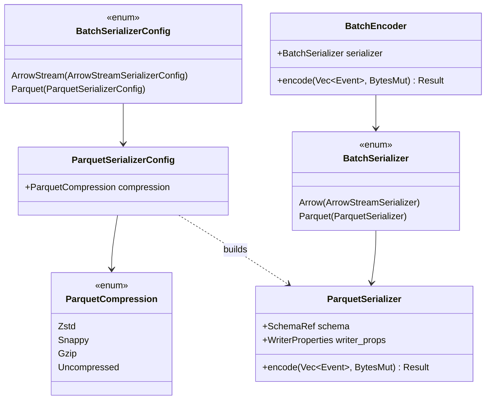

# Parquet Codec — Tasks

Design: [DESIGN.md](./DESIGN.md)

## Analysis

Build: `cargo check -p codecs --features parquet` — to verify after adding feature
Test: `cargo test -p codecs --features parquet` — to verify after adding tests
Lint: `cargo clippy -p codecs --features parquet` — to verify after implementation
Root build: `cargo check --features codecs-parquet`

### Known-failing tests
| Test | Reason | Action |
|---|---|---|
| (none) | | |

### Domain model

### Requirement traceability
| Type / Trait / Fn | Addresses | Notes |
|---|---|---|
| `ParquetSerializerConfig` | [FR1](./DESIGN.md#fr1), [FR3](./DESIGN.md#fr3) | Config with compression selection |
| `ParquetCompression` | [FR3](./DESIGN.md#fr3) | Maps to `parquet::basic::Compression` |
| `ParquetSerializer` | [FR1](./DESIGN.md#fr1) | `Encoder<Vec<Event>>` — produces complete Parquet file per batch |
| `build_otel_log_schema` | [FR2](./DESIGN.md#fr2) | Fixed 16-column OTLP log schema |
| `BatchSerializerConfig::Parquet` | [NFR3](./DESIGN.md#nfr3) | Follows ArrowStream variant pattern |
| `BatchSerializer::Parquet` | [NFR3](./DESIGN.md#nfr3) | Wired into `BatchEncoder` dispatch |

### Transformations
| Function | Input → Output | Invariant / Rule |
|---|---|---|
| `ParquetSerializer::encode` | `Vec<Event>, &mut BytesMut → Result<(), Error>` | Produces complete Parquet file (header + row groups + footer). At least one event required. Only `Event::Log` processed. |
| `build_otel_log_schema` | `() → SchemaRef` | Fixed 16-column schema matching [DESIGN.md schema table](./DESIGN.md). All column names and types must match exactly. |
| `events_to_record_batch` | `&[Event], SchemaRef → Result<RecordBatch>` | Reuses existing `serde_arrow` path from `arrow.rs`. Filters to `Event::Log` only. Handles timestamp conversion. |
| `record_batch_to_parquet` | `RecordBatch, WriterProperties → Result<Bytes>` | Uses `ArrowWriter` with configured compression. Output is a self-contained Parquet file. |
| `ParquetCompression::to_parquet` | `&self → parquet::basic::Compression` | Maps: Zstd → ZSTD(default), Snappy → SNAPPY, Gzip → GZIP(default), Uncompressed → UNCOMPRESSED |

## Tasks

### 1. Feature flags and `parquet` crate dependency ([NFR1](./DESIGN.md#nfr1), [NFR2](./DESIGN.md#nfr2))
**Goal**: Add the `parquet` crate and feature gates following the existing `arrow` pattern.
**Types**: Feature flags only — no runtime types.
**Constraints**:
- [ADR: storage-format-selection](./adrs/storage-format-selection.md) — Parquet, not Avro
- `parquet` crate must be v56.2.0 (matching existing `arrow` v56.2.0)
- Feature flags: `lib/codecs/Cargo.toml` → `parquet = ["dep:parquet", "dep:arrow", "dep:serde_arrow"]`
- Root `Cargo.toml` → `codecs-parquet = ["sol-lib/parquet"]`
- `lib/sol-lib/Cargo.toml` → `parquet = ["codecs/parquet"]`
- `parquet` crate features: `snap`, `flate2`, `zstd` (per [compression ADR](./adrs/parquet-compression-codec.md))
**Tests**: (none — compile check only)
**Verify**: `cargo check -p codecs --features parquet`
**Acceptance criteria**:
- [ ] `parquet` crate v56.2.0 added to `lib/codecs/Cargo.toml` with `snap`, `flate2`, `zstd` features
- [ ] Feature flag `parquet` defined in codecs, sol-lib, and root Cargo.toml
- [ ] `cargo check -p codecs --features parquet` exits 0
**Depends on**: (none)
**Time-box**: ~15 min

### 2. OTLP log Parquet schema ([FR2](./DESIGN.md#fr2))
**Goal**: Define the fixed Arrow schema for OTLP `LogRecord` that the Parquet serializer will use.
**Types**: `build_otel_log_schema` — see domain model
**Constraints**:
- Schema must have exactly 16 columns per [DESIGN.md schema table](./DESIGN.md)
- Timestamp columns use `DataType::Timestamp(TimeUnit::Nanosecond, None)` (INT64 physical)
- `trace_id` → `DataType::FixedSizeBinary(16)`, `span_id` → `DataType::FixedSizeBinary(8)`
- String columns → `DataType::Utf8`
- Integer columns → `DataType::Int32`
- All columns nullable (observability data is frequently sparse)
**Tests**:
- `test_otel_log_schema_column_count` — schema has 16 fields
- `test_otel_log_schema_column_names` — all column names match DESIGN.md
- `test_otel_log_schema_column_types` — all types match DESIGN.md
**Verify**: `cargo test -p codecs --features parquet -- otel_log_schema`
**Acceptance criteria**:
- [ ] `build_otel_log_schema()` returns a `SchemaRef` with exactly 16 columns
- [ ] Column names and types match [DESIGN.md schema table](./DESIGN.md) exactly
- [ ] All 3 tests pass
**Depends on**: task 1
**Time-box**: ~30 min

### 3. ParquetSerializer — core encoding ([FR1](./DESIGN.md#fr1), [FR3](./DESIGN.md#fr3))
**Goal**: Implement the serializer that converts a batch of events into a complete Parquet file.
**Types**: `ParquetSerializer`, `ParquetSerializerConfig`, `ParquetCompression` — see domain model
**Constraints**:
- [ADR: batch-per-file](./adrs/batch-per-file-semantics.md) — each `encode()` produces one complete Parquet file
- [ADR: attributes-serialization](./adrs/attributes-serialization-strategy.md) — attributes as JSON strings
- [ADR: compression](./adrs/parquet-compression-codec.md) — default Zstd, support Snappy/Gzip/Uncompressed
- Reuse `build_record_batch` logic from `arrow.rs` (Events → RecordBatch via serde_arrow)
- Use `parquet::arrow::ArrowWriter` to write RecordBatch → Parquet bytes
- `ArrowWriter::try_new(cursor, schema, Some(writer_props))` → `.write(&batch)` → `.close()`
- WriterProperties set compression from `ParquetCompression`
- Empty events vec → return error (same pattern as `ArrowEncodingError::NoEvents`)
- Only `Event::Log` events processed; others silently filtered
**Tests**:
- `test_parquet_encode_single_event` — encode one log, read back, verify fields
- `test_parquet_encode_batch` — encode 100 logs, verify row count
- `test_parquet_encode_empty_events_errors` — empty vec returns error
- `test_parquet_encode_attributes_as_json` — attributes column contains valid JSON
- `test_parquet_roundtrip` — encode → read back with `ParquetRecordBatchReader`, verify data matches
**Verify**: `cargo test -p codecs --features parquet -- parquet_encode`
**Acceptance criteria**:
- [ ] `ParquetSerializer` implements `Encoder<Vec<Event>>` producing valid Parquet output
- [ ] Output is a complete Parquet file (readable by `ParquetRecordBatchReader`)
- [ ] Attributes serialized as JSON strings per ADR
- [ ] All 5 tests pass
**Depends on**: task 2
**Time-box**: ~60 min

### 4. Compression configuration ([FR3](./DESIGN.md#fr3))
**Goal**: Support all 4 compression codecs with correct configuration deserialization.
**Types**: `ParquetCompression` — see domain model
**Constraints**:
- [ADR: compression](./adrs/parquet-compression-codec.md) — Zstd (default), Snappy, Gzip, Uncompressed
- Serde `rename_all = "snake_case"`: `zstd`, `snappy`, `gzip`, `none`
- `ParquetSerializerConfig` defaults to `ParquetCompression::Zstd` via `Default`
- Map: `Zstd → Compression::ZSTD(ZstdLevel::default())`, `Snappy → Compression::SNAPPY`, `Gzip → Compression::GZIP(GzipLevel::default())`, `Uncompressed → Compression::UNCOMPRESSED`
**Tests**:
- `test_parquet_compression_zstd` — encode with zstd, verify file is valid
- `test_parquet_compression_snappy` — encode with snappy, verify file is valid
- `test_parquet_compression_gzip` — encode with gzip, verify file is valid
- `test_parquet_compression_uncompressed` — encode uncompressed, verify file is valid
- `test_parquet_config_default_compression` — default config has zstd
- `test_parquet_config_deserialize` — deserialize `{"codec":"parquet","compression":"snappy"}`
**Tests verify each variant produces smaller or equal output compared to uncompressed (except uncompressed itself).**
**Verify**: `cargo test -p codecs --features parquet -- parquet_compression`
**Acceptance criteria**:
- [ ] All 4 compression variants produce valid Parquet files
- [ ] Config deserialization works for all variants
- [ ] Default is Zstd
- [ ] All 6 tests pass
**Depends on**: task 3
**Time-box**: ~30 min

### 5. BatchSerializerConfig / BatchSerializer integration ([NFR3](./DESIGN.md#nfr3))
**Goal**: Wire `ParquetSerializer` into the batch codec infrastructure so sinks can use it.
**Types**: `BatchSerializerConfig::Parquet`, `BatchSerializer::Parquet` — see domain model
**Constraints**:
- Follow `ArrowStream` variant pattern exactly (see `encoder.rs:15-18`, `serializer.rs:136-146`)
- Add `#[cfg(feature = "parquet")]` guards on all new variants
- `BatchSerializerConfig::Parquet` wraps `ParquetSerializerConfig`
- `BatchSerializerConfig::build()` must handle the `Parquet` variant
- `BatchSerializerConfig::input_type()` returns `DataType::Log` (same as Arrow)
- `BatchSerializer::Parquet` wraps `ParquetSerializer`
- `BatchEncoder::encode()` must dispatch to `ParquetSerializer::encode()`
- `BatchEncoder::content_type()` returns `"application/vnd.apache.parquet"` for Parquet variant
- `EncoderKind::Batch` must work with the Parquet variant (update `#[cfg]` from `arrow` to `any(feature = "arrow", feature = "parquet")`)
- Update public exports in `encoding/mod.rs` and `encoding/format/mod.rs`
**Tests**:
- `test_batch_encoder_parquet_roundtrip` — create `BatchEncoder` with Parquet serializer, encode events, verify valid Parquet output
- `test_batch_serializer_config_build` — build `ParquetSerializer` from `BatchSerializerConfig::Parquet`
**Verify**: `cargo test -p codecs --features parquet -- batch_encoder_parquet && cargo clippy -p codecs --features parquet`
**Acceptance criteria**:
- [ ] `BatchSerializerConfig::Parquet` variant exists and builds correctly
- [ ] `BatchSerializer::Parquet` dispatches encoding through `BatchEncoder`
- [ ] `EncoderKind::Batch` works with the Parquet variant
- [ ] Content type is `application/vnd.apache.parquet`
- [ ] Both tests pass
- [ ] Clippy clean
**Depends on**: task 4
**Time-box**: ~45 min

### 6. End-to-end sink integration tests ([FR4](./DESIGN.md#fr4), [FR5](./DESIGN.md#fr5))
**Goal**: Verify the Parquet codec works through the sink encoding path (Transformer + EncoderKind).
**Types**: Uses types from tasks 1-5 — no new types.
**Constraints**:
- Test the path: `(Transformer, EncoderKind::Batch(BatchEncoder::new(BatchSerializer::Parquet(..))))` → `encode_input(events, writer)`
- Verify the output written to `writer` is a valid Parquet file
- Verify file extension `.parquet` convention (document in test, not enforced by codec — sink responsibility)
- Test with representative OTLP log data: populated attributes, trace_id, span_id, severity
- Verify `src/sinks/util/encoding.rs` `Encoder<Vec<Event>>` impl dispatches correctly for Parquet
**Tests**:
- `test_sink_encoding_path_parquet` — full encoding path through `(Transformer, EncoderKind)`, verify output
- `test_parquet_with_representative_otlp_data` — encode logs with all 16 fields populated, read back and verify values
- `test_parquet_with_sparse_otlp_data` — encode logs with many null fields, verify null handling
**Verify**: `cargo test --features codecs-parquet -- sink_encoding_path_parquet && cargo test --features codecs-parquet -- parquet_with`
**Acceptance criteria**:
- [ ] Full sink encoding path produces valid Parquet output
- [ ] All 16 OTLP log fields round-trip correctly
- [ ] Sparse/null fields handled without errors
- [ ] All 3 tests pass
**Depends on**: task 5
**Time-box**: ~45 min

## Sessions

### Session 1 — Parquet codec implementation (~3.5H)
Tasks: 1, 2, 3, 4, 5, 6
**Skills**: `rust-software-engineer`, `tdd`
**Checkpoint**: `cargo test --features codecs-parquet && cargo clippy --features codecs-parquet`
**Commit point**: yes — commit after checkpoint passes

## Quality gates (post-session review)
- [ ] Acceptance criteria: all green above
- [ ] Code review: implementation matches [DESIGN.md](./DESIGN.md) intent
- [ ] Code organization: `lib/codecs/src/encoding/format/parquet.rs` follows `arrow.rs` patterns
- [ ] Code quality: no new complexity, clean types, no duplication with arrow.rs (extract shared helpers if needed)
- [ ] Security review: no unsafe code, no unbounded allocations (batch size bounded by sink config)
- [ ] Observability: reuse existing codec metrics (`component_sent_bytes_total`, `component_sent_events_total`)
- [ ] Performance: Parquet encoding should not be significantly slower than Arrow IPC for equivalent data
