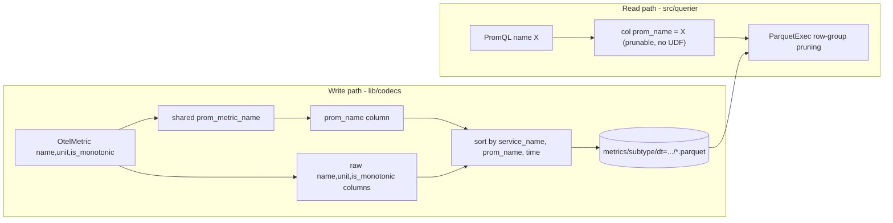

# prom-name-column — Design Doc

Builds on: [designs/20260527_parquet-multisignal.md](../../designs/20260527_parquet-multisignal.md) ·
relates to [parquet-backend](../parquet-backend/DESIGN.md)

## Context

Metric-name filtering in the Parquet query backend is done with the
`prom_metric_name(name, unit, is_monotonic)` **scalar UDF** (`src/querier/udf.rs`,
called via `prom_name_expr()` in `src/querier/prometheus.rs`). Because the filter
predicate is a UDF over raw columns, DataFusion cannot derive Parquet row-group
min/max pruning from it: every metric query decodes **all rows of all metric
files** and evaluates the UDF per row.

Measured on the live demo (14,026,388 metric rows):

| Filter | Plan | Time |
|---|---|---|
| `prom_metric_name(name,unit,is_monotonic) = 'x'` (current) | post-scan `FilterExec`, no pruning | **1.81 s** |
| `name = 'x'` (raw column) | `predicate=name_min <= x <= name_max` row-group pruning + name-sort | **0.11 s** |

The conversion is *many-to-one and lossy* (every non-alphanumeric collapses to
`_`; unit/`_total` suffixes are appended conditionally), so it **cannot be
inverted** at query time to a raw-`name` equality. The fix is to run the
normalization **once at write time** and store the result as a real, sorted
`prom_name` column, so the read filter becomes a prunable column equality.

## Functional Requirements

### FR1 — Materialize `prom_name` at write time
The Parquet codec writes a `prom_name` column on every metric row, equal to
`prom_metric_name(name, unit, is_monotonic)` for that row (the normalized
Prometheus/Mimir name). The raw OTLP `name`/`unit`/`is_monotonic` columns are
**retained unchanged** (storage fidelity).

### FR2 — Normalizer at write only; remove the read-time UDF
The normalization function (`prom_metric_name` + `unit_suffix`) moves to a shared
location (`lib/sol-core`) and is called by the **codec at write time** only. The
DataFusion `prom_metric_name_udf` wrapper **and its catalog registration are
removed** — the read path no longer normalizes anything; it reads the stored
`prom_name` column. (The ad-hoc SQL endpoint loses the `prom_metric_name`
function; acceptable — see non-goals.)

### FR3 — Read filters use the `prom_name` column (only)
The metrics-table schema (`src/querier/catalog.rs`) declares `prom_name`, and the
read path filters on it as a **plain column equality** (`col("prom_name") =
lit(name)`) — no UDF, no fallback predicate. Affected sites: `prom_name_expr`
(→ `col("prom_name")`), `name_pred_expr`, the `__name__` `label_values` path,
`build_series`, the histogram/bucket scans, and range/instant base selectors.

### FR4 — Histogram component names stay correct
The synthesized histogram component series (`<base>_count`, `<base>_sum`,
`<base>_bucket`) continue to resolve against the stored histogram row, expressed
as a predicate on `prom_name` (`prom_name = '<base>_count' OR (prom_name =
'<base>' AND bucket_counts IS NOT NULL)`), preserving current behavior.

### FR5 — Sort metric files by `prom_name`
The codec's `sort_dp_rows` and the compactor's sort-merge order rows by
`(service_name, prom_name, time_unix_nano)` so row-group min/max on `prom_name`
is tight and pruning is maximal. (Today they sort by raw `name`.)

### FR6 — Clean cutover (no backward compatibility)
We do **not** support reading pre-change Parquet files. The store is regenerated
so every metric file carries `prom_name`; the read path assumes the column is
present. There is **no** UDF fallback, no dual predicate, no mixed-old/new
handling, and no backfill step. `prom_name` may therefore be declared REQUIRED
(non-null) in both the codec and catalog schemas.

## Non-Functional Requirements

### NFR1 — Selective metric queries prune, no full scan
An exact metric-name query over `prom_name`-bearing files must use row-group
pruning (no per-row UDF over the whole table). Target: the prunable-column
latency class (~0.1 s for the 14 M-row dataset), not the full-scan class (~1.8 s).

### NFR2 — Result parity
Query results (instant, range, `label_values(__name__)`, `series`, histogram
quantiles) are identical to the pre-change UDF behavior, including for the
synthesized `_count`/`_sum`/`_bucket` component series. `querier::` stays green.

### NFR3 — Schema is the codec↔catalog contract
The `prom_name` column must be added to **both** the codec schemas
(per-subtype) and `metric_union_schema` in the catalog, at matching positions
— the existing binding-contract invariant (parquet-multisignal).

### NFR4 — No new external dependency
Pinned crate set unchanged (datafusion / datafusion-functions-json /
object_store / promql-parser / moka).

## Non-goals

- **Backward compatibility / reading pre-change files.** Out of scope by
  decision ([FR6](#fr6)) — the store is regenerated. No backfill, no mixed-data
  fallback. Revisit only if an in-place migration is later required.
- **Keeping the `prom_metric_name` UDF.** The DataFusion UDF wrapper and its
  registration are **removed** (the read path uses the column). The ad-hoc SQL
  endpoint (`sql.rs`) consequently loses the `prom_metric_name` SQL function —
  accepted. The pure normalization fn survives in `sol-core` for the write path.
- **Changing the normalization rules.** The OTLP→Prometheus mapping is unchanged
  (already fixed in the token-dedup work, `udf.rs`); this only moves *where/when*
  it runs.
- **Label-key normalization (`prom_attr`).** Out of scope — `prom_attr` is a
  JSON-extraction UDF on the attributes column, a separate concern with its own
  cardinality; not a metric-name pruning problem.

## Rabbit holes

- **Schema evolution reading old files.** A ListingTable whose schema has
  `prom_name` reading a file lacking it: confirm DataFusion fills the missing
  column with NULL (vs erroring). Cap: if NULL-fill is not automatic, the read
  path must tolerate absent `prom_name` via the FR6 fallback; do **not** attempt
  per-file schema negotiation or backfill in this work.
- **Moving the normalizer across crates.** `lib/codecs` cannot depend on the
  `sol` crate. Cap: move only the pure `prom_metric_name`/`unit_suffix` fns to a
  crate both can use (`lib/sol-core`, which already owns `OtelMetric`); leave the
  DataFusion UDF wrapper in `src/querier/udf.rs`. Do not refactor unrelated udf code.
- **Compaction/rollup carrying the new column.** Rollup/compaction read→rewrite
  metric batches; `prom_name` must survive the round-trip and the re-sort. Cap:
  it is just another column in the Arrow batch — verify it round-trips; only the
  sort key (FR5) changes.

## Design

**Data model.** One added column `prom_name` (REQUIRED UTF8) on every metric
subtype schema, populated at write from the shared normalizer. Raw columns kept.

**Read filter.** `name_pred_expr(name)` becomes `col("prom_name") = lit(name)`
(+ the histogram `_count`/`_sum` OR-branch, FR4). No fallback predicate, no UDF.

**Normalizer location.** Move `prom_metric_name` + `unit_suffix` to `lib/sol-core`
(alongside `OtelMetric`); the **codec** calls it at write time. The DataFusion
`prom_metric_name_udf` wrapper in `src/querier/udf.rs` and its catalog
registration (`catalog.rs`) are **deleted**.

Decisions:
- [Materialize prom_name at write time](./adrs/prom-name-materialization.md)
- [Canonical normalizer location](./adrs/normalizer-canonical-location.md)
- [Clean cutover — no backward compatibility](./adrs/legacy-file-migration.md)

## Cross-cutting Concerns

- **Observability.** `sol_query_*` scan-bytes/latency already emitted; expect a
  drop for selective metric queries. No new metrics required.
- **Migration.** None. Clean cutover ([FR6](#fr6)) — the Parquet store is
  regenerated so every file carries `prom_name`. Pre-change files are not
  supported; wipe/regenerate before deploying.
- **Rollback.** Revert the read path + restore the `prom_metric_name_udf` and
  its registration. Stored data already carries `prom_name` (inert if unused),
  so rollback is code-only.
