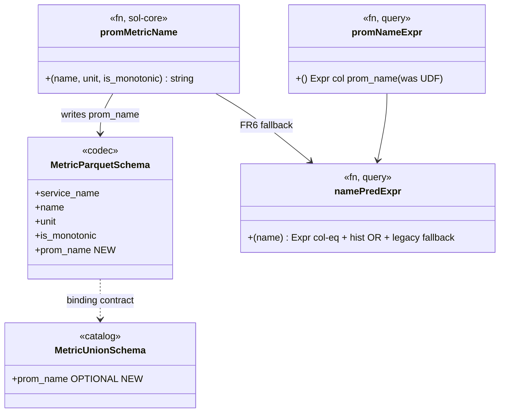

# prom-name-column — Tasks

Design: [DESIGN.md](./DESIGN.md)

## Analysis

Build: `cargo build --features query-backend --lib` — verified compiles green
Test (query): `cargo test --features query-backend --lib query::` — green baseline (138 passed)
Test (codec): `cargo test -p codecs` — verify parquet encoder tests (confirm feature flag in 4a)
Test (core): `cargo test -p sol-core` — for the moved normalizer
Lint: `cargo clippy --features query-backend --lib -- -D warnings` + `cargo clippy -p codecs -- -D warnings`

> **Environment note:** the `sol` crate is large (Vector fork); a cold rebuild
> after touching `sol-core`/`codecs` recompiles much of the tree (15–25 min on
> WSL2). Run **one** cargo invocation at a time — concurrent runs spawn competing
> ~5 GiB rustc processes that swap-thrash. Do not kill a build mid-compile (it
> forces a full rebuild).

### Known-failing tests
| Test | Reason | Action |
|---|---|---|
| (none in `query::` / codec) | baseline green | — |
| pre-existing `clippy --tests` `clone_on_ref_ptr` in fixtures | predates this work | out of scope (checkpoint is lib-only clippy) |

### Key code sites (grounded)
| Concern | Location |
|---|---|
| Normalizer (move source) | `src/query/udf.rs:88` `unit_suffix`, `:119` `prom_metric_name` |
| Normalizer (move target) | `lib/sol-core/src/event/otel_metric.rs` (OtelMetric: `name()` :621, `unit()` :629); `lib/codecs` already deps `sol-core` |
| UDF wrapper (keep, delegate) | `src/query/udf.rs:150` `prom_metric_name_udf` |
| Codec shared metric schema | `lib/codecs/.../parquet.rs:1418` `common_metric_schema_fields` (0 service_name, 1 name, 2 description, 3 unit, …) |
| Codec subtype schemas | `build_{gauge,sum,histogram,exp_histogram,summary}_schema` (:1551–1772) |
| Codec sort key | `parquet.rs:1834` `sort_dp_rows` → `(service_name, name, time)` |
| Codec `is_monotonic` source | `parquet.rs:2187` (Sum only; else false) |
| Catalog read schema | `src/query/catalog.rs:142` `metric_union_schema` (must mirror codec) |
| UDF registration | `src/query/catalog.rs:365` `register_udf(prom_metric_name_udf())` (keep — FR6 fallback) |
| Read filter sites | `src/query/prometheus.rs`: `prom_name_expr` :39, `name_pred_expr` :63, and callers :104, :147/155, :303/311, :667–668 (`__name__` label_values), :979, :1138, :1503 (histogram/bucket scans) |
| Compaction sort | `src/query/compaction.rs` (sort-merge by `service_name, time_col`) |
| Rollup round-trip | `src/query/rollup.rs` (`rollup_batches` — column must survive) |

### Domain model

### Requirement traceability
| Type / Fn | Addresses | Notes |
|---|---|---|
| `prom_metric_name` (moved to `sol-core`) | [FR2](./DESIGN.md#fr2) | single source of truth, write + read |
| `prom_metric_name_udf` (wrapper, kept) | [FR2](./DESIGN.md#fr2), [FR6](./DESIGN.md#fr6) | delegates to moved fn; FR6 fallback + ad-hoc SQL |
| `prom_name` column (codec subtype schemas) | [FR1](./DESIGN.md#fr1), [NFR3](./DESIGN.md#nfr3) | REQUIRED non-null on write |
| `prom_name` field (`metric_union_schema`) | [FR3](./DESIGN.md#fr3), [NFR3](./DESIGN.md#nfr3) | OPTIONAL/nullable (FR6 fallback) |
| `prom_name_expr` | [FR3](./DESIGN.md#fr3) | returns `col("prom_name")` |
| `name_pred_expr` | [FR3](./DESIGN.md#fr3), [FR4](./DESIGN.md#fr4), [FR6](./DESIGN.md#fr6) | col-eq + histogram OR + NULL→UDF fallback |
| `sort_dp_rows` / compaction sort | [FR5](./DESIGN.md#fr5) | sort by `(service_name, prom_name, time)` |

### Transformations
| Function | Input → Output | Invariant / Rule |
|---|---|---|
| `prom_metric_name` | `(name, unit, is_monotonic) → String` | unchanged rules (token-dedup); identical for write & read |
| codec metric encode | `OtelMetric dp → parquet row` | `prom_name == prom_metric_name(name, unit, is_monotonic)` for every row |
| `name_pred_expr(name)` | `&str → Expr` | matches the same series as today's UDF filter, on both new (`prom_name`) and legacy (NULL→UDF) files |

## Tasks

### 1. Move the canonical normalizer to `sol-core` ([FR2](./DESIGN.md#fr2))
**Goal**: One `prom_metric_name`/`unit_suffix` reachable by codec (write) and query (read).
**Types**: `prom_metric_name` (fn) — see domain model.
**Constraints**:
- [ADR: normalizer-canonical-location](./adrs/normalizer-canonical-location.md) — move the **pure** fns to `lib/sol-core`; keep the `ScalarUDF` wrapper in `src/query/udf.rs` delegating to the moved fn.
- Transformation: normalization rules unchanged (token-dedup behavior preserved).
- Do not move `normalize` (key-name) or `prom_attr` — out of scope.
**Tests** (red→green): move the existing `udf.rs` normalization cases to `sol-core` (`test_prom_metric_name_*`, incl. the double-suffix/idempotency cases); keep a thin delegation test in `udf.rs`.
**Verify**: `cargo test -p sol-core prom_metric_name && cargo test --features query-backend --lib query::udf::`
**Acceptance**:
- [ ] `prom_metric_name`/`unit_suffix` defined in `sol-core`, called by `udf.rs`
- [ ] no duplicated normalization logic remains
- [ ] normalization test cases pass in `sol-core`
**Depends on**: (none) **Time-box**: ~45 min

### 2. Codec writes the `prom_name` column + sorts by it ([FR1](./DESIGN.md#fr1), [FR5](./DESIGN.md#fr5), [NFR3](./DESIGN.md#nfr3))
**Goal**: Every metric Parquet row carries `prom_name`; files sorted for pruning.
**Types**: `prom_name` column on all 5 subtype schemas — see domain model.
**Constraints**:
- [ADR: prom-name-materialization](./adrs/prom-name-materialization.md) — `prom_name = prom_metric_name(name, unit, is_monotonic)` (Task 1 fn); `is_monotonic` from Sum data else `false`.
- Add the column to `common_metric_schema_fields` (REQUIRED UTF8) so all subtypes inherit it; write it in each subtype's column block.
- [FR5](./DESIGN.md#fr5): change `sort_dp_rows` key to `(service_name, prom_name, time_unix_nano)`.
- Raw `name`/`unit`/`is_monotonic` columns unchanged.
**Tests**: `test_metric_schema_has_prom_name`; `test_prom_name_column_matches_normalizer` (encode a sum `cpu_seconds_total`/`s`/monotonic → row `prom_name == "node_..."`-style normalized, no double suffix); `test_rows_sorted_by_prom_name`.
**Verify**: `cargo test -p codecs` (parquet encoder)
**Acceptance**:
- [ ] all 5 subtype schemas include `prom_name`
- [ ] written `prom_name` equals `prom_metric_name(...)` per row
- [ ] rows sorted by `(service_name, prom_name, time)`
**Depends on**: 1 **Time-box**: ~75 min

### 3. Catalog declares `prom_name` (nullable) ([FR3](./DESIGN.md#fr3), [NFR3](./DESIGN.md#nfr3), [FR6](./DESIGN.md#fr6))
**Goal**: The metrics read schema mirrors the codec, with `prom_name` nullable for legacy files.
**Types**: `prom_name` field in `metric_union_schema`.
**Constraints**:
- [ADR: legacy-file-migration](./adrs/legacy-file-migration.md) — declare `prom_name` **OPTIONAL/nullable** so files lacking it read as NULL (fallback reachable). New files write non-null.
- Field position/name must match the codec schema (binding contract, NFR3).
**Tests**: `test_metric_union_schema_has_prom_name` (nullable); existing catalog registration tests stay green.
**Verify**: `cargo test --features query-backend --lib query::catalog::`
**Acceptance**:
- [ ] `metric_union_schema` includes nullable `prom_name`
- [ ] catalog registers metrics table without schema-mismatch errors
**Depends on**: 2 **Time-box**: ~30 min

### 4. Read path filters on `prom_name` with legacy fallback ([FR3](./DESIGN.md#fr3), [FR4](./DESIGN.md#fr4), [FR6](./DESIGN.md#fr6), [NFR2](./DESIGN.md#nfr2))
**Goal**: Metric-name filtering is a prunable column equality; parity preserved on mixed data.
**Types**: `prom_name_expr`, `name_pred_expr` — see domain model.
**Constraints**:
- `prom_name_expr()` → `col("prom_name")` (was the UDF call).
- `name_pred_expr(name)` → `col("prom_name") = lit(name)` **+** histogram `_count`/`_sum` OR-branch ([FR4](./DESIGN.md#fr4)) **+** legacy fallback `OR (col("prom_name").is_null() AND <udf>(name,unit,is_monotonic) = name)` ([FR6](./DESIGN.md#fr6)).
- Update all caller sites that select/alias `prom_name_expr()` (prometheus.rs :104, :155, :311, :667–668, :979, :1138, :1503) to the column.
- Keep `register_udf(prom_metric_name_udf())` (catalog.rs:365) — it is the fallback.
- [NFR2](./DESIGN.md#nfr2): results identical to current (instant, range, label_values(`__name__`), series, histogram components).
**Tests**: `test_name_filter_uses_prom_name_column` (plan/Display contains `prom_name`, not the UDF, for the column branch); `test_histogram_component_names_resolve` (`X_count`/`X_sum` still match); `test_legacy_null_prom_name_falls_back` (a row with NULL prom_name still matches via UDF). Existing `handle_*` parity tests stay green.
**Verify**: `cargo test --features query-backend --lib query::`
**Acceptance**:
- [ ] `prom_name_expr` returns the column; no caller computes the UDF for the default filter
- [ ] `__name__` label_values + series still return the normalized names
- [ ] histogram `_count`/`_sum`/`_bucket` parity holds
- [ ] legacy (NULL `prom_name`) rows still match via the fallback
**Depends on**: 3 **Time-box**: ~90 min

### 5. Compaction + rollup carry and sort by `prom_name` ([FR5](./DESIGN.md#fr5), [NFR2](./DESIGN.md#nfr2))
**Goal**: Rewrites preserve `prom_name` and re-sort for pruning, so old files converge to prunable.
**Types**: compaction sort-merge, `rollup_batches`.
**Constraints**:
- `prom_name` round-trips through `rollup_batches` (it is another Arrow column — verify, don't drop it).
- Compaction sort-merge orders by `(service_name, prom_name, time)` ([FR5](./DESIGN.md#fr5)); if a compacted batch came from legacy files without `prom_name`, the rewrite materializes it (the codec write path, Task 2, does this when re-encoding) — confirm the compactor re-encodes via the codec.
**Tests**: `test_rollup_preserves_prom_name`; `test_compaction_sorts_by_prom_name` (or confirms column present post-compaction).
**Verify**: `cargo test --features query-backend --lib query::compaction:: query::rollup::`
**Acceptance**:
- [ ] `prom_name` present after rollup and compaction
- [ ] compacted output sorted by `(service_name, prom_name, time)`
**Depends on**: 2, 3 **Time-box**: ~45 min

### 6. Verify pruning + full parity ([NFR1](./DESIGN.md#nfr1), [NFR2](./DESIGN.md#nfr2))
**Goal**: Prove the fix: selective metric query prunes (no full scan), results unchanged.
**Types**: (verification task — no new types).
**Constraints**:
- [NFR1](./DESIGN.md#nfr1): an `EXPLAIN` of an exact metric-name query shows row-group pruning on `prom_name` (a `predicate=prom_name_min <= x <= prom_name_max`-style annotation), not a post-scan UDF FilterExec, for `prom_name`-bearing files.
- [NFR2](./DESIGN.md#nfr2): full `query::` suite green at parity.
**Tests**: an execution test asserting an exact-name instant query returns the same series as before; (manual/optional) live `EXPLAIN` + timing on the demo if the stack is up.
**Verify**: `cargo test --features query-backend --lib query:: && cargo clippy --features query-backend --lib -- -D warnings`
**Acceptance**:
- [ ] `query::` suite green (parity)
- [ ] clippy `-D warnings` clean
- [ ] EXPLAIN/test confirms pruning on `prom_name` for new files
**Depends on**: 4, 5 **Time-box**: ~30 min

## Sessions

### Session 1 — write side + schema (~2.5H)
Tasks: 1, 2, 3
**Skills**: `rust-software-engineer`
**Checkpoint**: `cargo test -p sol-core && cargo test -p codecs && cargo test --features query-backend --lib query:: && cargo clippy --features query-backend --lib -- -D warnings`
(green = new column written + schema mirrored; read still uses the UDF, so `query::` stays green at parity)
**Commit point**: yes — after checkpoint passes

### Session 2 — read switch + migration + verify (~2.5H)
Tasks: 4, 5, 6
**Skills**: `rust-software-engineer`
**Checkpoint**: `cargo test --features query-backend --lib query:: && cargo clippy --features query-backend --lib -- -D warnings` (+ EXPLAIN pruning check)
**Commit point**: yes

## Quality gates (post-session review)
- [ ] Acceptance criteria: all green above
- [ ] Code review: implementation matches [DESIGN.md](./DESIGN.md) intent + the 3 ADRs
- [ ] Code organization: normalizer single-sourced in `sol-core`; UDF wrapper thin; schema change mirrored codec↔catalog
- [ ] Correctness: parity on instant/range/label_values/series/histogram; legacy NULL-`prom_name` fallback proven
- [ ] Performance ([NFR1](./DESIGN.md#nfr1)): selective metric query prunes (EXPLAIN), no full-scan + per-row UDF for new files
- [ ] No new dependency ([NFR4](./DESIGN.md#nfr4)); schema contract intact ([NFR3](./DESIGN.md#nfr3))
