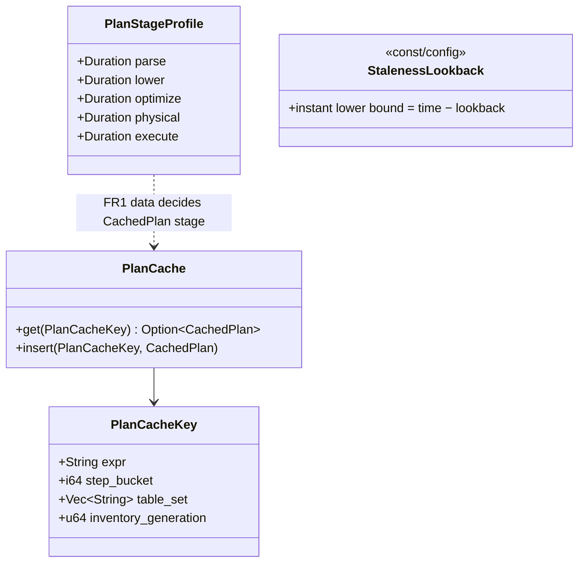

# promql-plan-cache — Tasks

Design: [DESIGN.md](./DESIGN.md)

## Analysis

Build: `cargo build --lib` — green (baseline = backend-metrics-perf S3 checkpoint)
Test: `cargo test --lib querier::` — green: 244 passed, 0 failed, 2 ignored (1 pre-existing + `bench_cold_range_query_demo_scale`)
Lint: `make check-clippy` (`Makefile:478`) — green at the same checkpoint

### Known-failing tests
| Test | Reason | Action |
|---|---|---|
| 1 ignored in `querier::` (pre-existing) + `bench_cold_range_query_demo_scale` (by design) | ignored | ignore |
| 6 × `codecs encoding::format::json` under `-p codecs --all-features` | pre-existing, outside scope | ignore |

### Measured starting point (see [backend-metrics-perf VERIFY](../../20260716_backend-metrics-perf/VERIFY.md))
| Probe | Now | Target |
|---|---|---|
| Cold `rate()` range query (live, release) | ~250 ms | ≤ 80 ms repeated-shape ([NFR1](./DESIGN.md#nfr1)) |
| Bare selector range (live) | 58 ms | reference floor |
| Warm result-cache hit | 5 ms | unchanged |
| 20-query burst | ~1.4 s | ≤ 0.5 s ([NFR2](./DESIGN.md#nfr2)) |
| Instant selector | 385 ms | ≤ 90 ms ([FR3](./DESIGN.md#fr3)) |
| In-repo bench (debug): cold rate / bare / warm | 609 / 108 / 13 ms | tracked by the same bench |

### Domain model

### Requirement traceability
| Type / Fn | Addresses | Notes |
|---|---|---|
| `PlanStageProfile` + profiling seam | [FR1](./DESIGN.md#fr1) | Timing spans around the 5 pipeline stages; bench-visible |
| `PlanCache`, `PlanCacheKey` | [FR2](./DESIGN.md#fr2) | Mechanism per [ADR](./adrs/plan-cache-mechanism.md) after FR1 |
| `StalenessLookback` in `selector_base_df`/`hist_instant_scan` | [FR3](./DESIGN.md#fr3) | Prometheus 5 m semantics, configurable |
| deleted legacy raw-file rule + zero query-time widening in `inventory.rs` | [FR4](./DESIGN.md#fr4) | No retro-compat (standing directive) — exact-bounds / compactor shapes / unbounded fallback only |

### Transformations
| Function | Input → Output | Invariant / Rule |
|---|---|---|
| profile run | (query shape) → `PlanStageProfile` table | Stages sum ≈ total (±10 %); reproducible on the fixture |
| `PlanCache::get/insert` | key → cached stage artefact | Hit ⇒ byte-identical response to miss; every key component has a changing-it-misses test |
| instant lower bound | `time → [time − lookback, time]` | Series with a sample inside lookback: identical result; staler series: absent (Prometheus semantics) |
| `parse_file_interval` (FR4) | `&Path → FileInterval` | Legacy `HH-MM-SS` rule deleted; exact-bounds / `compacted-*` / `rollup-*` / unbounded only; `scoped_files` widens by 0 |

## Tasks

### 1. Plan-pipeline profile ([FR1](./DESIGN.md#fr1))
**Goal**: Split the ~190 ms across parse/lower/optimize/physical/execute for `rate()`, bare selector, `histogram_quantile`; produce the ADR's decision table.
**Tests**: profiling seam unit test (stages sum sanity); extend `bench_cold_range_query_demo_scale` to print the stage table.
**Verify**: `cargo test --lib querier:: && cargo test --lib querier:: -- --ignored bench_cold_range_query_demo_scale --nocapture && make check-clippy`
**Acceptance criteria**:
- [x] Stage table recorded in the [ADR](./adrs/plan-cache-mechanism.md) (release, demo-scale fixture; live stage-split needs a rebuild — totals already measured live); ADR moved to `proposed` with recommendation **A′ + E** (physical planning dominates: 48 % shape-warm; optimizer 26 %; execute 21 %; `histogram_quantile` execution-bound)
**Depends on**: (none)
**Time-box**: ~75 min
**⚠ SESSION GATE**: autopilot PAUSES after task 1 — the human ratifies the ADR before tasks 2–3 run. Tasks 2–3 below are shaped for option A/C; if another option is ratified, re-run Phase 4b/4c for them first.

### 2a. A′ — optimized-logical-plan cache + rebind ([FR2](./DESIGN.md#fr2), [ADR ratified](./adrs/plan-cache-mechanism.md))
**Goal**: Repeated query shapes skip lower+optimize: cache the post-`state.optimize()` plan keyed by (expr text, step bucket, resolved table set, inventory generation, lookback config); on hit, REBIND the window — rewrite the time literals AND swap each `TableScan`'s scoped provider to the current window's scoped table (the cached plan embeds the previous window's file list — stale files served otherwise); then `query_planner().create_physical_plan()` directly (the task-1 seam hook).
**Tests** (red first): `test_rebound_plan_equals_fresh_plan` (per shape: rebound optimized plan == freshly-built+optimized plan, display-level); `test_plan_cache_hit_result_identical` (hit vs miss byte-equality); `test_plan_cache_key_components_miss` (each key component change ⇒ miss); `test_plan_cache_hit_skips_optimize` (deterministic proxy: optimize-stage counter/histogram, not wall-clock)
**Verify**: `cargo test --lib querier:: && make check-clippy`
**Acceptance criteria**:
- [x] Tests green (252/0/2, +6); `sol_querier_plan_cache_requests_total{result=hit|miss|bypass}` emitted; insert-time identity-rebind self-check ⇒ non-total shapes never cached (bypass); no bypassing shapes observed in the suite
**Depends on**: task 1 (ADR ratified 2026-07-17)
**Time-box**: ~90 min

### 2b. Re-profile; E sized by the remainder ([FR2](./DESIGN.md#fr2), [NFR1](./DESIGN.md#nfr1))
**Goal**: Run the stage bench post-A′; if repeated-shape `rate()` ≤ 80 ms on the fixture, record the table and SKIP E (note in ADR); else shrink the `rate()` lowering (fuse/eliminate window aggregates) until the physical+execute remainder fits, gated by the extrapolation golden test + instant==range parity matrix.
**Tests**: existing golden/parity suites are the bar for E; bench table recorded here either way
**Verify**: `cargo test --lib querier:: && cargo test --release --lib querier::prometheus::tests::bench_cold_range_query_demo_scale -- --ignored --exact --nocapture && make check-clippy`
**Acceptance criteria**:
- [x] Post-A′ release stage table (fixture, idle host): `rate()` cold 51.6 ms (optimize 5.7 / physical 23.3 / execute 18.5); **shape-warm 22–26 ms with optimize = 0.00** (plan-cache hit); result-cache hit 1.3 ms; bare `m` warm 6.5 ms; `histogram_quantile` warm 9–10 ms. **E SKIPPED with numbers**: repeated-shape is ≤ 80 ms with ~3× headroom (≈35 ms at the 1.4× live factor). Caveat recorded: absolute cross-run comparison vs the task-1 table is load-contaminated; the within-run cold→warm delta (optimize eliminated, physical ~15–17 ms remains) is the decision signal. Suites unchanged since 2a's green gates (no code in the skip path).
**Depends on**: task 2a
**Time-box**: ~90 min (skip path: ~20 min)

### 3. Instant staleness lookback + legacy-margin deletion ([FR3](./DESIGN.md#fr3), [FR4](./DESIGN.md#fr4))
**Goal**: Bound instant scans; delete the legacy raw-file rule and all query-time widening (no retro-compat — standing directive).
**Tests** (red first): `test_instant_selector_bounded_scan` (files-opened drops; in-lookback series identical, staler series absent); `test_exact_bounds_files_no_query_margin` (15-min scope over exact-bounds fixture includes only true-overlap files); `test_legacy_raw_name_falls_back_unbounded` (an old-style name is simply unbounded-included, no special rule); existing parity suite green
**Verify**: `cargo test --lib querier:: && make check-clippy`
**Acceptance criteria**:
- [ ] Tests green; instant selector live probe ≤ 90 ms recorded here
**Depends on**: (none — parallel-safe with 2)
**Time-box**: ~75 min

### 4. Live verification + evidence ([NFR1](./DESIGN.md#nfr1), [NFR2](./DESIGN.md#nfr2))
**Goal**: Re-run the predecessor's probe set on the rebuilt image; record before/after; targets met or honestly re-decomposed.
**Verify**: probe set from [backend-metrics-perf VERIFY](../../20260716_backend-metrics-perf/VERIFY.md); `cargo test --lib querier:: -- --ignored bench_cold_range_query_demo_scale --nocapture`
**Acceptance criteria**:
- [ ] VERIFY table updated: repeated-shape cold ≤ 80 ms, burst ≤ 0.5 s, instant ≤ 90 ms — or a fired-trigger note per the predecessor's pattern
**Depends on**: tasks 2a, 2b, 3 (+ user image rebuild)
**Time-box**: ~45 min

## Sessions

### Session 1 — Profile → ADR proposed (~1.5 H)
Tasks: 1
**Skills**: `rust-software-engineer`, `rust-build`, `tdd`
**Checkpoint**: `cargo test --lib querier:: && make check-clippy`
**Commit point**: yes — then STOP for ADR ratification (severity-3 style gate, planned not accidental)

### Session 2 — A′ → re-profile → (E?) + instant/margin (~4 H)
Tasks: 2a, 2b, 3
**Skills**: `rust-software-engineer`, `rust-build`, `tdd`
**Checkpoint**: `cargo test --lib querier:: && make check-clippy`
**Commit point**: yes

### Session 3 — Live evidence (~1 H, needs user rebuild)
Tasks: 4
**Skills**: `rust-software-engineer`, `rust-build`
**Checkpoint**: probe set green vs targets
**Commit point**: yes

## Quality gates (post-session review)
- [ ] Acceptance criteria all green
- [ ] Code review vs [DESIGN.md](./DESIGN.md) intent
- [ ] Plan-cache key completeness: every component has a changing-it-misses test
- [ ] Observability: plan-cache hit/miss counters on the querier dashboard family
- [ ] Performance: NFR table updated with live numbers
