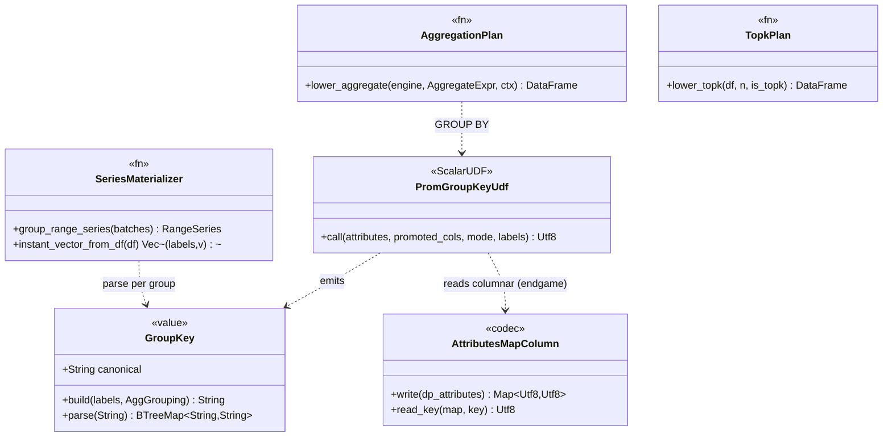

# promql-pushdown — Tasks

Design: [DESIGN.md](./DESIGN.md)

## Analysis

Build: `cargo build --features querier-backend` — (querier behind `querier-backend`; default features include it)
Test (querier): `cargo test --features querier-backend --lib querier::` — baseline ~143 tests green
Test (codec): `cargo test -p codecs --lib --features parquet` — schema/value tests green
Lint: `cargo clippy --features querier-backend --lib -- -D warnings`
Format: `cargo fmt --all`

### Known-failing tests
| Test | Reason | Action |
|---|---|---|
| (none) | baseline green at HEAD `a1ba34982` | — |

### Dependencies (pinned set — no additions allowed, [NFR1](./DESIGN.md#nfr1))
`datafusion = "53"` (53.1.0), `datafusion-functions-json = "0.53.1"`, `object_store = "0.13"`, `promql-parser = "0.9"`, `moka = "0.12"`. `prom_group_key` is a custom `ScalarUDF` via `create_udf` (same as `udf::prom_attr_udf`, `src/querier/udf.rs:53–84`) — no new crate.

### Key existing surface (from Phase 4a exploration)
- Eval entry points: `eval_instant` (`prometheus.rs:2225`), `eval_range_window` (`prometheus.rs:2002`).
- Aggregation today: Rust `aggregate_instant_vector` (`:500`), `aggregate_range_series` (`:524`), `AggGrouping` (`:448`), `agg_reduce` (`:485`); SQL single-level via `lower_aggregate_instant_df` (`:349`) / `lower_range_aggregate_df` (`:196`).
- Materialization (per-row JSON parse): `group_range_series` (`:1013`), `instant_vector_from_df` (`:2113`), `LabelCols::{build,labels}` (`:665,:701`) — `serde_json::from_str` at `:714`, key normalize via `udf::normalize` at `:722`.
- DataFrame API in use: `.aggregate([..],[..])` (`prometheus.rs:224`), window via `plan::frame::{rate:72, over_time:115, latest_per_series:52}` (`row_number().partition_by(...)`), `.filter/.select/.sort/.distinct/.union`.
- Shared `SessionContext` built once in `QueryEngine::new` (`catalog.rs:353`); UDFs registered there (`register_all` at `:362`, `ctx.register_udf(prom_attr_udf())`).
- Codec write-side (FR4 mirror target): `common_metric_schema_fields()` (`parquet.rs:1418`); `prom_name` field (`:1547`) REQUIRED, populated at `:2125` via `metric_prom_name`; `sort_dp_rows` key `(service_name, prom_name, time)` (`:1857`); attributes JSON via `kv_attrs_to_json_opt` (`:1821`); `OtelAttributes::get_string` for extraction; 5 subtype schemas extend the common fields. Codec schema/value tests at `parquet.rs:4756+`.

### Domain model

### Requirement traceability
| Type / Fn | Addresses | Notes |
|---|---|---|
| `prom_group_key` UDF (`udf.rs`) | [FR1](./DESIGN.md#fr1) | canonical group-key string; `create_udf`, registered on shared ctx |
| `GroupKey::{build,parse}` | [FR1](./DESIGN.md#fr1), [FR3](./DESIGN.md#fr3) | format per [group-key-format](./adrs/group-key-format.md); round-trips |
| `lower_aggregate` (instant+range) | [FR2](./DESIGN.md#fr2) | `GROUP BY prom_group_key` + agg; chained for nesting |
| `lower_topk` | [FR2](./DESIGN.md#fr2) | `ROW_NUMBER` window filter |
| `group_range_series` / `instant_vector_from_df` (reworked) | [FR3](./DESIGN.md#fr3) | parse per group / memoized per blob; no per-row `serde_json` |
| `attributes` MAP column (codec) | [FR4](./DESIGN.md#fr4) | dictionary-encoded `MAP<Utf8,Utf8>`, general; [materialized-label-columns](./adrs/materialized-label-columns.md) Approach A |
| boundary contract (no new type) | [FR5](./DESIGN.md#fr5) | [relational-nonrelational-boundary](./adrs/relational-nonrelational-boundary.md) |

### Transformations
| Function | Input → Output | Invariant / Rule |
|---|---|---|
| `prom_group_key` | `(attrs json, promoted cols, mode, labels) → Utf8 key` | deterministic; sorted; `by`=kept∩present, `without`=all−set−`__name__`; promoted wins on collision ([group-key-format](./adrs/group-key-format.md)) |
| `prom_group_key_reproject` | `(inner_key, mode, labels) → Utf8 key` | `= build(parse(inner_key), grouping)`; enables mixed nesting (`by` over `without`) |
| `GroupKey::parse` | `String → BTreeMap` | exact inverse of `build` (round-trip test) |
| `lower_aggregate` | `AggregateExpr → DataFrame(canonical schema)` | result = same values as the deleted Rust path ([NFR2](./DESIGN.md#nfr2)); no `format!` SQL ([NFR4](./DESIGN.md#nfr4)) |
| `group_range_series` | `RecordBatch[] → RangeSeries` | label map built ≤ once per distinct group/blob, never per row ([FR3](./DESIGN.md#fr3)) |
| attributes-MAP write | `data-point attributes → MAP<Utf8,Utf8>` | dictionary-encoded; columnar key access (no JSON parse); clean cutover ([NFR5](./DESIGN.md#nfr5)) |

## Tasks

### 1. `prom_group_key` UDF + `GroupKey` format + reprojection ([FR1](./DESIGN.md#fr1))
**Goal**: the keystone — a deterministic, reversible canonical group-key string the plan can `GROUP BY`, reverse per group, and **re-project** for an outer grouping (so nested aggregates compose).
**Types**: `prom_group_key` + `prom_group_key_reproject` ScalarUDFs, `GroupKey::{build,parse}`.
**Constraints**:
- [ADR: group-key-format](./adrs/group-key-format.md) — sorted `k=v` joined by `\x1f`, values escaped; `by`=kept∩present, `without`=all−set−`__name__`, none=`""`; promoted cols union JSON keys (normalized via `udf::normalize`), promoted wins.
- **Reprojection**: `prom_group_key_reproject(inner_key, mode, labels) = build(parse(inner_key), grouping)` — re-keys an already-built key for an outer aggregate (the canonical aggregate frame is `[prom_group_key, v, (time)]`).
- [NFR1](./DESIGN.md#nfr1) — `create_udf` pattern from `udf.rs:53`; no new dep.
**Tests** (red→green):
- `test_group_key_build_parse_roundtrip` — `parse(build(labels, g)) == projected(labels, g)` for by/without/none.
- `test_group_key_by_keeps_only_listed` / `test_group_key_without_drops_set_and_name` / `test_group_key_promoted_wins_on_collision`.
- `test_prom_group_key_udf_over_arrow` — UDF over a `StringArray` of attributes + promoted col → expected keys.
- `test_group_key_reproject` — `reproject(build(labels, without[mode]), by[cpu]) == build(labels, by[cpu])` (the mixed-nesting primitive).
**Verify**: `cargo test --features querier-backend --lib querier:: && cargo clippy --features querier-backend --lib -- -D warnings`
**Acceptance criteria**:
- [x] `GroupKey::build`/`parse` round-trip for by/without/none.
- [x] `prom_group_key_reproject` re-keys a built key correctly (test above green).
- [x] Both UDFs registered on the shared `SessionContext` and callable in a plan.
- [x] No new dependency added.
**Depends on**: (none) · **Time-box**: ~90 min · `downhill`

### 2. Push instant + range aggregation into DataFusion ([FR2](./DESIGN.md#fr2), [NFR3](./DESIGN.md#nfr3))
**Goal**: replace the Rust in-memory aggregate composition with `GROUP BY prom_group_key` + chained `.aggregate()`.
**Types**: `lower_aggregate` (used by `eval_instant`/`eval_range_window`); delete `aggregate_instant_vector`, `aggregate_range_series`, `AggGrouping`, `agg_reduce`.
**Constraints**:
- [ADR: aggregation-pushdown](./adrs/aggregation-pushdown.md) — `df.aggregate([prom_group_key(...)],[agg(v)])`; nested = chained `.aggregate()` over the uniform canonical frame `[prom_group_key, v, (time)]`; leaf inner uses `prom_group_key(attributes,…)`, nested inner uses `prom_group_key_reproject(inner_key,…)`.
- [NFR4](./DESIGN.md#nfr4) — `Expr`/`DataFrame` only, no `format!` SQL (invariant test must stay green).
- [NFR2](./DESIGN.md#nfr2) — identical results to the deleted path.
**Tests** (the existing parity tests are the contract — must stay green): `test_instant_nested_count_aggregate`, `test_instant_without_keeps_complement`, `test_range_without_aggregation_and_scalar_divisor`, `test_instant_aggregate_over_rate`, `test_max_over_time_executes_with_range_frame`. Plus new: `test_aggregation_grouped_in_plan` (logical plan contains an `Aggregate` node, not a Rust reduce) and **`test_mixed_nesting_by_over_without`** — `sum by (cpu) (sum without (mode) (m))` returns one series per cpu with the correct sums (exercises reprojection; uses `cpu_engine`).
**Verify**: `cargo test --features querier-backend --lib querier:: && cargo clippy --features querier-backend --lib -- -D warnings`
**Acceptance criteria**:
- [ ] All listed parity tests green through the plan path.
- [ ] `aggregate_instant_vector`/`aggregate_range_series`/`AggGrouping`/`agg_reduce` deleted.
- [ ] `no_sql_invariant_tests::test_no_format_sql_in_core` green.
**Depends on**: 1 · **Time-box**: ~90 min · `downhill`

### 3. Push `topk`/`bottomk` into a window plan ([FR2](./DESIGN.md#fr2))
**Goal**: `topk(k, …)`/`bottomk` via `ROW_NUMBER() OVER (PARTITION BY ts ORDER BY v [DESC]) <= k`, replacing `topk_series`.
**Types**: `lower_topk`; remove `topk_series` Rust path where superseded (keep frontend `merge_topk` for cross-shard).
**Constraints**: [ADR: relational-nonrelational-boundary](./adrs/relational-nonrelational-boundary.md) — topk is relational. [NFR2](./DESIGN.md#nfr2).
**Tests**: `test_topk_returns_top_n_series_with_all_points` stays green; new `test_topk_uses_window_plan`.
**Verify**: `cargo test --features querier-backend --lib querier:: && cargo clippy --features querier-backend --lib -- -D warnings`
**Acceptance criteria**:
- [ ] topk/bottomk parity test green through the window plan.
- [ ] Cross-shard `merge_topk` (frontend) unaffected.
**Depends on**: 2 · **Time-box**: ~60 min · `downhill`

### 4. Columnar series materialization — kill per-row JSON parse ([FR3](./DESIGN.md#fr3), [NFR6](./DESIGN.md#nfr6))
**Goal**: `group_range_series`/`instant_vector_from_df` must not `serde_json::from_str` per row.
**Types**: rework `LabelCols`/`group_range_series`/`instant_vector_from_df`.
**Constraints**:
- Grouped results carry `prom_group_key` → `GroupKey::parse` once per output group.
- Raw selectors: parse each **distinct** `attributes` blob once (memoize by string), not per row.
- [NFR2](./DESIGN.md#nfr2) — identical labels/values out.
**Tests**: `test_instant_normalizes_name_and_explodes_attributes`, `test_bare_selector_range_returns_raw_matrix` stay green; new `test_materialization_parses_each_blob_once` (a counter/instrumented parse asserts parse-count ≤ distinct series, not row count).
**Verify**: `cargo test --features querier-backend --lib querier:: && cargo clippy --features querier-backend --lib -- -D warnings`
**Acceptance criteria**:
- [ ] No per-row `serde_json::from_str` in the materialization path (parse count ≤ distinct series).
- [ ] All label/series tests green.
**Depends on**: 1 · **Time-box**: ~75 min · `downhill`

### 5. Micro-benchmark + parity sweep ([NFR2](./DESIGN.md#nfr2), [NFR3](./DESIGN.md#nfr3), [NFR6](./DESIGN.md#nfr6))
**Goal**: prove the win and lock parity before the write-side change.
**Constraints**: a synthetic high-cardinality fixture (e.g. 500 series × 1k points); assert post-migration aggregate path materializes ≪ the in-memory baseline and is faster.
**Tests**: `test_high_cardinality_aggregate_bounded` (no full materialization), `bench_aggregate_24h` (criterion or a timed `#[test]` gated behind a feature); full `querier::` suite green.
**Verify**: `cargo test --features querier-backend --lib querier::`
**Acceptance criteria**:
- [ ] Full querier parity suite green.
- [ ] Benchmark shows aggregate path faster + bounded memory vs baseline (recorded in the task).
**Depends on**: 2, 3, 4 · **Time-box**: ~60 min · `downhill`

### 6. Write `attributes` as a columnar Arrow MAP ([FR4](./DESIGN.md#fr4), [NFR5](./DESIGN.md#nfr5)) — gated on ADR ratification
**Goal**: codec writes the data-point `attributes` as a dictionary-encoded `MAP<Utf8,Utf8>` Parquet column instead of a JSON string (general, no allowlist).
**Types**: change the `attributes` field in `common_metric_schema_fields()` from `BYTE_ARRAY (UTF8)` to a `MAP` group; populate from `OtelAttributes` entries (the `kv_attrs_to_json_opt` site).
**Constraints**:
- [ADR: materialized-label-columns](./adrs/materialized-label-columns.md) Approach A — **`proposed`; human ratifies the clean cutover + the go before this task runs.**
- **First, verify the read primitive** (load-bearing unknown): how DataFusion reads a Parquet `MAP` for key extraction — `datafusion-functions-nested` map access vs a small UDF over the `MapArray`. Pin it before writing.
- [NFR5](./DESIGN.md#nfr5) — clean cutover, no backfill.
**Tests**: codec schema/value tests (`parquet.rs:4756+`) — `test_attributes_written_as_map`, updated `test_*_schema_column_count`; round-trip read of a MAP attribute.
**Verify**: `cargo test -p codecs --lib --features parquet`
**Acceptance criteria**:
- [ ] `attributes` is a `MAP` column in all 5 metric subtype schemas (dictionary-encoded), populated from data-point attributes.
- [ ] DataFusion can extract a key from the MAP (primitive verified + used).
- [ ] Schema tests updated.
**Depends on**: 5; ADR `accepted` · **Time-box**: ~90 min · `downhill` (after ratification)

### 7. Read-side reads attributes columnar — kill the last JSON parse ([FR4](./DESIGN.md#fr4), [FR5](./DESIGN.md#fr5))
**Goal**: `prom_group_key`/`prom_attr` read the `MAP` column columnar — **no `serde_json::from_str` anywhere** in the label path; document the boundary contract.
**Constraints**: [ADR: materialized-label-columns](./adrs/materialized-label-columns.md) Approach A, [relational-nonrelational-boundary](./adrs/relational-nonrelational-boundary.md). [NFR2](./DESIGN.md#nfr2) — identical labels/values out.
**Tests**: `test_group_key_reads_map_column`, `test_prom_attr_reads_map_column`; full querier suite green over MAP-attribute fixtures; `test_no_serde_json_in_label_path` confirms no per-row JSON parse remains.
**Verify**: `cargo test --features querier-backend --lib querier:: && cargo clippy --features querier-backend --lib -- -D warnings`
**Acceptance criteria**:
- [ ] Grouping/filtering reads the MAP column (verified via plan/EXPLAIN in a test); no JSON parse in the label path.
- [ ] Full querier parity suite green over MAP-attribute fixtures.
**Depends on**: 6 · **Time-box**: ~90 min · `downhill`

## Sessions

### Session 1 — Aggregation pushdown (the perf win, read-side only) (~3.5H)
Tasks: 1, 2, 3
**Skills**: `rust-software-engineer`, `tdd`, `rust-build`
**Checkpoint**: `cargo test --features querier-backend --lib querier:: && cargo clippy --features querier-backend --lib -- -D warnings`
**Commit point**: yes

### Session 2 — Materialization + benchmark (~2.5H)
Tasks: 4, 5
**Skills**: `rust-software-engineer`, `tdd`, `rust-build`
**Checkpoint**: `cargo test --features querier-backend --lib querier::`
**Commit point**: yes

### Session 3 — Endgame: columnar attributes (Arrow MAP, write-side, clean cutover) (~3.5H) — gated on [materialized-label-columns](./adrs/materialized-label-columns.md) `accepted`
Tasks: 6, 7
**Skills**: `rust-software-engineer`, `tdd`, `rust-build`
**Checkpoint**: `cargo test -p codecs --lib --features parquet && cargo test --features querier-backend --lib querier:: && cargo clippy --features querier-backend --lib -- -D warnings`
**Commit point**: yes

## Quality gates (post-session review)
- [ ] Acceptance criteria: all green above
- [ ] Code review: matches [DESIGN.md](./DESIGN.md) + the boundary contract ([relational-nonrelational-boundary](./adrs/relational-nonrelational-boundary.md))
- [ ] Code organization: aggregation lowering in one place; Rust shell clearly delineated
- [ ] Code quality: deleted Rust aggregate path (no dead code); no duplication between instant/range lowering
- [ ] Security: no `format!` SQL ([NFR4](./DESIGN.md#nfr4)); matcher values stay bound literals
- [ ] Observability: `sol_querier_*` latency panels reflect the win
- [ ] Performance: [NFR6](./DESIGN.md#nfr6) benchmark recorded; [NFR3](./DESIGN.md#nfr3) bounded-memory confirmed
