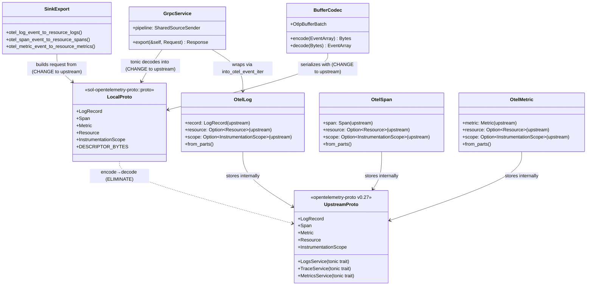

# OTLP Proto Unification — Tasks

Design: [DESIGN.md](./DESIGN.md)

## Analysis

Build: `cargo check` — verified green
Test: `cargo test -p sol --lib sources::opentelemetry` — (pending)
Lint: `cargo clippy` — (pending)

### Domain model

### Requirement traceability

| Type / Fn | Addresses | Notes |
|---|---|---|
| `into_otel_event_iter()` (logs/spans/metrics.rs) | [FR1](./DESIGN.md#fr1) | Delete proto_convert_*, wrap upstream types directly |
| `GrpcService` (grpc.rs) | [FR1](./DESIGN.md#fr1) | Import upstream service traits instead of local |
| `otel_*_event_to_resource_*()` (sinks/grpc.rs) | [FR2](./DESIGN.md#fr2) | Build requests from upstream types directly |
| `OtlpBufferBatch` (buffer_codec.rs) | [FR3](./DESIGN.md#fr3) | Use upstream proto types |
| `DESCRIPTOR_BYTES` (build.rs, proto.rs) | [FR4](./DESIGN.md#fr4) | Keep generation, remove Rust type generation |

### Transformations

| Function | Input → Output | Invariant / Rule |
|---|---|---|
| `ResourceLogs::into_otel_event_iter` | `ResourceLogs → impl Iterator<Item=Event>` | Zero encode-decode. Wrap upstream LogRecord directly in OtelLog::from_parts. |
| `ResourceSpans::into_otel_event_iter` | `ResourceSpans → impl Iterator<Item=Event>` | Zero encode-decode. Wrap upstream Span directly in OtelSpan::from_parts. |
| `ResourceMetrics::into_otel_event_iter` | `ResourceMetrics → impl Iterator<Item=Event>` | Zero encode-decode. Wrap upstream Metric directly in OtelMetric::from_parts. |
| `otel_log_event_to_resource_logs` | `&OtelLog → ResourceLogs` | Zero encode-decode. Extract upstream types directly from event. |
| `otel_span_event_to_resource_spans` | `&OtelSpan → ResourceSpans` | Zero encode-decode. Extract upstream types directly from event. |
| `otel_metric_event_to_resource_metrics` | `&OtelMetric → ResourceMetrics` | Zero encode-decode. Extract upstream types directly from event. |

### gRPC stack configuration (prior work — grpc-perf)

These optimizations are already implemented. Documented here for completeness — the combination with proto unification targets 45x total improvement over original baseline.

| Configuration | Location | Effect | Status |
|---|---|---|---|
| `TCP_NODELAY` | `lib/sol-core/src/tls/incoming.rs` | Disables Nagle's algorithm (~40ms delay eliminated) | ✅ Done |
| `http2_adaptive_window(true)` | `src/sources/util/grpc/mod.rs` | BDP estimation, dynamic window growth | ✅ Done |
| `initial_stream_window_size(1MB)` | `src/sources/util/grpc/mod.rs` | Larger per-stream flow control window | ✅ Done |
| `initial_connection_window_size(2MB)` | `src/sources/util/grpc/mod.rs` | Larger connection-level flow control window | ✅ Done |
| `http2_keepalive_interval(10s)` | `src/sources/util/grpc/mod.rs` | Prevents idle connection drops | ✅ Done |
| `http2_keepalive_timeout(20s)` | `src/sources/util/grpc/mod.rs` | Timeout for keepalive pings | ✅ Done |
| Remove DecompressionAndMetrics layer | `src/sources/util/grpc/mod.rs` | Eliminated mpsc+StreamBody+select per request | ✅ Done |
| SharedSourceSender | `lib/sol-core/src/source_sender/sender.rs` | Per-output lock, no clone per request | ✅ Done |

### Tonic upgrade (investigation — future work)

Sol uses tonic 0.12.3. A tonic upgrade may bring h2/hyper performance improvements (better frame multiplexing, reduced per-stream overhead). This is **not in scope** for this workspace — it requires upstream `opentelemetry-proto` crate compatibility and is tracked separately. Proto unification makes a future tonic upgrade easier by reducing the number of proto crate dependencies.

## Tasks

### 1. Switch gRPC source to upstream proto service traits ([FR1](./DESIGN.md#fr1), [NFR1](./DESIGN.md#nfr1))

**Goal**: Eliminate 3 encode-decode round-trips per event at source ingestion by using upstream proto types for tonic gRPC services.

**Types**: `into_otel_event_iter()` (logs.rs, spans.rs, metrics.rs), `Service` (grpc.rs), config.rs

**Constraints**:
- [ADR: proto-canonical-source](./adrs/proto-canonical-source.md) — Option A: upstream as canonical
- gRPC service traits must be imported from `upstream_opentelemetry_proto::tonic::collector::*`
- `into_otel_event_iter()` must be reimplemented on upstream `ResourceLogs`/`ResourceSpans`/`ResourceMetrics` types (extension trait or free function)
- `OtelLog::from_parts()`, `OtelSpan::from_parts()`, `OtelMetric::from_parts()` signatures unchanged — they already accept upstream types
- Delete all `proto_convert_resource`, `proto_convert_scope`, `proto_convert_span`, `proto_convert_log_record`, `proto_convert_metric` functions
- HTTP source path also calls `into_otel_event_iter()` — must work for both gRPC and HTTP
- HTTP source decodes with `prost::Message::decode()` — must decode into upstream types (change `ExportLogsServiceRequest` import)
- `sources::vector` module also uses OTLP service traits — must be updated

**Tests**:
- Existing `otel_log_event_iter_*` and `otel_event_iter_*` tests must pass (same behavior, no conversion)
- `test_uncompressed_grpc_request_succeeds` — gRPC requests still processed correctly
- `test_compressed_grpc_request_decompresses` — gzip still works via tonic built-in

**Verify**: `cargo test -p sol --lib sources::opentelemetry && cargo test -p sol-opentelemetry-proto && cargo clippy`

**Acceptance criteria**:
- [ ] No `proto_convert_*` functions exist in logs.rs, spans.rs, metrics.rs
- [ ] No `encode_to_vec()` + `decode()` round-trips in source ingestion path
- [ ] gRPC service traits imported from upstream crate
- [ ] `into_otel_event_iter()` wraps upstream types directly via `from_parts()`
- [ ] HTTP source uses upstream types for `prost::Message::decode()`
- [ ] `sources::vector` compiles and works
- [ ] Existing tests pass

**Depends on**: (none)
**Time-box**: ~90 min

### 2. Switch sink export to upstream proto types ([FR2](./DESIGN.md#fr2))

**Goal**: Eliminate 3 encode-decode round-trips per event at sink export by building OTLP requests directly from upstream types stored in events.

**Types**: `otel_*_event_to_resource_*()` in `sinks/opentelemetry/grpc.rs`, `collection_into_request()`

**Constraints**:
- [ADR: proto-canonical-source](./adrs/proto-canonical-source.md) — Option A: upstream as canonical
- `otel_log_event_to_resource_logs()` must build `ResourceLogs` from `log_event.record_to_proto()`, `log_event.resource_proto()`, `log_event.scope_proto()` — all already return upstream types
- Same pattern for spans and metrics
- `ExportLogsServiceRequest`, `ExportMetricsServiceRequest`, `ExportTraceServiceRequest` must be imported from upstream crate
- gRPC client stubs must also use upstream types
- HTTP sink also builds export requests — must be updated

**Tests**:
- Existing sink tests must pass
- Round-trip test: source → sink produces identical proto output

**Verify**: `cargo test -p sol --lib sinks::opentelemetry && cargo clippy`

**Acceptance criteria**:
- [ ] No `encode_to_vec()` + `decode()` round-trips in sink export path
- [ ] `otel_*_event_to_resource_*()` build requests directly from upstream types
- [ ] gRPC sink client uses upstream types
- [ ] HTTP sink uses upstream types
- [ ] Existing tests pass

**Depends on**: task 1
**Time-box**: ~60 min

### 3. Switch buffer codec to upstream proto types ([FR3](./DESIGN.md#fr3), [NFR3](./DESIGN.md#nfr3))

**Goal**: Use upstream proto types in `OtlpBufferBatch` so disk buffer encode/decode avoids proto round-trips.

**Types**: `OtlpBufferBatch`, `batch_to_event_array()`, encode functions in `buffer_codec.rs`

**Constraints**:
- [ADR: proto-canonical-source](./adrs/proto-canonical-source.md) — Option A: upstream as canonical
- `OtlpBufferBatch` fields must use upstream `ExportLogsServiceRequest`, `ExportMetricsServiceRequest`, `ExportTraceServiceRequest`
- Wire format is identical (same `.proto` source) — existing disk buffers must decode correctly
- `batch_to_event_array()` calls `into_otel_event_iter()` which is already updated in task 1
- Encode functions (`otel_logs_to_export`, etc.) must build upstream types

**Tests**:
- `test_buffer_codec_round_trip` — encode → decode preserves all event fields
- `test_wire_format_compatibility` — bytes encoded with local types decode correctly with upstream types

**Verify**: `cargo test -p sol-opentelemetry-proto && cargo clippy`

**Acceptance criteria**:
- [ ] `OtlpBufferBatch` uses upstream proto types
- [ ] No encode-decode round-trips in buffer codec path
- [ ] Wire-format compatibility verified (round-trip test)
- [ ] Existing buffer codec tests pass

**Depends on**: task 1
**Time-box**: ~60 min

### 4. Trim build.rs — DESCRIPTOR_BYTES only ([FR4](./DESIGN.md#fr4))

**Goal**: Stop generating Rust types from local `.proto` files. Keep only `DESCRIPTOR_BYTES` generation for reflection-based codecs.

**Types**: `build.rs`, `proto.rs` in `sol-opentelemetry-proto`

**Constraints**:
- `DESCRIPTOR_BYTES` must still be generated and accessible via `sol_opentelemetry_proto::proto::DESCRIPTOR_BYTES`
- `build.rs` should use `build_server(false).build_client(false)` — or switch to `prost_build` directly if tonic_build still generates unused Rust files
- `proto.rs` should only re-export `DESCRIPTOR_BYTES` and message type constants — remove all `tonic::include_proto!` module re-exports
- Verify codecs still work with `DESCRIPTOR_BYTES`
- Clean up `otel-proto-types` crate if fully unused after this change

**Tests**:
- OTLP encoder/decoder tests in `lib/codecs/` must pass
- `DESCRIPTOR_BYTES` must produce valid file descriptor set

**Verify**: `cargo test -p sol-codecs --lib encoding::format::otlp && cargo test -p sol-codecs --lib decoding::format::otlp && cargo clippy`

**Acceptance criteria**:
- [ ] `build.rs` does not generate Rust data types (only descriptor bytes)
- [ ] `proto.rs` only exports `DESCRIPTOR_BYTES` and constants
- [ ] No `tonic::include_proto!` calls in `proto.rs` (except for descriptor)
- [ ] OTLP encoder/decoder tests pass
- [ ] `otel-proto-types` crate removed or emptied if unused

**Depends on**: tasks 1, 2, 3
**Time-box**: ~45 min

### 5. Benchmark validation ([NFR1](./DESIGN.md#nfr1), [NFR2](./DESIGN.md#nfr2))

**Goal**: Verify proto unification closes the remaining gap with otelcol and causes no regressions.

**Constraints**:
- Must run: `noop-logs-grpc-10k`, `noop-metrics-grpc-10k`, `noop-traces-grpc-10k`, `noop-logs-http-10k`, `noop-logs-grpc-10k-gzip`
- Unbatched logs gRPC must reach ≥95% of otelcol (≥3,650/s)
- Unbatched metrics gRPC must reach ≥95% of otelcol (≥3,950/s)
- Traces, HTTP, gzip must not regress

**Verify**: `cd demo/benchmark && bash run.sh --scenario noop-logs-grpc-10k --duration 30`

**Acceptance criteria**:
- [ ] `noop-logs-grpc-10k` ≥ 3,650/s (≥95% of otelcol 3,844/s)
- [ ] `noop-metrics-grpc-10k` ≥ 3,950/s (≥95% of otelcol 4,153/s)
- [ ] `noop-traces-grpc-10k` ≥ 14,000/s (no regression)
- [ ] `noop-logs-http-10k` ≥ 4,200/s (no regression)
- [ ] `noop-logs-grpc-10k-gzip` ≥ 2,000/s (no regression)

**Depends on**: tasks 1, 2, 3, 4
**Time-box**: ~30 min

## Sessions

### Session 1 — Proto unification (~3H)
Tasks: 1, 2, 3, 4
**Skills**: (standard Rust)
**Checkpoint**: `cargo test -p sol --lib sources::opentelemetry && cargo test -p sol --lib sinks::opentelemetry && cargo test -p sol-opentelemetry-proto && cargo test -p sol-codecs --lib encoding::format::otlp && cargo test -p sol-codecs --lib decoding::format::otlp && cargo clippy`
**Commit point**: yes

### Session 2 — Benchmark validation (~30 min)
Tasks: 5
**Skills**: (none)
**Checkpoint**: benchmark results show targets met
**Commit point**: yes — commit benchmark results

## Quality gates (post-session review)
- [ ] Acceptance criteria: all green above
- [ ] Code review: implementation matches [DESIGN.md](./DESIGN.md) intent
- [ ] Code organization: changes are minimal and focused
- [ ] Code quality: no new complexity, clean types
- [ ] Performance: benchmark targets met per [NFR1](./DESIGN.md#nfr1), no regressions per [NFR2](./DESIGN.md#nfr2)
