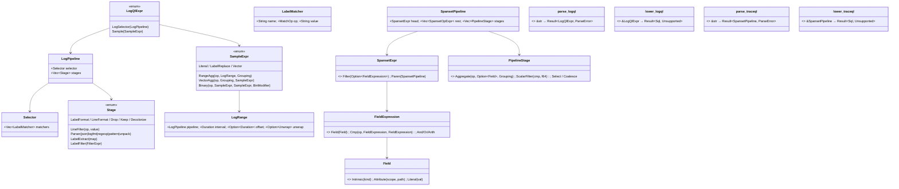

# query-parsers — Tasks

Design: [DESIGN.md](./DESIGN.md) · ADR: [parser-strategy](./adrs/parser-strategy.md)

## Analysis

Build: `cargo build --features query-backend` — green (baseline this session)
Test: `cargo test --features query-backend --lib query::` — green (~131 tests)
Lint: `cargo clippy --features query-backend -- -D warnings` — green
Per-module test filters: `… --lib query::logql`, `query::traceql`, `query::loki`, `query::tempo`.

### Known-failing tests
| Test | Reason | Action |
|---|---|---|
| (none) | clean baseline | — |

### Dependencies (no new external crate — NFR2)
| Crate | Version | Role | Already present? |
|---|---|---|---|
| `lrpar` | (as pinned by `promql-parser`) | LALR parser runtime | ✅ via `promql-parser` (Cargo.lock) |
| `lrlex` | same | lexer runtime | ✅ |
| `cfgrammar` | same | grammar/build support | ✅ |
| `serde_json` | existing | JSON attr handling in lowering | ✅ |

Upstream grammar sources to port (pin commit at port time):
- LogQL: `grafana/loki` → `pkg/logql/syntax/expr.y` + `lex.go`
- TraceQL: `grafana/tempo` → `pkg/traceql/expr.y` + `lexer.go`

### Domain model

### Requirement traceability
| Type / Fn | Addresses | Notes |
|---|---|---|
| `LogQlExpr`, `LogPipeline`, `Selector`, `LabelMatcher`, `Stage`, `SampleExpr`, `LogRange` | [FR1](./DESIGN.md#fr1) | LogQL AST; node names mirror Loki `expr.y` |
| `SpansetPipeline`, `SpansetExpr`, `FieldExpression`, `Field`, `PipelineStage` | [FR2](./DESIGN.md#fr2) | TraceQL AST; node names mirror Tempo `expr.y` |
| `parse_logql` | [FR1](./DESIGN.md#fr1), [FR7](./DESIGN.md#fr7), [NFR3](./DESIGN.md#nfr3) | grmtools-generated; never panics |
| `lower_logql` | [FR3](./DESIGN.md#fr3), [NFR3](./DESIGN.md#nfr3) | supported subset → SQL; deferred → `Unsupported` |
| `parse_traceql` | [FR2](./DESIGN.md#fr2), [FR7](./DESIGN.md#fr7), [NFR3](./DESIGN.md#nfr3) | grmtools-generated; never panics |
| `lower_traceql` | [FR4](./DESIGN.md#fr4), [NFR3](./DESIGN.md#nfr3) | supported subset → SQL; deferred → `Unsupported` |
| `ParseError`, `Unsupported` | [FR7](./DESIGN.md#fr7) | structured errors → HTTP 400 |
| grammar files pin upstream commit | [NFR1](./DESIGN.md#nfr1) | re-sync procedure in file header |

### Transformations
| Function | Input → Output | Invariant / Rule |
|---|---|---|
| `parse_logql` | `&str → Result<LogQlExpr, ParseError>` | Never panics; accepts the full grammar (FR1); error carries position |
| `lower_logql` | `&LogQlExpr → Result<String, Unsupported>` | SQL-escaped values; parity with current SQL for the existing subset (FR5); deferred features → `Unsupported`, never wrong SQL |
| `parse_traceql` | `&str → Result<SpansetPipeline, ParseError>` | Never panics; accepts full grammar (FR2) |
| `lower_traceql` | `&SpansetPipeline → Result<String, Unsupported>` | SQL-escaped; parity for existing subset; deferred → `Unsupported` |

---

## Coverage matrix — the gap (FR6)

Legend: ✅ now · 🅿 target *parse* · 🅛 target *lower* this plan · ⛔ deferred (non-goal, reason).
"now" = behaviour of today's ad-hoc parser.

### LogQL
**Status (Session 1, Tasks 1–5 shipped):** the grammar parser is **complete** for
every row below except binary `on/ignoring/group_left/right` modifiers (parsed as
bare operators only — a later slice). Lowering is wired into `translate_query_range`
/ `handle_volume` / `series` / `index` **at parity**: selector matchers + line
filters (`|= != |~ !~`) lower; all other stages and metric/binary lowering are
parsed but return a clear "not yet supported" error (Task 6 widens lowering).

| Feature | now | parse | lower | Notes / blocker |
|---|:--:|:--:|:--:|---|
| `{matchers}` `= != =~ !~` (anchored) | ✅ | 🅿 | 🅛 | parity |
| Line filters `\|= != \|~ !~`, empty backtick no-op | ✅ | 🅿 | 🅛 | parity |
| `\|>` / `!>` pattern line filters | ❌ | 🅿 | 🅛 | LIKE-translatable |
| `or`-composed line filters | ❌ | 🅿 | 🅛 | OR of LIKE/regex |
| `count_over_time` + `sum by(level)` volume → matrix | ✅ | 🅿 | 🅛 | parity (the demo shape) |
| range aggs `rate/bytes_*/avg/min/max/sum/quantile_over_time` | ❌ | 🅿 | 🅛 | reuse Prom matrix builders |
| vector aggs `sum/avg/count/min/max/topk/bottomk/sort` | partial | 🅿 | 🅛 | generalise current `sum by` |
| binary ops on metric exprs (`/ - * + cmp`, on/ignoring/group) | ❌ | 🅿 | 🅛 | reuse PromQL combine logic |
| label filter (static, on stored cols) `\| svc="x"` | ❌ | 🅿 | 🅛 | WHERE on promoted/`prom_attr` |
| `\| json` / `\| logfmt` (no new labels used downstream) | ❌ | 🅿 | 🅛 | no-op if extracted labels unused |
| label filter on **runtime-extracted** labels | ❌ | 🅿 | ⛔ | needs row-pipeline executor (non-goal) |
| `\| label_format` (rename/template) | ❌ | 🅿 | ⛔ | per-row templating (non-goal) |
| `\| line_format "…"` | ❌ | 🅿 | ⛔ | Go-template eval per row (non-goal) |
| `\| drop` / `\| keep` / `\| decolorize` | ❌ | 🅿 | 🅛 | column projection / passthrough |
| `\| unwrap` (metric over a label value) | ❌ | 🅿 | 🅛 | unwrap a numeric label into `v` |

### TraceQL
| Feature | now | parse | lower | Notes / blocker |
|---|:--:|:--:|:--:|---|
| `{ a = b }`, `{ a != b }` | ✅ | 🅿 | 🅛 | parity |
| `&&` within a spanset | ✅ | 🅿 | 🅛 | parity (AND of preds) |
| `\|\|` within a spanset | ❌ | 🅿 | 🅛 | OR of preds |
| comparison `> < >= <= =~ !~` on fields | ❌ | 🅿 | 🅛 | numeric/regex preds |
| arithmetic in field expr (`duration > 1s + 2s`) | ❌ | 🅿 | 🅛 | constant-fold to literal |
| intrinsics `name status kind duration` + scoped attrs | partial | 🅿 | 🅛 | extend current `traceql_lhs` |
| scopes `event. instrumentation. link. parent.*` | ❌ | 🅿 | partial | `event/link` in JSON cols if present; `parent.*` ⛔ |
| structural `>> << ~` and `! / &` variants | ❌ | 🅿 | ⛔ | recursive span-tree joins (non-goal) |
| pipeline `\| count()/avg()/…  cmp scalar`, `by(...)` | ❌ | 🅿 | partial | per-trace aggregates lowerable; cross-spanset ⛔ |
| `select(...)`, `coalesce()`, `compare()` | ❌ | 🅿 | ⛔ | result-shaping; revisit later |
| metrics `rate()/*_over_time()/topk/bottomk` | ❌ | 🅿 | ⛔ | TraceQL-metrics, separate effort |

This matrix is updated as lowering lands (Task 15 finalises it).

---

## Tasks

### 1. grmtools scaffold + LogQL selector parse ([FR1](./DESIGN.md#fr1), [NFR2](./DESIGN.md#nfr2))
**Goal**: Stand up the grmtools build pipeline and parse a `{matchers}` selector into AST.
**Types**: `LogQlExpr`, `LogPipeline`, `Selector`, `LabelMatcher` — see domain model
**Constraints**: [ADR](./adrs/parser-strategy.md) grmtools; grammar header pins Loki `expr.y` commit (NFR1); no new dep (NFR2).
**Tests**: `test_logql_parse_selector_matchers` (all 4 ops → AST), `test_logql_parse_rejects_unterminated` (Err, no panic).
**Verify**: `cargo test --features query-backend --lib query::logql`
**Acceptance**: [ ] build.rs codegen wired; [ ] selector parses to AST; [ ] malformed input → `ParseError`, no panic.
**Depends on**: (none) **Time-box**: ~90 min

### 2. LogQL pipeline parse (line filters, parser stages, label filter, format/drop/keep) ([FR1](./DESIGN.md#fr1))
**Goal**: Parse the full log-query pipeline grammar into `Vec<Stage>`.
**Types**: `Stage`, `FilterExpr`
**Constraints**: faithful to `expr.y` pipeline rules; `or`-composed line filters; empty backtick no-op preserved.
**Tests**: parse each stage kind; `test_logql_parse_pipeline_chain` (`{…} |= "a" | json | lvl="x" | line_format "…"`).
**Verify**: `cargo test --features query-backend --lib query::logql`
**Acceptance**: [ ] every Stage variant parses; [ ] chained pipeline parses in order.
**Depends on**: 1 **Time-box**: ~90 min

### 3. LogQL SampleExpr parse (range/vector aggs, binary, grouping) ([FR1](./DESIGN.md#fr1))
**Goal**: Parse metric queries into `SampleExpr` with correct operator precedence.
**Types**: `SampleExpr`, `LogRange`, `Grouping`, `BinModifier`
**Constraints**: port precedence/associativity 1:1 (rabbit hole); cover the demo volume shape.
**Tests**: `test_logql_parse_volume_shape`, `test_logql_parse_binary_precedence` (`a/b + c` groups correctly).
**Verify**: `cargo test --features query-backend --lib query::logql`
**Acceptance**: [ ] range+vector aggs parse with grouping; [ ] binary precedence matches upstream.
**Depends on**: 2 **Time-box**: ~90 min

### 4. LogQL lowering at parity + wire entry points ([FR3](./DESIGN.md#fr3), [FR5](./DESIGN.md#fr5), [NFR5](./DESIGN.md#nfr5))
**Goal**: Lower the current subset (selector + line filters + volume) and route `translate_query_range`/`handle_volume` through parse→lower; keep all `query::loki` tests green.
**Types**: `lower_logql`, `Unsupported`
**Constraints**: SQL-escaping preserved (NFR3); identical results to current SQL for the subset; deferred features → `Unsupported`.
**Tests**: existing `query::loki` suite unchanged & green; `test_logql_lower_unsupported_is_error` (a deferred feature → Err, not panic/wrong SQL).
**Verify**: `cargo test --features query-backend --lib query::loki && cargo test --features query-backend --lib query::logql`
**Acceptance**: [ ] `query::loki` green unchanged; [ ] entry points use the parser; [ ] deferred → clear error.
**Depends on**: 3 **Time-box**: ~90 min

### 5. LogQL error path + no-panic property test + matrix v1 ([FR6](./DESIGN.md#fr6), [FR7](./DESIGN.md#fr7), [NFR3](./DESIGN.md#nfr3))
**Goal**: Surface `ParseError` as HTTP 400 via routes; prove no input panics; publish the LogQL coverage matrix.
**Tests**: `test_logql_parse_never_panics` (property over random + adversarial strings); route test: malformed LogQL → 400 JSON error.
**Verify**: `cargo test --features query-backend --lib query::logql && cargo test --features query-backend --lib query::routes`
**Acceptance**: [ ] property test green; [ ] 400 on parse error; [ ] LogQL matrix rows marked parse-✅ where landed.
**Depends on**: 4 **Time-box**: ~60 min

### 6. LogQL lowering — widen ([FR3](./DESIGN.md#fr3))
**Goal**: Lower the lowerable LogQL features (pattern/`or` line filters, static label filters, drop/keep, range aggs → matrix, vector aggs incl topk, metric binary ops, unwrap); `Unsupported` for the ⛔ rows.
**Constraints**: reuse PromQL matrix builders & binary-op combine where applicable; never silently-wrong for dynamic-label pipelines.
**Tests**: one lowering test per newly-supported row (SQL/result assertion); `test_logql_dynamic_label_pipeline_unsupported`.
**Verify**: `cargo test --features query-backend --lib query::logql`
**Acceptance**: [ ] each 🅛 LogQL row has a green lowering test; [ ] ⛔ rows return `Unsupported`.
**Depends on**: 5 **Time-box**: ~90 min

### 7. grmtools TraceQL scaffold + spanset/field parse at parity ([FR2](./DESIGN.md#fr2))
**Goal**: Stand up the TraceQL grammar/lexer (incl. attribute-path/duration scan modes) and parse `{ FieldExpression }` with `&&`, intrinsics + scoped attrs, `= !=`.
**Types**: `SpansetPipeline`, `SpansetExpr`, `FieldExpression`, `Field`
**Constraints**: replicate Tempo lexer modes faithfully (rabbit hole); header pins Tempo `expr.y` commit (NFR1).
**Tests**: `test_traceql_parse_parity_cases` (today's `{a="x" && b!="y"}`), `test_traceql_parse_empty_set` (`{}`).
**Verify**: `cargo test --features query-backend --lib query::traceql`
**Acceptance**: [ ] parity cases parse to AST; [ ] attribute paths + durations lex correctly.
**Depends on**: 1 **Time-box**: ~90 min

### 8. TraceQL lowering at parity + wire entry point ([FR4](./DESIGN.md#fr4), [FR5](./DESIGN.md#fr5))
**Goal**: Lower the current subset and route `translate_search` through parse→lower; keep `query::tempo` green.
**Types**: `lower_traceql`, `Unsupported`
**Constraints**: SQL-escaping preserved; identical results for the subset; deferred → `Unsupported`.
**Tests**: existing `query::tempo` suite unchanged & green; `test_traceql_lower_unsupported_is_error`.
**Verify**: `cargo test --features query-backend --lib query::tempo && cargo test --features query-backend --lib query::traceql`
**Acceptance**: [ ] `query::tempo` green unchanged; [ ] entry point uses parser; [ ] deferred → clear error.
**Depends on**: 7 **Time-box**: ~90 min

### 9. TraceQL full field-expression + operators parse ([FR2](./DESIGN.md#fr2))
**Goal**: Parse comparison (`> < >= <= =~ !~`), arithmetic, `||`, parens, all scopes, spanset operators (`>> << ~` + `! / &` variants), and the pipeline (aggregates, `by`, scalar filters, select/coalesce) with correct precedence.
**Tests**: `test_traceql_parse_operators_precedence`, `test_traceql_parse_pipeline_aggregate`, `test_traceql_parse_structural_ops`.
**Verify**: `cargo test --features query-backend --lib query::traceql`
**Acceptance**: [ ] all grammar constructs parse; [ ] precedence matches upstream.
**Depends on**: 8 **Time-box**: ~90 min

### 10. TraceQL lowering — widen + matrix finalise ([FR4](./DESIGN.md#fr4), [FR6](./DESIGN.md#fr6))
**Goal**: Lower the lowerable TraceQL rows (`||`, comparisons, regex, arithmetic-fold, intrinsics+span/resource attrs, single-spanset per-trace aggregates); `Unsupported` for structural ops, `parent.*`, select/coalesce/compare, TraceQL-metrics.
**Tests**: one lowering test per 🅛 row; `test_traceql_structural_op_unsupported`, `test_traceql_metrics_unsupported`.
**Verify**: `cargo test --features query-backend --lib query::traceql && cargo test --features query-backend --lib query::tempo`
**Acceptance**: [ ] each 🅛 TraceQL row has a green test; [ ] ⛔ rows return `Unsupported`; [ ] matrix updated.
**Depends on**: 9 **Time-box**: ~90 min

### 11. Hardening + gap finalisation ([FR6](./DESIGN.md#fr6), [FR7](./DESIGN.md#fr7), [NFR3](./DESIGN.md#nfr3))
**Goal**: No-panic property tests for TraceQL; finalise both coverage matrices; cross-check against the demo dashboards; update CONFORMANCE.md references.
**Tests**: `test_traceql_parse_never_panics`; route test: malformed TraceQL → 400.
**Verify**: `cargo test --features query-backend --lib query:: && cargo clippy --features query-backend -- -D warnings`
**Acceptance**: [ ] full `query::` suite green; [ ] clippy clean; [ ] matrices reflect shipped state; [ ] CONFORMANCE cross-linked.
**Depends on**: 6, 10 **Time-box**: ~60 min

## Sessions

### Session 1 — LogQL parser + parity (~3H)
Tasks: 1, 2, 3, 4, 5
**Skills**: `rust-software-engineer`
**Checkpoint**: `cargo test --features query-backend --lib query::loki && cargo test --features query-backend --lib query::logql && cargo test --features query-backend --lib query::routes && cargo clippy --features query-backend -- -D warnings`
**Commit point**: yes

### Session 2 — LogQL lowering widen (~1.5H)
Tasks: 6
**Skills**: `rust-software-engineer`
**Checkpoint**: `cargo test --features query-backend --lib query::logql && cargo clippy --features query-backend -- -D warnings`
**Commit point**: yes

> ⏸ **Sessions 3–4 are gated.** Per the accepted scope decision, start TraceQL
> only after a payoff review of the LogQL sessions (1–2). Do not auto-proceed.

### Session 3 — TraceQL parser + parity (~3H) — ⏸ gated on LogQL payoff review
Tasks: 7, 8, 9
**Skills**: `rust-software-engineer`
**Checkpoint**: `cargo test --features query-backend --lib query::tempo && cargo test --features query-backend --lib query::traceql && cargo clippy --features query-backend -- -D warnings`
**Commit point**: yes

### Session 4 — TraceQL lowering widen + hardening + gap finalise (~2.5H) — ⏸ gated
Tasks: 10, 11
**Skills**: `rust-software-engineer`
**Checkpoint**: `cargo test --features query-backend --lib query:: && cargo clippy --features query-backend -- -D warnings`
**Commit point**: yes

## Quality gates (post-session review)
- [ ] Acceptance criteria: all green above
- [ ] Code review: parsers faithful to upstream `expr.y`; AST node names mirror upstream
- [ ] Code organization: `logql/` & `traceql/` modules; `loki.rs`/`tempo.rs` keep only handlers/response-shaping
- [ ] Code quality: no duplication of lowering logic that PromQL already has (reuse)
- [ ] Security: SQL-escaping preserved; no-panic property tests pass (NFR3)
- [ ] Observability: parse errors counted via existing request metric; HTTP 400 on parse failure
- [ ] Performance: parse+lower negligible vs SQL exec (NFR4); no grammar ambiguity blow-ups
- [ ] Docs: coverage matrix (FR6) reflects shipped state; NFR1 re-sync header in each grammar file

## Uncertainty (hill chart)
- Tasks 1, 4, 5, 6, 8 — **downhill** (mechanics understood: grammar scaffold, parity lowering reuses existing SQL builders).
- Tasks 2, 3, 7, 9 — **downhill but watch precedence** (goyacc→grmtools `%prec` port is the known rabbit hole; capped in DESIGN).
- Task 10 — **downhill** for the 🅛 rows; ⛔ rows are explicit non-goals, so no uphill remains.
- No task is uphill. The two genuine unknowns (structural-op lowering, dynamic-label pipelines) are scoped **out** as non-goals, so they cannot stall autopilot.

## Pre-flight gate (Phase 4c) — to confirm before Phase 5
- [ ] ADR [parser-strategy](./adrs/parser-strategy.md) accepted (status draft → accepted)
- [ ] Baseline build/test/lint green (run now)
- [ ] grmtools `build.rs` codegen pattern confirmed against `promql-parser`'s setup
- [ ] Upstream `expr.y` commits chosen to pin
