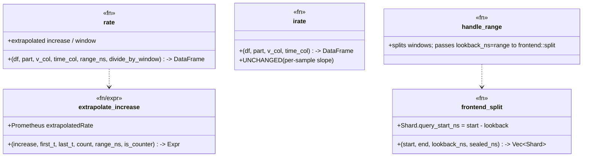

# range-rate-parity — Tasks

Design: [DESIGN.md](./DESIGN.md)

## Analysis

Build: `cargo build -p sol --features querier-backend --lib` — (verify at session start)
Test: `cargo test -p sol --features querier-backend --lib querier::` — baseline **214 passed, 0 failed, 1 ignored** at HEAD `059bbf9d2` (last rollup-read-routing checkpoint; re-confirm at pre-flight)
Lint: `cargo clippy -p sol --features querier-backend --lib` — clean (`#![deny(warnings)]` at `src/lib.rs:7`)

### Known-failing tests
| Test | Reason | Action |
|---|---|---|
| (none at baseline) | — | — |

### Read-path inventory (Phase 4a)
- **`rate()`** `src/querier/plan/frame.rs:174-227` — per-sample reset-adjusted delta via `lag`, `SUM(delta)` over the `RANGE BETWEEN range_ns PRECEDING AND CURRENT ROW` frame (`ns(time_col)` = `cast(time,Int64)`), divided by **fixed** `range_ns/1e9` when `divide_by_window`. Comment `:165-170` explicitly documents the missing extrapolation as a deferred follow-up.
- **`increase()`** = `rate(divide_by_window=false)` (same body, no divisor).
- **`irate()`** `frame.rs:112-147` — per-sample slope from the last two samples; **not** extrapolated, **unchanged** by this work.
- **`over_time()`/`over_time_ratio()`** `frame.rs:235-312` — same RANGE frame; **not** changed.
- **Value column**: `rate` reads coalesced `v` = `metric_value_expr(name)` (`prometheus.rs:161-175`) — last cumulative counter, identical on raw and tier (rollup keeps last-per-bucket cumulative), so extrapolation works uniformly across tier/raw.
- **Range call sites**: `handle_range:~2174` → `eval_range_window:~2853` → `lower_range_df:393-409` (`rate`/`increase`/`irate` on per-shard `[s,e]`).
- **Frontend split**: `handle_range:2209-2228` calls `frontend::split(lo, hi, 0, hi)` — `lookback_ns = 0`; `frontend::split` (`frontend.rs:39-59`) computes `query_start_ns = cursor − lookback_ns` but the range path ignores it and scans `[shard.start, shard.end]` (`metric_base_df` filters `prom_time_between(start,end)` `:209`). `test_rate_shards_overlap_by_lookback` (`frontend.rs:139`) already asserts the lookback semantics.
- **Instant path (reference, already correct)**: `instant_range_windows` uses `lag_margin = range` for `is_lag_range_op` (rate/increase/irate) → scans `[anchor − 2·range, anchor]`; `instant_leaf_frame:572-616` unions windows before the single rate pass.

### Tests affected (Phase 4a)
Non-extrapolated numeric asserts → **update to extrapolated expectation**: `test_rate_is_windowed_average_over_the_range` (frame.rs:416), `test_increase_is_windowed_sum_without_dividing` (431), `test_rate_executes_and_computes_values` (prometheus.rs:3633), `test_rate_is_windowed_not_irate` (3713), `test_range_sum_rate_over_offset_series_matches_sum_of_rates` (3811), `test_range_sum_by_host_rate_keeps_two_series` (3854), `test_rate_over_rollup_matches_raw` (rollup.rs:413).
Parity-critical (stay coupled; `|instant−range|<1e-6` still holds, values shift): `test_instant_rate_matches_range_rate` (5751), `test_instant_increase_matches_range_increase` (5785), `test_instant_sum_rate_matches_range_multiseries` (5893), `test_instant_sum_rate_by_label_matches_range` (5918).
Unchanged: `test_irate_is_per_sample_slope_unchanged`.
Reusable fixtures: `counter_engine` (3 samples), `bursty_counter_engine`, `offset_counter_engine`, `monotonic_counter_engine` (41 samples/10m/15s), `offset_multiseries_engine`.

### Domain model

### Requirement traceability
| Type / Fn | Addresses | Notes |
|---|---|---|
| `rate` (+ `extrapolate_increase`) | [FR1](./DESIGN.md#fr1) | Prometheus extrapolation on the reset-adjusted windowed increase |
| `increase` (`rate` w/o divisor) | [FR1](./DESIGN.md#fr1) | Same extrapolation, no window divisor |
| `handle_range` + `frontend::split` + `eval_range_window`/`metric_base_df` window flow | [FR2](./DESIGN.md#fr2) | Wire `lookback_ns=range`; scan from `query_start_ns`; emit points only for `[shard.start, shard.end]` |
| instant==range parity tests | [FR3](./DESIGN.md#fr3), [NFR1](./DESIGN.md#nfr1) | Stay coupled at the extrapolated value |
| `irate` | — | Explicitly unchanged |

### Transformations
| Function | Input → Output | Invariant / Rule |
|---|---|---|
| `extrapolate_increase` | `(reset_adjusted_increase, first_t, last_t, count, range_ns, is_counter) → f64` | Prometheus `extrapolatedRate`: extrapolate to each window edge by ≤ `avg_gap/2` (`avg_gap=(last_t−first_t)/(count−1)`), capped at the edge; for a counter, clamp a start extrapolation that would imply value<0 to the zero point. Single sample (count<2) → 0. |
| `rate` | `(df,…,range_ns,divide_by_window) → DataFrame[…,v]` | `v = extrapolated_increase / (range_ns/1e9)` when `divide_by_window`, else `extrapolated_increase`. Reset handling unchanged. Smooth across the eval grid on a steady counter. |
| `handle_range` shard scan | `(lo,hi,range_ns) → Vec<(table, query_start, end)>` | Scan `[query_start=shard.start−range, shard.end]`; output points filtered to `time ∈ [shard.start, shard.end]` (no double-emit across shards). |

## Tasks

### 1. Prometheus-compatible extrapolation in rate()/increase() ([FR1](./DESIGN.md#fr1), [NFR1](./DESIGN.md#nfr1), [NFR3](./DESIGN.md#nfr3))
**Goal**: `rate`/`increase` extrapolate the windowed increase to the window boundaries (Prometheus algorithm) so range graphs are smooth and match Mimir.
**Types**: `rate`, `extrapolate_increase` — see domain model.
**Constraints**:
- [ADR: extrapolated-rate](./adrs/extrapolated-rate.md) — replicate `extrapolatedRate`; keep the existing reset-adjusted `SUM(delta)` as the base increase; layer extrapolation using `first_t`/`last_t`/`count` over the same RANGE frame.
- Add window aggregates over the existing `RANGE range_ns PRECEDING` frame: earliest/latest sample time in the window and the sample count (e.g. `min`/`max` of `ns(time)` over the frame, `count` over the frame; or FIRST_VALUE/LAST_VALUE — pick what DataFusion 53 supports cleanly).
- `irate` unchanged. `over_time`/`over_time_ratio` unchanged. No new deps.
- Invariant (transformations table): single sample → 0; counter start-extrapolation clamped at zero; `divide_by_window` divides the extrapolated increase.
**Tests** (red→green), in `frame.rs` `#[cfg(test)]`:
- `test_rate_extrapolates_to_window_edges` — a counter sampled sparsely relative to the window: assert `rate` equals the **analytic Prometheus extrapolated** value (higher than `increase/window`), not `SUM(delta)/window`.
- `test_rate_is_smooth_across_grid` — a steadily-increasing counter evaluated at successive grid points yields a near-constant rate (max |Δ| between adjacent points below a small ε) — the zigzag is gone.
- Update `test_rate_is_windowed_average_over_the_range` (416) + `test_increase_is_windowed_sum_without_dividing` (431) to the extrapolated expectations (document the new expected numbers).
- `test_irate_is_per_sample_slope_unchanged` stays green untouched.
**Verify**: `cargo test -p sol --features querier-backend --lib querier::plan::frame`
**Acceptance criteria**:
- [x] `rate`/`increase` extrapolate per the ADR; the two new tests pass; irate unchanged.
- [x] Updated frame.rs rate/increase unit tests pass with documented extrapolated values.
**Depends on**: (none)
**Time-box**: ~90 min

### 2. Range-path pre-window lookback ([FR2](./DESIGN.md#fr2), [NFR1](./DESIGN.md#nfr1), [NFR2](./DESIGN.md#nfr2))
**Goal**: every range grid point (query start + each per-day shard boundary) gets a full rate window — no left-edge ramp / boundary dips.
**Types**: `handle_range`, `frontend::split`, `eval_range_window` — see domain model.
**Constraints**:
- [FR2](./DESIGN.md#fr2): pass `lookback_ns = matrix_range_ns(expr)` to `frontend::split` (replacing the `0` at `prometheus.rs:2220`); scan each shard from its `query_start_ns`; **filter output points to `time ∈ [shard.start, shard.end]`** so the lookback region only seeds LAG/window fill and points aren't double-emitted across shards.
- Reuse the existing `Shard.query_start_ns`; do not change `frontend::split`'s signature (it already takes `lookback_ns`). `metric_base_df`'s time filter must scan `[query_start, end]`.
- Invariant (transformations): no double-emitted timestamps; a steady counter's rate at the first grid point ≈ its rate mid-range (no ramp); rate is continuous across a day boundary.
**Tests**:
- `test_range_rate_no_left_edge_ramp` — a steady counter over a range starting well after the series start: the first grid points' rate ≈ the steady-state rate (not ramping from 0); reuse `monotonic_counter_engine`.
- `test_range_rate_continuous_across_shard_boundary` — a range spanning a UTC day boundary: rate is continuous (no dip) at the boundary; assert adjacent points across the boundary are within ε.
- `test_range_rate_no_duplicate_timestamps` — the range result has no repeated grid timestamps (lookback region not emitted).
**Verify**: `cargo test -p sol --features querier-backend --lib querier::prometheus querier::frontend`
**Acceptance criteria**:
- [x] `handle_range` passes `range_ns` lookback + scans from `query_start_ns`; output filtered to the shard window.
- [x] The three tests pass; no duplicate timestamps; no left-edge ramp; boundary-continuous.
**Depends on**: 1
**Time-box**: ~75 min

### 3. Reconcile downstream tests + Sol↔Mimir golden parity ([FR3](./DESIGN.md#fr3), [NFR1](./DESIGN.md#nfr1))
**Goal**: all integration + parity tests reflect the extrapolated + lookback-corrected semantics; a golden test pins Prometheus parity.
**Constraints**:
- Update the non-extrapolated integration asserts (`test_rate_executes_and_computes_values` 3633, `test_rate_is_windowed_not_irate` 3713, `test_range_sum_rate_over_offset_series_matches_sum_of_rates` 3811, `test_range_sum_by_host_rate_keeps_two_series` 3854, `test_rate_over_rollup_matches_raw` rollup.rs:413) to the new expected values (extrapolation + lookback).
- The instant==range parity tests (5751/5785/5893/5918) must **stay green** — their `|instant−range|<1e-6` coupling still holds; only absolute sanity thresholds may shift.
- Invariant: instant and range produce the **same** extrapolated value at a given instant.
**Tests**:
- `test_rate_matches_prometheus_golden` — a known counter series (e.g. `monotonic_counter_engine`) with the **hand-computed Prometheus `extrapolatedRate`** value asserted exactly (within 1e-6) — the durable parity anchor.
- All updated integration tests green; all 4 instant==range parity tests green.
**Verify**: `cargo test -p sol --features querier-backend --lib querier:: && cargo clippy -p sol --features querier-backend --lib`
**Acceptance criteria**:
- [x] Golden test asserts the analytic Prometheus value and passes.
- [x] Every affected integration test updated + green; all 4 parity tests green; full `querier::` green; clippy clean.
**Depends on**: 1, 2
**Time-box**: ~60 min

## Sessions

### Session 1 — Extrapolation + lookback + parity (~3.75H)
Tasks: 1, 2, 3
**Skills**: `rust-software-engineer`
**Checkpoint**: `cargo test -p sol --features querier-backend --lib querier:: && cargo clippy -p sol --features querier-backend --lib` — green; rate/increase extrapolate (smooth, no zigzag); range path has pre-window lookback (no left-edge ramp / boundary dips); instant==range parity green; golden Prometheus-parity test green.
**Commit point**: yes (commit per task at its green verify, per the durability invariants)

## Quality gates (post-session review)
- [ ] Acceptance criteria: all green above
- [ ] Code review: matches [DESIGN.md](./DESIGN.md) — extrapolation on the reset-adjusted increase; irate untouched
- [ ] Code organization: extrapolation logic co-located in `frame.rs`; lookback wiring in `handle_range`/`frontend`
- [ ] Code quality: no duplication; the `frame.rs:165-170` "deferred follow-up" comment removed/updated
- [ ] Security: n/a (read-path compute; no new deps/inputs)
- [ ] Observability: rate values shift to match Prometheus; no new metrics
- [ ] Performance: no scan regression (NFR2); lookback widens the scan by ≤ one `range` per shard; **manual live check: RED dashboard rate graph is smooth (matches Mimir), zigzag gone**
