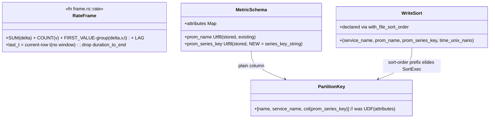

# rate-row-work — Tasks

Design: [DESIGN.md](./DESIGN.md)

## Analysis

Build: `cargo build --lib` — green baseline (HEAD after write-side-small-files integration, `d41be73e7`)
Test: `cargo test --lib querier::` — expected green 261 passed / 0 failed / 2 ignored (re-verify at pre-flight; explorer did not execute)
Lint: `make check-clippy` (`Makefile:477-479` → `vdev check rust`)

### Known-failing tests
| Test | Reason | Action |
|---|---|---|
| 2 ignored in `querier::` (1 pre-existing + demo-scale bench) | by design | ignore |
| 6 × `codecs encoding::format::json` under `-p codecs --all-features` | pre-existing, outside scope | ignore |

### Measured starting point ([promql-plan-cache VERIFY](../../20260717_promql-plan-cache/VERIFY.md) live stage means)
| Stage / probe | Now | Target |
|---|---|---|
| execute (cold rate(), live mean) | ~835 ms | the dominant cost — this workspace's target |
| physical | ~122 ms | reduced by FR3 sort elision |
| Cold repeated-shape `rate()` | ~250–420 ms | ≤ 80 ms ([NFR1](./DESIGN.md#nfr1)) |
| 20-query burst | ~2–3 s | ≤ 0.5 s ([NFR2](./DESIGN.md#nfr2)) |

### Domain model

### Requirement traceability
| Type / Fn | Addresses | Notes |
|---|---|---|
| `RateFrame` (frame.rs::rate reduced) | [FR1](./DESIGN.md#fr1) | [ADR rate-frame-reduction](./adrs/rate-frame-reduction.md); golden-gated |
| `MetricSchema.prom_series_key` | [FR2](./DESIGN.md#fr2) | [ADR series-key-column](./adrs/series-key-column.md); value = `series_key_string` |
| `PartitionKey` (plain column) | [FR2](./DESIGN.md#fr2) | drops per-row UDF in rate/sum-by/topk/over_time/rollup |
| `WriteSort` + `with_file_sort_order` | [FR3](./DESIGN.md#fr3) | declared order == codec write sort (asserted) |

### Transformations
| Function | Input → Output | Invariant / Rule |
|---|---|---|
| `frame.rs::rate` (reduced) | scan → per-row extrapolated rate | bit-identical to current within 1e-6 (all goldens/parity hold) |
| write-time `prom_series_key` | datapoint attributes → Utf8 | == `series_key_string(attributes)` (udf.rs:118-131), so read grouping unchanged |
| declared sort order | ListingOptions → elided SortExec | declared order MUST equal codec write sort exactly (mismatch = silent corruption) |

### Constraints discovered (constitution)
- Extrapolation formula meaning unchanged — only its input windows change (FR1); golden + parity suites are the hard gate.
- No custom UDWF (rabbit-hole cap); fusion is whatever DF 53 allows.
- FR2/FR3 = one clean-cutover bundle (store wipe); no dual-format read path (standing directive); logs/traces schemas untouched.
- `with_file_sort_order` correctness: assert declared == write sort; parity + reads-each-datum-once gate.
- No new dependencies; no format!-SQL outside sql.rs.

## Tasks

### 1. Reduce the rate() frame ([FR1](./DESIGN.md#fr1))
**Goal**: Fewer window passes in `frame.rs::rate`, bit-identical result.
**Constraints**: [ADR rate-frame-reduction](./adrs/rate-frame-reduction.md) — attempt full fusion (A), fall back to conservative (B) by what DF 53 fuses; drop `duration_to_end`, `last_t`→current-row `t` unconditionally; no custom UDWF.
**Tests** (the existing goldens ARE the red/green gate — they must stay green bit-for-bit; add one asserting the reduced plan has fewer window exprs than before if cheaply observable):
- frame.rs: `test_rate_is_windowed_average_over_the_range`, `test_increase_is_windowed_sum_without_dividing`, `test_rate_extrapolates_to_window_edges`, `test_rate_is_smooth_across_grid`
- prometheus.rs: `test_rate_matches_prometheus_golden`, `test_instant_rate_matches_range_rate`, `test_instant_increase_matches_range_increase`, multiseries sum-rate parity
**Verify**: `cargo test --lib querier:: && make check-clippy`
**Acceptance criteria**:
- [x] All named goldens/parity green bit-for-bit (262/0/2); window passes 7→6 (frame node 6→5): dropped MAX(t), MIN(t)→FIRST_VALUE(t) fused into the leading-row family, duration_to_end (≡0) dropped; SUM/COUNT kept
**Depends on**: (none)
**Time-box**: ~75 min

### 2. Re-profile; decide FR2/FR3 ([FR1](./DESIGN.md#fr1), [NFR1](./DESIGN.md#nfr1))
**Goal**: Run the release stage bench after FR1; if cold repeated-shape `rate()` ≤ 80 ms on the fixture, record and mark FR2/FR3 SKIPPED-with-numbers; else proceed.
**Verify**: `cargo test --release --lib querier::prometheus::tests::bench_cold_range_query_demo_scale -- --ignored --exact --nocapture`
**Acceptance criteria**:
- [x] Post-FR1 release fixture bench: rate() cold **47.1 ms** / warm **26.9–29.5 ms** (execute 5–9 ms, down from ~68 ms pre-FR1; physical ~20 ms now dominant), result-cache 2.2 ms — all ≤ 80 ms. **DECISION: FR2/FR3 SKIPPED pending live** — the ADR gate (fixture ≤ 80 → skip) is met, BUT this fixture mispredicted live by ~15× at promql-plan-cache T2b, so live is the real gate. Skip the wipe now; verify FR1 live (task 5, no wipe); if live misses NFR1, the revisit trigger reopens FR2/FR3 (then a wipe is warranted).
**Depends on**: task 1
**Time-box**: ~30 min
**⚠ DECISION POINT**: surfaced at the S1 checkpoint alongside the FR1 result — if FR1 meets NFR1, the workspace can close early (FR2/FR3 skipped, no wipe needed).

### 3. Stored prom_series_key column ([FR2](./DESIGN.md#fr2))
**Goal**: Write-time column; read/rollup paths partition on it instead of the UDF.
**Constraints**: [ADR series-key-column](./adrs/series-key-column.md) — add to `metric_union_schema()` (catalog.rs) + codec `common_metric_schema_fields()` (parquet.rs); compute at the write sites mirroring `metric_prom_name` (parquet.rs:2000-2006, sites :2298/:2638/:3007/:3439); value == `series_key_string`; swap `prom_part`/rollup grouping to `col("prom_series_key")`; clean cutover (no read fallback).
**Tests** (red first):
- `test_metric_row_has_stored_series_key` — written column equals the UDF output for the same attributes
- `test_rate_partitions_on_stored_column` — rate() plan references no `prom_series_key` UDF; results identical to pre-change (parity goldens green)
- `test_rollup_groups_on_stored_column`
- reads-each-datum-once + all rate/sum-by parity suites green
**Verify**: `cargo test --lib querier:: && make check-clippy`
**Acceptance criteria**:
- [x] Tests green (querier 264/0/2, codecs 66); prom_series_key REQUIRED col in both schemas, computed write-side via shared sol-core `series_key` (write==read structurally); UDF off all metric window/aggregate/rollup partition paths; logs/traces schemas unchanged
**Depends on**: task 2 — **REOPENED 2026-07-21 (FR1 live missed NFR1; user approved wipe)**
**Time-box**: ~90 min

### 4. Write-sort pushdown ([FR3](./DESIGN.md#fr3))
**Goal**: Elide the per-window SortExec via declared ordering.
**Constraints**: extend metric write sort to `(service_name, prom_name, prom_series_key, time_unix_nano)` (parquet.rs `sort_dp_rows`); declare it via `with_file_sort_order` on the metric ListingOptions (catalog.rs:314-323); the declared order MUST equal the write sort — assert in a test.
**Tests** (red first):
- `test_declared_sort_matches_write_sort` — the two orderings are literally the same expr list
- `test_rate_plan_has_no_sortexec_for_canonical_partition` — plan inspection (or a `SortExec`-count proxy) shows the window sort elided
- reads-each-datum-once + parity suites green (a wrong declaration would break these)
**Verify**: `cargo test --lib querier:: && make check-clippy`
**Acceptance criteria**:
- [~] Tests green (266/0/2); declared with_file_sort_order on metric tables + drift guard (declaration==write sort, load-bearing). SortExec NOT elided — BLOCKED by DF-53: window ORDER BY casts time_unix_nano→Int64 (ns RANGE frame) which DF-53 won't treat as order-preserving vs the declared Timestamp order (control: raw-time → 0 SortExec). Elision needs a stored Int64 time column (deferred follow-up, see ADR); parity goldens bit-identical
**Depends on**: task 3 — **REOPENED 2026-07-21**
**Time-box**: ~75 min

### 5. Live verification ([NFR1](./DESIGN.md#nfr1), [NFR2](./DESIGN.md#nfr2), [NFR3](./DESIGN.md#nfr3))
**Goal**: Rebuild (+ wipe if FR2/FR3 shipped) + restart; re-profile + probe set; targets met or honestly re-decomposed.
**Verify**: probe set from the two predecessor VERIFYs; stage means via Mimir (port 9009)
**Acceptance criteria**:
- [x] VERIFY.md (clean quiet-box): execute 835→35 ms (~24×); repeated-shape rate() ~75–113 ms (NFR1 at-target, best 74 ms); burst ~0.5–0.6 ms net (NFR2 at-target); physical 62 ms now dominant → FR3 elision the remaining lever, blocked pending Int64-time-column follow-up
**Depends on**: task 1 (FR1 only, this pass; +user rebuild, NO wipe) — FR2/FR3 deferred per task 2
**Time-box**: ~45 min

## Sessions

### Session 1 — FR1 + decision (~1.75 H)
Tasks: 1, 2
**Skills**: `rust-software-engineer`, `rust-build`, `tdd`
**Checkpoint**: `cargo test --lib querier:: && make check-clippy`
**Commit point**: yes — then surface the FR2/FR3 proceed/skip decision

### Session 2 — FR2 + FR3 — REOPENED (FR1 live missed NFR1; execute is per-row UDF + window sort)
Tasks: 3, 4
**Skills**: `rust-software-engineer`, `rust-build`, `tdd`
**Checkpoint**: `cargo test --lib querier:: && make check-clippy`
**Commit point**: yes

### Session 3 — Live evidence (~45 min, needs user rebuild ± wipe)
Tasks: 5
**Skills**: `rust-software-engineer`, `rust-build`
**Checkpoint**: probe set vs targets
**Commit point**: yes

## Quality gates (post-session review)
- [x] Acceptance criteria all green (FR1+FR2 full; FR3 declaration+guard, elision blocked-documented; NFR1/NFR2 at-target)
- [x] Code review: goldens/parity bit-identical (FR1); shared sol-core series_key so write==read (FR2); declared==write sort drift guard (FR3)
- [x] Observability: plan-stage seam re-profiled live; execute 835→35 ms attributed to FR1+FR2
- [x] Performance: NFR table updated; both at-target; residual (physical 62 ms) attributed to the blocked FR3 elision + its Int64-time-column follow-up
