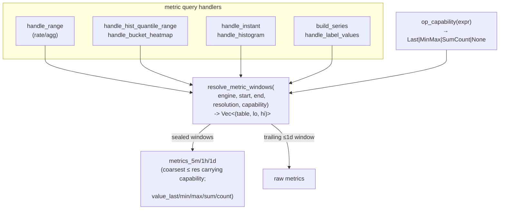

# rollup-read-routing — Design Doc

## Context

The compactor pre-computes metric rollup tiers (`metrics_5m/1h/1d`, last-sample-per-bucket) on the **write** side. The **read** side must route metric queries to the coarsest tier ≤ the query resolution to realise the benefit. That routing was wired into **one** path (`handle_range`'s rate/agg evaluation via `select_range_table`) but not the others, and the wiring that exists is **operator-unaware**:

- **Range histogram/heatmap** bypassed routing entirely — `handle_range` early-returns to `handle_hist_quantile_range`/`handle_bucket_heatmap`, which hardcoded raw `.table("metrics")` (`prometheus.rs:1224/1383`). The dashboard's heaviest panels (latency percentiles, response-time heatmap) therefore scanned **full-resolution raw over the whole range regardless of step**. Symptom observed live: `sol-querier` ~225% CPU on a 7-day view; setting Grafana "Min interval = 5m" changed nothing. Fixed point-wise in `40149d8fa` (a local `tiered_hist_source`), but that is a second, parallel copy of the routing logic.
- **Instant queries** (`handle_instant` function paths `:510`/`:551`, bare-selector base `latest_selected_df:429`, instant histogram `handle_histogram:1788`) read raw — fine when recent, but a Grafana **Stat** panel with a long `[$__range]` selector scans raw over the full range.
- **Metadata** (`/series` `build_series:111`, `/label/:name/values` `handle_label_values:917`) scan raw to enumerate names/labels — never the (smaller) tier, though the tier has the same series set.
- **Operator-unaware routing**: `select_range_table` picks the tier by **step alone**. The rollup keeps the **last sample per bucket**, so `rate`/`increase`/`histogram_quantile` stay correct, but `max_over_time`/`min_over_time`/`avg_over_time`/`sum_over_time`/`count_over_time` over a tier **silently under/mis-report** (intra-bucket detail is gone). The dashboard uses `max_over_time(process_memory_usage_bytes…)` across 8+ panels — a live correctness gap (those panels route to the 5m tier today and drop peaks).

Two structural causes, addressed together (write + read, so we do **not** repeat the write-ahead-of-read split that created this gap):
1. **Routing is duplicated per handler** instead of living at one choke point — each new handler re-implements, forgets, or mis-applies it.
2. **The rollup is lossy (last-only)**, so the only correct response for `max/min/avg/sum/count_over_time` is to *force raw* — sacrificing the tier acceleration. We remove that compromise by making the rollup **carry per-bucket `{last, min, max, sum, count}`**, so those operators route to a tier *and* stay exact. Routing becomes "use the coarsest tier that can answer correctly", not "fall back to raw".

## Functional Requirements

### FR1 — Single tier-resolution choke point
One function resolves the **source windows** for any metric query: given the time span, the query resolution, and whether the query is rollup-safe, it returns the ordered, time-disjoint `(table, lo, hi)` windows to scan — sealed windows from the coarsest eligible tier, the trailing ≤1-day (unsealed) window from raw `metrics`. Every metric read path obtains its scan source from it; no metric query path constructs a raw/tier table choice independently.

### FR2 — Operator → capability classifier
Each operator declares the **rollup capability** it needs to be answered exactly, rather than a binary safe/unsafe. The choke point routes to the coarsest tier that **carries** that capability; only operators whose capability no tier carries fall back to raw. Capabilities and the operators (scoped to what the querier implements today — dispatch at `prometheus.rs:333-353`: `rate`/`increase`/`irate`/`{max,min,avg,sum,count}_over_time`, plus `histogram_quantile`):
- **`Last`** — `rate`, `increase`, `histogram_quantile`, bare cumulative-counter selectors. (Last cumulative value per bucket suffices.)
- **`MinMax`** — `max_over_time` (reads per-bucket max), `min_over_time` (per-bucket min).
- **`SumCount`** — `avg_over_time` (`sum(sum)/sum(count)`), `sum_over_time` (`sum(sum)`), `count_over_time` (`sum(count)`).
- **`None` (force raw)** — `irate` (last-two-sample slope, sampling-dependent), `quantile_over_time`/`stddev`/`stdvar` (need the distribution), and any unknown/unimplemented/unclassified operator (conservative default). `delta`/`resets`/`last_over_time` map to `Last` once implemented.

With FR6, every tier carries `{Last, MinMax, SumCount}`, so all of the above except the `None` set route to a tier. See the [operator → capability ADR](./adrs/operator-safety-allowlist.md).

### FR3 — Route the range paths through the choke point
`handle_range`'s rate/agg path and the range histogram/heatmap handlers both obtain their source windows from FR1, replacing both `select_range_table` (the rate/agg copy) and `tiered_hist_source` (the histogram copy from `40149d8fa`). One routing implementation, used by both.

### FR4 — Route the instant paths through the choke point
`handle_instant` (and instant `handle_histogram`) resolve their scan source via FR1, using the range-selector window as the resolution input and the FR2 safety gate. A recent bare selector still resolves to raw (its window is short / unsealed); an instant over a long safe-operator window uses the tier for its sealed portion.

### FR5 — Route the metadata paths through the choke point
`/series` and `/label/:name/values` enumerate names/labels from the tier for their sealed window (the rollup preserves the full series set, so enumeration is exact and cheaper), raw for the trailing window. No value computation → always tier-eligible for the sealed window (capability `Last` suffices).

### FR6 — Rich rollup aggregates (write side)
The rollup carries, per `(series, time-bucket)`, the scalar metric value as **`{last, min, max, sum, count}`** (not just `last`). `last` preserves cumulative-counter/gauge-snapshot semantics (rate/increase/histogram_quantile unchanged); `min`/`max`/`sum`/`count` make `max/min/avg/sum/count_over_time` **exact** off the tier (max-of-maxes, min-of-mins, sum-of-sums, count-as-Σcount, avg as `Σsum/Σcount`). `rollup_plan` emits the four new aggregate columns alongside the existing last-valued columns; the tier schema gains four nullable columns shared with the raw schema (raw files null them via the adapter — no schema fork, no double-count). Histograms keep last-snapshot `bucket_counts` (capability `Last`); `quantile_over_time` is **not** made tier-exact (would need per-bucket distributions — deferred, stays raw).

### FR7 — Capability-aware value selection (read side)
When a window resolves to a tier, the read path selects the **per-bucket aggregate column** matching the operator's capability instead of recomputing over `last`: `max_over_time → MAX(value_max)`, `min_over_time → MIN(value_min)`, `sum_over_time → SUM(value_sum)`, `count_over_time → SUM(value_count)`, `avg_over_time → SUM(value_sum)/SUM(value_count)`. Raw windows are unchanged (`over_time` over the coalesced `v`). The selection is driven by the FR2 capability, so a tier and raw window in the same query each compute correctly and merge per-timestamp.

## Non-Functional Requirements

### NFR1 — Correctness preserved (parity with raw)
For every query, results must match the raw-only computation within existing tolerances. Specifically: no rollup-unsafe operator (FR2) ever reads a tier; histogram quantiles over the tier equal the raw last-sample-in-bucket quantile; the sealed/trailing windows are time-disjoint so per-timestamp sums never double-count. The ~32 existing querier PromQL tests + Sol↔Mimir parity stay green.

### NFR2 — No new dependencies
Within the pinned set (datafusion 53, datafusion-functions-json 0.53.1, object_store 0.13, promql-parser 0.9, moka 0.12). The choke point is plain Rust over the existing `Expr`/`DataFrame`/catalog APIs.

### NFR3 — No silent-bypass regression
After consolidation, a metric query path cannot read a tier-eligible source without going through the choke point. Enforced structurally: the per-handler raw `.table("metrics")` literals for metric *queries* are removed in favour of the resolver, and a guard test asserts the routing is exercised (e.g. a coarse-step query of each shape reads the tier; an unsafe operator does not).

## Non-goals
- **Active-day rollup.** The trailing/active day has no tier and stays raw — by design (the compactor never rolls up the unsealed day). This work routes the *sealed* portion only; active-day acceleration is separate, deferred work (it needs union-on-read of tier+raw and was costed earlier).
- **Logs/traces tiers.** No rollups exist for them (bounded ≤30-day window) — out of scope.
- **`quantile_over_time` / `stddev` / `stdvar` / `irate` on a tier.** Exact quantiles/variance need per-bucket distributions (t-digest/sketch), not `{min,max,sum,count}`; `irate` needs raw sample spacing. These stay raw — a documented, irreducible residue, not a gap. (Sketch-based quantile rollup is a possible future tier capability, out of this scope.)
- **Active-day rollup.** The trailing/unsealed day has no tier and stays raw — the compactor never rolls up the active day. This work routes the *sealed* portion only.
- **Frontend shard cache.** The per-day immutable shard cache (`frontend.rs`) is unchanged; consolidation feeds it the same windows.
- **New rollup tiers / sub-5m resolution.** Tier set stays 5m/1h/1d.
- **Mixed-schema tier files / migration.** Per the project's **clean-cutover, no-retro-compat-for-Parquet** rule, the store starts empty: every `rollup-*.parquet` is written by the new `rollup_plan` and carries the aggregate columns. There is no mixed old/new tier population to reconcile, so a tier unconditionally advertises `{Last, MinMax, SumCount}` (no per-file capability probing). No migration path is in scope.
- **Catalog refresh-path cost.** The 15 s `build_providers` walk was suspected as a CPU cost and **profiled out** (live store 451 MB / 792 files: ~30 ms/refresh, querier idles 0.01–0.06 % CPU; footer reads scale benignly with compacted-file count). The `20e203c51` refresh fix is performance-neutral. Excluded — there is no measured cost to fix. See [TASKS.md → Refresh-path profiling](./TASKS.md#analysis). The 225 % CPU is the read path this work targets, not the refresh.

## Rabbit holes
- **Exhaustive PromQL operator classification.** PromQL has many functions; do not attempt to prove safety for each. Classify the `*_over_time` family + the counter family (`rate`/`increase`/`delta`/`resets`) + `histogram_quantile` explicitly; everything else defaults to **raw** (safe by construction). Cap: the allowlist is a small static table, not a proof system.
- **Instant tier-selection heuristic.** Don't over-model. Use the range-selector window as the resolution input (analogous to `step`); no range selector ⇒ raw. Don't try to infer an effective step from the eval grid.

## Design

A single resolver replaces the scattered `.table("metrics")` choices and the two routing copies.

- **`resolve_metric_windows(engine, start, end, resolution, capability) -> Vec<(table, lo, hi)>`** (FR1): the one routing function. `capability=None` ⇒ a single `[(metrics, start, end)]`. Otherwise ⇒ the coarsest tier ≤ resolution **that carries `capability`** for `[start, sealed_ns]`, raw for `(sealed_ns, end]` (`sealed_ns = end − grace`). Time-disjoint.
- **`op_capability(expr) -> Capability`** (FR2): the static classifier (`Last`/`MinMax`/`SumCount`/`None`). Range/instant handlers pass the query's operator; metadata passes `Last` (no value computation).
- **`rollup_plan`** (FR6): emits `{last, min, max, sum, count}` per bucket; the tier schema (shared, nullable) carries the four aggregate columns.
- **value selection** (FR7): for a tier window the handler projects the per-op aggregate column (`value_max`/`value_min`/`value_sum`/`value_count`) and the merge agg; for a raw window, the coalesced `v` and the natural agg. The rest of each handler's filter/project/aggregate logic is unchanged; only the *source table* and the *value expression* change.

Decisions:
- [Single tier-resolution choke point](./adrs/tier-resolution-choke-point.md)
- [Operator → capability classifier + rich rollup](./adrs/operator-safety-allowlist.md)
- [Rollup aggregate schema](./adrs/rollup-aggregate-schema.md)
- [Instant & metadata tier routing](./adrs/instant-and-metadata-routing.md)

## Cross-cutting Concerns
- **Observability**: the existing `querier_bytes_scanned`/`files_opened` telemetry will show the drop on routed paths; no new metrics required (a follow-up could label by table tier).
- **Migration / rollback**: pure read-path refactor, no data or schema change; revert is code-only. The `40149d8fa` `tiered_hist_source` is subsumed (deleted) by the shared resolver.
- **Correctness guard**: parity tests (raw vs tier) per query shape + an unsafe-operator-stays-raw test prevent regression and re-introduction of the bypass.
