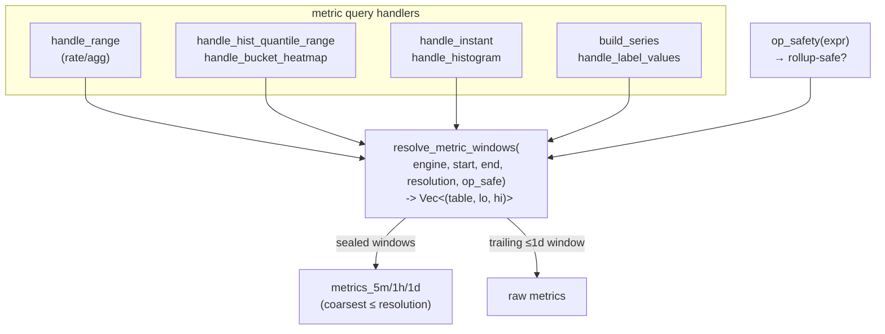

# rollup-read-routing — Design Doc

## Context

The compactor pre-computes metric rollup tiers (`metrics_5m/1h/1d`, last-sample-per-bucket) on the **write** side. The **read** side must route metric queries to the coarsest tier ≤ the query resolution to realise the benefit. That routing was wired into **one** path (`handle_range`'s rate/agg evaluation via `select_range_table`) but not the others, and the wiring that exists is **operator-unaware**:

- **Range histogram/heatmap** bypassed routing entirely — `handle_range` early-returns to `handle_hist_quantile_range`/`handle_bucket_heatmap`, which hardcoded raw `.table("metrics")` (`prometheus.rs:1224/1383`). The dashboard's heaviest panels (latency percentiles, response-time heatmap) therefore scanned **full-resolution raw over the whole range regardless of step**. Symptom observed live: `sol-querier` ~225% CPU on a 7-day view; setting Grafana "Min interval = 5m" changed nothing. Fixed point-wise in `40149d8fa` (a local `tiered_hist_source`), but that is a second, parallel copy of the routing logic.
- **Instant queries** (`handle_instant` base `prometheus.rs:429`, instant histogram `handle_histogram` `:1788`) read raw — fine when recent, but a Grafana **Stat** panel with a long `[$__range]` selector scans raw over the full range.
- **Metadata** (`/series` `build_series:111`, `/label/:name/values` `handle_label_values:917`) scan raw to enumerate names/labels — never the (smaller) tier, though the tier has the same series set.
- **Operator-unaware routing**: `select_range_table` picks the tier by **step alone**. The rollup keeps the **last sample per bucket**, so `rate`/`increase`/`histogram_quantile` stay correct, but `max_over_time`/`min_over_time`/`avg_over_time`/`quantile_over_time` over a tier **silently under/mis-report** (intra-bucket peaks are gone). The dashboard uses `max_over_time(process_memory_usage_bytes…)` — a latent correctness gap.

Root structural cause: routing is duplicated per handler instead of living at one choke point, so each new handler either re-implements it, forgets it, or applies it unsafely. This work consolidates it.

## Functional Requirements

### FR1 — Single tier-resolution choke point
One function resolves the **source windows** for any metric query: given the time span, the query resolution, and whether the query is rollup-safe, it returns the ordered, time-disjoint `(table, lo, hi)` windows to scan — sealed windows from the coarsest eligible tier, the trailing ≤1-day (unsealed) window from raw `metrics`. Every metric read path obtains its scan source from it; no metric query path constructs a raw/tier table choice independently.

### FR2 — Operator-safety allowlist
The choke point routes to a tier **only** when the query's value computation is preserved by last-sample-per-bucket downsampling. Rollup-safe: `rate`, `increase`, `delta`, `resets`, `histogram_quantile` (cumulative bucket counts), `last_over_time`, and bare cumulative-counter selectors. Rollup-unsafe: `max_over_time`, `min_over_time`, `avg_over_time`, `sum_over_time`, `quantile_over_time`, `stddev/stdvar_over_time`, and any operator needing intra-bucket detail. Unsafe → the choke point returns all-raw windows (no tier). Unknown/unclassified operators default to **raw** (conservative).

### FR3 — Route the range paths through the choke point
`handle_range`'s rate/agg path and the range histogram/heatmap handlers both obtain their source windows from FR1, replacing both `select_range_table` (the rate/agg copy) and `tiered_hist_source` (the histogram copy from `40149d8fa`). One routing implementation, used by both.

### FR4 — Route the instant paths through the choke point
`handle_instant` (and instant `handle_histogram`) resolve their scan source via FR1, using the range-selector window as the resolution input and the FR2 safety gate. A recent bare selector still resolves to raw (its window is short / unsealed); an instant over a long safe-operator window uses the tier for its sealed portion.

### FR5 — Route the metadata paths through the choke point
`/series` and `/label/:name/values` enumerate names/labels from the tier for their sealed window (the rollup preserves the full series set, so enumeration is exact and cheaper), raw for the trailing window. No value computation → always tier-eligible for the sealed window (FR2 not applicable).

## Non-Functional Requirements

### NFR1 — Correctness preserved (parity with raw)
For every query, results must match the raw-only computation within existing tolerances. Specifically: no rollup-unsafe operator (FR2) ever reads a tier; histogram quantiles over the tier equal the raw last-sample-in-bucket quantile; the sealed/trailing windows are time-disjoint so per-timestamp sums never double-count. The ~32 existing querier PromQL tests + Sol↔Mimir parity stay green.

### NFR2 — No new dependencies
Within the pinned set (datafusion 53, datafusion-functions-json 0.53.1, object_store 0.13, promql-parser 0.9, moka 0.12). The choke point is plain Rust over the existing `Expr`/`DataFrame`/catalog APIs.

### NFR3 — No silent-bypass regression
After consolidation, a metric query path cannot read a tier-eligible source without going through the choke point. Enforced structurally: the per-handler raw `.table("metrics")` literals for metric *queries* are removed in favour of the resolver, and a guard test asserts the routing is exercised (e.g. a coarse-step query of each shape reads the tier; an unsafe operator does not).

## Non-goals
- **Active-day rollup.** The trailing/active day has no tier and stays raw — by design (the compactor never rolls up the unsealed day). This work routes the *sealed* portion only; active-day acceleration is separate, deferred work (it needs union-on-read of tier+raw and was costed earlier).
- **Logs/traces tiers.** No rollups exist for them (bounded ≤30-day window) — out of scope.
- **Write-side / rollup generation.** The compactor and `rollup_plan` are untouched; this is purely read-path routing.
- **Frontend shard cache.** The per-day immutable shard cache (`frontend.rs`) is unchanged; consolidation feeds it the same windows.
- **New rollup tiers / sub-5m resolution.** Tier set stays 5m/1h/1d.

## Rabbit holes
- **Exhaustive PromQL operator classification.** PromQL has many functions; do not attempt to prove safety for each. Classify the `*_over_time` family + the counter family (`rate`/`increase`/`delta`/`resets`) + `histogram_quantile` explicitly; everything else defaults to **raw** (safe by construction). Cap: the allowlist is a small static table, not a proof system.
- **Instant tier-selection heuristic.** Don't over-model. Use the range-selector window as the resolution input (analogous to `step`); no range selector ⇒ raw. Don't try to infer an effective step from the eval grid.

## Design

A single resolver replaces the scattered `.table("metrics")` choices and the two routing copies.

- **`resolve_metric_windows`** (FR1): the one routing function. `op_safe=false` ⇒ a single `[(metrics, start, end)]`. `op_safe=true` ⇒ tier for `[start, sealed_ns]` (coarsest tier ≤ resolution), raw for `(sealed_ns, end]`, where `sealed_ns = end − grace`. Time-disjoint.
- **`op_safety(expr) -> bool`** (FR2): the static allowlist classifier. Range handlers pass the query's operator; metadata passes `true` (no value computation); instant passes its selector-operator classification.
- Handlers build their scan as the union of `hist_scan`/selector-scan over the returned windows — the existing per-handler filter/project/aggregate logic is unchanged; only the *source* changes.

Decisions:
- [Single tier-resolution choke point](./adrs/tier-resolution-choke-point.md)
- [Operator-safety allowlist for rollup routing](./adrs/operator-safety-allowlist.md)
- [Instant & metadata tier routing](./adrs/instant-and-metadata-routing.md)

## Cross-cutting Concerns
- **Observability**: the existing `querier_bytes_scanned`/`files_opened` telemetry will show the drop on routed paths; no new metrics required (a follow-up could label by table tier).
- **Migration / rollback**: pure read-path refactor, no data or schema change; revert is code-only. The `40149d8fa` `tiered_hist_source` is subsumed (deleted) by the shared resolver.
- **Correctness guard**: parity tests (raw vs tier) per query shape + an unsafe-operator-stays-raw test prevent regression and re-introduction of the bypass.
