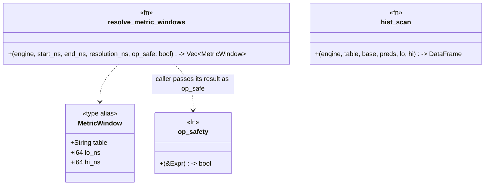

# rollup-read-routing — Tasks

Design: [DESIGN.md](./DESIGN.md)

## Analysis

Build: `cargo check --features querier-backend --lib` — verified green (HEAD `40149d8fa`)
Test: `cargo test --features querier-backend --lib querier::` — verified green (querier:: 176 passed, 1 ignored)
Lint: `cargo clippy --features querier-backend --lib` — verified clean (`#![deny(warnings)]` at `src/lib.rs:7` makes warnings hard errors; `querier-backend` is a default feature)

### Known-failing tests
| Test | Reason | Action |
|---|---|---|
| (none — querier:: 176 green at HEAD) | | — |

### Read-path inventory (Phase 4a, all `src/querier/prometheus.rs` unless noted)
| Path | Entry | Current source | Routes today? |
|---|---|---|---|
| Range rate/agg | `handle_range:1543` → `select_range_table:1480` + sealed split (`:1576`,`:1581`,`:1597`) → `eval_range_window:2187`(table) → `lower_range_df:306`(table) → `metric_base_df:144`(table) | tier/raw per window | ✅ (step-only, **op-unaware**) |
| Range histogram/heatmap | `handle_hist_quantile_range:1212` / `handle_bucket_heatmap:1366` (early-return at `:1553`/`:1556`; also `eval_range_window:2287`/`:2290` ignore the passed `table`) → `tiered_hist_source:1519` | tier/raw (a 2nd routing copy) | ✅ (the `40149d8fa` copy) |
| Instant | `handle_instant:805` → `lower_range_df(…,"metrics"):551` / `lower_aggregate_range(…,"metrics"):510` | raw hardcoded | ❌ |
| Instant histogram | `handle_histogram:1770` (`engine.table("metrics"):1788`) | raw hardcoded | ❌ |
| Metadata `/series` | `handle_series:967` → `build_series:106` (`:111`) | raw | ❌ |
| Metadata `/label/:name/values` | `handle_label_values:943` → `build_label_values:900` (scan `:917`, 4×) | raw | ❌ |
| Metadata `/labels` | `handle_labels:957` → `distinct_json_keys(…,"metrics"):958` | raw | ❌ |
| SQL | `sql.rs:handle_sql:81` | user-controlled | out of scope (non-goal) |

### Operator representation (Phase 4a)
- Range fns are `Expr::Call(c)` with `c.func.name: &str` (`"rate"`, `"increase"`, `"irate"`, `"max_over_time"`, …); arg `Expr::MatrixSelector(ms)`, window `ms.range: Duration`.
- `matrix_range_ns(expr) -> Option<i64>` (`:458`) already extracts the selector window in ns — the **resolution input** for instant routing.
- `detect_hist_quantile:1173` captures the optional `topk` wrapper into `HistSpec.topk:1144`; `find_hist_base:1148` recurses to the selector.
- `range_to_ns(Duration)->i64` (`:199`); `RollupTier`/`select_tier` in `src/querier/rollup.rs`.

### Domain model

### Requirement traceability
| Type / Fn | Addresses | Notes |
|---|---|---|
| `resolve_metric_windows` | [FR1](./DESIGN.md#fr1) | The single choke point; returns time-disjoint `(table,lo,hi)` windows |
| `op_safety` | [FR2](./DESIGN.md#fr2) | Static allowlist classifier; default raw |
| `MetricWindow` (`(String,i64,i64)`) | [FR1](./DESIGN.md#fr1) | Value returned by the resolver |
| `handle_range` (+`eval_range_window`/`lower_range_df`/`metric_base_df` table flow) | [FR3](./DESIGN.md#fr3) | Range rate/agg routed via resolver + op_safety |
| `handle_hist_quantile_range`/`handle_bucket_heatmap` | [FR3](./DESIGN.md#fr3) | Take windows from resolver; `tiered_hist_source` deleted |
| `handle_instant`/`lower_range_df`/`lower_aggregate_range`/`handle_histogram` | [FR4](./DESIGN.md#fr4) | Instant routed via resolver (resolution = `matrix_range_ns`, gated by `op_safety`) |
| `build_series`/`build_label_values`/`handle_labels` | [FR5](./DESIGN.md#fr5) | Metadata sealed→tier (op_safe=true always) |

### Transformations
| Function | Input → Output | Invariant / Rule |
|---|---|---|
| `resolve_metric_windows` | `(start,end,resolution,op_safe) → Vec<(table,lo,hi)>` | Windows are time-**disjoint** and cover `[start,end]`; a tier appears **only** when `op_safe && tier eligible (≤ resolution) && window ≤ sealed_ns`; else raw `metrics`. Trailing `(sealed_ns,end]` always raw. |
| `op_safety` | `&Expr → bool` | `true` **only** for `rate`/`increase`/`histogram_quantile` (incl. through `topk`/`sum by(le)`/paren wrappers); everything else (incl. `irate`, `*_over_time`, unknown) `false`. |

## Tasks

### 1. Choke point + operator-safety classifier ([FR1](./DESIGN.md#fr1), [FR2](./DESIGN.md#fr2))
**Goal**: One routing function + one safety classifier, replacing `select_range_table`.
**Types**: `resolve_metric_windows`, `op_safety`, `MetricWindow` — see domain model.
**Constraints**:
- [ADR: tier-resolution-choke-point](./adrs/tier-resolution-choke-point.md) — single resolver; subsumes `select_range_table`.
- [ADR: operator-safety-allowlist](./adrs/operator-safety-allowlist.md) — safe set = `{rate, increase, histogram_quantile}`; default raw.
- Invariant: windows time-disjoint + cover `[start,end]`; tier only when `op_safe && ≤resolution && sealed`.
- Reuse `RollupTier`/`select_tier` (`rollup.rs`), `sealed_ns = end − 86_400_000_000_000`.
**Tests** (red→green):
- `test_op_safety_safe_ops` — `rate`/`increase`/`histogram_quantile` (incl. `topk(histogram_quantile(sum by(le)(rate(..))))`) → true.
- `test_op_safety_unsafe_ops` — `irate`, `max_over_time`, `avg_over_time`, `sum_over_time`, `count_over_time`, a bare selector, unknown fn → false.
- `test_resolve_windows_unsafe_is_all_raw` — `op_safe=false` → single `[(metrics,start,end)]`.
- `test_resolve_windows_splits_sealed_and_trailing` — coarse resolution, `op_safe=true`, 2-day span → `[(metrics_5m,start,sealed),(metrics,sealed+1,end)]`, disjoint.
- `test_resolve_windows_fine_resolution_no_tier` — resolution < 5m → all raw even when safe.
**Verify**: `cargo test --features querier-backend --lib querier::prometheus::tests::test_op_safety querier::prometheus::tests::test_resolve_windows`
**Acceptance criteria**:
- [ ] `resolve_metric_windows` + `op_safety` exist; the 5 tests pass.
- [ ] `op_safety` returns true only for the three safe operators.
- [ ] `select_range_table` is removed (folded in) or delegates to the resolver.
**Depends on**: (none)
**Time-box**: ~75 min

### 2. Route the range rate/agg path ([FR3](./DESIGN.md#fr3), [NFR1](./DESIGN.md#nfr1))
**Goal**: `handle_range` chooses each window's table via the resolver + `op_safety`, not `select_range_table` + a step-only branch.
**Constraints**:
- [ADR: tier-resolution-choke-point](./adrs/tier-resolution-choke-point.md), [ADR: operator-safety-allowlist](./adrs/operator-safety-allowlist.md).
- `eval_range_window`/`lower_range_df`/`metric_base_df` keep their `table: &str` param (table flows down unchanged); only the *choice* moves to the resolver.
- Invariant: a `max_over_time(...)` range query at a coarse step now reads **raw** (was tier).
**Tests**:
- `test_range_max_over_time_reads_raw_at_coarse_step` — `max(max_over_time(m[5m]))` over a sealed 2-day span at M5 step reads raw (distinct raw vs tier values prove it — extend the existing tier fixture `test_long_range_keeps_live_tail_when_tier_selected`).
- `test_range_rate_still_uses_tier` — `sum(rate(m[5m]))` sealed window still reads tier (the existing test stays green).
**Verify**: `cargo test --features querier-backend --lib querier::prometheus`
**Acceptance criteria**:
- [ ] Range path sources windows from `resolve_metric_windows`.
- [ ] `max_over_time` coarse-step reads raw; `rate` reads tier; both tests pass.
- [ ] All pre-existing range tests stay green.
**Depends on**: 1
**Time-box**: ~60 min

### 3. Route the range histogram/heatmap path ([FR3](./DESIGN.md#fr3), [NFR1](./DESIGN.md#nfr1))
**Goal**: histogram/heatmap range handlers take windows from the resolver; delete the `tiered_hist_source` duplicate.
**Constraints**:
- [ADR: tier-resolution-choke-point](./adrs/tier-resolution-choke-point.md) — one routing impl.
- Handlers take `windows: &[MetricWindow]` (or the resolver result) and union `hist_scan` over them; `handle_range` early-return + `eval_range_window:2287/2290` pass windows (the latter passes its single chosen window).
- Invariant: results unchanged vs the `40149d8fa` behaviour (the existing routing test stays green).
**Tests**:
- `test_histogram_quantile_range_routes_sealed_window_to_tier` — already exists (`40149d8fa`); must stay green against the consolidated path.
- `test_tiered_hist_source_removed` — (compile-level) `tiered_hist_source` no longer exists; histogram handlers reference the resolver.
**Verify**: `cargo test --features querier-backend --lib querier::prometheus`
**Acceptance criteria**:
- [ ] `tiered_hist_source` deleted; histogram/heatmap handlers route via `resolve_metric_windows`.
- [ ] The existing histogram routing test + all histogram tests pass.
**Depends on**: 1
**Time-box**: ~60 min

### 4. Route the instant paths ([FR4](./DESIGN.md#fr4), [NFR1](./DESIGN.md#nfr1))
**Goal**: instant queries + instant histogram source via the resolver, resolution = `matrix_range_ns(expr)`, gated by `op_safety`.
**Constraints**:
- [ADR: instant-and-metadata-routing](./adrs/instant-and-metadata-routing.md) — instant via selector window + safety gate; no range selector ⇒ raw.
- Replace hardcoded `"metrics"` at `:510`, `:551`, `:1788`.
- Invariant: a recent bare-selector instant still reads raw; an instant `histogram_quantile(rate(..[long]))`/`rate(..[long])` over a sealed window uses the tier; instant `max_over_time` reads raw.
**Tests**:
- `test_instant_rate_long_window_uses_tier` — instant `sum(rate(m[…]))` whose window covers a sealed span reads tier.
- `test_instant_max_over_time_reads_raw` — instant `max_over_time(m[…])` reads raw at any window.
- `test_instant_bare_selector_reads_raw` — `m` at `t` reads raw (recent).
**Verify**: `cargo test --features querier-backend --lib querier::prometheus`
**Acceptance criteria**:
- [ ] Instant + instant-histogram source via the resolver; no hardcoded `"metrics"` left in those paths.
- [ ] The three instant tests pass; existing instant tests stay green.
**Depends on**: 1
**Time-box**: ~75 min

### 5. Route the metadata paths ([FR5](./DESIGN.md#fr5), [NFR1](./DESIGN.md#nfr1))
**Goal**: `/series`, `/label/:name/values`, `/labels` enumerate from the tier for sealed windows, raw for trailing.
**Constraints**:
- [ADR: instant-and-metadata-routing](./adrs/instant-and-metadata-routing.md) — metadata is always tier-eligible (no value compute; rollup preserves the series/label set); `op_safety` not consulted.
- Replace hardcoded `"metrics"` at `:111`, `:917` (×4), `:958`.
- Invariant: enumerated names/labels are **identical** to the raw-only result (the tier has the same distinct series/labels).
**Tests**:
- `test_series_enumeration_matches_raw_via_tier` — `/series` over a sealed span returns the same `(name,service_name)` set whether read from tier or raw.
- `test_label_values_matches_raw_via_tier` — `/label/host/values` identical via tier.
**Verify**: `cargo test --features querier-backend --lib querier::prometheus`
**Acceptance criteria**:
- [ ] Metadata paths source via the resolver (sealed→tier).
- [ ] Enumeration results identical to raw; both tests pass.
**Depends on**: 1
**Time-box**: ~60 min

### 6. No-silent-bypass guard ([NFR3](./DESIGN.md#nfr3))
**Goal**: lock in the consolidation so a future handler can't silently bypass routing or route an unsafe op.
**Constraints**:
- [ADR: tier-resolution-choke-point](./adrs/tier-resolution-choke-point.md), [ADR: operator-safety-allowlist](./adrs/operator-safety-allowlist.md).
- Invariant: every metric query-serving read of a tier goes through `resolve_metric_windows`.
**Tests**:
- `test_no_query_path_hardcodes_tier_table` — a source-level guard (like the existing `no_sql_invariant_tests`): assert no query-serving fn in `prometheus.rs` contains a `.table("metrics_…")` literal (tiers only reached via the resolver). Allow raw `.table("metrics")` only where the resolver isn't applicable, or assert resolver usage.
- `test_unsafe_operator_never_tiers` — table-driven over the unsafe op list, asserting `resolve_metric_windows(op_safe=op_safety(expr))` yields all-raw.
**Verify**: `cargo test --features querier-backend --lib querier:: && cargo clippy --features querier-backend --lib`
**Acceptance criteria**:
- [ ] Guard test(s) pass and would fail if a new handler hardcoded a tier or routed an unsafe op.
- [ ] Full `querier::` suite green; clippy clean.
**Depends on**: 2, 3, 4, 5
**Time-box**: ~45 min

## Sessions

### Session 1 — Choke point + range paths (~3H)
Tasks: 1, 2, 3
**Skills**: `rust-software-engineer`
**Checkpoint**: `cargo test --features querier-backend --lib querier:: && cargo clippy --features querier-backend --lib` — green; `select_range_table`/`tiered_hist_source` gone; range rate/agg + histogram route via the resolver; `max_over_time` reads raw.
**Commit point**: yes

### Session 2 — Instant + metadata + guard (~3H)
Tasks: 4, 5, 6
**Skills**: `rust-software-engineer`
**Checkpoint**: `cargo test --features querier-backend --lib querier:: && cargo clippy --features querier-backend --lib` — green; no hardcoded tier reads outside the resolver; instant + metadata routed.
**Commit point**: yes

## Quality gates (post-session review)
- [ ] Acceptance criteria: all green above
- [ ] Code review: matches [DESIGN.md](./DESIGN.md) — one resolver, no per-handler routing
- [ ] Code organization: resolver + classifier co-located; dead code (`select_range_table`, `tiered_hist_source`) removed
- [ ] Code quality: no duplicated routing logic; `op_safety` is the only safety surface
- [ ] Security: n/a (read-path refactor, no new deps/inputs)
- [ ] Observability: `querier_bytes_scanned`/`files_opened` reflect the drop on routed paths
- [ ] Performance: 7-day metric dashboard cold-load CPU drops vs raw; `max_over_time` parity with raw confirmed
