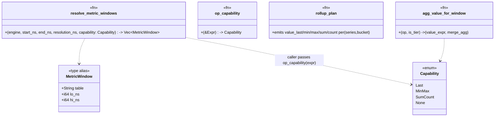

# rollup-read-routing — Tasks

Design: [DESIGN.md](./DESIGN.md)

## Analysis

Build: `cargo check --features querier-backend --lib` — verified green (HEAD `20e203c51`)
Test: `cargo test --features querier-backend --lib querier::` — verified green (querier:: **177 passed, 1 ignored**, 2026-06-26 at HEAD `20e203c51`)
Lint: `cargo clippy --features querier-backend --lib` — verified clean (`#![deny(warnings)]` at `src/lib.rs:7` makes warnings hard errors; `querier-backend` is a default feature)

### Known-failing tests
| Test | Reason | Action |
|---|---|---|
| (none — querier:: 177 green at HEAD `20e203c51`) | | — |

### Refresh-path profiling (evidence — why the catalog refresh is out of scope)
Profiled the live demo store (`sol:20e203c51`, 2026-06-26): **451 MB, 792 parquet files, 42 dirs, 83 compacted, 54 rollup** (7 days). The 15 s catalog refresh (`catalog.rs:284 build_providers` → `resolve_signal_files` + `rollup_tier_files` ×3) measured **~30 ms total** (enumeration 5–9 ms; metrics tree ×4 = 16 ms; 83 `read_provenance` footer reads negligible in-process — the apparent 120 ms was shell `fork` overhead, 83 `/bin/true` = 107 ms). Querier idles at **0.01–0.06 % CPU** between queries; refresh ticks are not a visible cost and **do not scale into one** in the foreseeable range (footer reads scale with compacted-file count: 83 → ~120 at 30-day retention). The fix `20e203c51` is performance-**neutral** (same walk, reordered to close the registration gap). **Conclusion: the refresh path is not the CPU cost** — the 225 % querier CPU was the *read path* under active 7-day load (raw scans via the op-unaware `select_range_table`), which is exactly what this work consolidates. No catalog-refresh follow-up is warranted.

### Read-path inventory (Phase 4a, all `src/querier/prometheus.rs` unless noted)
| Path | Entry | Current source | Routes today? |
|---|---|---|---|
| Range rate/agg | `handle_range:1543` → `select_range_table:1480` + sealed split (`:1576`,`:1581`,`:1597`) → `eval_range_window:2187`(table) → `lower_range_df:306`(table) → `metric_base_df:144`(table) | tier/raw per window | ✅ (step-only, **op-unaware**) |
| Range histogram/heatmap | `handle_hist_quantile_range:1212` / `handle_bucket_heatmap:1366` (early-return at `:1553`/`:1556`; also `eval_range_window:2287`/`:2290` ignore the passed `table`) → `tiered_hist_source:1519` | tier/raw (a 2nd routing copy) | ✅ (the `40149d8fa` copy) |
| Instant (function) | `handle_instant:805` → `lower_range_df(…,"metrics"):551` / `lower_aggregate_range(…,"metrics"):510` | raw hardcoded | ❌ |
| Instant (bare selector) | `handle_instant:805` → `latest_selected_df:415` (`engine.table("metrics"):429`) — latest sample ≤ `t` | raw hardcoded | ❌ |
| Instant histogram | `handle_histogram:1770` (`engine.table("metrics"):1788`) | raw hardcoded | ❌ |
| Metadata `/series` | `handle_series:967` → `build_series:106` (`:111`) | raw | ❌ |
| Metadata `/label/:name/values` | `handle_label_values:943` → `build_label_values:900` (scan `:917`, 4×) | raw | ❌ |
| Metadata `/labels` | `handle_labels:957` → `distinct_json_keys(…,"metrics"):958` | raw | ❌ |
| SQL | `sql.rs:handle_sql:81` | user-controlled | out of scope (non-goal) |

### Operator representation (Phase 4a)
- Range fns are `Expr::Call(c)` with `c.func.name: &str` (`"rate"`, `"increase"`, `"irate"`, `"max_over_time"`, …); arg `Expr::MatrixSelector(ms)`, window `ms.range: Duration`.
- `matrix_range_ns(expr) -> Option<i64>` (`:458`) already extracts the selector window in ns — the **resolution input** for instant routing.
- `detect_hist_quantile:1173` captures the optional `topk` wrapper into `HistSpec.topk:1144`; `find_hist_base:1148` recurses to the selector.
- `range_to_ns(Duration)->i64` (`:199`); `RollupTier`/`select_tier` in `src/querier/rollup.rs`.

### Domain model

### Requirement traceability
| Type / Fn | Addresses | Notes |
|---|---|---|
| `Capability` (enum) | [FR2](./DESIGN.md#fr2) | `Last`/`MinMax`/`SumCount`/`None` — what a query needs / a tier carries |
| `op_capability` | [FR2](./DESIGN.md#fr2) | Static classifier; default `None` (raw) |
| `resolve_metric_windows` | [FR1](./DESIGN.md#fr1) | Single choke point; routes to coarsest tier carrying the capability |
| `MetricWindow` (`(String,i64,i64)`) | [FR1](./DESIGN.md#fr1) | Value returned by the resolver |
| `value_min/value_max/value_sum/value_count` cols + `rollup_plan` | [FR6](./DESIGN.md#fr6) | Per-bucket scalar aggregates; nullable, shared with raw schema |
| `agg_value_for_window` (read-side value/agg selection) | [FR7](./DESIGN.md#fr7) | Tier → per-op aggregate column; raw → coalesced `v` |
| `handle_range` (+`eval_range_window`/`lower_range_df`/`metric_base_df`/`over_time`) | [FR3](./DESIGN.md#fr3), [FR7](./DESIGN.md#fr7) | Range routed via resolver + capability; tier value via `agg_value_for_window` |
| `handle_hist_quantile_range`/`handle_bucket_heatmap` | [FR3](./DESIGN.md#fr3) | Take windows from resolver (capability `Last`); `tiered_hist_source` deleted |
| `handle_instant`/`lower_range_df`/`lower_aggregate_range`/`latest_selected_df`/`handle_histogram` | [FR4](./DESIGN.md#fr4) | Instant routed via resolver (resolution = `matrix_range_ns`, gated by `op_capability`); bare-selector `latest_selected_df` → resolver yields raw (no hardcoded literal) |
| `build_series`/`build_label_values`/`handle_labels` | [FR5](./DESIGN.md#fr5) | Metadata sealed→tier (capability `Last` always) |

### Transformations
| Function | Input → Output | Invariant / Rule |
|---|---|---|
| `op_capability` | `&Expr → Capability` | `Last`: `rate`/`increase`/`histogram_quantile` (incl. through `topk`/`sum by(le)`/paren). `MinMax`: `max_over_time`/`min_over_time`. `SumCount`: `avg`/`sum`/`count_over_time`. `None`: `irate`, `quantile/stddev/stdvar_over_time`, unknown, bare selector. |
| `resolve_metric_windows` | `(start,end,resolution,capability) → Vec<(table,lo,hi)>` | Time-**disjoint**, cover `[start,end]`; a tier appears **only** when `capability≠None && tier ≤ resolution && tier carries capability && window ≤ sealed_ns`; trailing `(sealed_ns,end]` always raw. |
| `rollup_plan` | `batches → batches (+value_min/max/sum/count)` | Per `(name,service_name,series_key,bucket)`: `last_value` for existing cols; `min/max/sum/count` of the coalesced scalar value into the 4 new cols. |
| `agg_value_for_window` | `(op, is_tier) → (value_expr, agg)` | Tier: `max→(value_max,MAX)`, `min→(value_min,MIN)`, `sum→(value_sum,SUM)`, `count→(value_count,SUM)`, `avg→(value_sum/value_count via Σ)`. Raw: `(coalesced v, op's natural agg)`. |

## Tasks

### 1. Rich rollup aggregates + schema ([FR6](./DESIGN.md#fr6))
**Goal**: the rollup carries per-bucket `{last, min, max, sum, count}` of the scalar value so `max/min/avg/sum/count_over_time` can be exact off a tier.
**Types**: `value_min`/`value_max`/`value_sum`/`value_count` columns, `rollup_plan` — see domain model.
**Constraints**:
- [ADR: rollup aggregate schema](./adrs/rollup-aggregate-schema.md) — 4 nullable `Float64` cols added to the **shared** `metric_union_schema` (`catalog.rs:143`); raw files null them (adapter). Clean cutover (empty state) — no migration, no per-file probing.
- Aggregate the **coalesced scalar value** (same `metric_value_expr` coalesce the read path uses), grouped by the existing `(name, service_name, series_key, bucket)`; keep the existing `last_value(...)` columns unchanged (rate/histogram_quantile rely on them). Histograms null the new cols.
- Invariant: `value_count` = raw sample count per bucket; `avg = Σvalue_sum/Σvalue_count`; existing `test_rate_over_rollup_matches_raw`/`test_rollup_preserves_bucket_counts` stay green.
**Tests** (red→green):
- `test_rollup_emits_per_bucket_aggregates` — a 5m bucket with values `[1,9,4]` → `value_min=1,value_max=9,value_sum=14,value_count=3`, `double_value`(last)=4.
- `test_max_over_rollup_matches_raw` — `max_over_time` from `MAX(value_max)` over a multi-sample-per-bucket fixture equals the raw max (peaks preserved).
- `test_avg_over_rollup_matches_raw` — `Σvalue_sum/Σvalue_count` equals raw `avg_over_time`.
- `test_catalog_metric_schema_has_value_aggregate_cols` — the 4 cols present and nullable in `metric_union_schema`.
**Verify**: `cargo test --features querier-backend --lib querier::rollup querier::catalog`
**Acceptance criteria**:
- [x] `rollup_plan` emits the 4 aggregate columns; schema carries them (nullable). *(robust to per-subtype schemas: scalar built from present cols; value_* always appended in projection.)*
- [x] max/avg-from-rollup parity tests pass; rate/histogram rollup tests stay green. *(querier::rollup 12 passed; compaction run_once green unedited.)*
**Depends on**: (none)
**Time-box**: ~90 min
**Status**: ✅ done (commit pending Session-1 checkpoint).

### 2. Capability classifier + choke point ([FR1](./DESIGN.md#fr1), [FR2](./DESIGN.md#fr2))
**Goal**: one `Capability` classifier + one routing function (`resolve_metric_windows`), replacing `select_range_table`.
**Types**: `Capability`, `op_capability`, `resolve_metric_windows`, `MetricWindow` — see domain model.
**Constraints**:
- [ADR: tier-resolution-choke-point](./adrs/tier-resolution-choke-point.md) — single resolver; subsumes `select_range_table`.
- [ADR: operator → capability classifier + rich rollup](./adrs/operator-safety-allowlist.md) — `Last`={rate,increase,histogram_quantile}; `MinMax`={max,min_over_time}; `SumCount`={avg,sum,count_over_time}; `None`={irate,quantile/stddev/stdvar_over_time,bare selector,unknown}.
- Tier advertises `{Last,MinMax,SumCount}` unconditionally (clean cutover, Task 1). Reuse `RollupTier`/`select_tier`; `sealed_ns = end − 86_400_000_000_000`.
- Invariant: windows time-disjoint + cover `[start,end]`; tier only when `capability≠None && tier ≤ resolution && window ≤ sealed_ns`.
**Tests**:
- `test_op_capability_classes` — each op → its capability (incl. `topk(histogram_quantile(sum by(le)(rate(..))))`→Last; `irate`/unknown/bare→None).
- `test_resolve_windows_none_is_all_raw` — `None` → single `[(metrics,start,end)]`.
- `test_resolve_windows_splits_sealed_and_trailing` — coarse res, 2-day span, any non-None capability → `[(metrics_5m,start,sealed),(metrics,sealed+1,end)]`, disjoint.
- `test_resolve_windows_fine_resolution_no_tier` — resolution < 5m → all raw.
**Verify**: `cargo test --features querier-backend --lib querier::prometheus::tests::test_op_capability querier::prometheus::tests::test_resolve_windows`
**Acceptance criteria**:
- [x] `Capability` + `op_capability` + `resolve_metric_windows` exist; the 4 tests pass.
- [x] `select_range_table` left in place (still used by `handle_range`); removed in Task 3 when its caller is rewired (dead code would fail `#![deny(warnings)]`). New fns are exercised by their tests → not dead.
**Depends on**: 1
**Time-box**: ~75 min
**Status**: ✅ done (commit pending Session-1 checkpoint). **Review finding → Task 3**: `op_capability` returns `None` for `Expr::Binary`/`Expr::Unary` (e.g. `rate(a)/rate(b)`) → raw. Correct but an efficiency regression vs the old step-only routing; Task 3 must handle it (see Task 3 constraints).

### 3. Route range + capability-aware value selection ([FR3](./DESIGN.md#fr3), [FR7](./DESIGN.md#fr7), [NFR1](./DESIGN.md#nfr1))
**Goal**: `handle_range` sources windows from the resolver; on a tier window the value comes from the per-op aggregate column (`agg_value_for_window`), so `max_over_time` now uses the tier **correctly** (not raw).
**Types**: `agg_value_for_window` — see domain model.
**Constraints**:
- [ADR: operator → capability](./adrs/operator-safety-allowlist.md), [FR7](./DESIGN.md#fr7).
- `eval_range_window`/`lower_range_df`/`metric_base_df`/`over_time` keep `table: &str`; add the per-op value/agg selection for tier windows (`metric_value_expr` → `value_max` etc.; `over_time` merge agg per [transformations table](#transformations)); `avg` = `Σvalue_sum/Σvalue_count`.
- **Binary/unary expressions (review finding from Task 2):** `op_capability` returns `None` for `Expr::Binary`/`Expr::Unary`, so `rate(a[5m])/rate(b[5m])` (a common error-rate panel shape) would read **raw** — correct but an efficiency regression vs the old step-only routing. Extend `op_capability` to recurse into binary/unary operands and **combine**: if all leaf operands share a tier-eligible capability (or only differ as `Last`-compatible), return it; if any operand is `None` or capabilities conflict (e.g. `MinMax` vs `SumCount` — different source columns), return `None` (raw). Keep it conservative: when unsure, `None`.
- Invariant: `max_over_time` at a coarse step over a sealed window reads the **tier** and equals the raw max (peaks preserved — the FR2/FR6 win). `rate(a)/rate(b)` over a sealed window routes to the tier (both operands `Last`).
**Tests**:
- `test_range_max_over_time_uses_tier_and_matches_raw` — `max(max_over_time(m[5m]))` over a sealed 2-day span at M5 step reads the tier **and** equals the raw result.
- `test_range_avg_over_time_uses_tier_and_matches_raw` — `avg_over_time` tier == raw.
- `test_range_rate_still_uses_tier` — existing rate routing stays green.
- `test_range_binary_rate_ratio_uses_tier` — `rate(a[5m])/rate(b[5m])` over a sealed window routes both operands to the tier (capability combine = `Last`); `test_op_capability_binary_mixed_is_none` — `max_over_time(a)/rate(b)` → `None` (conflicting columns → raw).
**Verify**: `cargo test --features querier-backend --lib querier::prometheus`
**Acceptance criteria**:
- [ ] Range path sources windows from `resolve_metric_windows`; tier value via `agg_value_for_window`.
- [ ] `max_over_time`/`avg_over_time` use the tier and match raw; all pre-existing range tests green.
- [ ] `select_range_table` removed once `handle_range` no longer calls it (no dead code).
**Depends on**: 2
**Time-box**: ~90 min

### 4. Route the range histogram/heatmap path ([FR3](./DESIGN.md#fr3), [NFR1](./DESIGN.md#nfr1))
**Goal**: histogram/heatmap range handlers take windows from the resolver (capability `Last`); delete the `tiered_hist_source` duplicate.
**Constraints**:
- [ADR: tier-resolution-choke-point](./adrs/tier-resolution-choke-point.md) — one routing impl.
- Handlers union `hist_scan` over the resolver windows; `handle_range` early-return + `eval_range_window:2287/2290` pass windows.
- Invariant: results unchanged vs `40149d8fa` (the existing routing test stays green).
**Tests**:
- `test_histogram_quantile_range_routes_sealed_window_to_tier` — exists (`40149d8fa`); stays green against the consolidated path.
- `test_tiered_hist_source_removed` — (compile-level) `tiered_hist_source` gone; histogram handlers reference the resolver.
**Verify**: `cargo test --features querier-backend --lib querier::prometheus`
**Acceptance criteria**:
- [ ] `tiered_hist_source` deleted; histogram/heatmap route via `resolve_metric_windows`.
- [ ] The existing histogram routing + all histogram tests pass.
**Depends on**: 2
**Time-box**: ~60 min

### 5. Route the instant paths ([FR4](./DESIGN.md#fr4), [FR7](./DESIGN.md#fr7), [NFR1](./DESIGN.md#nfr1))
**Goal**: instant queries + instant histogram source via the resolver, resolution = `matrix_range_ns(expr)`, gated by `op_capability`, with tier value selection (FR7).
**Constraints**:
- [ADR: instant-and-metadata-routing](./adrs/instant-and-metadata-routing.md).
- Replace hardcoded `"metrics"` at `:510`, `:551`, `:1788`, **and `:429` (`latest_selected_df`, the bare-instant path)**. Route `latest_selected_df` via the resolver too: bare selector → `Capability::None` → all-raw — functionally raw, but **no hardcoded literal** (keeps Task 7's guard absolute).
- Invariant: a recent bare-selector instant reads raw; an instant `max_over_time`/`rate` over a sealed window uses the tier (correctly, via FR7).
**Tests**:
- `test_instant_rate_long_window_uses_tier` — instant `sum(rate(m[…]))` over a sealed span reads tier.
- `test_instant_max_over_time_uses_tier_and_matches_raw` — instant `max_over_time(m[…long])` over a sealed span uses the tier and equals raw.
- `test_instant_bare_selector_reads_raw` — `m` at `t` reads raw.
**Verify**: `cargo test --features querier-backend --lib querier::prometheus`
**Acceptance criteria**:
- [ ] Instant + instant-histogram source via the resolver; no hardcoded `"metrics"` in those paths.
- [ ] The three instant tests pass; existing instant tests green.
**Depends on**: 2, 3
**Time-box**: ~75 min

### 6. Route the metadata paths ([FR5](./DESIGN.md#fr5), [NFR1](./DESIGN.md#nfr1))
**Goal**: `/series`, `/label/:name/values`, `/labels` enumerate from the tier for sealed windows, raw for trailing.
**Constraints**:
- [ADR: instant-and-metadata-routing](./adrs/instant-and-metadata-routing.md) — metadata always tier-eligible (capability `Last`; no value compute).
- Replace hardcoded `"metrics"` at `:111`, `:917` (×4), `:958`.
- Invariant: enumerated names/labels **identical** to the raw-only result.
**Tests**:
- `test_series_enumeration_matches_raw_via_tier` — `/series` over a sealed span: same `(name,service_name)` set via tier or raw.
- `test_label_values_matches_raw_via_tier` — `/label/host/values` identical via tier.
**Verify**: `cargo test --features querier-backend --lib querier::prometheus`
**Acceptance criteria**:
- [ ] Metadata paths source via the resolver (sealed→tier).
- [ ] Enumeration identical to raw; both tests pass.
**Depends on**: 2
**Time-box**: ~60 min

### 7. No-silent-bypass guard + capability invariants ([NFR3](./DESIGN.md#nfr3), [NFR1](./DESIGN.md#nfr1))
**Goal**: lock in the consolidation — no handler can hardcode a table or route a `None`-capability op to a tier.
**Constraints**:
- [ADR: tier-resolution-choke-point](./adrs/tier-resolution-choke-point.md), [ADR: operator → capability](./adrs/operator-safety-allowlist.md).
- Invariant: every metric query-serving read goes through `resolve_metric_windows`.
**Tests**:
- `test_no_query_path_hardcodes_table` — source-level guard (like `no_sql_invariant_tests` at `mod.rs:162`): no query-serving fn in `prometheus.rs` contains a `.table("metrics")` or `.table("metrics_…")` literal (all via the resolver); `#[cfg(test)]` fixtures excluded. Absolute — no carve-out (Task 5 routed `latest_selected_df`).
- `test_none_capability_never_tiers` — table-driven over the `None` op list (`irate`, `quantile_over_time`, unknown, bare selector): `resolve_metric_windows(op_capability(expr))` yields all-raw.
**Verify**: `cargo test --features querier-backend --lib querier:: && cargo clippy --features querier-backend --lib`
**Acceptance criteria**:
- [ ] Guard tests pass and would fail if a handler hardcoded a table or tiered a `None` op.
- [ ] Full `querier::` suite green; clippy clean.
**Depends on**: 3, 4, 5, 6
**Time-box**: ~45 min

## Sessions

### Session 1 — Rich rollup + choke point (~2.75H)
Tasks: 1, 2
**Skills**: `rust-software-engineer`
**Checkpoint**: `cargo test --features querier-backend --lib querier:: && cargo clippy --features querier-backend --lib` — green; rollup emits `{min,max,sum,count}`; schema carries them; `Capability`/`op_capability`/`resolve_metric_windows` exist; `select_range_table` gone.
**Commit point**: yes

### Session 2 — Route range + histogram + value selection (~2.5H)
Tasks: 3, 4
**Skills**: `rust-software-engineer`
**Checkpoint**: `cargo test --features querier-backend --lib querier:: && cargo clippy --features querier-backend --lib` — green; range rate/agg + histogram route via the resolver; `tiered_hist_source` gone; `max_over_time`/`avg_over_time` use the tier and match raw.
**Commit point**: yes

### Session 3 — Instant + metadata + guard (~3H)
Tasks: 5, 6, 7
**Skills**: `rust-software-engineer`
**Checkpoint**: `cargo test --features querier-backend --lib querier:: && cargo clippy --features querier-backend --lib` — green; no hardcoded table reads outside the resolver; instant + metadata routed; `None`-capability ops never tier.
**Commit point**: yes

## Quality gates (post-session review)
- [ ] Acceptance criteria: all green above
- [ ] Code review: matches [DESIGN.md](./DESIGN.md) — one resolver + one capability classifier, no per-handler routing
- [ ] Code organization: resolver + classifier + `agg_value_for_window` co-located; dead code (`select_range_table`, `tiered_hist_source`) removed
- [ ] Code quality: no duplicated routing/value-selection logic; `op_capability` is the only capability surface
- [ ] Security: n/a (no new deps/inputs; plain Arrow columns + read-path refactor)
- [ ] Observability: `querier_bytes_scanned`/`files_opened` reflect the tier drop on routed paths
- [ ] Performance: 7-day dashboard cold-load CPU drops vs raw; `max_over_time`/`avg_over_time`/`rate` parity with raw confirmed; rollup storage delta measured (estimate ~15–22% of raw)
