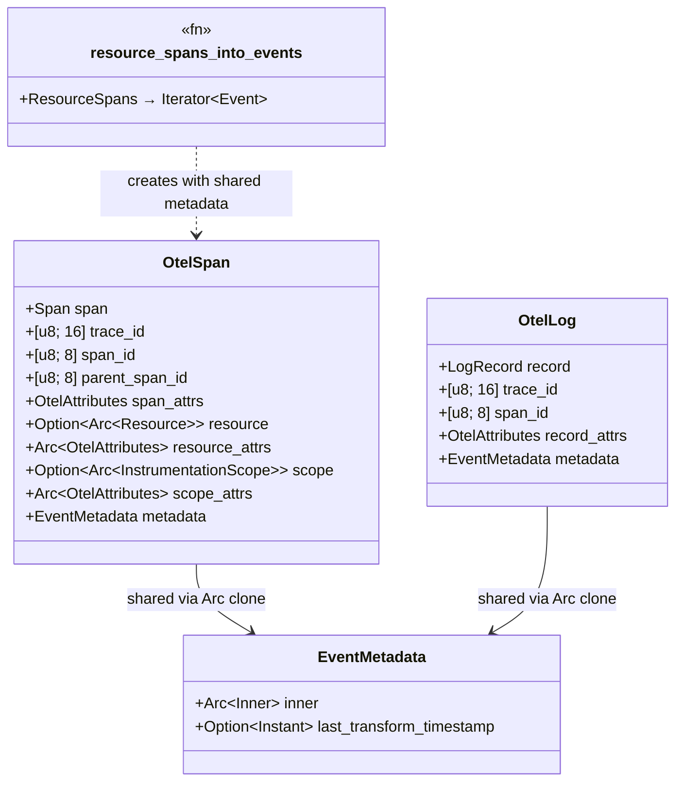

# Tail Sampling Slim Buffer — Tasks

Design: [DESIGN.md](./DESIGN.md)

## Analysis

Build: `cargo check` — verified green
Test: `cargo test -p sol-core --features vrl --lib` — verified green (243 passed)
Lint: `cargo clippy -p sol-core` — verified green
Format: `cargo fmt --all --check` — verified green

Tail sampling tests: `cargo test -p sol --lib -- tail_sampling` (binary crate, requires full build)

### Known-failing tests
| Test | Reason | Action |
|---|---|---|
| `sol-core` lib test compilation (without `vrl` feature) | `OtlpTimestamp::from_nanos` behind `#[cfg(feature = "vrl")]` but test references it unconditionally | Pre-existing; use `--features vrl` flag |

### Measured struct sizes

```
Event enum:              344 bytes
OtelSpan:                344 bytes
Span (proto):            264 bytes
EventMetadata:            24 bytes (+ ~216 bytes heap per Arc<Inner>)
OtelAttributes:           24 bytes
Vec<u8>:                  24 bytes
```

### Domain model



### Requirement traceability
| Type / Trait / Fn | Addresses | Notes |
|---|---|---|
| `resource_spans_into_events` | [FR1](./DESIGN.md#fr1) | Share one EventMetadata across all spans in batch |
| `resource_logs_into_events` | [FR1](./DESIGN.md#fr1) | Same pattern for logs |
| `resource_metrics_into_events` | [FR1](./DESIGN.md#fr1) | Same pattern for metrics |
| `EventMetadata.clone()` | [FR2](./DESIGN.md#fr2) | Already uses Arc clone; make_mut for COW |
| `OtelSpan.trace_id` | [FR3](./DESIGN.md#fr3) | New `[u8; 16]` field |
| `OtelSpan.span_id` | [FR4](./DESIGN.md#fr4) | New `[u8; 8]` field |
| `OtelSpan.parent_span_id` | [FR4](./DESIGN.md#fr4) | New `[u8; 8]` field |
| `OtelLog.trace_id` | [FR5](./DESIGN.md#fr5) | New `[u8; 16]` field |
| `OtelLog.span_id` | [FR5](./DESIGN.md#fr5) | New `[u8; 8]` field |
| `OtelSpan::trace_id()` | [FR6](./DESIGN.md#fr6) | Return from new field |
| `OtelSpan::span_to_proto()` | [FR7](./DESIGN.md#fr7) | Restore IDs to proto |
| `OtelSpan::as_map()` | [FR7](./DESIGN.md#fr7) | Read from new fields |
| `OtelSpan::apply_value_map()` | [FR7](./DESIGN.md#fr7) | Write to new fields |

### Transformations
| Function | Input -> Output | Invariant / Rule |
|---|---|---|
| `resource_spans_into_events` | `ResourceSpans` -> `Iterator<Event>` | All events share one `Arc<Inner>` for metadata |
| `OtelSpan::new` | `Span` -> `OtelSpan` | `mem::take` trace_id/span_id/parent_span_id from proto; store as `[u8; N]` |
| `OtelSpan::span_to_proto` | `&OtelSpan` -> `Span` | Restore trace_id/span_id/parent_span_id to proto Vec<u8> |
| `OtelSpan::as_map` | `&OtelSpan` -> VRL Value | Read IDs from `[u8; N]` fields, hex-encode |
| `OtelSpan::apply_value_map` | VRL Value -> `&mut OtelSpan` | Decode hex IDs into `[u8; N]` fields |

## Tasks

### 1. Share EventMetadata in resource_spans_into_events ([FR1](./DESIGN.md#fr1), [FR2](./DESIGN.md#fr2))

**Goal**: Eliminate per-span `Arc<Inner>` allocation by sharing one EventMetadata across all spans in a ResourceSpans batch.

**Types**: `resource_spans_into_events` — see domain model

**Constraints**:
- [ADR: shared-metadata](./adrs/shared-metadata.md) — share via Arc clone, not lazy/pool
- Create `EventMetadata::default()` once before the iterator
- Pass `metadata.clone()` to each `OtelSpan::from_parts_shared()` call
- `EventMetadata::clone()` is already an Arc refcount bump — no code change needed in EventMetadata itself

**Tests**:
- `test_shared_metadata_across_batch` — create ResourceSpans with 3 spans. Call `resource_spans_into_events()`. Verify all 3 events have the same `source_event_id` (proves they share the same Arc<Inner>).
- Existing test `otel_event_iter_preserves_span_fields` must still pass.

**Verify**: `cargo test -p sol-opentelemetry-proto --lib && cargo clippy -p sol-opentelemetry-proto`

**Acceptance criteria**:
- [ ] `resource_spans_into_events` creates one EventMetadata shared across all spans
- [ ] `resource_logs_into_events` creates one EventMetadata shared across all logs
- [ ] `resource_metrics_into_events` creates one EventMetadata shared across all metrics
- [ ] All existing proto crate tests pass
- [ ] Copy-on-write still works (Arc::make_mut on one event does not affect others)

**Depends on**: (none)
**Time-box**: ~30 min
**Hill**: downhill

### 2. Add fixed-size ID fields to OtelSpan ([FR3](./DESIGN.md#fr3), [FR4](./DESIGN.md#fr4), [FR6](./DESIGN.md#fr6))

**Goal**: Replace per-span Vec<u8> heap allocations for trace_id/span_id/parent_span_id with inline `[u8; N]` arrays.

**Types**: `OtelSpan` — see domain model

**Constraints**:
- [ADR: fixed-size-ids](./adrs/fixed-size-ids.md) — extract-and-restore pattern
- Add `trace_id: [u8; 16]`, `span_id: [u8; 8]`, `parent_span_id: [u8; 8]` to OtelSpan
- In all constructors (`new`, `from_parts`, `from_parts_shared`, `from_otel_log`, `from_value_map`): extract IDs from proto Span via helper, `mem::take` the Vec<u8> to free heap
- Accessor methods `trace_id()`, `span_id()`, `parent_span_id()` return `&[u8]` from new fields
- `span_to_proto()` and `into_parts()` restore IDs to proto before returning

**Tests**:
- `test_fixed_id_round_trip` — create OtelSpan with known trace_id/span_id/parent_span_id. Verify accessors return correct values. Verify `span_to_proto()` restores them to the proto Span.
- `test_fixed_id_empty_parent` — span with empty parent_span_id stores `[0u8; 8]`, serializes back to empty Vec.
- Existing tests must pass (accessors return same `&[u8]` values).

**Verify**: `cargo test -p sol-core --features vrl --lib && cargo clippy -p sol-core`

**Acceptance criteria**:
- [ ] OtelSpan has `trace_id: [u8; 16]`, `span_id: [u8; 8]`, `parent_span_id: [u8; 8]`
- [ ] All constructors extract IDs and `mem::take` the proto Vec<u8>
- [ ] Accessor methods return from new fields
- [ ] `span_to_proto()` restores IDs to proto
- [ ] `into_parts()` restores IDs to proto
- [ ] All existing sol-core tests pass

**Depends on**: (none)
**Time-box**: ~60 min
**Hill**: downhill

### 3. Update VRL roundtrip for fixed-size IDs ([FR7](./DESIGN.md#fr7))

**Goal**: Update `as_map()` and `apply_value_map()` to read/write the new fixed-size ID fields instead of proto fields.

**Types**: `OtelSpan` — see transformations table

**Constraints**:
- `as_map()`: use `self.trace_id` instead of `self.span.trace_id` for hex encoding
- `apply_value_map()`: decode hex string into `[u8; N]` field, not proto field
- `from_value_map()`: same — write to new fields
- Helper `take_id` in apply_value_map currently returns `Vec<u8>` — change to write directly to `[u8; N]` or convert

**Tests**:
- `test_vrl_roundtrip_trace_id` — set trace_id via VRL, read back via `as_map()`, verify hex matches
- Existing VRL/as_map tests must pass

**Verify**: `cargo test -p sol-core --features vrl --lib && cargo clippy -p sol-core`

**Acceptance criteria**:
- [ ] `as_map()` reads trace_id/span_id/parent_span_id from new fields
- [ ] `apply_value_map()` writes to new fields
- [ ] Hex round-trip is lossless
- [ ] All existing sol-core tests pass

**Depends on**: task 2
**Time-box**: ~30 min
**Hill**: downhill

### 4. Add fixed-size ID fields to OtelLog ([FR5](./DESIGN.md#fr5))

**Goal**: Same extract-and-restore pattern for OtelLog's trace_id and span_id.

**Types**: `OtelLog` — see domain model

**Constraints**:
- OtelLog has `record: LogRecord` with `trace_id: Vec<u8>` and `span_id: Vec<u8>`
- Add `trace_id: [u8; 16]` and `span_id: [u8; 8]` to OtelLog
- Update constructors, accessors, and serialization methods
- Update VRL as_map / apply_value_map for OtelLog

**Tests**:
- `test_otel_log_fixed_id_round_trip` — verify trace_id/span_id round-trip through OtelLog
- Existing OtelLog tests must pass

**Verify**: `cargo test -p sol-core --features vrl --lib && cargo clippy -p sol-core`

**Acceptance criteria**:
- [ ] OtelLog has `trace_id: [u8; 16]`, `span_id: [u8; 8]`
- [ ] All constructors extract and `mem::take`
- [ ] Serialization restores IDs
- [ ] All existing sol-core tests pass

**Depends on**: task 2 (reuse helper functions)
**Time-box**: ~30 min
**Hill**: downhill

### 5. Update downstream consumers ([FR6](./DESIGN.md#fr6))

**Goal**: Update tail sampling, service graph, load balancing, and sources to use the new fixed-size fields.

**Types**: consumers of `OtelSpan::trace_id()` etc.

**Constraints**:
- `tail_sampling/transform.rs` `extract_trace_id()`: `otel_span.trace_id()` already returns `&[u8]`; the copy-to-array logic can be simplified to `*otel_span.trace_id()` (if we return `&[u8; 16]` with deref)
- `servicegraph/transform.rs` `to_trace_id()`/`to_span_id()`: same simplification
- `load_balancing.rs` `extract_routing_key()`: currently clones `span.span().trace_id` (Vec clone) — change to `span.trace_id().to_vec()` or better, hash `&[u8]` directly without clone
- `sources/datadog_agent/traces.rs`: writes `Vec<u8>` to proto → assign to new OtelSpan fields
- `sources/vector/convert.rs`: writes `Vec<u8>` to proto → assign to new OtelSpan fields

**Tests**:
- Existing tail sampling, service graph, and load balancing tests must pass
- `test_load_balancing_no_clone` — verify routing key extraction doesn't allocate (optional, hard to test)

**Verify**: `cargo check && cargo test -p sol --lib -- tail_sampling && cargo test -p sol --lib -- servicegraph`

**Acceptance criteria**:
- [ ] `extract_trace_id()` reads from `[u8; 16]` field directly
- [ ] `extract_routing_key()` avoids Vec clone
- [ ] Source conversions (DD, Vector) write to new fields
- [ ] All downstream tests pass
- [ ] Full `cargo check` passes

**Depends on**: tasks 2, 4
**Time-box**: ~45 min
**Hill**: downhill

### 6. Build, benchmark, verify ([NFR1](./DESIGN.md#nfr1), [NFR2](./DESIGN.md#nfr2), [NFR3](./DESIGN.md#nfr3))

**Goal**: Build release image, run memory-focused benchmarks, verify improvement.

**Constraints**:
- Build: `docker build -f demo/benchmark/Dockerfile.sol -t sol:local .`
- Run scenarios: `tail-sampling-traces-grpc-10k`, `sustained-tail-sampling-traces-grpc-10k`, `noop-traces-grpc-50k`
- Compare against baseline (previous results in design doc)
- Target: tail sampling memory ≤1.0x of otelcol (~200 MiB)

**Tests**:
- Benchmark results recorded and compared to baseline
- No throughput regression (≥95% of otelcol for all passing scenarios)

**Verify**: `bash demo/benchmark/run.sh` (selected scenarios)

**Acceptance criteria**:
- [ ] Docker image builds successfully
- [ ] tail-sampling-grpc-10k memory ≤ 200 MiB (≤1.0x otelcol)
- [ ] No throughput regression on noop scenarios
- [ ] Results documented in design doc

**Depends on**: tasks 1-5
**Time-box**: ~60 min (mostly waiting for benchmark)
**Hill**: downhill

## Sessions

### Session 1 — EventMetadata sharing + fixed-size IDs (~3H)
Tasks: 1, 2, 3, 4, 5
**Checkpoint**: `cargo fmt --all --check && cargo clippy -p sol-core && cargo test -p sol-core --features vrl --lib && cargo check`
**Commit point**: yes — commit after checkpoint passes

### Session 2 — Benchmark validation (~1H)
Tasks: 6
**Checkpoint**: benchmark results show ≤1.0x otelcol memory for tail-sampling-grpc-10k
**Commit point**: yes — commit results update to design doc

## Quality gates (post-session review)
- [ ] Acceptance criteria: all green above
- [ ] Code review: implementation matches [DESIGN.md](./DESIGN.md) intent
- [ ] Code organization: changes confined to `opentelemetry-proto/src/{spans,logs,metrics}.rs` and `sol-core/src/event/otel_event.rs`
- [ ] Code quality: no new complexity beyond ID field extraction and metadata sharing
- [ ] Performance: NFR targets met, no regressions on critical paths
