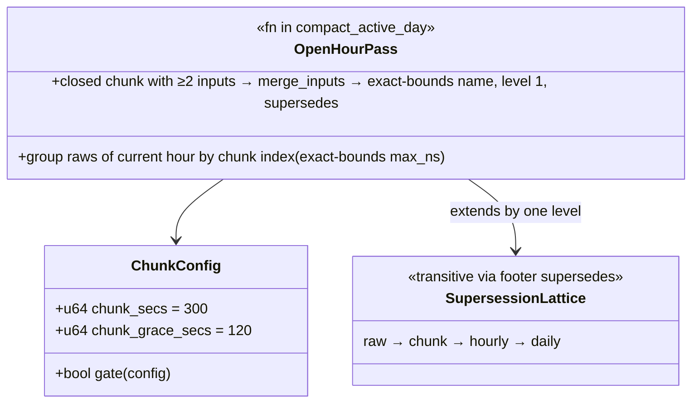

# write-side-small-files — Tasks

Design: [DESIGN.md](./DESIGN.md)

## Analysis

Build: `cargo build --lib` — green (baseline = promql-plan-cache S2 checkpoint, code HEAD `c591624ff`; only docs commits since)
Test: `cargo test --lib querier::` — green: 254 passed, 0 failed, 2 ignored (covers `querier::compaction` tests)
Lint: `make check-clippy` — green at the same checkpoint

### Known-failing tests
| Test | Reason | Action |
|---|---|---|
| 2 ignored in `querier::` (1 pre-existing + demo-scale bench) | by design | ignore |
| 6 × `codecs encoding::format::json` under `-p codecs --all-features` | pre-existing, outside scope | ignore |

### Measured starting point ([promql-plan-cache VERIFY](../../20260717_promql-plan-cache/VERIFY.md))
| Probe | Now | Target |
|---|---|---|
| `files_opened` p95, 15-min metrics window (live) | 237 | ≤ 40 ([NFR1](./DESIGN.md#nfr1)) |
| Bare selector range (live, loaded) | 304 ms | ≤ 150 ms ([NFR2](./DESIGN.md#nfr2), shared) |
| Repeated-shape `rate()` (live) | 370–420 ms | improved; ≤ 80 ms jointly owned with row-work levers |
| Data visibility (flush cadence) | ≤ 30 s | unchanged ([NFR3](./DESIGN.md#nfr3)) |

### Domain model

### Requirement traceability
| Type / Fn | Addresses | Notes |
|---|---|---|
| `OpenHourPass` (inside `compact_active_day`) | [FR1](./DESIGN.md#fr1) | [ADR](./adrs/open-hour-chunk-compaction.md) option A; reuses `merge_inputs`/`finalize_writer` |
| `ChunkConfig` fields (`config/compactor.rs`) | [FR1](./DESIGN.md#fr1), [FR2](./DESIGN.md#fr2) | Config-gated; defaults 300/120 s |
| demo `sol-compactor.yaml` `interval_secs: 60` | [FR2](./DESIGN.md#fr2) | Tick fits chunk closing |
| fixture arithmetic test | [FR3](./DESIGN.md#fr3) | Deterministic in-window count |

### Transformations
| Function | Input → Output | Invariant / Rule |
|---|---|---|
| chunk grouping | current-hour non-superseded raws → chunk buckets by `max_ns` | closed = `now ≥ chunk_end + grace`; ≥ 2 inputs; write-once (compacted chunk's inputs superseded ⇒ never re-forms) |
| chunk merge | raws → one exact-bounds-named level-1 file | name bounds = true min/max of merged rows; supersedes exactly its inputs; staged→rename atomic |
| hourly absorb | chunks + leftover raws → `compacted-hHH` | unchanged code path; transitive supersession; reads-each-datum-once across raw ∪ chunk ∪ hourly ∪ daily |

### Constraints discovered (constitution)
- Name-based consistency (no quiescence assumptions); staged `.tmp` → atomic rename; GC only footer-listed inputs after `delete_grace_secs` (60 s) > querier refresh (15 s) — restate, don't re-derive.
- Chunk outputs MUST use the existing exact-bounds name shape (querier parser untouched) + level-1 provenance footer.
- Rollups/sealed-day paths untouched; `run_once` error-isolation pattern preserved (a failing chunk merge is counted, never aborts the pass).
- No new dependencies; no format!-SQL; standing no-retro-compat directive (satisfied — no layout change).

## Tasks

### 1. Open-hour chunk compaction ([FR1](./DESIGN.md#fr1))
**Goal**: Closed chunks of the current hour compact into exact-bounds-named level-1 files; hourly pass absorbs them transitively.
**Types**: `OpenHourPass`, `ChunkConfig` — see domain model; implement inside `compact_active_day` (`src/querier/compaction.rs:330-397`), mirroring the hourly pass structure and the existing config plumbing (`config/compactor.rs`).
**Constraints**: [ADR](./adrs/open-hour-chunk-compaction.md) — write-once chunks, exact-bounds names, level 1, config-gated; error isolation per `run_once` pattern.
**Tests** (red first, mirroring `test_intraday_*` fixtures at `compaction.rs:835+`):
- `test_chunk_compacts_closed_chunks_only` — closed chunk superseded, open chunk's raws kept
- `test_chunk_respects_grace_watermark`
- `test_chunk_is_write_once_idempotent` — second pass produces nothing new
- `test_hourly_absorbs_chunks_and_leftover_raws` — transitive supersession; `resolve_files` returns exactly the hourly file
- `test_querier_reads_each_datum_once_across_chunk_level` — mirror of `catalog.rs:1332` across raw ∪ chunk ∪ hourly
- `test_chunk_disabled_is_noop`
**Verify**: `cargo test --lib querier:: && make check-clippy`
**Acceptance criteria**:
- [ ] All six tests green; chunk file names parse as exact-bounds in the inventory (assert via `parse_file_interval` in one test)
**Depends on**: (none)
**Time-box**: ~90 min

### 2. Config + demo wiring ([FR2](./DESIGN.md#fr2))
**Goal**: Chunk fields documented and demo tick fits chunk closing.
**Constraints**: demo `sol-compactor.yaml` `interval_secs: 300 → 60` + chunk fields in the existing comment style; `delete_grace_secs` > querier-refresh invariant restated at the field docs; yaml-deserialization test extended for the new fields' defaults.
**Tests**: config default test (mirror existing `config/compactor.rs` test pattern)
**Verify**: `cargo test --lib querier:: && cargo test --lib config:: 2>&1 | tail -2 && make check-clippy`
**Acceptance criteria**:
- [ ] Defaults test green; demo yaml updated with comments
**Depends on**: task 1
**Time-box**: ~30 min

### 3. In-window file-count arithmetic ([FR3](./DESIGN.md#fr3), [NFR1](./DESIGN.md#nfr1))
**Goal**: Deterministic proof of the reduction.
**Tests** (red first): `test_open_hour_window_file_count` — generate a current-hour store at 30 s cadence (exact-bounds fixtures), run the chunk pass, assert `scoped_files` for a 15-min window returns ≤ the ADR arithmetic (3 chunks + tail) and strictly fewer than the uncompacted count
**Verify**: `cargo test --lib querier:: && make check-clippy`
**Acceptance criteria**:
- [ ] Test green with the counts stated in its assertions
**Depends on**: task 1
**Time-box**: ~45 min

### 4. Live verification ([NFR1](./DESIGN.md#nfr1), [NFR2](./DESIGN.md#nfr2), [NFR3](./DESIGN.md#nfr3))
**Goal**: Rebuilt image + restarted stack (no wipe): `files_opened` p95 ≤ 40; floors re-measured; freshness unchanged; VERIFY.md recorded.
**Verify**: probe set from the two predecessor VERIFYs; `sum by (result)`/stage/files_opened telemetry via Mimir (port 9009)
**Acceptance criteria**:
- [ ] VERIFY.md: files_opened p95 ≤ 40 (or honest re-decomposition); bare floor + rate() movement recorded; visibility lag spot-checked ≤ flush cadence
**Depends on**: tasks 1–3 (+ user rebuild + restart; NO store wipe)
**Time-box**: ~45 min

## Sessions

### Session 1 — Chunk pass + config + arithmetic (~2.75 H)
Tasks: 1, 2, 3
**Skills**: `rust-software-engineer`, `rust-build`, `tdd`
**Checkpoint**: `cargo test --lib querier:: && make check-clippy`
**Commit point**: yes

### Session 2 — Live evidence (~45 min, needs user rebuild)
Tasks: 4
**Skills**: `rust-software-engineer`, `rust-build`
**Checkpoint**: probe set vs targets
**Commit point**: yes

## Quality gates (post-session review)
- [ ] Acceptance criteria all green
- [ ] Code review vs [DESIGN.md](./DESIGN.md) intent (supersession lattice tests are the core)
- [ ] Observability: compactor counters show the new cadence; files_opened p95 on the querier dashboard is the acceptance signal
- [ ] Performance: NFR table updated with live numbers; shared-ownership caveat restated for the latency NFRs
